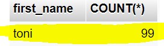
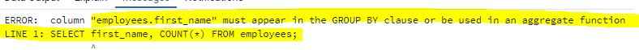

# FUNKTIOISTA

## KOOSTEFUNKTIOT

:::info Lue lisää täältä

https://www.postgresql.org/docs/9.5/functions-aggregate.html

:::

Nimensä mukaisesti koostefunktiot koostavat monesta rivistä yhden tuloksen

### AVG

AVG-funktio laskee keskiarvon annetusta argumenttinä annetusta sarakkeesta

```sql

-- ao. kysely laskee keskiarvopalkan kaikista työntekijöistä

SELECT AVG(salary) AS avg_salary FROM employees;

```

### SUM

SUM laskee summan argumenttinä annetusta sarakkeesta

```sql

-- ao. kysely laskee kaikkien työntekijöiden palkkojen summan

SELECT SUM(salary) AS sum_salary FROM employees;

```

### MIN && MAX

MIN laskee argumenttinä annetun sarakkeen pienimmän arvon ja MAX taas suurimman arvon

```sql

SELECT MIN(salary) AS min_salary, MAX(salary) AS max_salary FROM employees;


```


### COUNT

COUNT laskee tulosjoukon rivien määrän

```sql

-- ao. kysely laskee sovelluskehitys-osastolla työskentelevien työtenkijöiden määrän

SELECT COUNT(e.id) AS num_of_employees FROM employees AS e INNER JOIN departments AS d ON e.department_id = d.id WHERE d.name = 'sovelluskehitys';

```

```sql

-- ao. kysely kaikkien työntekijöiden määrän koko yrityksessä, riippumatta osastosta

SELECT COUNT(e.id) AS num_of_employees FROM employees AS e;

```

### KOOSTEFUNKTIOT JA GROUP BY

Koostefunktiot laskevat oletuksena useasta rivistä yhden tuloksen. GROUP BY:lla voit muuttaa hakutuloksen rivien määrää

Muutetaan yo. kyselyä niin, että kaikkien työntekijöiden lukumäärän sijaan, työtenkijöiden lukumäärät ryhmitellään osastoittain (palautetaan siis jokaisen osaston työntekijöiden lukumäärä erikseen)

```sql


SELECT COUNT(e.id) AS num_of_employees FROM employees AS e GROUP BY e.department_id;

```

:::danger ÄLÄ KOSKAAN

Sekoita koostefunktiota ja normaali sarakkeita SELECT-lausekkeessa ilman GROUP BYta

:::

#### ESIMERKKI (MYSQL)

```sql

SELECT first_name, COUNT(id) FROM employees;

```




Ensisilmäyksellä kaikki näyttää olevan kunnossa, mutta tulos antaa ymmärtää, että employees-taulussa on 99 riviä, ja kaikkien nimi on toni. <strong>Tämä tulos on harhaanjohtava, koska MySQL palauttaa ensimmäisen työntekijän nimen</strong>


#### ESIMERKKI (POSTGRES)

```sql

SELECT first_name, COUNT(id) FROM employees;

```



Yo. kuvan PostgreSQL:n tulos on oikea tässä tapauksessa, koska koostefunktioita ja normaali sarakkeita ei voi sekoittaa SELECT-lausekkeessa ilman GROUP BY:ta.

#### MIKSI NÄIN?

Jos kysely hajoitetaan kahteen eri kyselyyn

```sql
-- 1. Hae kaikkien käyttäjien etunimet

SELECT first_name FROM employees;

```

yo. kysely palauttaa 99 riviä ja ao. 

```sql

-- 2. laske kaikki rivit employees-taulusta.

SELECT COUNT(*) FROM employees;


```
palauttaa vain yhden rivin.

<strong>Näitä kahta kyselyä ei siis voi mitenkään järkevästi näyttää yhtenä tuloksena, ellei käytetä GROUP BYta tai koostefunktiota myös first_name-sarakkeelle</strong>

```sql

-- korjataan kysely käytteäen GROUP BY:ta

SELECT first_name, COUNT(*) AS c FROM employees GROUP BY first_name;

```

Voit ryhmitellä usealla sarakkeella yhdessä kyselyssä


```sql

SELECT last_name, department_id, COUNT(*) FROM employees GROUP BY last_name, department_id;

```


### KOOSTEFUNKTIOT JA HAVING

Haetaan ensin kaikkien osastojen keskiarvopalkat

```sql

-- keskiarvopalkat osastoittain

SELECT department_id, AVG(salary) FROM employees GROUP BY department_id;

```

Muokataan nyt kyselyä niin, että se hakisi ainoastaan osastot, joiden keskarvopalkka on yli 4200

```sql
-- HUOM tämä ei toimi!!!


SELECT department_id, AVG(salary) FROM employees WHERE AVG(salary) > 4200 GROUP BY department_id;

```

:::info Kysymys: miksi yo. kysely ei toimi?

Et voi käyttää WHERE-lauseketta filtteröimään koostefunktion tuloksia. Voit filtteröidä koostefunktion tuloksia käyttäen HAVING-lauseketta

:::

```sql

-- HUOM tämä toimii oikein!!!

SELECT department_id, AVG(salary) FROM employees GROUP BY department_id HAVING AVG(salary) > 4200;

```

:::info Kysymys: Miksi näin?

WHERE suoritetaan ennen koostefunktiota ja GROUP BY:ta. Ensin siis jätetään tulosjoukon ulkopuolelle ne rivit, jotka eivät täsmää WHERE-lausekkeen ehtoon ja sen jälkeen vasta suoritetaan koostefunktio ryhmittäin. Koostefunktion käyttäminen WHERE-lausekkeessa on siksi mahdotonta.

:::

### SUBQUERY (ALIKYSELY)

:::info Kysymys: Koska koostefunktion käyttäminen WHEREn ehtona ei ole mahdollista, miten voin hakea kaikki työntekijät, joiden palkka on esim. alle keskiarvopalkan?

Tähän voit käyttää alikyselyä. Voit laskea keskiarvopalkan alikyselyllä ja käyttää sen tulosta WHERE-lausekkeen ehtona

:::

```sql

SELECT id, first_name, last_name, salary FROM employees WHERE salary > (SELECT AVG(salary) FROM employees);

```

## SKALAARIFUNKTIOT (SCALAR FUNCTIONS)

:::info Lue lisää täältä

Skalaarifunktioita on monia ja ne on jaoteltu tietotyyppien / käyttötarkoituksen mukaan

lista kategorioittain: https://www.postgresql.org/docs/9.2/functions.html

merkkijonofunktiot: https://www.postgresql.org/docs/9.2/functions-string.html
päivämääräfunktiot: https://www.postgresql.org/docs/9.2/functions-datetime.html

:::

Skalaarifunktiot eivät tiivistä useaa riviä yhteen riviin, vaan ne suoritetaan jokaiselle hakutuloksen riville erikseen. 

### CONCAT

Yhdistää yhden tai useamman merkkijonon

```sql


SELECT CONCAT(first_name, ' ', last_name) AS full_name FROM employees;

```

### UPPER && LOWER

```sql

SELECT UPPER(first_name), LOWER(first_name) FROM employees;

```

### NOW

NOW palauttaa aikaleiman 

```sql

SELECT NOW()

```

### TIMESTAMPDIFF

Palauttaa kahden aikaleiman erotuksen pyydetyssä yksikössä

:::info

HUOM! TIMESTAMPDIFF on MySQL:n funktio, eikä se siksi toimi PostgreSQL:ssä.

:::

```sql

-- palauttaa kahden aikaleiman välisen ajan tunteina

SELECT TIMESTAMPDIFF(HOUR,'2022-02-01','2022-02-21')

-- voit saada saman tuloksen Postgrellä näin:

SELECT EXTRACT(epoch FROM '2022-02-21'::timestamp - '2022-02-01'::timestamp)/3600

```

:::info AGE-funktio ja vähennysoperaattori

Voit käyttää Postgressa kahden aikaleiman välisen erotuksen laskemiseen AGE-funktiota tai ihan vain miinuslaskua.

:::

## OMAT FUNKTIOT

Voit luoda myös omia funktiota. Ne ovat hyödyllisiä selventämään kyselyjä, joista ilman funktiota voisi tulla pitkiä.

Voit luoda omia funktiota esim. SQL:llä tai PL/pgsql:llä. 

### SQL:llä tehty funktio

```sql

CREATE FUNCTION clean_emp() RETURNS void AS '
    DELETE FROM emp
        WHERE salary < 0;
' LANGUAGE SQL;

-- kutsutaan äin

SELECT clean_emp()


```

### PL/SQL

```sql

CREATE FUNCTION overpaid (employees, INTEGER) RETURNS BOOLEAN AS '
    -- tämä funktio ottaa vastaan kaksi parametria: employees (taulu) ja kokonaislukuarvon ja palauttaa BOOLEANIN
    -- Postgressa taulun nimeä voi käyttää tietotyyppinä
    
    -- DECLARE:ssa määritetään muuttujat
    DECLARE
        emprec ALIAS FOR $1;
        paidfor ALIAS FOR $2;
    -- BEGIN aloittaa funktion bodyn
    BEGIN
        IF emprec.salary ISNULL THEN
            RETURN FALSE;
        END IF;
        RETURN emprec.salary > sallim;
    END;
' LANGUAGE 'plpgsql';


```


:::info Harjoitus

Keksi tähän joku harjoitus, jossa suunnittellaan ensin tietokanta ja sitten tungetaan pythonilla dataa kantaan ja kysellään sitä sitten vaikka datagripillä

:::


