# YLEISIMMÄT SOVELLUSKEHYSTEN PERIAATTEET JA ARKKITEHTUURIT

<h2><i>"Jos softa olisi talo, rakenna se niin, ettei talosta tarvitse hajoittaa koko seinää, jos ikkuna tai ovi pitää vaihtaa."</i></h2>

:::tip tä?

Arkkitehtuureilla ja suunnitelumenetelmillä pystymme palottelemaan softan niin pieniin modulaarisiin osiin, ettei mitään tarvitse koodata uudestaan / olemassa olevaa koodia hajottaa. Pystymme siis koodaamaan toisenlaisen toteutuksen ominaisuudesta ja korvaamaan vanhan sillä hajoittamatta vanhaa

:::

Suunnittelumenetelmiä ja arkkitehtuureja on olemassa hyvin paljon ja ne voivat olla sovellusalakohtaisia. Esimerkiksi reaaliaikasovelluksissa voidaan käyttää eri suunnittelumalleja ja periaatteita kuin pyyntö/vastaus-periaatteella toimivassa web-sovelluksessa. Myös mobiilisovelluksissa ja työpöytäsovelluksissa voidaan käyttää eri suunnittelumalleja kuin web-sovelluksissa.

<strong>Tällä opintojaksolla keskitytään web-ohjelmoinnin ja web-sovelluskehysten yleisimpiin suunnitetlumalleihin</strong>. Toteutamme suunnittelumalleja käyttäviä koodeja itse ilman frameworkia ja tutkimme myös, miten nämä suunnittelumallit voidaan ottaa käyttöön joissakin mainituissa frameworkeissa.

## MVC


MVC-malli eli <strong>M</strong>odel<strong>V</strong>iew<strong>C</strong>ontroller koostuu kolmesta sovelluksen eri kerroksesta <strong>M</strong>odel eli mallikerros vastaa tietokannan tauluja. Jokaisesta tietokannan taulusta tehdään ohjelmaluokka (Class). <strong>C</strong>ontroller on ohjelmaluokka (Class) tai kasa funtkioita, jotka ottavat vastaan clientin web-palvelimelle lähettämät requestit, käsittelevät ne (se, miten pyynnöt käsitellään riippuu routen tarkoituksesta) ja lähettää clientille responsen takaisin <strong>V</strong>iewinä eli käyttäjälle näkyvänä osana.

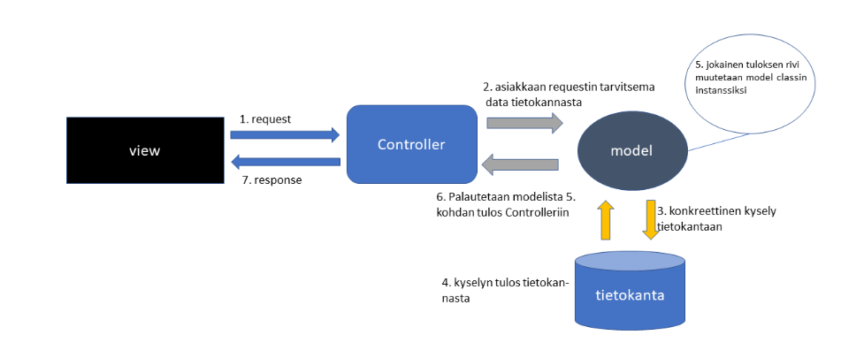

- <strong>1. request:</strong> Käyttäjä kirjoittaa selaimelle osoitteen
    * palvelimella jokaiseen routeen on kiinnitetty joku Controllerin funktio / metodi. Eli kun menet web-palvelimella johonkin osoitteeseen, siihen kiinitetty Controllerin funktio suoritetaan.

- <strong>2. Asiakkaan requestin tarvitsema data tietokannasta:</strong> Controllerin tehtävä on toimia kapellimestarina, joka ottaa pyynnöt vastaan, hakee tietokannasta modelin kautta tarvittavat datat ja palauttaa ne asiakkaalle responsena.

- <strong>3. Konkreettinen kysely tietokantaan:</strong> Model-ohjelmaluokka on se paikka, jossa tehdään konkreettinen tietokantakysely tietokantaan

- <strong>4. Kyselyn tulos tietokannasta &</strong> 5. <strong>jokainen tuloksen rivi muutetaan model-classin instanssiksi:</strong> Kun Model-luokassa tehdään konkreettinen kysely tietokantaan kohdassa 3., tietokanta palauttaa kyselyn tuloksen. Jokaisesta tuloksen rivistä tehdään Model-luokan instanssi.

- <strong>6. Palautetaan modelista 5. kohdan tulos takaisin Controlleriin</strong> Controller ottaa vastaan tietokantakyselyn tuloksen model-luokan instansseina. Kyselyä ei siis suoraan palauteta Controlleriin tietokannasta. Miksi? Tähän vastaus selviää hieman myöhemmin, kun teemme esimerkkejä

- <strong>7. response</strong> Koska Controller on kapelimestari, joka johtaa koko orkesteria, se vastaanottaa pyynnöt asiakkaalta ja palauttaa vastauksen asiakkaalle. Tässä kohtaa Cotrollerin tehtävä on palauttaa vastaus pyydetyssä formaatissa (html, xml, json)


### Kerrataan


Kun käyttäjä suorittaa jonkun toiminnon nettisivulla, siitä lähtee pyyntö johonkin nettiosoitteeseen. Tähän nettiosoitteeseen lähetetty pyyntö menee Controllerin funktiolle / metodille käsiteltäväksi. Controllerin funktio / metodi puolestaan useimmiten hakee, lisää tai päivittää olemassa olevaa tietoa tietokantaan. Tämän operaation tekee Model-luokka.

Kun Model-luokka on tehnyt tehtävänsä, se palauttaa kyselyn tuloksen takaisin Controllerille, joka puolestaan lähettää vastauksen takaisin käyttäjälle. Vastaus näkyy päivityksenä nettisivulla.


#### Model

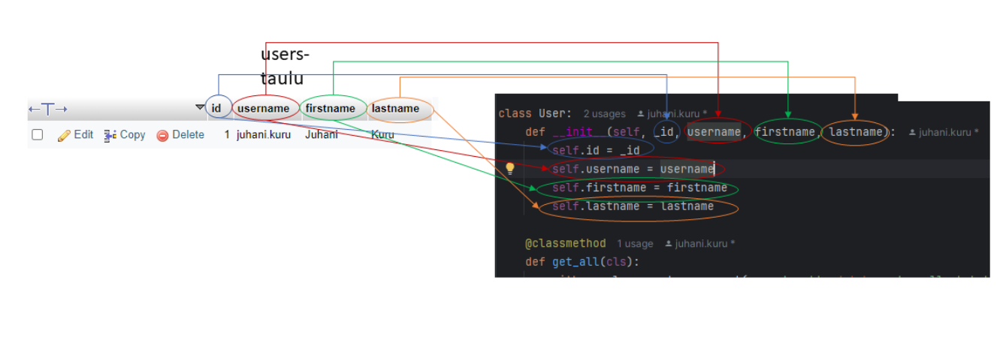

Jokaisesta tietokannan taulusta tehdään oma Model-ohjelmaluokka (Class), jossa on kaikki tietokantataulun sarakkeet ja metodit, joilla data haetaan tietokannasta. Modeliin tulee tietokantaan liittyvä koodi (ns. data access layer). 

:::tip Yksikkö vai monikko?

Huomaa, että taulun nimi tietokannassa on usein pienellä ja monikossa. Kirjoitusasu ei ole pakollinen, vaan koodari saa itse päättää tietokannan taulujen nimet. <strong>Model-luokka on kuitenkin yksikössä, koska jokainen Model-luokan instanssi kuvastaa yhtä käyttäjää. Jokaisesta tietokantaulun rivistä tehdään yksi instanssi. Model-luokka alkaa isolla kirjaimella tässä tapauksessa, koska se on Pythonin nimeämiskäytännön mukaista</strong>


:::

#### View

MVC:ssä view on käyttäjälle näkyvä osa. Se voi olla HTML-sivu tai kuten tässä esimerkissä JSON-vastaus


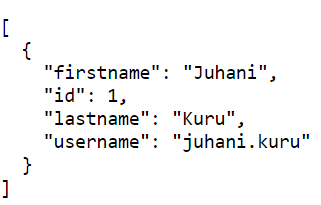

#### Controller

MCV:ssä Controller ottaa pyynnöt vastaan, käsittelee ne asianmukaisesti (esim. hakee tietokannasta tavaraa Modelin kautta) ja palauttaa vastauksen takaisin asiakkaalle.

Ohjelmointikielestä ja käytetystä frameworkista riippuen Controller voi olla ohjelmaluokka tai sitten yksinkertaisesti tiedosto, jossa on kasa funktioita.

:::tip Mistä tiedän, kuinka monta Controlleria tarvitsen ja mistä kaikista pitää tehdä Controller?

Hyvin tyypillisesti frameworkit, joissa routet luodaan automaattisesti tekevät näin

https://domain.com/controller/controllerin_funktio_tai_metodi

Vaikka käyttäisit työkalua, joka ei luo routeja automaattisesti, kannattaa tätä käytäntöä kuitenkin seurata, koska se on hyvin paljon käytetty ja tuttu koodareille, jotka tietävät, miten MVC toimii

<strong>Eli jos url on <i>http://localhost:5000/api/users/get_all_users</i>, tehdään users-controller, jossa get_all_users-funktio tai metodi</strong>

Hyvin usein kuitenkin controllerin funktion nimi voidaan jättää pois urlista, kun kyseessä on rest api ja käytetään restful routingia. Urli voi siis olla http://localhost:5000/api/users/, jossa users-controllerin funktion nimi on get_all_users, mutta se liitetään routeen /.

Jos et muista restful routingin perusperiaatteita, palauta ne mieleen <a href="https://juhaniguru-webapis.onrender.com/rest/#resurssimetodit">täältä</a>

:::


### Tuntiharjoitus 1.

:::tip Koodataan 

Katsotaan esimerkki koodista ilman MVC-mallia ja tehdään sama sen jälkeen käyttäen MVC:tä. Näin erot ja suunnittelumallin hyödyt huomaa helpoiten.

:::

:::tip *)

Jos käytät PyCharmia IDEnä, sinun ei tarvitse luoda itse virtualenviä, vaan PyCharmin pitäisi luoda ja käynnistää se sinulle automaattisesti.

:::

:::tip **)

Jos luot, tai PyCharm luo, virtualenvin eri nimellä kuin venv, muista vaihtaa se komentoon.

:::


1. Hae <a href="https://github.com/juhaniguru/sovelluskehykset_bad1.git">Githubista mallikoodi</a> ja tietokanta
2. Asennus
    * tarvitset tähän MySQL:n tai MariaDB:n (jotta tietokantayhteys saadaan päälle)
    * tarvitset myös Pythonin
    * luo sen jälkeen virtualenv*: <i>python -m venv venv</i> tai macilla <i>python3 -m venv venv</i>
    * käynnistä sen jälkeen virtualenv*, **: <i>venv\Scripts\activate</i> tai macilla <i>source venv/bin/activate</i>
    * asennuksien jälkeen aja komento <i>python -m pip install -r requirements.txt</i> tai Macilla <i>python3 -m pip install -r requirements.txt</i>

3. Varmista sen jälkeen, että sovellus lähtee päälle: <i>python app_harjoitus1.py</i>
4. Kun sovellus käynnistyy mene osoitteisiin <i>http://localhost:5000/api/users</i> ja <i>http://localhost:5000/api/products</i>
ja paina mieleen vastauksen muoto (kentät ja niiden arvot). Asiakkaalle menevä vastaus ei saa koskaan muuttua, jos koodia konepellin alla refaktoroidaan.

#### Tehtävänanto

Nyt, kun palvelin lähtee päälle tee näin:

1) Luo uusi PyCharm / Flask-projekti
    * tämä voidaan tehdä tunnilla yhdessä
2) Refaktoroi oo. app_harjoitus1.py:n koodi MVC-suunnittelumallin mukaiseksi
3) <strong>Tietokannassa on myös products-taulu. Tee sille vastaavanlainen koodi kuin käyttäjien listaukselle MVC-mallin mukaisesti</strong>


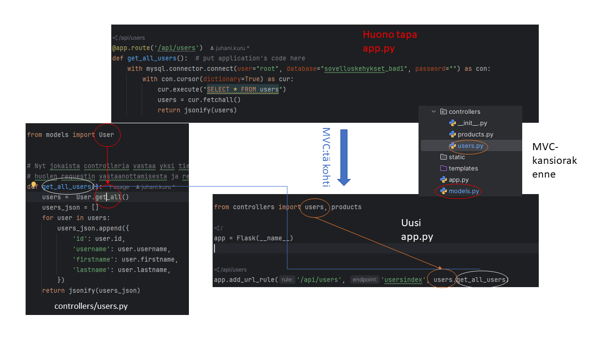
<small><i>Esimerkkikuva lopputuloksesta</i></small>

:::info Huom

Mallikuvasta puuttuu tarkoituksella User model, siitä on näytetty esimerkki aiemmin. Muista myös lisätä tarvittava metodi luokkaan, jolla teet tietokantakyselyn. 

:::


:::tip plussaa

Käymme yhdessä tuntiharjoituksen läpi tunnilla. Jos palautat ennen läpikäyntiä tehtävän Moodleen, ja se on oikein, <strong>voit saada siitä lisäpisteitä opintojaksoa arvioitaessa</strong>.

<strong>Yhteisen läpikäynnin jälkeen palautettuja tehtäviä ei hyväksytä ja, koska kyseessä on tuntiharjoitus, ainoastaan tunnille osallistuneiden tehtävät arvioidaan.</strong>


:::

### Q&A 1

:::tip Huonosti tehdyssä mallissa on 7 riviä koodia, miksi ihmeessä koodi pitää jakaa moneen tiedostoon ja tehdä niin vaikeasti?

- Pienessä sovelluksessa monimutkaisten suunnittelumallien käyttäminen tuntuukin turhalta ja yliampuvalta. Kun koodin tekee alusta asti kunnolla skaalautuvuus mielessä, sitä on koodin lisääntyessä helppo jatkokehittää ja ylläpitää.

- MVC on alunperin (muistaakseni) 70-luvulla kehitetty suunnittelumalli, jota käytettiin aluksi työpöytäsovelluksissa. Sen kolmikerrosmallin (selain=View, palvelin=Controller, tietokanta=Model) vuoksi se sopii web-ohjelmoinnin suunnittelumalliksi. Uskallan väittää, ettei maailmassa ole yhtään tosissaan työkseen web-hommia tekevää koodaria, joka ei tiedä, mikä MVC on.

- MVC eriyttää web-sovelluksen eri vastuualueet toisistaan, mikä helpottaa koodin uudelleenkäytettävyyttä. Kyseessä on ns. <strong><i>Separation of Concerns</i></strong>.
    * tehdään tästä yhdessä esimerkki tunnilla.

- Muistatko olio-ohjeloinnin kulmakiven <a href="/recap/#abstraction" target="_blank">abstraction</a>? Koska Model-luokat vastaavat tietokantakyselyistä, konkreettinen tietokantakyselyn toteutus kätketään model-luokan metodin alle. Koodarin ei siis tarvitse tietää, miten tai mistä tieto tulee, kun käyttää sovellusta. Toisin sanoen tietolähteen voi vaihtaa koskematta ollenkaan Controller-luokan routehandleriin, kunhan metodin nimi pysyy samana.

- <strong>Koska tämä opintojakso koskee web-sovelluskehyksiä ja suunnittelumalleja, et pääse opintojaksoa läpi, jos et käytä MVC:tä tai vastaavia suunnittelumalleja koodissasi</strong>


:::

### Tehtävä 1

Jatka tuntiharjoitusta ja tee loput <i>CRUD-toiminnallisuudet</i> käyttäjille ja tuotteille. Käytä MVC-suunnittelumallia ja restful routingin periaatteita.

:::tip Mikä CRUD?

CRUD tulee sanoista <strong>C</strong>reate<strong>R</strong>ead<strong>U</strong>pdate<strong>D</strong>elete Se on yleisesti web-ohjelmoinnissa käytetty termi ja sillä tarkoitetaan, että jollekin kokonaisuudelle tehdään luonti,- luku,- päivitys- ja poisto-ominaisuudet. <strong>Read eli listaus tarkoittaa tässä tapauksessa kahta eri routea ja controllerin funktiota. Ensimmäisellä listataan kaikki ja toisella haetaan id:n perusteella yksi rivi tietokannasta.</strong>

:::


### Tuntiharjoitus 2. 


1. Jos sinulla ei vielä ole koodeja, hae ne täältä: <a href="https://github.com/juhaniguru/sovelluskehykset_bad1.git">Githubista mallikoodi</a> ja tietokanta

2. Tee samat asennukset kuin tuntiharjoitus 1, jos sinulla ei ole vielä virtualenvia
3. Varmista sen jälkeen, että sovellus lähtee päälle: <i>python app_harjoitus2.py</i>

#### Tehtävänanto


1. Refaktoroi app_harjoitus2.py:n koodi niin, että käytät MVC-mallia. Sinun pitää luoda Model-luokka vehicles-tietokantataulua varten ja käyttää sitä ajoneuvotietojen hakuun tietokannasta. Käytä samaa Model-luokan metodia molemmissa routehandlereissa (<i>get_all_vehicles_api</i> ja <i>get_all_vehicles_page</i>)

:::tip plussaa

Käymme yhdessä tuntiharjoituksen läpi tunnilla. Jos palautat ennen läpikäyntiä tehtävän Moodleen, ja se on oikein, <strong>voit saada siitä lisäpisteitä opintojaksoa arvioitaessa</strong>.

<strong>Yhteisen läpikäynnin jälkeen palautettuja tehtäviä ei hyväksytä ja, koska kyseessä on tuntiharjoitus, ainoastaan tunnille osallistuneiden tehtävät arvioidaan.</strong>


:::

Tämän tuntiharjoituksen lopputuloksena sinulla pitäisi olla kaksi routehandleria, joista toinen palauttaa html-sivun ja toinen jsonia. Molemmat näistä routehandlereista hakevat datan käyttäen samaa Model-luokan metodia. Aiemmin mainittiin: 

:::info

<i>"MVC eriyttää web-sovelluksen eri vastuualueet toisistaan, mikä helpottaa koodin uudelleenkäytettävyyttä. Kyseessä on ns. Separation of Concerns.". </i>

:::

Nyt olemme käyttäneet samaa koodia kahdessa paikassa ja ainoasteaan metodikutsu on toistoa.


### Q&A 2. 

:::tip Onko MVC kaikki, mitä tarvitaan?

<strong>Pienemmissä sovelluksissa MCV-malli voi riittää, mutta todellisuudessa koodi kannattaa tehdä modulaarisemmin.</strong> Jos sinun pitää esim. vaihtaa tietokanta MySQL:stä Postgrehen, model-luokkien kyselyt eivät toimi välttämättä sellaisinaan. 

(Totta, vaikka molemmat ovat relaatiotietokantoja, joissa käytetään SQL-kyselykieltä, Postgres seuraa tiukemmin SQL-kielen standardia, eikä siinä siksi välttämättä toimi kaikki MySQL:n funktiot / ominaisuudet)

Vaikka tietokantaskeema pysyisi samana, joudut kirjoittamaan model-luokat uudestaan Postgrelle, koska kysleyt tehdään MVC-mallissa suoraan modeliin. 

:::

## Repository pattern

Repository-malli ja MVC-malli eivät sulje toisiaan pois, vaan niitä voi käyttää yhdessä. MVC:tä käytetään yleensä pohjalla ja sen päällä käytetään esim. repository-mallia.

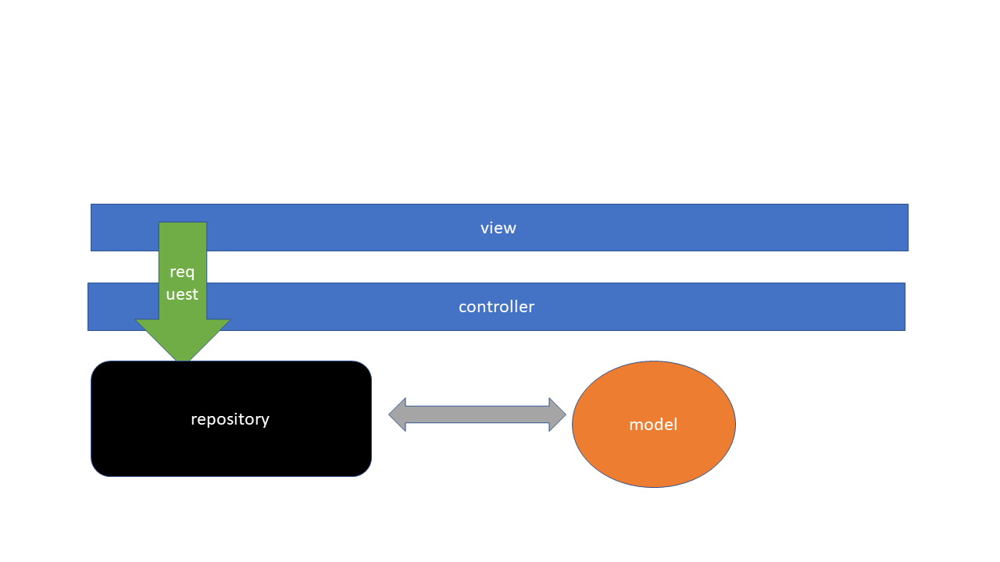

<small><i>Yksinkertaistettu kuva repository-mallista</i></small>

:::info Huom

Yo. kuva on yksinertaistettu esimerkki repository-mallin käytöstä. Oikeasti kaikki metodit eivät mene samaan repositorioon, vaan niitä on useampia. Kuvan on tarkoitus osoittaa, että tieto ei kulje enää suoraan controllerista modeliin ja takaisin. Nyt tieto kulkee controllerista repositorion kautta modeliin ja samaa reittiä takaisin.


:::

:::tip  Hyvä nyrkkisääntö

Luo jokaista modelia kohti oma repositorio.

<i>Tästä voi poiketa, jos sinulla on kaksi tosiinsa liittyvää modelia, joita käytät aina yhdessä, muttet koskaan tarvitse toista ilman toista. Tällöin voit käyttää kumpaakin modelia saman repositorion kautta.</i>

:::

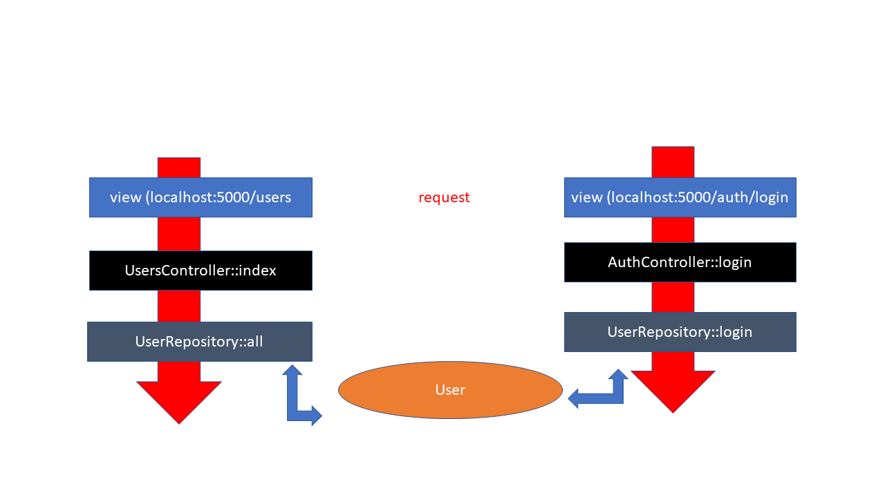

Yo. kuvassa on tarkempi esimerkki MVC:n ja repository-mallien yhteiskäytöstä.
Vasemmalla puolella oleva request tehdään osoitteeseen <i>/users/</i>. Siksi pyyntö reitittyy <i>UsersControlleriiin index-metodiin</i>, joka puolestaan kutsuu <i>UserRepositoryn all-metodia</i>. all-metodi käyttää <i>User-modelia</i>

Oikealla puolella oleva pyyntö reitittyy <i>AuthControllerin login-metodiin</i>, koska route on <i>/auth/login</i>. Controllerista kutsutaan <i>UserRepositoryn login-metodia</i>, joka myös käyttää <i>User-modelia</i>. 

<strong>Koska molemmat reqeustit tarvitsevat User-modelia, voidaan niiden toiminnallisuudet sijiottaa samaan repositorioon, mutta Controllerit vaihtuvat, koska urlit ovat erit.</strong>

### Tuntiharjoitus 3. 

:::tip Koodataan 

Katsotaan esimerkki koodista MVC-mallista ilman repository-mallia ja tehdään sama sen jälkeen käyttäen repositoriota. Näin erot ja suunnittelumallin hyödyt huomaa helpoiten.

:::

1. Jos sinulla ei vielä ole koodeja, hae ne täältä: <a href="https://github.com/juhaniguru/sovelluskehykset_mvc2.git">Githubista mallikoodi</a> sekä tietokannat.
    * mysql-tietokanta on sama kuin aiemmissa tuntiharjoituksissa.
    * tarvitset tätä esimerkkiä varten Postgres-kannan 

2. Tee samat asennukset kuin tuntiharjoitus 1 ja 2., jos sinulla ei ole vielä virtualenvia
3. Varmista sen jälkeen, että sovellus lähtee päälle: <i>python app.py</i>

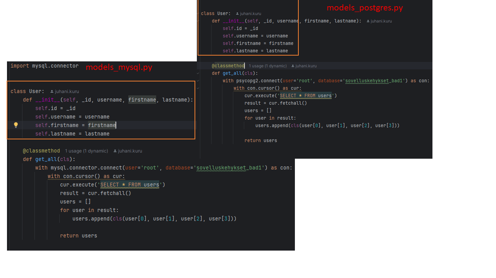
<small><i>Kuva lähtötilanteesta</i></small>

Kuten kuvasta näkyy, User-luokka on molemmissa model-tiedostoissa sama, vaikka tietokantaskeema on molemmissa sama ja vain metodin toteutus on erilainen. 

#### Tehtävänanto

1. Luo uusi PyCharm / Flask-projekti
    * tämä voidaan tehdä tunnilla yhdessä
2. Refaktoroi mallin koodi käyttämään Repository-mallia.
    * tee vastaava repository myös Postgrelle
3. <strong>Tietokannassa on myös products-taulu. Tee sille vastaavanlainen koodi kuin käyttäjien listaukselle MVC-mallin mukaisesti</strong>

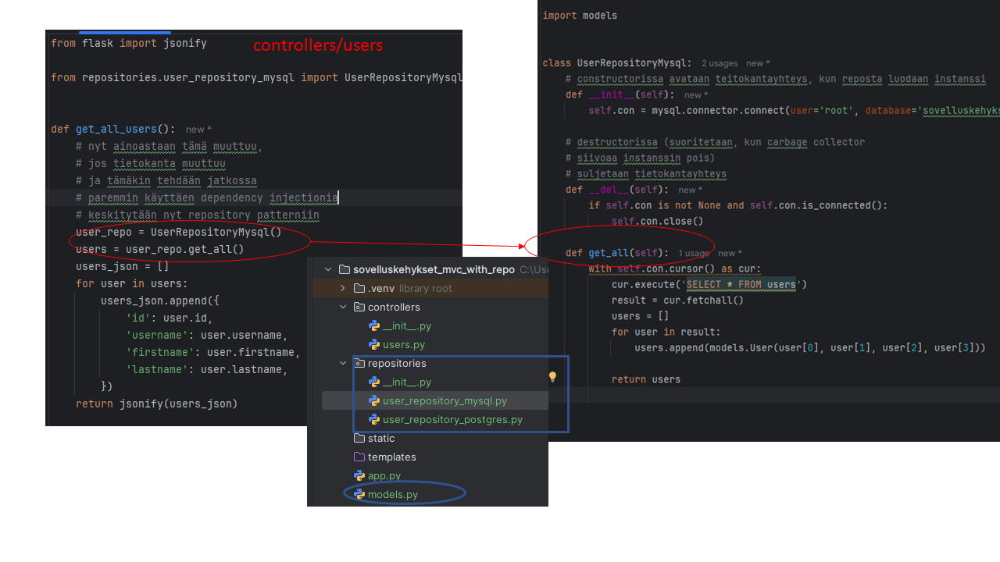

:::tip Muista periytyminen (inheritance)

Peritytyminen on yksi olio-ohjelmointikielten kulmakivistä. Tässäkin tehtävässä repositorioiden get_all-metodit ovat samanlaiset. <strong>Saat plussaa, jos saat poistettua toistuvan koodin repositorioista käyttäen apuna periytymistä</strong> 

:::

### Tehtävä 2

Jatka tuntiharjoitusta ja tee loput <i>CRUD-toiminnallisuudet</i> käyttäjille ja tuotteille. Käytä MVC-suunnittelumallia, repository-mallin kanssa yhdessä ja restful routingin periaatteita. Tee CRUD sekä  MySQL:lle että Postgrelle.

:::tip Mikä CRUD?

CRUD tulee sanoista <strong>C</strong>reate<strong>R</strong>ead<strong>U</strong>pdate<strong>D</strong>elete Se on yleisesti web-ohjelmoinnissa käytetty termi ja sillä tarkoitetaan, että jollekin kokonaisuudelle tehdään luonti,- luku,- päivitys- ja poisto-ominaisuudet. <strong>Read eli listaus tarkoittaa tässä tapauksessa kahta eri routea ja controllerin funktiota. Ensimmäisellä listataan kaikki ja toisella haetaan id:n perusteella yksi rivi tietokannasta.</strong>

:::

### Tehtävä 3.

Tee sovellukseen lisäominaisuus, joka hakee käyttäjätiedot <a href="https://jsonplaceholder.typicode.com/users" target="_blank">täältä</a>. Tarkoitus on, että teet uuden repositorion uutta datalähdettä varten, jotta muutokset oo. koodiin pysyvät mahdollisimman vähäisinä

:::info Huom. APIsta löytyvä data ei ole täysin samanlaista

- Pidä model-luokka koodissa ennallaan (osoitetiedot yms. voit jättää käyttämättä).
- Apista löytyvä name-kenttä sisältää sekä suku-, että etunimen, muista laittaa nimet oikeisiin muuttujiin model-luokassa.

:::

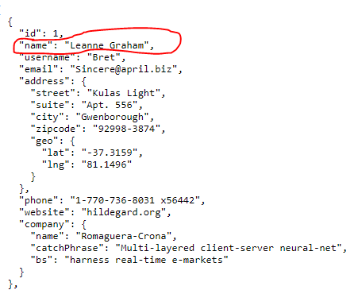

<small><i>Lähde: https://jsonplaceholder.typicode.com/users</i></small>

### Tehtävä 4.

Tämä on hieman haastavampi tehtävä. Jatka tehtävää 2. ja tee lisäksi repositorio ja CRUD-toiminnallisuudet MongoDB:lle. 

:::info Koska tämä ei ole tietokantakurssi

emme käytä aikaa yhdessä tunnilla siihen, jos ei ole tarvetta <strong>Jos sinulle ei ole aiempaa kokemusta MongoDB:stä, kerro siitä. Voin tehdä videon / jakaa aiemmilta opintojaksoilta materiaalia.</strong>

:::

## Factory Pattern & Dependency Injection

Factory Patternia ja Dependency Injectionia näkee käytettävän monesti yhdessä, vaikka ne toimivat toki yksinäänkin

###  Factory Pattern

Kuvittele, että sinulla on tehtaassa liukuhihna, jolla voidaan valmistaa useita erilaisia kenkiä. Pystyt valmistamaan kaikkia näitä eri kenkiä tietämättä itse, miten ne valmistetaan, kunhan vain osaat paremetroida / konfiguorida liukuhihan oikein.

```py


class Shoe:
    def __init__(self, brand, style, size):
        self.brand = brand
        self.style = style
        self.size = size

    

class ShoeFactory:
    def create_shoe(self, shoe_type, _size):
        if shoe_type == "lenkkarit":
            return Shoe("Asics ", "Gel Nimbus", _size)
        elif shoe_type == "saapas":
            return Shoe("Nokia", "Kumisaapas", _size)
        elif shoe_type == "sandaali":
            return Shoe("Pomar", "Hiekka", _size)
        

# Usage
factory = ShoeFactory()
boot = factory.create_shoe("saapas", 43)
sneaker = factory.create_shoe("lenkkarit", 43)
sandal = factory.create_shoe("sandaali", 43)


```

Yllä on yksinkertaistettu esimerkki ShoeFactory:sta, jossa voi luoda sandaaleita, lenkkareita ja saappaita. ShoeFactory-luokan voi korvata myös yksinkertaisemmalla funktiolla, esim. <i>create_shoe</i>.

Palataan takaisin aiempaan Repository Pattern-mallin esimerkkiin ja käytetään siinä RepositoryFactorya, jolla luodaan varsinainen instanssi repositorysta.


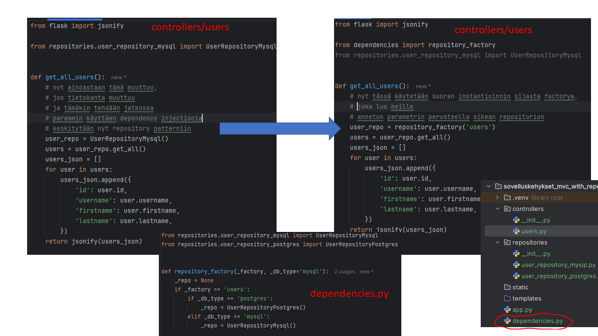

Yo. esimerkissä käytämme repository_factory-funktiota luomaan UserRepository-luokasta instanssin. 

### Q&A 3.

:::tip Miksi factory patternia pitäisi käyttää, kun ilmankin pärjää?

- Kaikissa eri suunnittelumallien käyttöesimerkeissä on kyse pohjimmiltaan parista asiasta

- Separation of Concerns
- Koodin keskitetty hallinta
    * nyt, kun UserRepositoryn instansseja ei luoda missä sattuu, vaan keskitetysti reposityro_factory:n avulla, muutokset UserRepositoryyn tarvitsee tehdä vain yhteen paikkaan

    * myös silloin, jos pitää tehdä uusi repositorio uutta datalähdettä varten, lisäys tarvitsee tehdä vain yhteen paikkaan. 

- Koodin testattavuus paranee sitä enemmän, mitä modulaarisemmin se on rakennettu
    * yksikkötestejä ajettaessa repository voidaan helposti korvata stubilla / fakella.

:::

:::tip Eikö ole hullua, että repository_factorya kutsutaan jokaisessa controllerin routehandlerissa erikseen?

Kyllä, tämä ei ole järkevää. Sen sijaan factory patternia kannattaa käyttää yhdessä dependency injectionin kanssa

:::

### Dependency Injection (DI)

Yksinkertaisesti dependency injection on tekniikka, jonka avulla ohjelman komponentti (esim. Controllerin routehandler-metodi/funktio) <i>saa riippuvuutensa (esim. UserRepository) ulkopuolelta sen sijaan, että loisi sen itse.</i>

Katsotaan uudelleen osaa edellisestä kuvasta, niin huomataan, mitä tämä käytännössä tarkoittaa

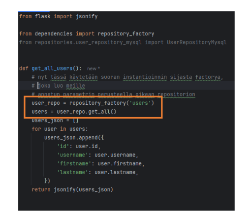

Yo. kuvassa on oranssilla ympyröitynä repository_factory-funktion kutsu. Tässä siis get_all_users-routehandler luo itse UserRepository-luokan instanssin käyttäen repository_factorya. 

:::tip Mikä vika tässä on?

Periaatteessa ei mitään vikaa, koska koodihan toimii, mutta jos meillä olisi useampi routehandler, joissa tarvitaan samaa UserRepositorya (kuten oikeissa sovelluksissa on) ja repository_factoryn kutsua pitäisi jotenkin muuttaa, tällä tavalla joutuisimme muuttamaan kutsua jokaiseen routehandleriin (jos joutuisimme vaihtamaan datalähdettä mysqlista postgrehen).

<strong>Sen sijaan, jos luomme UserRepositorysta instanssin routehandlereiden ulkopuolella ja välitämme instanssin niille parametrina, joudumme tekemään muutoksen vain yhteen paikkaan. Tämä on dependency injection</strong>

:::

Dependency Injectionin voi tehdä useammalla eri tavalla, käydään ne läpi

### Decorator injection

:::info huom decorator injection

Decoratorit ovat Pythonin ominaisuus, joka löytyy vastaavana myös muista ohjelmointikielistä JavaScriptissä / TypeScriptissä ne ovat myös decoraattoreita, Javassa näistä puhutaan annotaatioina ja C#:ssa attribuutteina. C#:ssa attribuutteja ei kuitenkaan kannata käyttää ensisijaisesti depenndency injectioniin. C#:ssa tähän on olemassa muita sopivampia dependency injectionin muotoja, joita käydään myöhemmin läpi.

Jos et tiedä, mikä decorator on, lue ensin <a href="/whatis/#python-decorator">tämä</a>

:::

Nyt, kun tiedät, mikä dekoraattori on, katsotaan, miten voimme käyttää sitä modularisoimaan vielä pidemmälle aiemmin tehtyä koodia.

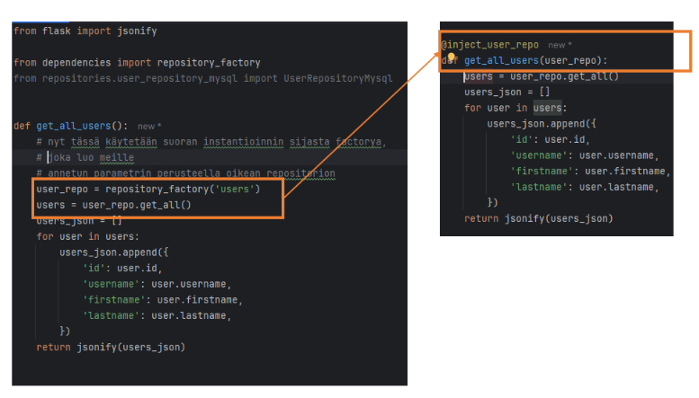

### Tuntiharjoitus 4.

Jatka tuntiharjoitus 3:sta niin, ettet luo UserRepositorya enää routehandlerissa vaan sen sijaan käytät decorator injectionia saadaksesi UserRepositoryn instassin routehandleriin. 

#### Tehtävänanto

Tehtäväsi on myös luoda dekoraattori itse, jossa käytät repository_factory-funktiota dekoraattori on tarkoituksella jätetty esimerkistä pois.

### Constructor injection

Constructor injection on toinen ja varmasti yleisin dependency injectionin muoto, sillä se toimii luokkien constructoreiden avulla (Pythonissa luokan __init__-metodi) ja näin ollen kaikissa olio-ohjelmointikielissä*. <strong>Kyse on siitä, että luokan konstruktorille annetaan riippuvuudet parametreinä.</strong>

:::info *)

Toimitus huomauttaa, ettei ole koodannut kaikilla maailman ohjelmointikielillä, mutta ainakin näissä: Python, PHP, C#, Java, Kotlin, Dart, JavaScript / TypeScript* ym.

:::

Katsotaan uudelleen tuntiharjoitus 3. UserRepository-esiemerkkiä.


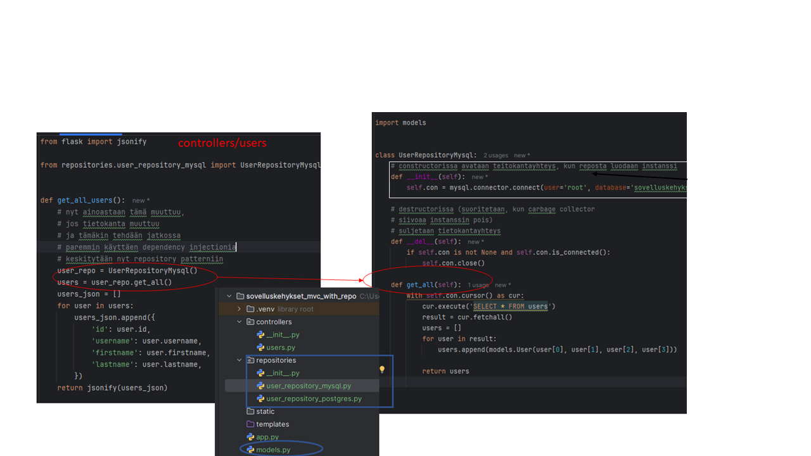

Yo. kuvassa tietokantayhteys on avattu UserRepositoryMysql-luokan konstruktorissa. Koodista saa modulaarisemman käyttämällä constructor injectionia.

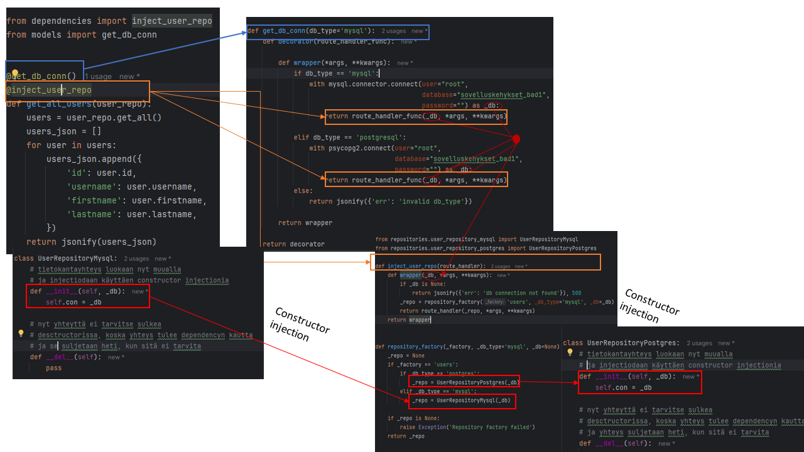

1. Vasemmalla ylhäällä controllerin routehandlerin yläpuolella on 2 dekoraattoria
    * get_db_conn, jolla avataan tietokantayhteys ja
    * inject_user_repo, jolla injectoidaan repositorio routehandleriin käyttäen decorator injectionia.

2. Oikealla controllerin vieressä on models.py:n get_db_conn-dekoraattorin koodi
    * tässä dekoraattorissa avataan db_type-muuttujan mukainen tietokantayhteys, joka on joko MySQL tai Postgres
    * Kun tietokantayhteys on avattu, palautetaan route_handler, joka saa parametrikseen juuri avatun tietoantayhteyden _db

3. Koska controllerissa get_db_conn-dekoraattorin alapuolella on käytetty inject_user_repo-dekoraattoria, 2. kohdan return route_handler_func(_db, *args, **kwargs) menee seuraavaksi inject_user_repo-dekoraattoriin.

4. inject_user_repo-dekoraatorissa käytetään repository_factory-funktiota, jossa luodaan varsinainen repositorion instanssi. <i>Nyt repository_factory ottaa 3. parametrin, joka on get_db_conn-dekoraattorista saatu avattu tietokantayhteys</i>

5. repository_factory-funktiossa on varsinainen <strong>constructor injection</strong>, kun annamme instanssia luodessamme repositoriolle tietokantayhteyden kontstruktorin parametrinä.

### Q&A 4.

:::tip Tuntuuko tämä constructor injection yliampuvalta?

Myönnetäköön, että esimerkin koodimäärä on niin pieni, ettei tässä nimenomaisessa tapauksessa constructor injectionista ole merkittävää hyötyä. Se, että tietokantayhteys instantioidaan repositorion constructorissa ilman dependency injectiota toimii tässä tapauksessa riittävän hyvin.

Yksi merkittävä hyöty construction injectionin käytöstä (ja tietokantayhtyden luonnista repositoryn ulkopuolella) on se, että nyt voisimme käyttää yhtä repositoriota sekä Mysqlille, että Postgrelle, koska ainoa ero koodeissa on yhdistämiseen liittyvä.

:::

### Setter injection

Setter injection on constructor injectionin variaatio, jossa constructorin sijasta tai sen lisäksi repositorioon tehdään set_db-metodi, jonka avulla tietokantayhteyden voi vaihtaa "lennosta" tekemättä uutta instanssia repositoriosta.

```py

class UserRepository:
    def __init__(self):
        self.con = None
    
    def set_db(self, _db):
        self.con = _db

```

## Service Pattern

Service-malli, Repository-malli ja MVC-malli eivät sulje toisiaan pois, vaan niitä voi käyttää yhdessä. MVC:tä käytetään yleensä pohjalla ja sen päällä käytetään esim. service- ja repository-malleja

Service-mallia ei myöskään ole pakko käyttää repositoryn kanssa.

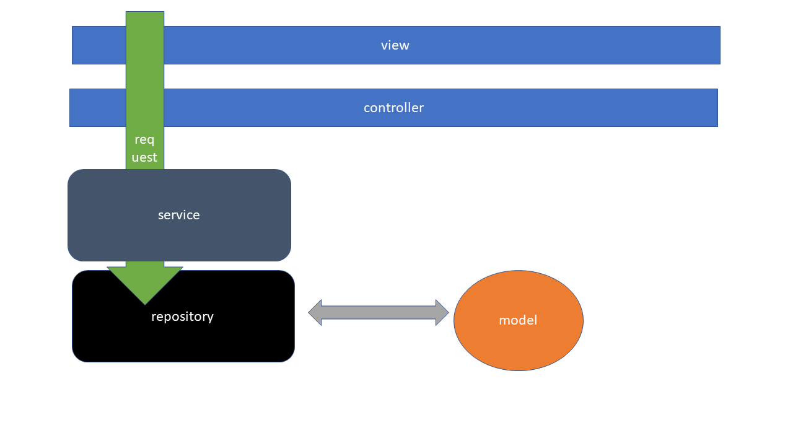

Service-mallissa service-layer kuuluu controllerin ja jo meille tutun repositorio-layerin väliin.

### Q&A 5.

:::tip Mihin service layeria tarvitsee?

Ei välttämättä mihinkään. Uusia abstraktiolayereita ei kannata lisätä vain abstraktion ja patternien vuoksi, mutta service layerilla on paikkansa. Katsotaan esimerkki siitä, milloin service layeria kannattaa käyttää

:::

<i>Kuvitellaan sellainen käyttötapaus, jossa käyttäjän sisäänkirjautumisen jälkeen pitää tehdä jokaisesta kirjautumisesta lokimerkintä tietokantaan.</i> Koodi tällaisessa käyttötapauksessa voisi näyttää ilman sevice patternia tältä:

```py

# AuthRepository
class AuthRepository:
    def __init__(self, _db, _log_repository):
        self.con = _db
        self.log = _log_repository

    def login(self, username, password):
        with self.con.cursor() as cur:
            cur.execute('SELECT * FROM user WHERE username = %s', (username,))
            user = cur.fetchone()
            if user is  None:
                raise Exception('user not found')
            if user['password'] == password:
                now = # nykyhetki

                # lisätään lokimerkintä käyttäjän kirjautumisesta.

                # TÄMÄ RIVI ON VÄÄRÄSSÄ PAIKASSA
                # LogRepositorya EI PIDÄ KÄYTTÄÄ TÄÄLLÄ
                self.log.add(username, now)
            


            

```

```py

class LogRepository:
    def __init__(self, _db):
        self.con = _db
    
    def add(self, username, _timestamp):
        with self.con.cursor() as cur:
            cur.execute('INSERT INTO log_table(username, ts) VALUES(%s, %s)', (username, _timestamp))
            cur.execute()

```

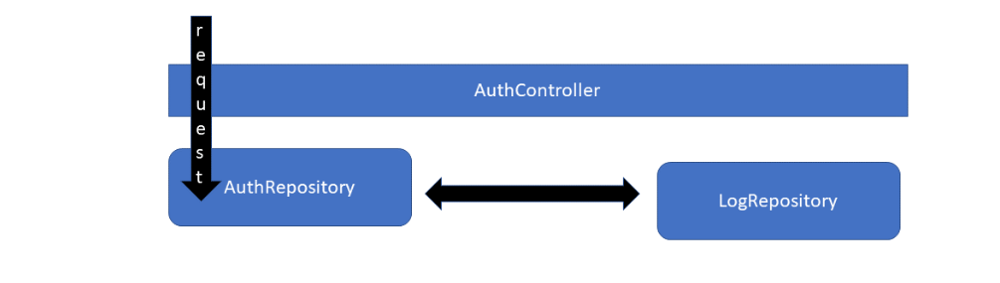

Yo. kuvassa on Controller-luokka / tiedosto, jota ei koodiesimerkissä ole. Se on jätetty esimerkistä pois selkeyden vuoksi. Joka tapauksessa repositoriot toimivat kuvan tavalla.

:::tip Huomaatko, mikä ongelma tässä on?

Kun request valuu alaspäin controllerilta AuthRepositorylle, homma menee vielä oikein, mutta samalla tasolla olevien komponenttien (tässä tapauksessa repositoryt Auth ja Log) ei pitäisi keskustella keskenään. <strong>Datan pitäisi valua aina arkkitehtuurissa alas ja vastauksen nousta takaisin ylös. Ei niin, että ensin alas ja sitten sivuttain</strong>

:::

Tähän on kaksi hyvää korjausta

#### 1. Kutsutaan AuthControllerista kahta eri repositorya ja niiden metodeja

```py

# esimerkistä on jätetty pois
# dekoraattoreiden luonti,
# koska se on toissijaista esimerkin kannalta

@get_db_conn()
@inject_auth_repo
@inject_log_repo
@app.route('/api/login')
def login(auth_repo, log_repo):
    auth_repo.login('juhani', 'salasana')
    log_repo.add('juhani', now)

```

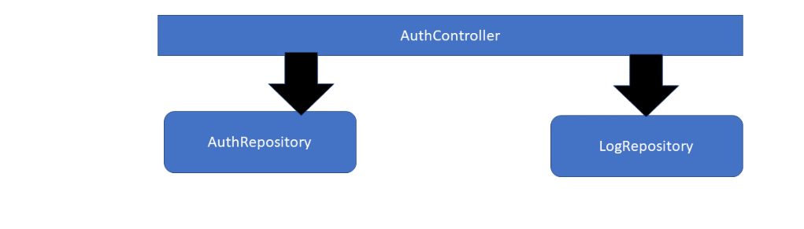

Tämä ratkaisu toimii ihan hvyin pienissä sovelluksissa, mutta useamman repositorion injectoiminen  yhteen routehandleriin voi mennä työlääksi

Parempi vaihtoehto on käyttää Repository Patternin kanssa yhdessä Service Patternia

```py

# service
class AuthService:
    def __init__(self, _db):
    
        self.auth_repo = AuthRepository(_db)
        self.log_repo = LogRepository(_db)
    

    def login(self, username, password):
        self.auth_repo.login(username, password)
        self.log_repo.add(username, now)


# controller
@app.route('/api/login')
@inject_auth_service
def login(auth_service):
    auth_service.login('juhani', 'salasana')

```

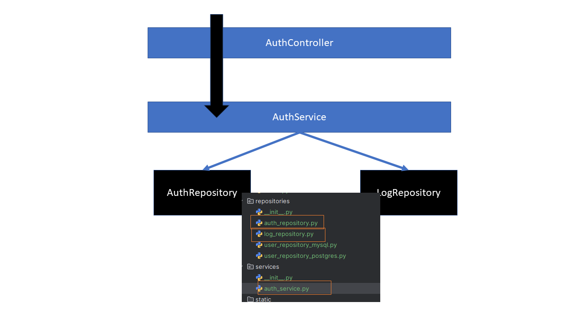

:::tip Miksi tämä ratkaisu on parempi kuin kaksi eri repositorya controllerissa?

- controllerin routehandlerit on hyvä pitää mahdollisimman siisteinä
    * tämä perustuu MVC:n perusperiaatteeseen <i>"Slim controller, fat model</i>
    * Slim controller, fat model tarkoittaa käytännössä sitä, että controlleriin pitäisi tulla MVC-mallissa mahdollisimman vähän tavaraa.
- kun käytämme service patternia yhdessä repository patternin kanssa, pystymme abstraktoimaan (kätkemään) useita repositoryja saman servicen alle koskematta controllerin koodiin ollenkaan -> modulaarisempi koodi = parempi koodi

:::

Mikään suunnittelumalli ei rajaa kerroksien määrää, että kerroksia pitäisi olla korkeintaan tai vähintään jokin tietty määrä. 

:::tip Vinkki

Itse teen lähtökohtaisesti nykyään projektin rakenteen tällä kaavalla view->controller->service->repository->model. 

Jokaista Controlleria varten oma service ja jokaista modelia varten oma repository sekä tietenkin jokaista tietokannan taulua varten puolestaan oma model-luokka.

Se, mitä dependency injectionin muotoa käytän riippuvuuksien välittämiseen komponentilta ja layerilta toiselle riippuu käytetystä kielestä.

Pythonin tapauksessa controllerissa käytän monesti decorator injectionia ja ja controllerista alaspäin välitän riippuvuudet constructor injectionilla tai interface injektionilla*

Factory patternia käytän monesti riippuvuuksien luontiin, sillä se keskittää riippuvuuuksien luonnin yhteen paikkaan, jolloin mahdolliset koodiin tehtävät muutokset voidaan tehdä yhteen paikkaan.


:::


:::tip *) Mikä ihmeen interface injection

<strong>interface injection tarkoittaa vain sitä, että constructor injectionissa riippuvuuden tietotyyppinä käytetään luokan tietotyypin sijasta interfacea, mikä puolestaan luo modulaarisempaa koodia. Kyse on siis constructor injectionin variaatiosta</strong>

Totta emme ole aiemmin käyneet läpi interface injectionia, eikä sitä ole edes mainittu.
Koska Pythonissa ei ole monesta muusta kielestä tuttua interfacea, tämä on jätetty tarkoituksella pois. Käydään tämä dependency injectionin tyyppi läpi C#:lla. Esimerkin löydät <a href="#">täältä</a>

:::

:::tip Eikö Pythonissa voi käyttää interface injectionia?

Ei varsinaisesti juuri siksi, koska interfacea ei Pythonissa ole. Pythonin tapauksessa interfacen voi korvata abstractilla luokalla...Mutta koska Python on dynaamisesti tyypitetty kieli, se ei ole monestikaan tarpeen. Interface Injection on todella hyödyllinen tapa staattisesti tyypitetyissä kielissä (C#, Go...yms.). Voit katsoa vastaavan esimerkin Pythonille <a href="#">täältä</a>

:::


