# ASP .Net Core

:::tip Miksi frameworkiksi on valittu Asp .Net Core?

Työkalut on valittu kolmella perusteella

- Opettaja on itse käyttänyt niitä töissä ja osaa auttaa hyvin tarvittaessa
- Opiskeljoille C# on tuttu ennestään
- Stack Overflown <a href="https://survey.stackoverflow.co/2024/technology#admired-and-desired">kehittäjätutkimusen tulosten perusteella.</a> Linkistä avautuvalla sivulla on kohta Web frameworks and technologies.

Asp .Net Core on eniten ihailtu web-framework (joka ei ole fronttiframework). Sen lisäksi, että se on haluttu, 72% sitä jo käyttävistä haluaa jatkaa sen käyttöä.

:::

ASP .Net Core on crossplatform eli se on tehty toimimaan useimmilla eri alustoilla.

## Asenuus

### .NET 8

1. Mene osoitteeseen <a href="https://dotnet.microsoft.com/en-us/download">https://dotnet.microsoft.com/en-us/download</a> ja lataa uusin stable versio. 
    * materiaalia tehdessä uusin versio on 8 (LTS). Tarkempi versio on 8.08, mutta sillä ei pitäisi olla merkitystä

2. Lataa ja asenna .Net

## Uuden projektin luonti käyttäen dotNet CLI:tä

Voit suorittaa tässä osiossa olevat komennot command promptissa, terminaalissa tai vaikka VS Coden kautta*

:::info Kyllä, koodaamme VS Codella

Voit koodata kyllä esim. Jetbrains Riderilla tai Visual Studiolla, mutta Visual Studio ei ole (ainakaan enää pitkään) saatavilla Macille ja Jetbrainsin työkalut ovat maksullisia.

<strong>Kaikki esimerkit tehdään VS Codella ja dotnet CLI:llä</strong>

:::

1. Luodaan projektille kansio
    * luo kansio profiilisi alle, jotta sinulla on on tarvittavat oikeudet suorittaa toimenpiteitä

2. Mene sisään luomaasi tyhjään kansioon

3. Tarkistetaan, että .Net SDK ja dotnet CLI on asennettu onnistuneesti

```sh

# suorita tämä komento tyhjässä kansiossa, jonka loit

dotnet --info

```

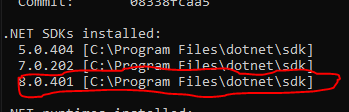

Komento palauttaa listan asennuksista. Minulla on esimerkkikuvassa asennettu useampi SDK-versio, joista alin (8.04) on uusin. Jos sinulla on useampi SDK-verio, käytetään oletuksena aina uusinta.

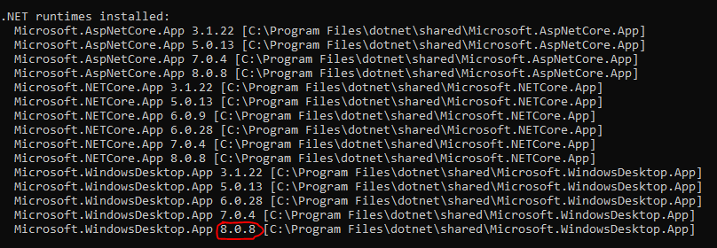

Toinen merkittävä tekijä on .net runtimen versio. 

:::info Huomaa, että nämä eivät välttämättä ole samat

Huomaa, että SDK:n ja runtimen versiot eivät välttämättä ole täsmälleen samat. Tämä on täysin OK

<strong>Monet myöhemmin asentamamme riippuvuudet pitää olla samassa versiossa kuin runtime. Muista siis runtimen versio.</strong>

:::

:::info SDK VS Runtime

SDK sisältää työkalut koodin kääntämiseen yms. Runtime on se, joka sitten puolestaan suorittaa SDK:n kääntämän lähdekoodin. 

:::

## Luodaan projekti

1. Ensin luodaan solution (sln) projektia varten. 

:::info Mikä solution?

Meidän projektimme on pieni, joten solutionimme sisältää vain yhden projektin, mutta .net projektien kasvaessa sovellus voidaan jakaa useampaan pienempään projektiin, jotka kuuluvat samaan solutioniin.

:::

```sh

# dotnet new komennolla
# voimme luoda vaikka mitä ja nyt luomme
# solutionin, johon varastoimme projektimme

dotnet new sln

```

2. Luodaan nyt varsinainen webapi projekti

```sh

dotnet new webapi -controllers -n API


```

3. Liitetään projekti solutioniin

```sh

# ennen liittämistä aja
# tämä komento listaa solutionin projektit
dotnet sln list

dotnet sln add API


```

## VS Coden konffaus

1. Tarkista VS Codessa, että projektin luonti onnistui
    * Avaa koodi VS Codessa solutionin tasolta (ei siis pelkästään API projektia)

2. Katso, että löydät:
    * API-kansion
    * API-kansion alta löytyy Controllers-kansio


:::info Miten Controllers-kansio on jo olemassa?

dotnet webapi käyttää MVC-mallia pohjana. Kun loimme projektin ylempänä käyttäen -controllers-attribuuttia, dotnet CLI loi meille projektin pohjan valmiiksi.

:::

3. Asenna sen jälkeen C# Dev Kit-laajennos
    * tämän avulla VS Code osaa auttaa sinua enemmän devatessa
    * VS Codeen ilmestyy tämän asennuksen jälkeen Solution Explorer. Tätä kannattaa käyttää, kun alamme koodata.

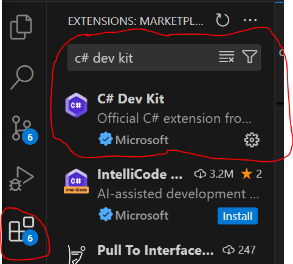

4. Asenna Nuget Gallery
    * Nuget on .netin paketinhallintajärjestelmä. Voit verrata sitä Noden npm:ään ja Pythonin Pypin (pip)

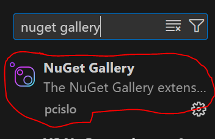
    


5. Asenna SQLite
    * SQLite on tiedostopohjainen "SQL-tietokanta"
    * devausvaiheessa se on helppo ja nopea käyttää, mutta älä koskaan yritä käyttää sitä tuotannossa

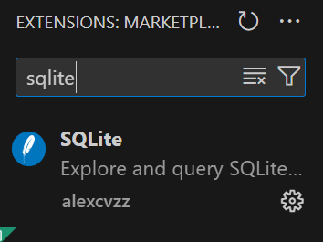  

## Testataan projekti

1. Avaa VS Coden terminaali ja mene API-kansioon
    * ei siis solution-tasolle, vaan projektitasolle

```sh

dotnet watch

```

Tämä komento buildaa ja käynnistää projektin development-modessa. Oletuksena käynnistyy myös selain Swagger-dokumentaatiosivulle.

watch-komento käynnistää projektin myös hot reload-modessa. Käytännössä projektin koodiin tehtävät muutokset aiheuttavat autom. uudelleenkäynnistyksen web-serverille.

Jos haluat käynnistää projektin ilman hot realodia, aja dotnet run

Saat avata sivun myös suoraan selaimella käyttämättä swaggeria. <i>Katso vain terminaalista portti, johon sovellus käynnistyy</i>


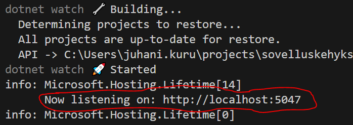

### Mikä [ApiController]?

[ApiController] on attribuutti, jonka avulla ASP .Net Core automatisoi meille paljon asioita

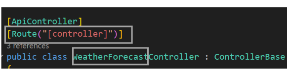


- Automattinen routtaus
    * [HttpGet], [HttpPost] jne. attribuuttien käyttö on mahdollista controllerin routehandler-metodeissa

- Automaattinen request paramien ja request bodyn validointi ja parametrien mäppäys.
    * meillä ei tässä vaiheessa ole yhtään routea jossa olisi parametrejä, mutta palataan tähän myöhemmin.


### Mikä [Route("[controller]")]


- Kun käytät [Route]-attribuuttia controller-luokalle, pystyt määrittämään sillä routen "keskiosan"

- [controller] on "wild card", joka automaattisesti laittaa controllerin nimen routen "keskiosaan". Sinun ei siis tarvitse määrittää routea jokaiselle controllerille erikseen, kun käytät [controller] wild cardia.

### ControllerBase

ControllerBase on yliluokka, jota käytämme webapissa, koska se ei rendaa HTML-viewiä vaan siitä saa ulos XML:ää ja JSONia.


 ### Mistä swaggerissa näkyvä route tulee?

Hyvin usein MVC-mallia noudattavat web-frameworkit rakentavat routtauksen automaattisesti niin, että urlin "keskiosa" domainin ja lopun välissä tulee Controllerin nimestä


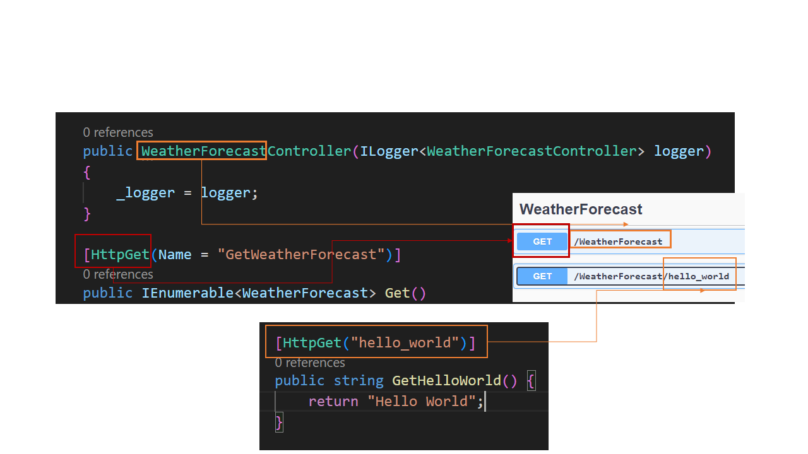

Esimerkkicontrollerissa on nyt kaksi metodia (eli kaksi routea). Ensimmäisessa ei ole routea määritetty, joten se menee automaattisesti controllerin juureen. Toiselle on määritetty route hello_world. ASP .Net Coressa routet määritetään attribuutin paramatrinä.

[HttpGet] on C#:n attribuutti, jolla kiinitetään routehandler haluttuun routeen. Se toimii tässä tapauksessa samalla tavalla kuin Pythonin dekoraattori. Kaikille HTTP-metodeille (GET, POST, PUT, PATCH, DELETE) on omat attribuuttinsa.

## Muita tiedostoja

### launchSettings.json

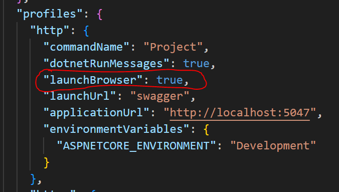

- launchSettings.json-tiedostossa on projektin käynnistyykseen liittyviä asetuksia

    * portti
    * https
        * asp .net coren saa automaattisesti toimimaan https-protokollan kautta. Emme kuitenkaan käytä opintojaksolla tätä ominaisuutta, koska se ei ole osaamistavoitteissa. Käytämme oletus http-protokollaa.


:::tip launchBrowser

Oletuksena launchBrowswer on true. Tämä asetus avaa uuden selaimen ikkunan joka kerta, kun käynnistät palvelimen uudelleen. <strong>Kannattaa laittaa tämä pois päältä</strong>

:::

### API.csproj

Tämä tiedosto sisältää projektiin asennetut riippuvuudet. <strong>Älä koske tähän tiedostoon oletuksena itse. Kun asennamme Nuget:lla paketteja, tämä tiedosto päivittyy automaattisesti</strong>

### API.http

Tämä on projektiin sisäänrakennettu reqeustien lähetykseen tehty työkalu, jota emme käytä. <strong>Käytämme tällä opintojaksolla testaukseen Swagger-dokumentaatiota sekä Postmania ja Insomnia Rest Clientiä</strong>

### appSettings.Development.json ja appSettings.json

- appSettings.Development.json-tiedostoon laitamme erilaisia softan asetuksia, joita tarvitsemme softan ollessa development-modessa. Development-mode on määritetty launchSettingsissä. 
    * Development-tiedostoa ei siis käytetä ollenkaan, jos buildaamme tuotantoversion
    * laitamme tähän tiedostoon myöhemmin myös tietokantayhteyden speksit.

- appSettings.json-tiedosto on sama, mutta sitä käytetään modesta riippumatta. Tänne kannattaa laittaa asetukset, jotka pätevät kaikissa modeissa.

:::tip Logging.LogLevel.Microsoft.AspNetCore

appSettings.Development.json-tiedostossa tämä asetus on Warning. Kannattaa vaihtaa siihen Information. <strong>Näin saat enemmän lokiin tietoa siitä, mitä tapahtuu</strong>

<strong>Älä kuitenkaan käytä Information-arvoa tuotannossa, koska se voi antaa liikaa tietoa mahdolliselle hyökkääjälle</strong>

:::

### Program.cs

Tämä on kaikki palaset yhteenkokoava tiedosto. Tulemme lisäämään tähän tiedostoon omia servicejämme, kunhan teemme niitä ensin. 

Tämä tiedosto on keskeinen osa mm. Asp .Net Coren dependency injection patternia, mutta tästä lisää myöhemmin.

## Entity Framework Core


### Models

Lisää Solution Explorer näkymästä uusi kansio nimeltä Models. Tämä kansio tulee sisältämään kaikki MVC-mallimme sovelluksessa käyttämät model-luokat.

#### AppUser

Lisää Models-kansioon uusi luokka nimeltä AppUser

```cs

public class AppUser
{
    // Muista, käyttää Id-propertysta juuri tällaista nimeä
    // asennamme EntityFrameWorkCore-riippvuuden Nugetista
    // EF Core tekee autom. Id-attribuutista tietokannan
    // taulun perusavaimen
    public int Id { get; set; }
    public required string UserName { get; set; }
    public required string Role { get; set; }
    public required string PasswordSalt { get; set; }
    public required string HashedPassword { get; set; }
}

```

:::tip Miksi kaikki isolla?

Kyseessä on C#:n property. <strong>Propertyt kirjoitetaan nimemiskäytännön mukaan isolla alkukirjaimella.</strong>

:::

:::tip Miksi UserName?

Tämä ei ole kirjoitusvirhe. Username (pienellä n-kirjaimella) toimii yhtä hyvin tässä tapauksessa. <strong>Kannattaa kuitenkin nimetä käyttäjänimen property UserNameksi</strong>

Jos haluat joskus lisätä tähän projektiin Asp .Net Identity-paketin*, sinun ei tarvitse muuttaa käyttäjänimen propertya. <strong>Identityn nimemiskäytäntöjen mukaan käyttäjänimi property on UserName</strong>

:::


:::info *) Mikä Asp .Net Identity?

Asp.Net Identity on paketti, jolla voit tehdä turvallisen ja paljon käytetyn autentikoinnin ja autorisoinnin omaan projektiisi. Me emme sitä kuitenkaan nyt käytä, koska opintojakson pointti on opetella käyttämään dependency injectionia ja muita framewrkin ominaisuuksia. Identityn käyttö automatisoi niin paljon, että asioita voi jäädä huomaamatta. Lisäksi, koska autentikointi ei ole osaamistavoitteissa, menemme helpomman kautta. <strong>Jos haluatte, voin tehdä lisätehtävän Identityn käyttöönotosta</strong>

:::

### Entity Framework Core

Entity Framework Core on se palikka, joka luo Models-kansion luokista tietokantatauluja ja mahdollistaa niistä tiedon lukemisen ja niihin tiedon viemisen (lisäys, muokkaus) sekä tiedon poistamisen <strong>kirjoittamatta SQL-kyselyjä itse</strong>

- Ominaisuuksia ovat mm.
    * kyselyt
    * muutosten seuranta
        - Jos jokin sarake muuttuu / poistuu tai sellainen lisätään, voimme luoda migraation tästä
    * caching (paljon käytetyt kyselyt cachetetaan)


#### Asennus

Jos asensit Nuget Gallery-laajennoksen VS Codeen sinulla pitäisi olla Nuget-välilehti terminaalin vieressä

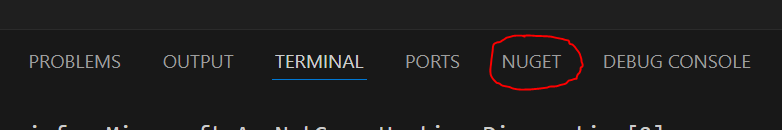

1. Hae Nugetista microsoft.entityframeworkcore.sqlite
    * Tämä on EntityFrameWorkCorelle sqlite-provider. Tämän asennuksen jälkeen EntityFrameworkCore osaa keskustella SQLite-tietokannan kanssa.

2. <strong>Ole tarkkana, että otat juuri oikean paketin</strong>

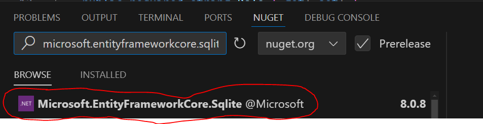

3. Valitse oikealta sama versio kuin, mikä runtimesi versio on. 

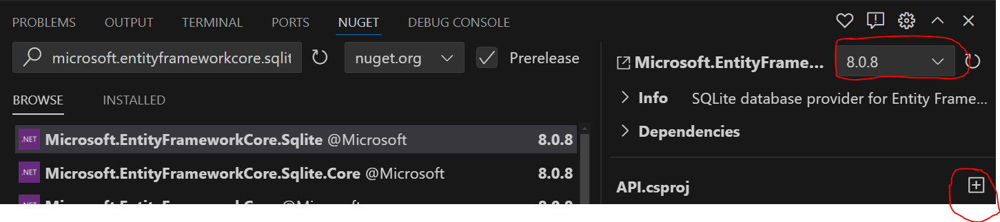

Asenna paketti painamalla plussaa

4. Hae Nugetista: microsoft.entityframeworkcore.design
    * tarvitsemme tätä migraatioihin, jotta EntityFrameworkCore osaa luoda Model-classeista varsinaisen tietokannan


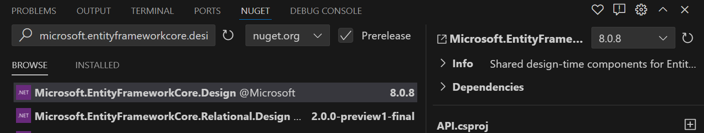

Asenna paketti painamalla plussaa

Voit varmistaa, että asennus onnistui API.csproj-tiedostosta

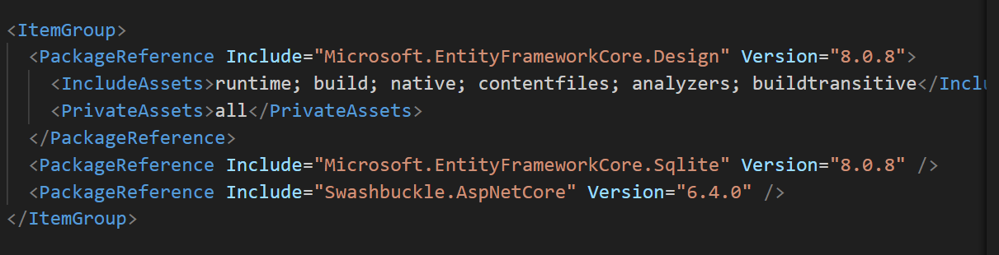


#### DataContext

1. Luo API-kansion alle Data-kansio
2. Luo Data-kansioon DataContext-luokka

```cs

using System;
using API.Models;
using Microsoft.EntityFrameworkCore;

namespace API.Data;

public class DataContext(DbContextOptions options) : DbContext(options)
{
    // Propertyn nimestä tulee
    // tietokantataulun nimi
    // Tässä siis Users

    // modeleista tehdään dbsetit
    public DbSet<AppUser> Users { get; set; }
}

```

#### Käytetään 1. kerran dependency injectionia, jotta .net Core osaa yhdistää tietokantaan

1. Mene Program.cs-tiedostono
2. Lisätää uusi service luokkaan

```cs

// Add services to the container.

// lisätään dbcontext yläpuolella builder = WebApplication.CreateBuilder(args);

// tämä lisää DataContextin osaksi buildi prosessia
// näin saamme tietokantayhteyden mukaan
builder.Services.AddDbContext<DataContext>(opt =>
{
    // AddDbContextille pitää kertoa, mistä tietokantayhteyden speksit löytyvät
    // näitä meillä ei vielä ole.
    opt.UseSqlite(builder.Configuration.GetConnectionString("DefaultConnection"));
});

// alapuolella on builde.Services.AddControllers();

```

#### Lisätään appSettings.Development.json-tiedostoon tietokantayhteyden tiedot


```json

{
  "Logging": {
    "LogLevel": {
      "Default": "Information",
      "Microsoft.AspNetCore": "Information"
    }
  },
  "ConnectionStrings": {
    "DefaultConnection": "Data source=tickets.db"
  }
}


````

## Migraatiot

1. Suorita komento terminaalisssa.

```sh

dotnet tool list -g

```

:::tip 

Jos listassa ei mainita dotnet-ef:ää tai jos mainitaankin, mutta asennuksen versio ei täsmää dotnet runtimen kanssa, asennettaan ensin dotnet-ef

:::

### Asennettaan dotnet-ef

1. Mene osoitteeseen nuget.org
2. Hae sieltä dotnet ef ja valitse kuvan mukainen paketti

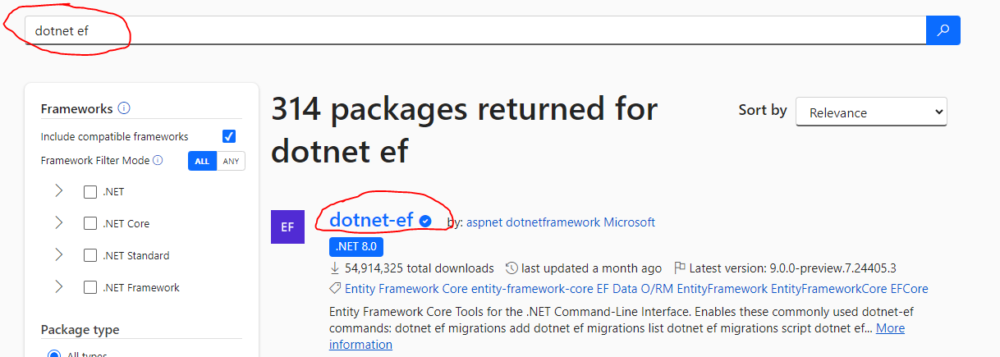

3. Valitse sen jälkeen paketin sivulta oikea versio, joka täsmää runtimesi version kanssa

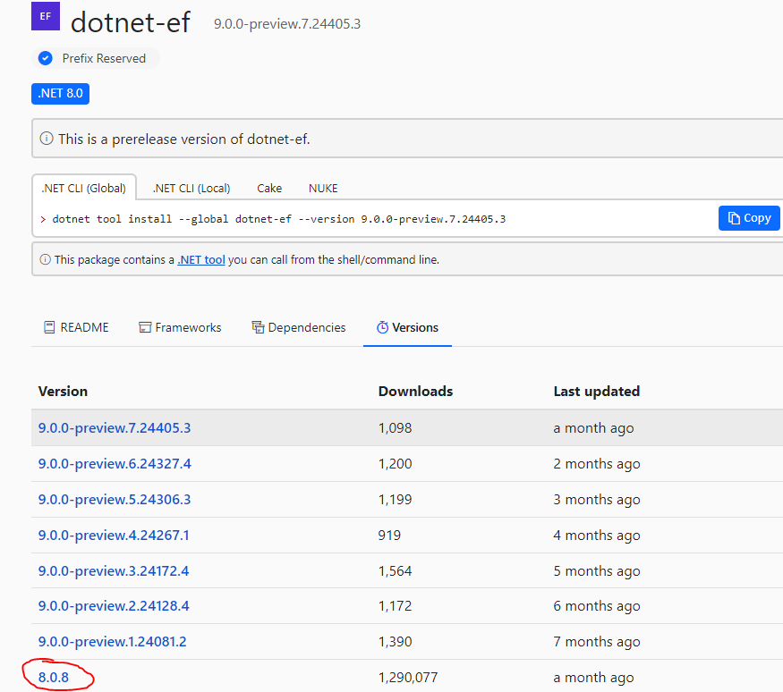

4. Kun valitset oikean version, voit kopioida komennon leikepöydälle

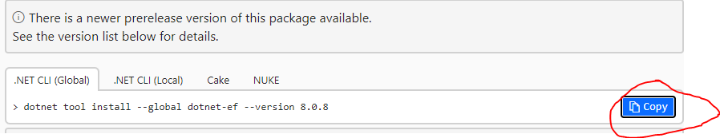

5. Suorita nyt komento

```sh
dotnet ef

```

### Luodaan migraatio

 edellisen kohdan asennuksen jälkeen tämä komento avaa ohjeet dotnet ef:n käyttöön

 1. Suorita komento

 ```sh

 dotnet ef migrations add AddUsersTable -o Data/Migrations

 ```

 Tämä komento luo migraatioskriptin, jonka nimeksi tulee AddUsersTable. -o parametrilla voi määrittää, mihin kansioon migraatiot luodaan

 :::tip -o

 - Jos -o-parametria ei käytä, luodaan migraatiot projektin juureen, mutta tämä on siistimpi vaihtoehto

 - seuraavaissa migraatioissa -o-parametria ei tarvitse antaa, koska seuraavat menevät automaattisesti samaan kansioon. 


 :::

 :::tip migraation nimi

 Tässä tapauksessa migraation nimi on AddUsersTable. Anna aina migraatiolle kuvaava nimi <strong>Tämä vaikuttaa arvosanaan, koska se vaikuttaa koodin laatuun ja luettavuuteen</strong>

 :::

 ### Luodaan tai päivitetään tietokanta

 :::info

 Jos tietokantaa ei ole vielä olemassa, se luodaan. Muuten tämä komento päivittää oo. tietokantaa

 :::

 Suorita komento

 ```sh

 dotnet ef database update


 ```

 Tämä komento luo tietokannan. Nyt sinulla pitäisi olla appSettings.Development.json-tiedostoon lisätty tietokanta luotuna projektissa

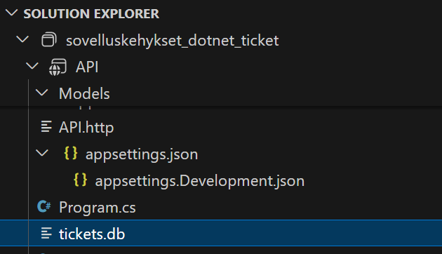

### Avataan tietokanta

:::tip SQLite-laajennus

Jos asensit alussa SQLite-laajennuksen VS Codeen, voit avata tietokannan sillä

:::

1. Paina VS Codessa CTRL+Shift+P (Avaa command paletin)
    * macille on eri pikanäppäinyhdistelmä
2. Valitse listasta SQLite: Open database ja valitse se
3. Tämän jälkeen valitse avautuvasta valikosta luomasi tietokanta
    * esimerkissä tickets.db
4. Avaa tämän jäkeen VS Coden SQLite Explorer

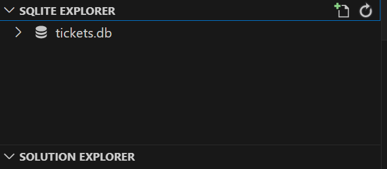

## Koodataan

Jos sait kaikki asennettua ja tietokannan auki, olet valmis koodaamaan.

Teemme oppitunneilla / ylimääräisillä videoilla pienen projektin sekä ASP .Net Corella että Pythonin FastAPI:lla, jotta saat paremman käsityksen siitä, miten arkkitehtuureja ja suunnittelumenetelmiä voidaan käyttää eri kielillä ja Frameworkeilla. 

Teemme molemmilla frameworkeilla saman pienen sovelluksen, jotta erot ja samankaltaisuudet työkalujen välillä tulevat selvemmin esiin. 

:::tip Onko tämä palautettava tehtävä?

Jos palautat tämän, voit saada plussaa, mutta tämä tehtävä ei ole pakollinen, vaan ainoastaan esimerkki.

:::

:::tip Tuleeko tästä osiosta palautettava tehtävä?

Kyllä tulee, mutta siitä lisää myöhemmin.

:::

### Käyttäjien listaus

:::tip Admin-oikeudet käyttäjien listaukseen

Koska meillä on vain yksi tietokantataulu ja haluan näyttää, miten tietokantahaut toimivat, aloitamme käyttäjien listauksella. 

Kun pääsemme esimerkeissä pidemmälle, lisäämme pääsyrajoituksen, jonka mukaan vain admin-roolin käyttäjät voivat listata käyttäjiä


:::

#### Luodaan uusi Controller

1. Mene Soutions Explorerissa Controller-kansioon ja lisää uusi tiedosto
2. Valitse avautuvasta valikosta <i>Api Controller</i>
3. Anna tiedostolle nimeksi <i>UsersController</i>. Ole tarkka nimeämisen kanssa, koska tästä tulee osa routea. <strong>Aloita isolla kirjaimella ja käytä CamelCasingia</strong>

```cs

using Microsoft.AspNetCore.Http;
using Microsoft.AspNetCore.Mvc;

namespace API.Controllers
{
    [Route("api/[controller]")]
    [ApiController]
    public class UsersController : ControllerBase
    {
    }
}

```

Api controller-luokan automaattisesti luotu stub näyttää tältä.


:::tip Mikä vika tässä on?

Teknisesti kaikki toimii kyllä, mutta nyt meillä on jo kaksi Controlleria, joissa toistuu tarpeettomasti samanlainen koodi. Pidetään koodi "kuivana" ja poistetaan turha toisto

:::

:::tip Tä?

DRY principle eli <strong>D</strong>on't<strong>R</strong>epeat<strong>Y</strong>ourself tarkoittaa, että mitä vähemmän koodissa on turhaa toistoa sitä helpompi se on ylläpitää ja lukea.

<strong>Tässä tapauksessa voimme tehdä yliluokan, johon siirrämme toistuvan koodin.</strong>

:::

4. Luodaan ControllerCustomBase-niminen tiedosto Controllers-kansioon

```cs

using Microsoft.AspNetCore.Http;
using Microsoft.AspNetCore.Mvc;

namespace API.Controllers
{
    [Route("api/[controller]")]
    [ApiController]
    public class ControllerCustomBase : ControllerBase
    {
    }
}

```

Kun tämän jälkeen UsersController laitetaan perimään uusi ControllerCustomBase-luokka, meidän ei tarvitse toistaa Route- ja ApiController-attribuutteja enää UsersControllerissa.

```cs

using Microsoft.AspNetCore.Http;
using Microsoft.AspNetCore.Mvc;

namespace API.Controllers
{

    // tästä on lähtenyt turhaa toistoa poist
    // nyt tämä luokka perii ControllerCustomBase-luokan
    public class UsersController : ControllerCustomBase
    {
    }
}


```

4. Nyt, kun koodi on siivottu, jatketaan koodausta

```cs

using API.Data;
using API.Models;
using Microsoft.AspNetCore.Http;
using Microsoft.AspNetCore.Mvc;
using Microsoft.EntityFrameworkCore;

namespace API.Controllers
{

    // tästä on lähtenyt turhaa toistoa poist
    // nyt tämä luokka perii ControllerCustomBase-luokan

    // tässä on käytännössä constructor injection contextilla

    public class UsersController(DataContext context) : ControllerCustomBase
    {

        // HttpGet-attribuutti määrittää HTTP-metodin
        // koska routea ei ole määritetty, data löytyy
        // usersControllerin juuresta
        [HttpGet]
        public List<AppUser> GetAllUsers()
        {
            // tämä palauttaa listan käyttäjistä
            return context.Users.ToList();

        }
    }
}


```

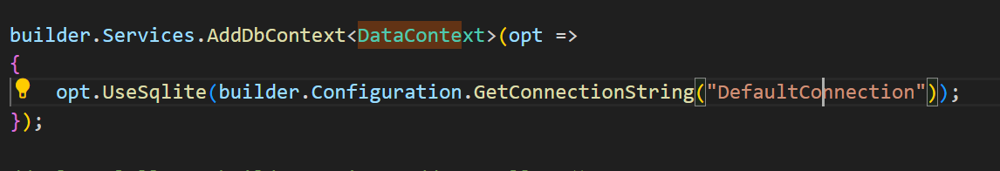

<i><small>muistatko tämän kohdan Program.cs-tiedostossa</small></i>

:::tip Miten saamme DataContext-luokan suoraan controlleriin?

Koska olemme lisänneet DataContext-luokan servicenä ohjelmaamme, pystymme ottamaan sen käyttöön näin yksinkertaisesti missä tahansa controllerissa. <strong>Tämä on dependency injectionia, tarkemmin sanottuna constructor injectionia, käytännössä</strong>


:::

:::tip Hetkinen, riittääkö tämä? Entä repository pattern ja service pattern?

On totta, että tämä koodi ei ole mahdottoman modulaarisesti tehty, vaikka asp.net coressa se on melko automaattista.

Itseasiassa EFCore (ja sitä kautta meidän DataContext) käyttää jo valmiiksi Repository Patternia, joten sitä meidän ei tarvitse itse enää tehdä. Sen sijaan service layerin lisääminen softaan on ihan paikallaan. Ei vaan tehdä sitä vielä, vaan korjataan ensin tästä koodista pari juttua

:::

:::tip Mikä vika siinä vielä on?

On totta, että koodi toimii ja on mukavan lyhyt, niin kuin Controllerin kuuluu MVC:ssä ollakin. Kyse on siitä, että route handlereiden kannattaa olla asynkroonisia. 

Tämä korjaus ei varsinaisesti liity arkkitehtuureihin, mutta <strong>routehandlerit kannattaa tehdä asynkronisiksi</strong>

:::

Katstoaan, miten routehandlerista saadaan asynkroninen.

```cs

// muu koodi pysyy ennallaan

        [HttpGet]
        // nyt metodissa on async keyword sekä paluuarvona on Task
        // Task on se, mikä tekee käytännössä handlerista asynkronisen
        // Task on geneerinen luokka, joka voi itse sisältää useita tyyppejä
        // siksi Taskille pitää kertoa, että palautusarvo on List<AppUser> eli lista 
        // AppUser-luokan instansseja.
        public async Task<List<AppUser>> GetAllUsers()
        {
            // jos metodi on asynkroninen, pitää muistaa käytää awaitia
            return await context.Users.ToListAsync();

        }

```
:::tip Riittääkö tämä? 

Asynkronisuuden puolesta riitää kyllä. Nyt metodi toimii asynkronisesti, eli koodi skaalautuu paremmin kovalla käytöllä, kun http-requestit eivät blokkaa toisiaan.

routehandlerissa on kuitenkin vielä parantamisen varaa. Nyt kun paluuarvona on List emme pysty mitenkään näyttämään käyttäjälle asianmukaista virheilmoitusta virheen sattuessa. Tällä toteutuksella voisimme virheen sattuessa palauttaa vain tyhjän listan,eikä se kerro virheestä mitään.

:::

Tehdään koodi vielä uudellee niin, että pstymme näyttämään virheitä niiden sattuessa    

```cs

        [HttpGet]
        // nyt kun tietotyyppinä on actionresult,
        // pystymme palauttamaan myös virheitä niiden sattuessa
        // jätetään kuitenkin vielä toistaiseksi virheenkäsittely pois
        // esimerkistä
        public async Task<ActionResult> GetAllUsers()
        {
            // tämä palauttaa listan käyttäjistä
            var users = await context.Users.ToListAsync();
            return Ok(users);

        }

```

:::tip Joko nyt riittää?

Periaatteessa kyllä! Teknisesti koodi on oikein, mutta jos haluat täyden hyödyn irti Swagger-dokumentaatiosta, kannattaa routehandlerille kertoa, mitä tietotyyppiä ActionResult sisältää

:::

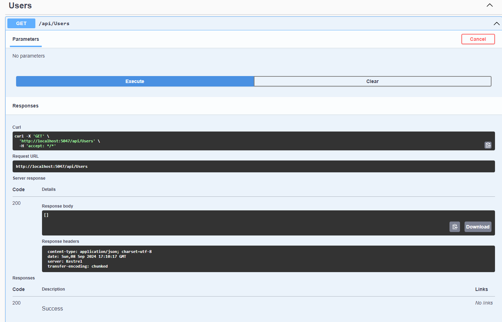

Kuten yo. kuvasta näkyy, Swagger ei kerro mitään routehandlerin paluuarvosta, koska sitä ei ole sille kerrottu

:::tip Miten sen paluuarvon voi sitten kertoa?

ActionResult on geneerinen luokka, jolle voi antaa paluuarvon. Tehdään koodi vielä kerran uudelleen.

:::

```cs

        [HttpGet]

        // nyt routehandler on asynkroninen
        // siitä voi palauttaa myös muutakin kuin Listan käyttäjistä virheiden sattuessa
        // ja lisäksi dokumentaatiosta selviää, millainen paluuarvo on requestin onnistuessa
        public async Task<ActionResult<List<AppUser>>> GetAllUsers()
        {
            // tämä palauttaa listan käyttäjistä
            var users = await context.Users.ToListAsync();
            return Ok(users);

        }

```

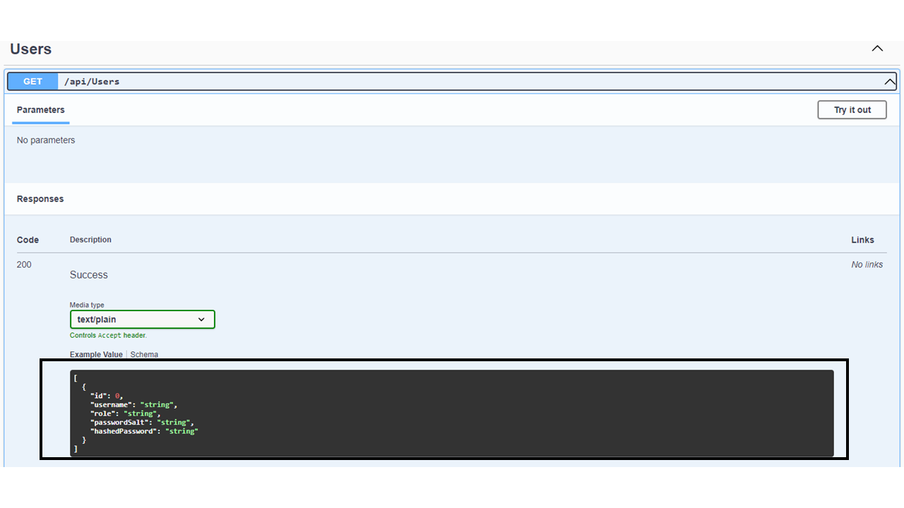

### Service Pattern Asp .net Coressa

:::tip Ennen kuin

katsomme, miten Service Pattern toimii Asp .Net Coressa, katsotaan ensin, <a href="/whatis/#interface">mikä on rajapinta</a> ja miten sitä voidaan käyttää koodin modularisoinnissa.

:::

Nyt kun olemme ottaneet selvää, mikä on interface ja miten interface injectionia voidaan käyttää, katsotaan, miten voimme käyttää niitä Asp .Net Coressa ja Service Patternin käyttöönotossa


1. Lisää API-kansion alle Solutions Explorerissa uusi kansio <i>Services</i>
2. Lisää Services-kansion alle uusi kansio <i>Interfaces</i>
3. Lisää Interfaces-kansioon uusi interface <i>IUserService</i>

```cs

using System;
using API.Models;

namespace API.Services.Interfaces;

public interface IUserService
{
    Task<List<AppUser>> GetAll();
}

```

4. Lisää Services-kansioon uusi luokka <i>UserService</i>

```cs

using System;
using API.Data;
using API.Models;
using API.Services.Interfaces;
using Microsoft.EntityFrameworkCore;

namespace API.Services;

// Nyt DataContext on injektoitu UserServicen dependencyksi
// Huomaa. UserService käyttää nyt IUserService-rajapintaa
public class UserService(DataContext context) : IUserService
{
    // nyt se tietokantakysely, joka oli aiemmin Controllerissa,
    // löytyy täältä
    public async Task<List<AppUser>> GetAll()
    {
        var users = await context.Users.ToListAsync();
        return users;
    }
}


```

5. Muokataan UsersControllerin koodia niin, että se käyttää UserServicea

```cs
// nyt controller käyttää servicea
// nimenomaan interface injectionilla
public class UsersController(IUserService service) : ControllerCustomBase
    {


        [HttpGet]
        public async Task<ActionResult<List<AppUser>>> GetAllUsers()
        {
            // nyt sen sijaan, että tekisimme suoraan kyselyn contextiin,
            // käytämme sericen GetAll-metodia.
            var users = await service.GetAll();
            return Ok(users);

        }


    }

```

Jos nyt suoritat koodin, se kääntyy kyllä, mutta siitä tulee ajonaikainen virhe!

:::tip Miksi softa kuolee ajossa?

Teknisesti kaikki on kääntäjän mielestä kunnossa, mutta ongelma on siinä, että ASP .Net Core ei tiedä, mitä meidän  <i>IUserService</i> tekee. 

<strong>Muista että interface ei sisällä konkreettista toteutusta, vaan ainostaan kuvauksen metodista. Tästä syystä, kun käytämme Interfacea tyyppinä, Asp. Net Core ei tiedä, mitä konkreettisesti pitäisi tehdä</strong>
:::

6. Rekisteröidään UserService käyttöön
    * Mene Program.cs-tiedostoon
    * Lisää uusi service

```cs

// yläpuolella on on builder.Services.AddContext ....

// Tämä rivi kertoo, että aina, kun Controlleriin injectoidaan muuttuja tyypillä
// IUserService, pitää Asp .Net Coren tehdä konkreettinen instanssi luokasta UserService

builder.Services.AddScoped<IUserService, UserService>();

// alapuolella on builde.Services.AddControllers();


```

:::tip Mikä ihmeen AddScoped?

- Pystyt lisäämään oman servicen kolmella eri tavalla
    * AddScoped: tämä tarkoittaa, että servicesta tehty instanssi (tässä tapauksessa UserService) elää HTTP-pyynnön ajan. Kun sitä ei enää tarvita, se siivotaan pois. Taas seuraavan requestin aikana luodaan uusi instanssi.
    * AddTransient: Aina, kun servicen metodia kutsutaan luodaan uusi instanssi sevicestä. Jos olisimme esim. tehneet kaksi eri metodikutsua serviceen samassa routehandlerissa, molemmille Asp .Net Core olisi luonut oman instanssin
    * AddSingleton: Singleton tarkoittaa, että instansseja luodaan vain yksi koko ohjelman elinkaaren aikana ja kaikki käyttävät tätä samaa instanssia. <strong>Tämä toimii yleensä hyvin conffitiedostojen tapauksessa, muttei muuten</strong>

    <strong>Kun implementoit Service Patternia omaan koodiisi, kannattaa oletuksena käyttää AddScoped-metodia niiden lisäykseen</strong>

    

:::

### Tuntiharjoitus 5.

Tutki itsenäisesti, miten voit tehdä UsersControlleriin muut CRUD-ominaisuudet ja toteuta ne.

### Tehtävä 6.

Tee C#:lla ja Asp .Net Corella webapi verkkokaupalle rajoitetuin ominaisuuksin.

Tähän tehtävään tarvittavat tarkemmat speksit toimitetaan myöhemmin

- Ominaisuudet:
    * Kaikkien tuotteiden listaus
    * Tuotteiden listaus kategorioittain
    * Kategroiden listaus


## Autentikaatio

:::info

Oikeassa tuotantokäyttöön tarkoitetussa sovelluksessa kannattaa käyttää valmista autentikaatiota (esim. micorsoft.aspnetcore.identity). Tämän opintojakson näkökulmasta Identityn käyttö tässä vaiheessa ei ole paras tapa oppia uusia asioita.

<strong>Jos käytämme nyt Identityä, opit konffaamaan Identityn käyttöön, mutta kun teemme autentikaation ja autorisoinnin itse, opit käyttämään Middlewareja, Attribuutteja ja Dependency Injectionia vielä lisää</strong>

:::

:::tip Miksi teemme aina rekisteröitymisen ja sisäänkirjautumisen

<strong>Käyttäjän rekisteröityminen mahdollistaa sisäänkirjautumisen ja sisäänkirjautuminen mahdollistaa monien uusien ominaisuuksien opettelun</strong>

- Se on web-softissa hyvin tyypillinen käyttötapaus, ja on siksi hyvä osata useimmilla kielillä
- Meillä on vielä opettelematta
    * kustomoidujen authorization policyjen luonti, rekisteröinti ja käyttö
    * kustomoidujen omatekoisten middlewareiden luonti ja käyttö

Nämä ominaisuudet on helpompi opettaa, kun pystymme esim. tarkistamaan, onko käyttäjä kirjautunut sisään.


:::

### Käyttäjän luominen

1. Lisätään UsersControlleriin käyttäjän luontia varten routehandler

```cs


[HttpPost]
// classit AddUserRes ja AddUsreReq puuttuvat vielä
public async Task<ActionResult<AddUserRes>> CreateUser(AddUserReq req)
{
    // myös UserServicesta puuttuu Create-metodi
    var user = await service.Create(req);
    return Ok(user);
}

```

:::info Mitkä AddUserRes ja AddUserReq?

Näitä meillä ei vielä ole. Ennen tätä olemme palauttaneet AppUsereita UsersControllerin GetAllUsers-routehandlerista, mutta tämä ei kannata

<strong>Model-luokat ovat tietokannan kanssa keskustelua varten, mutta jos käyttäjille pitää näyttää jotakin, älä palauta salasanoja ja passwordSaltia</strong>


:::

2. Luo API-kansion alle uusi kansio <i>DTOs</i>

:::info DTO?


DTO tulee sanoista <strong>D</strong>ata<strong>T</strong>ransfer<strong>O</strong>bject. Ne ovat käytännössä luokkia niin kuin Model-luokatkin, mutta niillä kuljetetaan dataa rajapinnan kautta ohjelmaan sisään ja ohjelmasta ulos

:::

3. Lisää DTOs-kansioon Class AddUserRes

```cs

namespace API.DTOs;

public class AddUserRes
{
    public required int Id { get; set; }
    public required string UserName { get; set; }
}


```

4. Lisää samaan kansioon AddUserReq-luokka

```cs


using System;

namespace API.DTOs;

public class AddUserReq
{
    public required string UserName { get; set; }
    public required string Password { get; set; }
    // jos requestista puuttuu role-avain, käytetään useria oletuksena
    public string Role { get; set; } = "user";

}


```

:::tip Mistä Asp .Net Core tietää, mistä parametrit tulevat

Kun käyttää HttpPostia ja Controllerin routehandlerille annetaan parametrinä ns. complex type, eli luokka, niin Asp .Net Core hakee sitä automaattisesti requst bodysta

:::

5. Lisää IUserService-luokkaan Create-metodi

```cs

using System;
using API.DTOs;
using API.Models;
using Microsoft.AspNetCore.Identity.Data;

namespace API.Services.Interfaces;

public interface IUserService
{
    
    // jos sinulla on täällä miuta metodeja, ne pysyvät ennallaan
    Task<AddUserRes> Create(AddUserReq req);

    
}

```

Tämän jälkeen UserServicesta tulee virhe. <strong>Lisäsit uuden Create-metodin rajapintaan, jota ei ole vielä konkreettisesti tehty UserServiceen</strong>

6. Lisätään Create-metodille konkreettinen toteutus

```cs
// muu täällä pysyy ennallaan
public Task<AddUserRes> Create(AddUserReq req)
{
    throw new NotImplementedException();
}

```

Muista, että serviceen tulee asynkronisia tietokantaopieraatioita, joten Create pitää merkata asynciksi

7. Lisää koodi metodiin 


```cs


public async Task<AddUserRes> Create(AddUserReq req)
    {
        // HMACSHA512ia käytetään salasanan hashaykseen
        // sekä Saltin lisäämiseen 
        using var hmac = new HMACSHA512();

        var user = new AppUser
        {
            UserName = req.UserName,
            Role = req.Role,
            // hmac.Key on randomi salt, jonka loit automaattisesti
            // kun teit hmac-instanssin
            PasswordSalt = hmac.Key,
            // ComputeHash tekee hashin selkokielisestä salasanasta
            HashedPassword = hmac.ComputeHash(
                // Encoding.UTF8.GetBytes?
                // req.Password on string-tyyypiä, mutta ComputeHash
                // haluaa parametring byte[]-arrayna
                // GetBytes siis palauttaa merkkijonosta byte[] arrayn.

                Encoding.UTF8.GetBytes(req.Password)
            )

        };
        // tämä tekee käytännössä insertin Users-tietokantatauluun
        context.Users.Add(user);
        // insert pitää vahvistaa, jotta rivi oikeasti tallennetaan
        await context.SaveChangesAsync();

        // tallennuksen jälkeen Id-attribuutilla on arvo
        return new AddUserRes {
            Id = user.Id,
            UserName = user.UserName
        };

```

:::info Koodissa on virhe

Olemme luoneet AppUser-modelin jo aiemmin ja siellä salt ja hashedpassword ovat string-tietotyyppiä. Muutetaan modelia

:::

```cs

using System;

namespace API.Models;

public class AppUser
{
    // Muista, käyttää Id-propertysta juuri tällaista nimeä
    // asennamme EntityFrameWorkCore-riippvuuden Nugetista
    // EF Core tekee autom. Id-attribuutista tietokannan
    // taulun perusavaimen
    public int Id { get; set; }
    public required string UserName { get; set; }
    public required string Role { get; set; }
    // näiden pitää olla byte[]-tietotyyppiä
    public required byte[] PasswordSalt { get; set; }
    public required byte[] HashedPassword { get; set; }
}


```

Nyt käyttäjien salasanat eivät ole enää selkokielisiä.

:::info käyttäjänimet eivät ole yksilöllisiä.

Tietokannassa ei ole nyt rajoitetta UserName-sarakkeelle UNIQUE-rajoitetta.

:::

### Varmistetaan, että käyttäjänimi pysyy yksilöllisenä

Tämän voi tehdä koodin päähän tai tietokannan päähän

#### Koodilla

1. Lisätään UserServiceen metodi tarkistusta varten

```cs

private async Task<bool> CheckUsernameTaken(string username)
    {   
        // AnyAsync palauttaa true tai false sen mukaan löytyykö hakehdolla mitään

        
        var taken = await context.Users.AnyAsync(u => u.UserName.ToLower() == username.ToLower());
        return taken;

    }

```

2. Käytetään yo. metodia Create-metodissa

```cs

public async Task<AddUserRes> Create(AddUserReq req) {

    var taken = await CheckUsernameTaken(req.UserName);
    if (taken)
    {
        throw new Exception("username taken");
    }

    // loput metodista pysyy samana
}


```

Emme ole aiemmin heittäneet poikkeuksia service-layerista. <strong>Nyt poikkeus pitää käsitellä Controllerin puolella</strong>


3. Muokataan UsersControllerin routehandleria

```cs

[HttpPost]

        public async Task<ActionResult<AddUserRes>> CreateUser(AddUserReq req)
        {
            try
            {
                var user = await service.Create(req);
                return Ok(user);
            }
            catch (Exception e)
            {
                return BadRequest(new { title = e.Message, error = "Username is taken" });
            }


```

### Login

Nyt, kun salasana on hashatty ja turvallisesti tallessa, katsotaan, miten sisäänkirjautuminen tehdään

1. Tehdään IUserServiceen uusi metodin kuvaus <i>Login</i>

:::tip Jos haluat

Voit luoda myös uuden servicen, rajapinnan ja Controllerin

:::

```cs

using System;
using API.DTOs;
using API.Models;
using Microsoft.AspNetCore.Identity.Data;

namespace API.Services.Interfaces;

public interface IUserService
{
    

    // kaikki muu pysyy ennallaan
    // lisää tämä metodi

    Task<LoginRes?> Login(LoginReq req);
}


```

:::tip Miksi LoginResin perässä on kysymysmerkki?

Se tarkoitaa, että metodista voi palauttaa <i>null</i>in. Jos tässä tapauksessa käyttäjää ei löydy, käyttäjä on olemassa, mutta salasana on väärin voimme palauttaa controllerin actioniin nullin (poikkeuksen heittämisen sijaan) ja palauttaa käyttäjälle virheilmoituksen.

:::

2. Tehdään nyt uudet DTOsit kirjautumista varten

```cs


// LoginRes

public class LoginRes
{

    public required string Token { get; set; }

}


```

```cs

// LoginReq

public class LoginReq
{
    public required string UserName { get; set; }
    public required string Password { get; set; }
}


```

Lähetämme palvelimelle käyttäjätunnuksen ja salasanan. Jos nämä ovat oikein, luomme JWT tokenin ja palautamme sen LoginReq-tyyppisenä objektina, jossa on merkkijono Token

3. Lisätään UserServiceen Login-metodi

```cs

// ITokenTool on rajapinta,jonka luomme myöhemmin
public class UserService(DataContext context, ITokenTool tokenCreator) : IUserService
{

    public async Task<LoginRes?> Login(LoginReq req)
    {
        // FirstOrDefaultAsync palauttaa ensimmäisen rivin tietokannasta, 
        // johon hakuehto täsmää
        // kyselynä tämä olisi SELECT * FROM Users WHERE username = ?
        var user = await context.Users.FirstOrDefaultAsync(u => u.UserName.ToLower() == req.UserName.ToLower());
        // Pelkkä First heittää poikkeuksen, jos tulosta ei löydy
        // FirstOrDefault palauttaa nullin, jos tulosta ei löydy
        if (user == null)
        {
            return null;
        }

        // tässä sama hmac kuin rekisteröitymisessä
        // mutta nyt constructorille on annettu parametrina
        // löydetyn käyttäjän salt
        // saltin pitää nyt olla käyttäjälle rekisteröitymisessä tehty sama salt
        // jos salt ei ole sama, salasanat eivät koskaan täsmää
        using var hmac = new HMACSHA512(user.PasswordSalt);
        // tässä tehdään hash selkokielisestä salasanasta
        var computedPassword = hmac.ComputeHash(Encoding.UTF8.GetBytes(req.Password));
        // computedHash on byte[] array, joten se voidaan luupata läpi
        for (int i = 0; i < computedPassword.Length; i++)
        {   
            // jos salasanat eivät täsmää, palautetaan null
            if (computedPassword[i] != user.HashedPassword[i])
            {
                return null;
            }
        }
        
        // jos salasanat täsmäävät, luodaan jwt token
        // tätä meillä ei vielä ole
        var token = tokenCreator.CreateToken(user);
        // jos tokenin luonti jostakin syystä onnistu
        // palautetaan null
        if (token == null)
        {
            return null;
        }


        // jos tokenin luonti onnistuu,
        // palauttetaan se controllerin actioniin 
        ///ja sitä kautta käyttäjälle
        return new LoginRes
        {
            Token = token
        };
    }
}

```

Tehdään nyt tokenin luontiin koodi

4. Luo API-kansioon Tools-kansio ja Tools-kansion alle Interfaces-kansio

5. Luo sen jälkeen Interfaces-kansioon uusi rajapinta <i>ITokenTool</i>

```cs

namespace API.Tools.Interfaces;

public interface ITokenTool
{
    string? CreateToken(AppUser user);
}


```

- Asenna nyt kaksi pakettia Nugetista
    * System.IdentityModel.Tokens.Jwt. Tästä uusin versio on tällä hetkellä 8.02
    * Microsoft.AspNetCore.Authentication.JwtBearer. Tästä uusin versio tällä hetkellä 8.0.8

6. Luo TokenKey-avain appSettings.json-tiedostoon

Muista, että tämän avaimen pitää olla ainakin 64 merkkiä pitkä ja se on aina pidettävä salassa

```json

{
  "Logging": {
    "LogLevel": {
      "Default": "Information",
      "Microsoft.AspNetCore": "Warning"
    }
  },
  "AllowedHosts": "*",
  "TokenKey": "oma salainen salkjdlkdjsflf avain tähän"
}

```

7. Luo Tools-kansioon luokka <i>SymmetricToken</i>

```cs

// Tools/SymmetricToken


using System;
using System.IdentityModel.Tokens.Jwt;
using System.Security.Claims;
using System.Text;
using API.DTOs;
using API.Models;
using API.Tools.Interfaces;
using Microsoft.IdentityModel.Tokens;

namespace API.Tools;

// saamme configin automattisesti dependency injectionin avulla
// muista ottaa ITokenTool-rajapinta käyttöön
public class SymmetricToken(IConfiguration config) : ITokenTool
{
    public string? CreateToken(AppUser user)
    {
        // varmista, että appSettingsissä on 
        // samanlainen kirjoitusasu TokenKeylle
        var tokenKey = config["TokenKey"];
        if (tokenKey == null)
        {
            return null;
        }

        // varmista myös, että TokenKey on tarpeeksi pitkä
        if (tokenKey.Length < 64)
        {
            return null;
        }   
        
        // SymmetricSecurityKey on tyyppi, jossa jwt:n luonnissa
        // ja jwtn tarkistuksessa käytetään samaa avainta (TokenKey)
        // string pitää muuttaa byte[] arrayksi
        var key = new SymmetricSecurityKey(Encoding.UTF8.GetBytes(tokenKey));
        // jwt:n allekirjoitus tehdään avainta käyttäen
        // HMACSha512-algoritimillä
        var credentials = new SigningCredentials(key, SecurityAlgorithms.HmacSha512Signature);

        // tässä jwt:n sisään laitettavat käyttäjää koskevat asiat
        // Sub = käyttäjän id
        // Name = käyttäjänimi
        // Jti = random merkkijono
        var claims = new List<Claim> {
            new Claim(JwtRegisteredClaimNames.Sub, user.Id.ToString()),
            new Claim(JwtRegisteredClaimNames.Name, user.UserName),
            new Claim(JwtRegisteredClaimNames.Jti, Guid.NewGuid().ToString()),
            new Claim(ClaimTypes.Role, user.Role)

        };
        // luodaan token claimit on yo. tiedot, jotka menevät sisään
        // expires on voimassaoloaika (tässä viikko)
        // SigningCredentials on allekirjoitus joka luotiin ylempänä
        var _token = new JwtSecurityToken(claims: claims, expires: DateTime.UtcNow.AddDays(7), signingCredentials: credentials);
        // tässä tehdään tokenista base64 enkoodattu merkkijono
        // tämä voidaan antaa käyttäjälle kirjautumisen jälkeen
        return new JwtSecurityTokenHandler().WriteToken(_token);


    }
}


```

8. Otetaan SymmetricToken käyttöön

```cs

// Program.cs

// yläpuolella builder.Services.AddScoped<IUserService, UserService>();
// UserServicessa kutsumme tokenCreator.CreateToken-metodia
// framelle pitää kertoa, mistä tuo tokenCreator tulee
// ja mikä se on
// tässä taas esimerkki dependency injectionin mahdollistavasta
// servicen lisäämisestä
builder.Services.AddScoped<ITokenTool, SymmetricToken>();

// konfataan jwt käyttöön

builder.Services.AddAuthentication(JwtBearerDefaults.AuthenticationScheme).AddJwtBearer(o =>
{
    // varmistetaan, että TokenKey löytyy
    var tokenKey = builder.Configuration["TokenKey"] ?? throw new Exception("token key not found");
    // konfataan tässä, mitä tarkistetaan
    o.TokenValidationParameters = new TokenValidationParameters
    {

        // varmistaa allekirjoituksen
        ValidateIssuerSigningKey = true,
        // jotta allekirjoituksen voi tarkistaa,
        // pitää kertoa, mitä avainta allekirjoituksessa käytetään
        IssuerSigningKey = new SymmetricSecurityKey(Encoding.UTF8.GetBytes(tokenKey)),
        // issuerin tarkistus on pois päältä
        
        ValidateIssuer = false,
        // myös audiencen tarkistus on pois päältä
        ValidateAudience = false
    };

});


```

:::tip Mikä Issuer ja Audience

Nämä ovat JWT:n speksin standarditietoja. Sitä, mikä JWT on, emme käy tarkemmin läpi, koska se ei ole tämän opintojakson osaamistavoitteissa.

<strong>Jos haluat oppia JWT:stä lisää, voit lukea siitä lisää <a href="https://juhaniguru-webapis.onrender.com/auth/#jwt-jsonwebtoken">täältä</a></strong>

:::

### Testataan, että sisäänkirjautuminen toimii

1. Kun kirjaudut sisään, sinulle pitäisi vastauksena tulle JWT-merkkijono, josa on käyttäjäsi tietoja

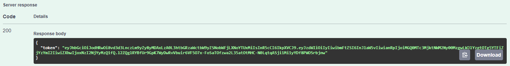


2. mene <a href="https://jwt.io">jwt.io:hon</a> ja liitä rajapinnasta vastauksena saamasi token sivulle


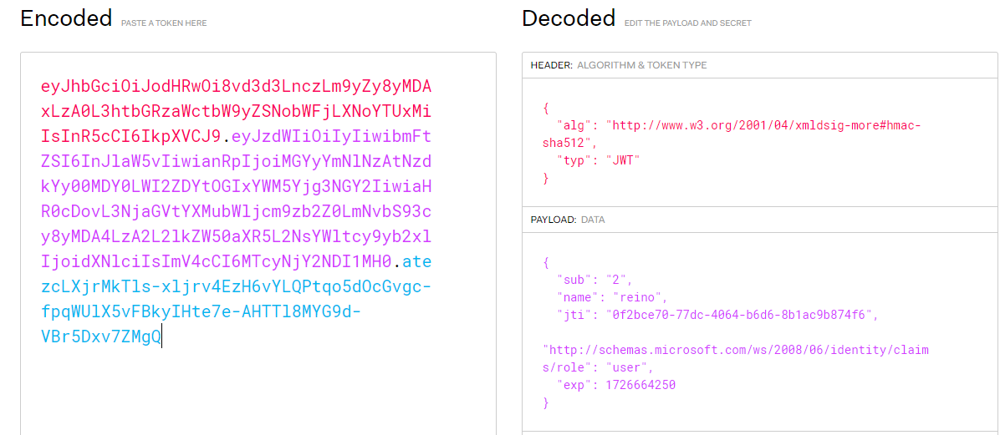


## Autorisointi

Autorisointi eli pääsyrajoitukset toimivat ASP .Net Coressa sisäänrakennetulla <i>Authorize</i>-attribuutilla. Katsotaan tästä esimerkki.

1. Otetaan ensin autorisointi käyttöön <i>Program.cs</i>

```cs


// yläpuolella builder.Services.AddAuthentication...

builder.Services.AddAuthorization();


// alapuolella on builde.Services.AddControllers();


```

Tässä esimerkissä aiempaa UsersControllerin GetAllUsers-metodia on muutettu lisäämällä sen yläpuolelle [Authorize]

```cs

[HttpGet]
// tämä on lisätty
[Authorize]
public async Task<ActionResult<List<AppUser>>> GetAllUsers()
{

    

    var users = await service.GetAll();
    return Ok(users);

}


```

Attribuutti estää sisäänkirjautumattoman käyttäjän pääsyn routeen.

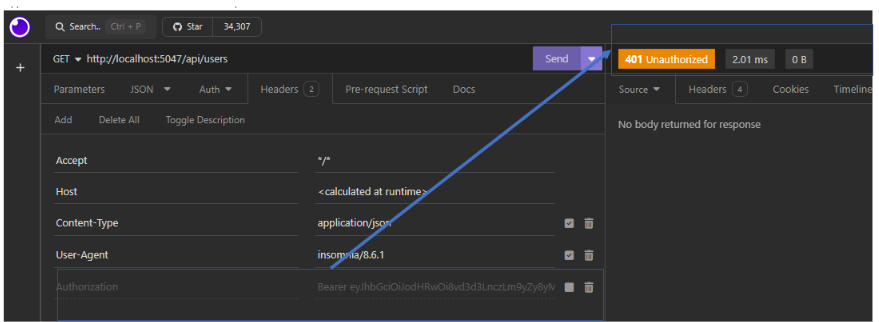

Kuten yo. kuvasta näkyy, kun Authorization-header on pois päältä (sitä ei lähetetä requestin mukana), saadaan palvelimelta vastukseksi <i>401 Unauthorized</i>

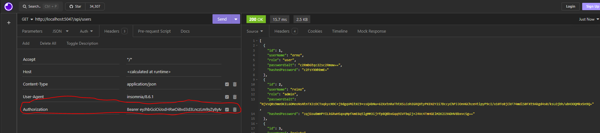

Kun Authorization-header lähetetään oikealla JWT-tokenilla palvelimelle, saamme käyttäjät vastauksena, kuten kuuluukin

### Authorization Policyt

Harvoin kuitenkaan autorisointi on web-sovelluksessa niin suoraviivaista, että käyttäjä pääsee kaikkiin resursseihin kiinni, jos on vain kirjautunut sisään. Hyvin useinhan käyttäjä saa rekisteröidyttyään roolin, jonka mukaan hänen oikeuksiaan voidaan edelleen määritellä.

1. ASP .Net Coressa on sisäänrakkennettuna myös roolipohjainen autorisointi. Otetaan se käyttöön nyt.

```cs

// Program.cs

builder.Services.AddAuthorization(options =>
{
    options.AddPolicy("RequireAdminRole", policy => policy.RequireRole("admin"));
    // Add more policies as needed
});

```

Yo. koodissa lisäämme oman uuden policyn ja annamme sille nimeksi <i>RequireAdminRole</i>

policy.RequireRole-metodia kutsumalla kerromme, mitä roolia tämä policy koskee.


2. Muutetaan Controllerin koodi käyttämään meidän omaa Policya

```cs

[HttpGet]
// Authorize-attribuutille voi
// antaa käytettävän policyn nimen attribuuttina
[Authorize(Policy = "RequireAdminRole")]
public async Task<ActionResult<List<AppUser>>> GetAllUsers()
{

    

    var users = await service.GetAll();
    return Ok(users);

}


```

### Oma authorization policy

Kaikkiin mahdollisiin pääsyrajoituksiin ASP .Net Corellakaan ei ole valmista vastausta. 

Kuvitellaan, että teet pelin backendia. Jokainen pelaaja saa viikottain / kuukausittain ilmaisen lahjan, jos on pelannut tarpeeksi monta tuntia viikossa / kerännyt tarpeeksi kokemuspisteitä (XP) viikossa. Tällainen käyttötapaus on niin tiukasti sidoksissa businesslogiikkaan, ettei sille löydy mistään frameworkista valmista palikkaa. 

Tehdään sellainen itse

1. Luodaan ensin oma ClaimType

```cs

public class SymmetricToken(IConfiguration config) : ITokenTool
{
    // tämä on ns. inner / nested class
    // C#:ssa tämä on täysin toimivaa koodia
    // nested class on hyvä tapa ryhmitellä koodia, jos
    // kaksi luokkaa ovat toisiinsa tiukasti sidoksissa
    // eikä tässä tapauksessa XPClaim-luokalla
    // ole mtn käyttöä ilman SymmetricToken-luokkaa

    // jos XPClaimia käytettäsiin useammassa luokassa, kannattaisi se luoda erikseen
    static class XPClaim
    {
        public const string XP = "XP";
    }

    // kaikki muu SymmetriTokenissa pysyy samana
}

```

2. Listään tietokantaan Xp-sarake Users-tauluun, josta saamme tiedon 

```cs

using System;

namespace API.Models;

public class AppUser
{
    // Muista, käyttää Id-propertysta juuri tällaista nimeä
    // asennamme EntityFrameWorkCore-riippvuuden Nugetista
    // EF Core tekee autom. Id-attribuutista tietokannan
    // taulun perusavaimen
    public int Id { get; set; }
    public required string UserName { get; set; }
    public required string Role { get; set; }
    public required byte[] PasswordSalt { get; set; }
    public required byte[] HashedPassword { get; set; }

    // tämä on uusi
    public int Xp { get; set; }
}


```

3. Luodaan uusi migraatio

```sh
# suorita komento API-kansiossa
# tämä komento luo uuden migraatiskriptin
dotnet ef migrations add AddXpColumn

```

4. Päivitetään tietokanta

```sh

dotnet ef database update

```

5. Päivitetään CreateToken-metodi

```cs

// SymmetricToken.cs
// CreateToken-metodi

// kaikki muu pysyy ennallaan

var claims = new List<Claim> {
    new Claim(JwtRegisteredClaimNames.Sub, user.Id.ToString()),
    new Claim(JwtRegisteredClaimNames.Name, user.UserName),
    new Claim(JwtRegisteredClaimNames.Jti, Guid.NewGuid().ToString()),
    new Claim(ClaimTypes.Role, user.Role),
    // tämä on uusi
    new Claim(XPClaim.XP, user.Xp.ToString())

};

```

6. Lisätään Policies-kansio ja alikansiot

Luo API-kansioon <i>Policies</i>-kansio ja sinne alikansiot <i>Policies/Requirements</i> ja <i>Policies/Handlers</i>


7. Lisää <i>Requirements</i>-kansioon uusi luokka <i>XpRequirement</i>

```cs

// Policies/Requirements/XpRequirement

using System;
using Microsoft.AspNetCore.Authorization;

namespace API.Policies.Requirements;

// IAuthorizationRequirement on tyhjä rajapinta, jota voidaan käyttää tietotyyppinä custom policyille
public class XpRequirement : IAuthorizationRequirement
{
    public XpRequirement(string xp)
    {
        Xp = xp;
    }

    public string Xp { get; }


}


```

8. Lisää Handlers-kansioon uusi luokka <i>XpAuthorizationHandler</i>

```cs

using System;
using System.Reflection.Metadata;
using API.Policies.Requirements;
using Microsoft.AspNetCore.Authorization;

namespace API.Policies.Handlers;

// oma AuthorizationHandler preii AuthorizationHandler-luokan
// perivälle luokalle annetaan oma custom requirement, jotta
// handler tietää, mitä vaatimusta vasten jwt:n arvo tarkistetaan
public class XpAuthorizationHandler : AuthorizationHandler<XpRequirement>
{
    // HandleRequirementAsync tulee base-luokasta
    protected override Task HandleRequirementAsync(AuthorizationHandlerContext context, XpRequirement requirement)
    {
        // context.User sisältää jwt:n claimit
        // jos jwt sisältää claimin XP,
        // mennään eteenpäin
        var xpClaim = context.User.FindFirst(c => c.Type == "XP");
        if (xpClaim != null)
        {
            int parsedXp;

            // koska Claimin Value:n tietotyyppi on string
            // muutetaan se kokonaisluvuksi
            var success = int.TryParse(xpClaim.Value, out parsedXp);
            // jos claimissa on numeerinen arvo, jonka parsetus intiksi onnistuu
            if (success)
            {
                // jos claimista saatu Xp on suurempi / on yhtä suuri kuin
                // meidän määrittämämme arvo
                // silloin päästään eteenpin
                if (parsedXp >= requirement.Xp)
                {
                    context.Succeed(requirement);
                }
            }
        }

        // tämä pitää palauttaa, vaikka 
        // vaatimus ei täyttyisikään
        return Task.CompletedTask;
    }
}


```

9. Rekisteröidään oma Policy


```cs

builder.Services.AddAuthorization(options =>
{
    options.AddPolicy("RequireAdminRole", policy => policy.RequireRole("admin"));
    // tämä on uusi
    options.AddPolicy("Require1000Xp", policy => policy.Requirements.Add(new XpRequirement(1000)));
});

// tämä myös

builder.Services.AddScoped<IAuthorizationHandler, XpAuthorizationHandler>();


```

10. Testataan omaa policya

Lisää koodi UsersControlleriin

```cs

[HttpGet("account/rewards")]
// tähän routeen ei pääse, jos Xp-avain puuttuu jwt-tokenista
// tai sen arvo on alle 1000
[Authorize(Policy = "Require1000Xp")]
public ActionResult<string> GetRewards()
{
    return Ok("");
}

```

Attrbuutit ja omat policyt ovat yksinkertainen autorisoititapa, jos tieto luetaan suoraan tokenista.

Tässä tapauksessa access token on voimassa 7 päivää. Jos pelaaja saa päivässä 1000 kokemuspistettä, hän olisi oikeutettu palkintoihin jo päivän kuluttua, mutta saa ne vasta viikon kuluttua, kun token päivittyy (tai aiemmin, jos käyttäjä kirjautuu sisään uudelleen aiemmin)


:::info Mikä neuvoksi?

Usein muuttuvia tietoja ei kannata tosiaankaan tallentaa tokeniin, jos se muuttuu harvoin. <strong>Parasta on lukea Xp tietokannasta</strong>

:::

## Oma attribute

Tähän menneessä olemme käyttäneet vain valmista Authorize-attribuuttia, jolle olemme tehneet oman policyn, mutta jso Xp pitäisi lukea tietokannasta mahdollisimman ajantasaisen tuloksen saamiseksi, luoda oma attribuutti, jossa tieto haetaan kannasta

1. Lisää API-kansioon <i>Attributes</i>-kansio

2. Lisää Attributes-kansioon <i>XpAuthorizationAttribute</i>-luokka

```cs

using System;
using System.IdentityModel.Tokens.Jwt;
using System.Security.Claims;
using API.Models;
using API.Services.Interfaces;
using Microsoft.AspNetCore.Mvc;
using Microsoft.AspNetCore.Mvc.Filters;

namespace API.Attributes;

// käytetään IAuthorizatonFilter-rajapintaa, koska
// attribuutti liittyy autorisointiin
// toinen mahdollinen rajapinta olisi IActionFilter
// sitä voidaan käyttää, jos attribuutti ei liity autorisointiin
public class XpAuthorizationAttribute(int requiredXp) : Attribute, IAuthorizationFilter
{
    // OnAuthorization tulee IAuthorizationFilter-interfacesta
    public async void OnAuthorization(AuthorizationFilterContext context)
    {

        // var logger = context.HttpContext.RequestServices.GetRequiredService<ILogger<XpAuthorizationAttribute>>();


        // servicejä ei pysty injektoimaan konstruktoriin
        // mutta servicen pystyy hakemaan tällä tavalla
        var userService = context.HttpContext.RequestServices.GetRequiredService<IUserService>();

        if (userService == null)
        {
            // jos serviceä ei löydy, palautetaan 401
            context.Result = new UnauthorizedResult();
            return;
        }
        // tämänhän pitäisi olla sub, ei nameidentifier
        // asp .net core toimii niin, että sub claim mäpätään nameidentifieriksi
        // jos haluat käyttää sub-claimia nameidentifierin sijaan
        // pitää AddAuthentication-kutsussa määrittää MapInboundClaims falseksi

        // haetaan käyttäjäid claim 
        var id = context.HttpContext.User.Claims.FirstOrDefault(c => c.Type == ClaimTypes.NameIdentifier);

        if (id == null)
        {
            // jos claimia ei löydy, käyttäjä ei ole kirjautunut 
            // sisään ja palautetaan 401
            context.Result = new UnauthorizedResult();
            return;
        }

        int parsedId;
        
        // jos claim löytyy, muutetaan sen arvo intiksi
        var success = int.TryParse(id.Value, out parsedId);
        if (!success)
        {

            context.Result = new UnauthorizedResult();
            return;
        }

        // haetaan käyttäjä id:n perusteella
        var user = await userService.GetById(parsedId);
        if (user == null)
        {
            context.Result = new UnauthorizedResult();
            return;
        }


        // jos käyttäjä löytyy,
        // tarkistetaan, onko käyttäjä Xp:n arvo
        // yli vaaditun xp:n
        if (user.Xp < requiredXp)
        {
            // huom, jos xp:tä ei ole tarpeeksi
            // palautetaan 403 (forbidden)
            context.Result = new ForbidResult();
            return;
        }

        // jos homma Ok, ei tarvitse palauttaa mitään


    }


}


```

3. Otetaan attribuutti käyttöön

```cs

[HttpGet("account/rewards")]

//[Authorize(Policy = "Require1000Xp")]
// nyt custom policy on korvattu omalla attribuutilla, 
// joka luotiin äsken. Arvo 10 on requiredXp
// Huom nimeämiskäytönnön mukaan luokan nimessä on Attribute
// mutta käytettäessä sitä ei mainita
// tänne pääsee siis vain jos xp tietokannassa käyttäjällä on yli 10
[XpAuthorization(10)]
public ActionResult<string> GetRewards()
{
    return Ok("");
}

```


    
