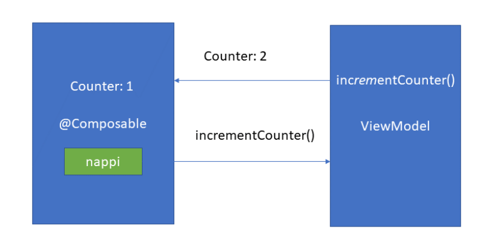
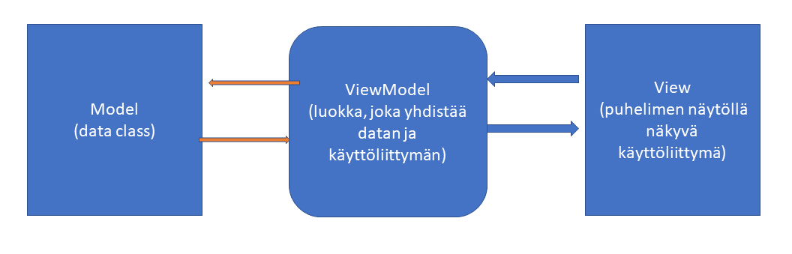

# KOMPONENTTIEN TILANHALLINTA

:::info
Tilanhallinta tarkoittaa sitä, että käyttöliittymä reagoi siinä esitettävän datan muutoksiin.
:::

## TILANHALLINTA ENNEN

### XML UUDELLE NÄKYMÄLLE

Tämä on tiedostosta fragment_another.xml

```xml

<?xml version="1.0" encoding="utf-8"?>
<LinearLayout xmlns:android="http://schemas.android.com/apk/res/android"
    xmlns:tools="http://schemas.android.com/tools"
    android:layout_width="match_parent"
    android:layout_height="match_parent"
    android:orientation="vertical"
    tools:context=".AnotherFragment">

    <!-- TODO: Update blank fragment layout -->


    <TextView
        android:id="@+id/textView2"
        android:layout_width="match_parent"
        android:layout_height="wrap_content"
        android:text="TextView" />

    <EditText
        android:id="@+id/editTextText"
        android:layout_width="match_parent"
        android:layout_height="wrap_content"
        android:ems="10"
        android:gravity="center_horizontal"
        android:inputType="text"
        android:text="Name" />


    <Button
        android:id="@+id/button"
        android:layout_width="match_parent"
        android:layout_height="wrap_content"
        android:text="Button" />

</LinearLayout>


```

Sivulla on 3 komonenttiä. Ylimpänä on label, kesimmäisenä tekstikenttä ja alimpana nappi.

1. Kirjoitetaan tekstikentään jotakin
2. Painetaan nappia
3. Tekstikenttään kirjoitettu teksti päivittyy labeliin.

### AnotherFragment-luokka

:::info viewBinding

Ao. esimerkissä on tällaiset koodirivit

_binding = FragmentAnotherBinding.inflate(inflater, container, false)
val root: View = binding.root

Nämä liittyvät viewBindingiin. Voit lukea siitä lisää <a href="https://developer.android.com/topic/libraries/view-binding">täältä</a>

:::

```kt

package com.example.oldexample

import android.os.Bundle
import android.util.Log
import androidx.fragment.app.Fragment
import android.view.LayoutInflater
import android.view.View
import android.view.ViewGroup
import android.widget.Button
import android.widget.EditText
import android.widget.TextView
import androidx.lifecycle.ViewModelProvider
import com.example.oldexample.databinding.FragmentAnotherBinding

class AnotherFragment: Fragment() {
    private var _binding: FragmentAnotherBinding? = null

    private val binding get() = _binding!!

    override fun onDestroyView() {
        super.onDestroyView()
        _binding = null
    }

    override fun onCreateView(
        inflater: LayoutInflater,
        container: ViewGroup?,
        savedInstanceState: Bundle?
    ): View {
        // viewmodelin koodi on alempana.
        val anotherViewModel = ViewModelProvider(this).get(AnotherViewModel::class.java)
        _binding = FragmentAnotherBinding.inflate(inflater, container, false)
        val root: View = binding.root

        // fragment_another.xml-tiedoston label
        val textView : TextView = binding.textView2

        // tämä observe-lambda tarkkailee labelin tekstiin tehtäviä muutoksia
        // ja päivittää labelin tekstin

        
        anotherViewModel.text.observe(viewLifecycleOwner) {

            textView.text = it
        }
        // tekstikenttä, johon käyttäjä voi kirjoitaa uuden tekstin
        val editText: EditText = binding.editTextText
        // nappi, jota painamalla teksti päivitetään
        val button: Button = binding.button
        // kiinnitetään nappiin onclick-kuuntelija, joka päivittää tekstin
        button.setOnClickListener {
            // postValue()n kutsu triggeröi observen (ylempänä), joka puolestaan päivittää tekstin
            anotherViewModel.text.postValue(editText.text.toString())
        }

        return root

    }
}


```

### AnotherViewModel-luokka

```kt

package com.example.oldexample

import androidx.lifecycle.LiveData
import androidx.lifecycle.MutableLiveData
import androidx.lifecycle.ViewModel

class AnotherViewModel: ViewModel() {


    val text = MutableLiveData<String>().apply {
        value = "This is another fragment"
    }
}

```

Ilman Jetpack Composea tarvitaan fragment, jossa on ns. binding-layer ja view model sekä XML-koodi käyttöliittymää varten. 

## TILANHALLINTA NYT

### remember & mutableStateOf

```kt


@Composable
fun Greeting(modifier: Modifier = Modifier) {
    // remember on composeen sisäänrakennettu funktio, joka
    // saa Greeting-composablen muistamaan muuttujan myGreeting arvon
    val myGreeting = remember {
        // mutableStateOf on arvo, jota voi muuttaa
        // vertaa aiemmassa vanhan tavan esimerkissä MutableLiveDataan
        mutableStateOf("Oletusteksti")
    }
    Column {
        Text(
            // tekstikentän arvoksi tulee myGreeting
            text = myGreeting.value,
            modifier = modifier
        )
        // outlinedTextFieldillä on onValueChange-callback,
        // johon voi määrittää, mitä tapahtuu
        // kun tekstikentän teksti muuttuu

        OutlinedTextField(value = myGreeting.value, onValueChange = {
            // aina kun tekstikentän teksti muuttuu, myös myGreeting-muuttujan arvo
            // päivitetään
            myGreeting.value = it
        })

    }

}


```

Jetpack Composella ei edes tarvitse nappia, jolla päivittää labelin teksti, koska OutlinedTextFieldissä on onValueChange-kuuntelija sisäänrakennettuna.


:::info

Koska remember on Greeting-composablen sisällä, myGreeting-muuttujan arvo unohtuu esimerkiksi, kun puhelin käännetään vaakatasoon, koska Greeting-composable rendataan uudelleen. Siirretään myGreeting viewModeliin

:::


### ViewModel

Luodaan tiedosto GreetingViewModel

```kt
package com.example.newwayexample

import androidx.compose.runtime.State
import androidx.compose.runtime.mutableStateOf
import androidx.lifecycle.ViewModel

class GreetingViewModel: ViewModel() {


    // _myGreeting sisältää saman mutableStateOfin kuin aiemminkin
    // nyt ei voi käyttää remember-funktiota, koska se toimii ainoastaan
    // @Composablen sisällä
    private val _myGreeting = mutableStateOf("Oletusteksti")
    // nyt myGreeting-muuttujia, on kaksi, joista ylemi on private
    // ja ao. on julkinen
    // tätä julkista käytetään OutlinedTextFieldin valussa
    val myGreeting: State<String> = _myGreeting

    // tällä päivitetään uusi arvo greetingiin. onValueChange:ssa
    fun setGreeting(newGreeting: String)
    {
        _myGreeting.value = newGreeting
    }

}

```

### Uusi @Composable Greeting

Muutetaan Greeting-composablen koodia niin, että se käyttää rememberin sijasta GreetingViewModelia

```kt

@Composable
fun Greeting(modifier: Modifier = Modifier) {

    // luodaan GreetingViewModelista viewModel()-funktion avulla uusi muuttuja nimeltä vm
    val vm: GreetingViewModel = viewModel()


    Column {
        Text(

            // nyt myGreetingin arvo tulee vm:stä
            text = vm.myGreeting.value,
            modifier = modifier
        )
        // outlinedTextFieldillä on onValueChange-callback,
        // johon voi määrittää, mitä tapahtuu
        // kun tekstikentän teksti muuttuu

        OutlinedTextField(value = vm.myGreeting.value, onValueChange = {
            // aina kun tekstikentän teksti muuttuu, myös myGreeting-muuttujan arvo
            // päivitetään
            // käyttäen GreetingViewModelin setGreeting-metodia.
            vm.setGreeting(it)
        })

    }

}


```

Nyt vaikka, käännät puhelinta, myGreetingin arvo pysyy muistissa

### MIKÄ IHMEEN ViewModel?

- ViewModel on luokka, joka muistaa käyttöliittymän tilan (kaikkien käyttöliittymän muuttujien arvot yms.). Jetpack Composea käytettäessä ViewModelin pääasiallinen käyttötarkoitus on käyttöliittymän tilan hallinta. Toissijainen käyttötarkoitus on ohjelman businesslogiikan hallinta. Voit laittaa ViewModeliin koodia, joka hakeaa tietoa jostakin REST-rajapinnasta.



Kun koodi kirjoitetaan composableiden sijasta ViewModeleihin, näyttölogiikka pysyy siistimpänä, koska esim. rajapintahaut eivät sekoitu käyttöliitymään.
Lisäksi tilanhallinta ViewModelin kautta on järkevää, koska käyttöliittymän tila pysyy ViewModelissa muistissa konfiguraatiomuutosten yli (esim. puhelimen kääntö vaakaan / pystyyn)



Viewistä ei koskaan käytetä suoraan modelia, eli data classin attribuutteja. Sen sijaan kaikki kommunikaatio datan kanssa tapahtuu viewitä viewmodelin kautta. 