## DESIGNING RELATIONAL DATABASES

## CONSEPTUAL DESIGN

The purpose of conseptual design is to identify <i>entity types</i>, their <i>attributes</i> and <i>relationships</i>. Remember nouns are either <i>entities</i> or <i>attributes</i>

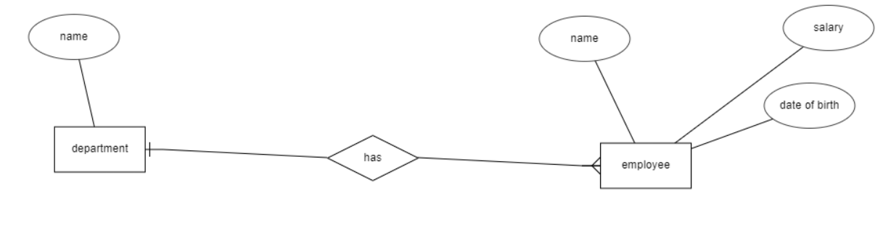

- Rectangles are entities
- Ellipses are attributes (double ellipses are multivalued)
- Diamonds are relationship types

:::tip

Conseptual modeling is useful especially for non-technical people, becuase it might be easier to understand, but quite often this step can be skipped

:::

## LOGICAL DESIGN

The next step in relational database design is to build a logical model of the database based on the conseptual model if one exists.

You can finalize the logical model by adding <i>database-independent datatypes</i>*, <i>primary keys</i> and <i>foreign keys</i> to conseptual model.

:::info *) database-independent datatypes?

Because logical model must not contain any RDBMS-specific (Postgres, MySQL, MariaDB) features, datatypes can be specified as <i>String</i>, <i>Integer</i> etc.

:::

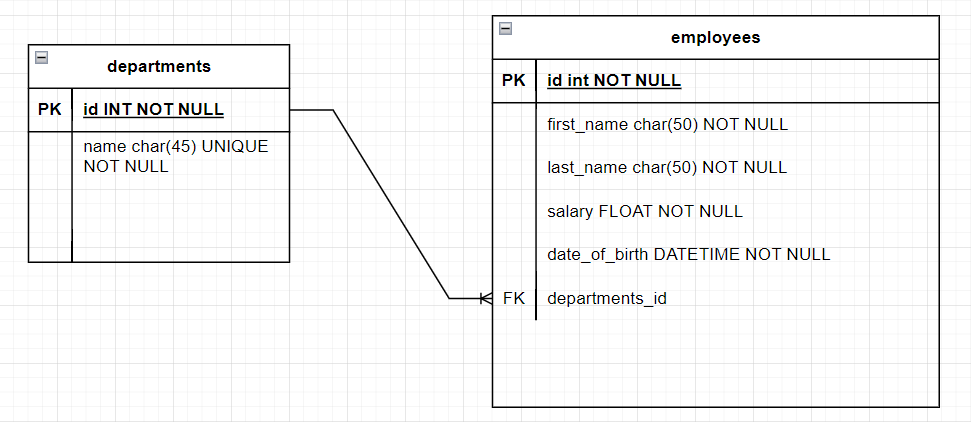

Take a look at the conseptual model. Firstly the employee entity's attributes are <i>name</i>, <i>salary</i> and <i>date of birth</i>
Here in the logical model (in the picture above) the <i>name</i> is split into two different attributes <i>first_name</i> and <i>last_name</i> Secondly in addition to splitting attributes into two different ones, the attribute names are now in their final form (eg. whitespaces have been replaced with underscores). Thirdly the <i>has</i> relation in the conseptual model has no been broken into <i>ONE-TO-MANY</i> relation with actual <i>primary and foreign keys</i>

## PHYSICAL MODEL

Physical model is based on the logical model, and in addition it contains all the database managment system specific features and datatypes. 

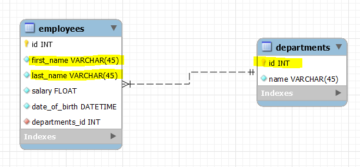

This picture is from <i>MySQL Workbench</i> software and thus it has MySQL specific constraints and datatypes. For exampel primary key field <i>id</i> with AI constraint is <i>SERIAL</i> in Postgres.

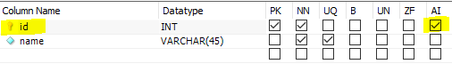

<small><i>Column constraints in MySQL</i></small>

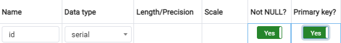

<small><i>Column constraints in Postgres</i></small>

## DATATYPES

There are quite many different datatypes and some are RDBMS-specific, so there's no point in listing them all here. Nonetheless here are some most useful MySQL datatypes

### NUMERIC

#### INT

Integer datatype signed  -2 147 483 648 - 2 147 483 647 and unsigned 0 - 4 294 967 295.  There are also other variations (BIGINT, TINYINT, etc.)

:::tip

Unsigned numeric values are not part of SQL standard so for example Postgres doesn't support them. 

:::

### FLOATING POINT NUMBERS

#### FLOAT 

Small floating point number

#### DOUBLE

Double precision floating point number

#### DECIMAL

Decimal is a fixed point number. <i>FLOAT(M, D)</i> of length of <i>M</i> and DECIMALS of <i>D</i> 

#### REAL

A synonym for either DOUBLE or FLOAT depending whether REAL_AS_FLOAT mode is on or not.

### BOOLEAN

Either true of false and is a synonym for TINYINT(1)

## DATABASE NORMALIZATION

Normalization is a process of refining database model in a way that it prevents anomalies, reduces redundant data, and thus speeds up <i>updating</i>, <i>inserting</i> and <i>deleting</i> data. 

Selecting data can actually take a hit in terms of performance, because normalization adds relations between tables and thus querying requires more joins

### 1 NF (NORMAL FORM)

Let's assume we had a <i>customers</i> entity with attributes: <i>name</i>, <i>address</i> and <i>phone numbers</i> like this

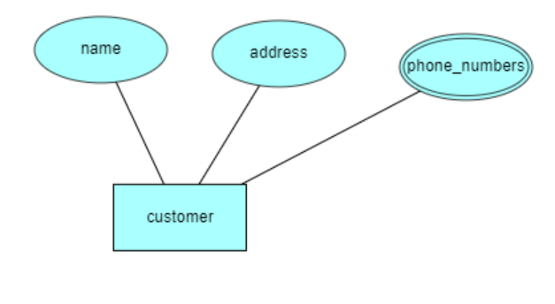

and in for example Excel it could look something like the following

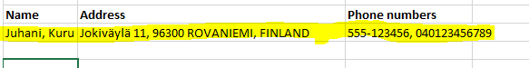

For this data to be in the 1st normal form firstly the <i>name</i> column needs to be split into <i>first_name</i> and <i>last_name</i> secondly the <i>address</i> column needs to be split into <i>street_address</i>, <i>zip_code</i>, <i>city</i> and <i>country</i>. Lastly because the customer has two different phone numbers, we need two lines for one customer like the following. Let's add a unique identifier <i>id</i> to tell that the two rows are infact the same customer

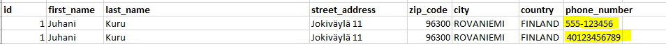

:::tip 1st NF

1st NF states that every entity needs to have a unique identifier and that there can only be one piece of information in a column to make indexing easier

:::

### 2NF

For the data to in the 2nd NF it needs to be in the 1st NF and there must not be any partial dependencies

:::info Partial dependency

occurs when one primary key determines some other attributes that are not strictly identified by the primary key

:::

In the above example the only strictly customer related data are the columns: <i>first_name</i> and <i>last_name</i>

Thus for the model to be in the 2nd NF we need to modify it like so

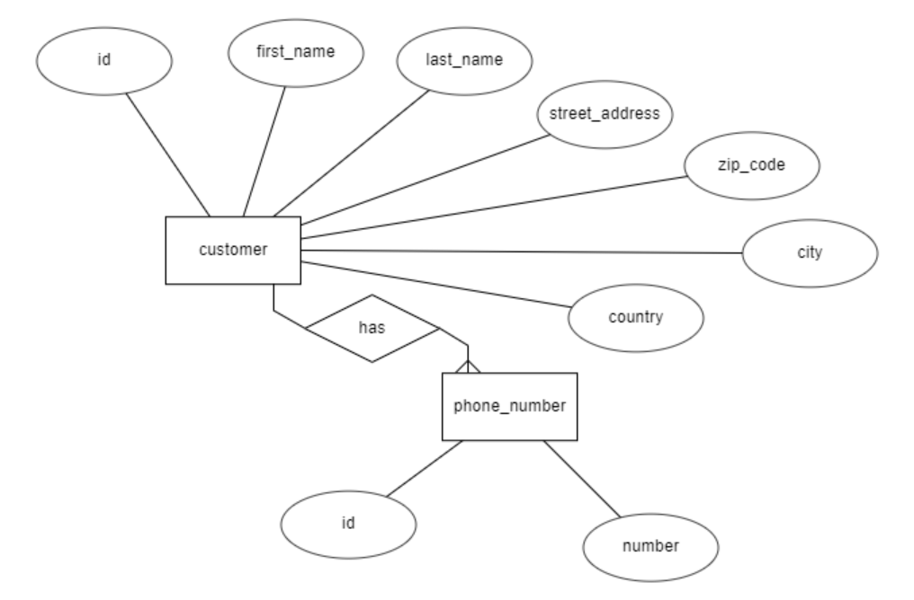

It can be argued, whether address information should be stored into a separate table, and if it's strictly dependent on the customer's primary key. But this is fine for the 2nd NF because customer can be only at one place at a time so it's acceptable to store address data in the same table as customer data

Nonetheless for the model to be in the 3rd NF it's better done this way

### 3NF

For the model to be in the 3NF there must not be any transitive dependencies

:::info Transitive dependency

occurs when some non-key attribute determines some other attribute

:::

Here such an attribute could be <i>zip_code</i> which determines <i>city</i> whereas <i>city</i> determines <i>country</i> and so on

Let's refine the model to match the 3rd NF

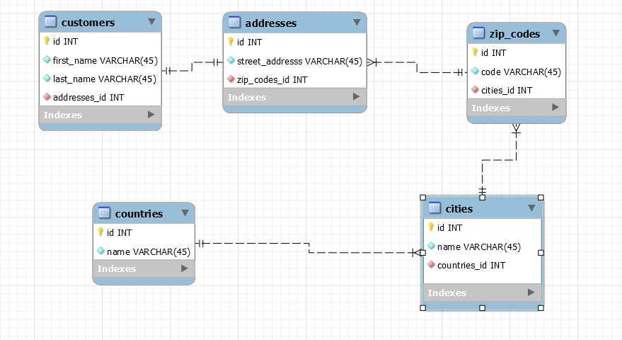

Let's first create thsi physical model and import. After importing insert a couple of rows into each table and create a query fetching customers and their address information

## RELATIONS

There are three types of relations in relational databases

### 1:1 (ONE-TO-ONE)

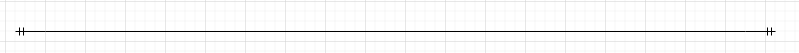

If you could save all the data into one table (eg the address information in the customers table) but the nature of the data to be saved is different (custromers vs. addresses) you can save them into a separate table and connect the tables using one-to-one relation

### 1:N

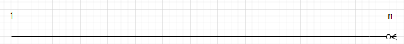

If you find yourself saving same kind of data into one database column separated by commas (eg.phone numbers before) it's either a one-to-many or many-to-many relation

:::info one-to-many vs. many-to-many

For example one customer can have many phone numbers but a single phone number can be owned only by one customer at any given time. That's a one-to-many

Whereas one student can attend many courses and one course can have many students. That makes it a many-to-many

:::

### MANY-TO-MANY

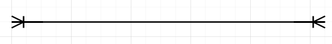

In ER diagrams and modeling many-to-many can be depicted with a three-headed relation in both ends but in relational databases many-to-many has to solved using a so called <i>through</i> table with two one-to-many relations

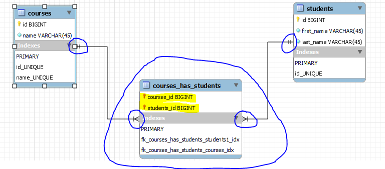

So far we've only had single column primary keys but in a many-to-many relation the through table's primary key is a composite primary key consisting of two foreign keys

## EXCERCISE #3

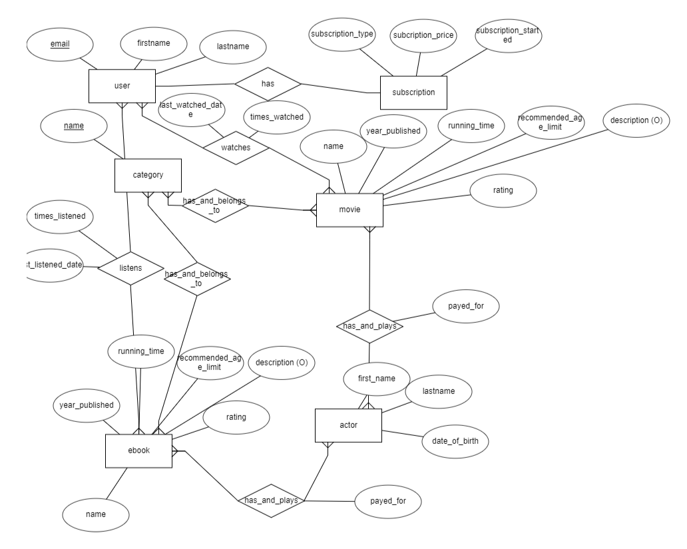

:::info

There are quite many entities and attributes there, so if it's hard to see what's going on and what connects to where, we can take a look at this together.
And I can write a description about this design if it's easier to follow

:::

:::info

This has to be returned. Return only the .mwb file

:::

Design a physical model out of this consept design.
- You must use MySQL Workbench to do that
- The physical model is meant to be used as a database of a OLTP system, so it should be normalized to 3rd normal form
- <strong>Keep in mind that movie and ebook entities have the exact same attributes, would it be a smart move to merge them into one table?</strong>
- When designing the model keep in mind that some of the attributes might be better stored in a separate table of their own
- You have to decide what datatypes to use
- Remember that some of the relationships  need many-to-many relations 

- the underscored attributes are unique
- the attributes with (O) sign are optional

