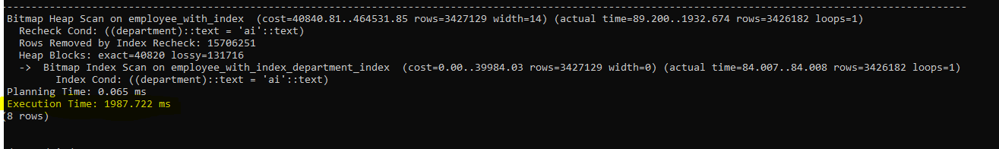
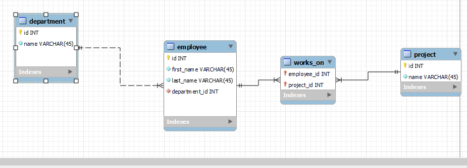

# DATAN KÄSITTELY JA SUORITUSKYVYN VARMISTAMINEN

Opintojakson sisällössä on mainittu suurten ja haastavien datamäärien käsittely (mm. indeksointi ja aggregointi). Indeksointi on tärkeä osa nopeampaa tiedonhakua, mutta suurten ja haastavien datamäärien käsittelyyn liittyy todella paljon muutakin. 

## INDEKSOINTI

<strong>Indeksointi nopeuttaa tietokantahakuja</strong>

Tietokantahaku ilman indeksoituja tietokantataulun sarakkeita on kuin hakisit tietosanakirjasta termiä <i>X</i> ilman asiasanaluetteloa. Joutuisit lukemaan kirjan jokaisen sivun. Jos taas käytät asiasanaluetteloa hyväksesi, voit hakea kaikki sivut, joilla <i>X</i> on mainittu ja lukea vain ne kyseiset sivut. Tietokantataulu on kuin kirja, jonka jokainen rivi on yksi sivu. Kun lisäät indeksin tietokantataulun sarakkeeseen, sen sarakkeen tiedot lisätään asiasanaluetteloon. Jos sarakkeen tiedot eivät ole asiasanaluettelossa, pitää kaikki rivit käydä läpi, mutta sarakkeen ollessa asiasanaluettelossa, riittää että luetaan vain ne rivit, jotka on asiasanaluettelossa mainittu.

:::info Indeksointi, PK & UNIQUE

Jokaisen tietokantataulun kaikki perusavainsarakkeet indeksoidaan automaattisesti, samoin kaikki yksilöllisiksi merkatut sarakkeet (UNIQUE) on indeksoitu

:::

Älä kuitenkaan indeksoi innoissasi kaikkien taulujen kaikkia sarakkeita, koska jokainen indeksointi vie levytilaa. Mitä enemmän asiasanaluettelossa on eri termejä, sitä paksumpi asiasanaluettelosta tulee. Lisäksi uusien rivien lisääminen (INSERT), muokkaaminen (UPDATE) ja poistaminen (DELETE) voivat hidastua, koska asiasanaluettelo pitää myös päivittää.

### MITÄ INDEKSOIDA

- Indeksoi aina kaikki viiteavaimet (foreign key), koska niitä käytetään JOINeissa.

:::info MySQL & viiteavaimet


MySQL indeksoi automaattisesti kaikki viiteavainsarakkeet, mutta esim. PostgreSQL ei sitä tee

:::

- Indeksoi sarakkeet, joita käytät paljon WHERE-lausekkeen ehtoina

```sql

-- haetaan kaikki työntekijät, joiden palkka on alle 5000
-- tämä kysely nopeutuu, kun indeksoit salary-sarakkeen.
SELECT * FROM employee WHERE salary < 5000;

```

```sql

-- haetaan kaikki työntekijät, joiden etunimi on Juhani
-- tämä kysely nopeutuu, kun indeksoit first_name-sarakkeen.
SELECT * FROM employee WHERE first_name = 'Juhani';

```


```sql

-- haetaan kaikki työntekijät, joiden sukunimi on Kuru
-- tämä kysely nopeutuu, kun indeksoit last_name-sarakkeen.
SELECT * FROM employee WHERE last_name = 'Kuru';

```

```sql

-- haetaan kaikki työntekijät joiden etunimi on Esko ja sukunimi on Aho
-- tässä kyselyssä ei välttämättä riitä, 
-- että first_name ja last_name-sarakkeet on indeksoitu yksitellen
-- jos käytät paljon sarakkeita kyselyjen ehtoina yhdessä, tee yhdistelmäindeksi

SELECT * FROM employee WHERE first_name = 'Esko' AND last_name = 'Aho';


```

:::info Miten niin "ei välttämättä riitä..."?

Relaatiotietokantojen "query plannerit" ovat todella nopeita ja nokkelia optimoimaan kyselyistä tehokkaampia. Nyrkkisääntönä indeksointiin kannattaa pitää yllä mainittuja sääntöjä ja luoda lisää yhdistelmäindeksejä tarpeen niin vaatiessa.

<strong>Jos kyselyt toimivat hitaasti ja syyksi paljastuu puutteellinen indeksointi, kannattaa niitä lisätä, ja tutkia, miten se vaikuttaa kyselyn suoritusnopeuteen.</strong>

:::

### INDEKSIN LUONTI

```sql

CREATE INDEX index_name
ON table_name (column1, column2, ...);


```

```sql

-- unique indeksi
-- järjestelmässä työntekijöiden sähköpostit ovat yksilöllisiä
CREATE UNIQUE INDEX employee_email_idx
ON employee (email);


-- "normaali indeksi"
CREATE INDEX employee_salary_idx
ON employee (salary);

-- yhdistelmäindeksi
CREATE INDEX employee_name_idx
ON employee (first_name, last_name);


```

## KYSELYJEN DEBUGGAUS

:::info Lue lisää täältä

https://www.postgresql.org/docs/current/using-explain.html

:::

:::info Ensin

1) Luodaan tietokanta <i>index_test1</i>
2) Aja .sql-dumppi sisään juuri lisättyyn tietokantaan
    * dumppi löytyy Moodlesta index_test1.sql


::: 


```sql

-- 1) Luodaan tietokanta

-- kirjaudu sisään

psql postgres postgres

-- kirjoita pyydettäessä superuserin salasana

CREATE DATABASE index_test1

-- lopeta 

exit

-- 2) vie .sql-tiedoston sisältö tietokantaan

psql -U postgres index_test1 < index_test1.sql

-- kirjoita tämän jälkeen pyydetty salasana


```

### EXPLAIN

Explain kirjaimellisesti selittää sen query plannin, jonka mukaan kysly suoritettiin. Siitä selviää, kaikki vaiheet (node), jotka kyselyssä käydään läpi

```sql
-- suorita kysely

EXPLAIN SELECT first_name, last_name from employee WHERE department = 'ai';

```


### SEQ SCAN

Sequential Scan tarkoittaa sitä, että taulusta on pitänyt lukea kaikki rivit, jotta voidaan löytää ne työntekijät, joiden osasto on <i>ai</i>. Sequential scan voi olla nopea tauluissa, joissa ei ole paljon dataa, tai vaihtoehtoisesti myös tauluissa, joissa on paljon dataa, mutta joissa myös kyselyn tulos on iso osa taulun kokonaisrivimäärästä.

:::info Miksi tässä kyselyssä query planner käyttää sequential scannia?

Yo. kyselyssä pitää käyttää sequential scannia, eli kahlata koko taulu läpi, koska taulun <i>department-sarakkeessa</i> ei ole indeksiä

:::


```sql
-- suorita komentorivillä komennot
-- tätä ei ole pakko tehdä, jos olet jo postgres-serverillä sisällä
psql postgres postgres

-- kirjoita pyydettäessä salasana

-- vaihda tietokanta

\c index_test1;

-- katsotaan employee-taulun speksit

\d employee;


```


Kuten yo. kuvasta näkyy, employee-taulussa on vain primary key-indeksi id-sarakkeessa, mutta ei muita indeksejä.

#### COST=X..Y

COST sisältää kaksi eri lukua, joista molemmat ovat query plannerin arvioita siitä, kuinka "kallista" kyselyn suorittaminen on. Mitä kalliimpi kysely on, sitä enemmän se vaatii laskentaa. Isompi luku on kalliimpi suorittaa. <i>X</i> on ns. "estimated start-up cost". Start-upiin kuuluvat kaikki kyselyn vaiheet, jotka suoritetaan ennen varsinaista tulosvaihetta. Start-upiin kuuluvat esim. tuloksen järjestäminen. 

Tässä yo. esimerkkikyselyssä X on 0.00, koska kyselyssä ei ole esim. ORDER BYta, vaan pelkkä tulosjoukon filtteröinti department-sarakkeen mukaan. Käytännössä tämä tarkoittaa sitä, että "käynnistykseen" ei kulu yhtään aikaa, vaan päästään suoraan asiaan. 

<i>Y</i>:n arvoon vaikuttaa mm. taulun rivien määrä sekä pari vakiota <i>seq_page_cost</i> ja <i>cup_tuple_cost</i>. 

#### ROWS

ARvio siitä, kuinka monta riviä tulosjoukossa on

#### WIDTH

Arvio tulosjoukon keskiarvokoosta

:::info Sinun ei tarvitse muistaa

mitä kaikki nämä argumentit tarkoittavat. Tärkeintä on muistaa, mitä isompia lukuja, sitä pidempään tulosten hakeminen kestää. Katsotaan myöhemmin, miten query plannerin tekemiin suunnitelmiin voi vaikuttaa.


:::

```sql

-- katstoaan seuraavaksi toisen taulun tiedot

\d employee_with_index;

```


Kuten yo. kuvasta näkyy, employee_with_index-taulussa on indeksi department-sarakkeessa

```sql

-- suoritetaan aiempi kysely uudelleen tähän tauluun

EXPLAIN SELECT first_name, last_name FROM employee_with_index WHERE department = 'ai';

```

:::info Miksi tässä kyselyssä query planner käyttää sequential scannia?

employee_with_index-taulussa on 24 miljoonaa riviä, joista yli 3:lla miljoonalla rivillä department-sarakkeen arvo on ai. Postgren query planner käyttää indeksiä, jos hakutuloksen rivimäärä on 5-10¤ taulun kokonaisrivimäärästä, mutta ei välttämättä, jos tulosjoukon rivimäärä on enemmän.

:::


### MITEN SAADA INDEKSI MUKAAN (INDEX SCAN)?

#### QUERY PLANNERIN KONFFAUS

:::info seq_page_cost ja random_page_cost

EXPLAINin cost-arvon arvioinnissa query planner käyttää paria vakiota, joista toinen on <i>seq_page_cost</i>. Seq_page_cost-vakio tarkoittaa sitä, kuinka "kalliina" query planner pitää sequential scannia, eli sitä, kun taulun rivit luetaan järjestestyksessä ilman indeksiä. Postgressa seq_page_costin arvo on oletuksena 1.0

random_page_cost-arvo puoleestaan kuvastaa sitä, kuinka "kalliina" query planner pitää kaikkia muita kuin sequential scannia. (tämä tarkoittaa myös niitä hakuja, jotka käyttävät indeksejä). Postgressa random_page_costin arvo on oletuksena 4.0

Tämä tarkoittaa käytännössä sitä, että query plannerin arvion mukaan mm. indeksien käyttö on 4 kertaa kalliimpaa kuin järjestyksessä kaikkien rivien lukeminen.

:::

:::info Indeksienhän piti nopeuttaa hakuja...

jos indeksit nopeuttavat hakuja, miten niiden käyttö voi olla 4 kertaa kalliimpaa kuin kaikkien rivien lukeminen?<br><br>

Indeksien läpikäynti vaatii levy I/O:ta (eli levyltä lukemista), mikä on hidasta. Siksi indeksien käyttö voi olla kalliimpaa kuin kaikkien rivien lukeminen ilman indeksiä, mutta Postgres osaa myös cachettaa indeksit, joka puolestaan nopeuttaa hakuja indeksien luvun jälkeen.

:::

Muutetaan query plannerin asetuksia niin, että levyltä lukeminen olisi vähemmän kallista.

```sql
-- muutetaan random_page_costin arvoksi 3.0
-- nyt levyltä lukeminen on vähemmän kallista
set random_page_cost = 3.0

```
Suoritetaan aiempi kysely uudelleen

```sql

EXPLAIN SELECT first_name, last_name FROM employee_with_index WHERE department = 'ai';

```


Kuten kuvasta näkyy, nyt qurey planner valitsee Bitmap Heap Scannin, mutta myös suunnitelman työvaiheita on nyt enemmän. cost:n Y-arvo on pienempi kuin sequential scannissa, mutta X:n  (start-upin) arvo kasvoi todella paljon sequential scannin nollasta (0) Näin kyselyn kokonaiskustannus on huomattavasti isompi, vaikka enää ei lueta kaikkia rivejä.


Jos konffien muutos ei auta, muutetaan seuraavaksi kyselyä

#### KYSELYN MUUTOS

```sql

EXPLAIN SELECT first_name, last_name FROM employee_with_index WHERE department IN ('ai', NULL) ORDER BY department;

```


Nyt, kun kyselyä muutettiin hieman, index scan onnistuu. 

:::info Miksi kyselyn muutos sai indeksin mukaan?

random_page_cost on nyt 3.0, mutta sillä ei ole merkitystä, tämä kysely toimisi samoin, vaikka random_page_cost olisi 4.0. Index scan onnistuu, koska 
1) Käytämme IN-lauseketta, jossa on ai:n lisäksi NULL sekä 
2) ORDER BY lausekkeessa käytetään indeksoitua saraketta.

<strong>NULL:n käyttö pakottaa indeksin käytön, koska <i>ai</i> ei ole enää ainoa mahdollinen vaihtoehto query plannerin mielestä (kuitenkaan yhtään riviä ei voi olla olemassa, jossa department olisi NULL, koska saraketta ei voi jättää tyhjäksi (NOT NULL))</strong>.

:::

Kuten kuvasta näkyy, kyselyn kustannusarvio on vieläkin korkeampi kuin aiemmalla seq scannilla, mutta muista se on pelkkä arvio, joka ei välttämättä pidä paikkaansa.

:::info EXPLAIN ei suorita kyselyä
pelkkä EXPLAINin käyttö ei suorita kyselyä, joten varsinaista suoritusvertailua ei pelkällä EXPLAINilla voi tehdä. 

Kun kyselyn suorittaa EXPLAIN ANALYZE SELECT...., kysely myös suoritetaan. Analyze saa sen aikaan. Tällä tavalla voidaan verrata myös oikeita suoritusaikoja
:::


Suoriteaan aiemmat kyselyt uudestaan ANALYZEn kanssa

```sql
-- tässä random_page_cost on 3.0, joten seq_scan ei ole käytössä

EXPLAIN ANALYZE SELECT first_name, last_name FROM employee_with_index WHERE department = 'ai';

```




Kun planner käyttää Bitmap Heap Scannia, kysely kestää melkein 2 sekuntia.

```sql
-- muutetaan ensin random_page_cost takaisin 4.0:aan

SET random_page_cost = 4.0;

-- suoriteaan sama kysely uudelleen

EXPLAIN ANALYZE SELECT first_name, last_name FROM employee_with_index WHERE department = 'ai';

```


:::info
Seq scan on marginaalisesti nopeampi kuin Bitmap Heap Scan
:::

```sql

EXPLAIN ANALYZE SELECT first_name, last_name FROM employee_with_index WHERE department IN ('ai', NULL) ORDER BY department;

```


Index scannia käyttämällä saatiin kaikista paras lopputulos. Ja vaikka kustannusarvio oli huomattavasti suurempi, todellinen kustannus jäi kuitenkin indeksin ansiosta alle 100, ja oikea suoritusaikakin alle sekunnin.

### INDEX ONLY SCAN

```sql

-- katsotaan uutta taulua

\d employee_with_indeces;

```


Kuvassa on employee_with_indeces-taulun rakenne. Siellä on 2. merkitsevää indeksiä, joista ensimmäinen on department-sarakkeessa, niin kuin aiemmasakin taulussa, ja toinen on useamman sarakkeen yhdistelmäindeksi

```sql
explain analyze select department, first_name, last_name from employee_with_indeces where department = 'ai';

```


:::info Miksi tämä kysely on niin paljon nopeampi kuin index scan?

Index only scan onnistuu, koska meillä on yhdistelmäindeksi kolmessa sarakkeessa (department, first_name, last_name) ja SELECtissä haemme ainoastaan nämä sarakkeet. Lisäksi department-sarake on ainoa WHERE-lausekkeen rajoittava ehto.

:::


### ANALYZE

Kun muutat taulujen indeksointeja, eli lisäät tai poistat indeksejä, aja sen jälkeen aina analyze

```sql
ANALYZE;

```

ANALYZE ilman EXPLAINia debugattavaa kyselyä, päivittää taulujen tilastot, joita query planner käyttää kustannusarvioissa ja kyselyjen suorituksessa. Saat parempia, ajantasaisia tuloksia, kun muistat päivittää statsit 


## VIEW & MATERIALIZED VIEW

View on kuin nimetty kysely. Jos huomaat suorittavasi useasti saman kyselyn, voit luoda siitä viewin tai materialized viewin. View luodaan aina käyttäen kyselyn dataa, joka saadaa oo. taulusta.

### VIEW


```sql

-- luodaan uusi view

CREATE VIEW <viewin_nimi> AS SELECT.....;

-- tämän jälkeen ei tarvitse aina suorittaa samaa kyselyä uudelleen ja uudelleen
-- voit korvata monimutkaisen kyselyn tekemällä yksinkertaisen kyselyn viewiin

SELECT * FROM viewin_nimi;


```

Luodaan aiemmin käytetystä kyselystä view

```sql

-- viewin luonti

CREATE VIEW ai_workers_view AS SELECT first_name, last_name FROM employee_with_index WHERE department IN ('ai', NULL) ORDER BY department;

-- tarkistetaan, että view on luotu
-- suorita komento
\dv


```


```sql
-- nyt voit hakea kaikki ai-osastolla työskentelevät suoraan näin

SELECT * FROM ai_workers_view;

-- katsotaan seuraavaksi viewin suorituskykyä

EXPLAIN ANALYZE SELECT * FROM ai_workers_view;

```


View ei parantanut suorituskysyä, vaan on itseasiassa hitaampi kuin alkuperäinen kysely

:::info Miksi VIEW on hitaampi?

VIEWin kysely lisää uuden työvaiheen, Subquery Scannin, alkuperäiseen kyselyyn, siksi viewiin tehty kysely on hitaampi. View lisää ylimääräisen työvaiheen, koska se on "ikkuna" alkuperäiseen tauluun, eikä viewissä olevaa dataa ole oikeasti tallennettu fyysisesti alkuperäisen taulun ulkopuolelle.

::: 

### MATERIALIZED VIEW

Materialized view eroaa viewistä siinä, että data oikeasti tallennetaan fyysisesti alkuperäisen taulun ulkopuolelle

```sql
-- luodaaan materialized view

CREATE MATERIALIZED VIEW <materialized_viewin_nimi> AS SELECT ...

-- tämän jälkeen ei tarvitse aina suorittaa samaa kyselyä uudelleen ja uudelleen
-- voit korvata monimutkaisen kyselyn tekemällä yksinkertaisen kyselyn viewiin

SELECT * FROM materialized_viewin_nimi;

```

```sql
-- luodaan materlialized view

CREATE MATERIALIZED VIEW ai_workers_mview AS SELECT first_name, last_name FROM employee_with_index WHERE department IN ('ai', NULL) ORDER BY department;

-- katsotaan seuraavaksi, että se luotiin
-- \dv listaa vain viewit, siksi käytetään \d-komentoa
-- \d listaa kaikki datat tietokannassa
\d

```


Koska ai_workers_view ja ai_workers_mview on molemmat luotu samalla kyselyllä, niissä on sama data

```sql
-- katsotaan seuraavaksi materialized viewin suorituskykyä

    EXPLAIN ANALYZE SELECT * FROM ai_workers_mview;


```


:::info Miksi materialized view on nopein?

Koska materialized_view tallentaa fyysisesti kyselyn tuloksen, siinä ei ole 24 miljoonaa riviä, vaan ainoastaan 3 miljoonaa riviä. Koska dataa on paljon vähemmän, seq scan ei haittaa mitään ja datan kysely on paljon nopeampi.

:::

Koska view on vain "ikkuna" alkuperäiseen tauluun, se päivittyy automaattisesti, kun taulu päivittyy, mutta <strong>materialized view</strong> pitää päivittää manuaalisesti aina alkuperäisen datan päivittyessä


```sql

-- materialized viewin päivitys

REFRESH MATERIALIZED VIEW <nimi>

-- ai_workers_mviewin päivitys

REFRESH MATERIALIZED VIEW ai_workers_mview;

```


## OLTP & OLAP

<a href="/recap/">Kertaus-sivulla</a> käsitellyt suunnitteluperiaatteet (esim. normalisoinnin säännöt) on tehty OLTP-tietokantoja varten.


:::info Mikä OLTP?

OLTP (Online Transactional Processing) tarkoittaa suuria määriä lyhytkestoisia kyselyjä (transaktioita) tietokantaan, joita tekevät useat käyttäjät yhtäaikaa. Esimerkiksi nettikaupan sivut voivat olla tällaisia. Useat ihmiset selaavat tuotteita, toiset tekevät tilauksia (lisäävät  tuotteita  ostoskoreihin, poistavat niitä, maksavat tilauksia ja hyväksyvät niitä. yms) Kaikki nämä toiminnot vaativat hyvin normalisoitua tietokantarakennetta, jotta INSERTit, UPDATEt, DELETEt ja SELECTit voidaan suorittaa nopeasti. Kerralla haettavat tietomäärät ovat kuitenkin pieniä (esim. tuotteet voidaan sivuttaa sen sijaan, että ne kaikki haettaisiin kerralla).

Pitkälle normalisoitu tietokanta on tarkoitettu ja on siksi nopea yksittäisissä kyselyissä, joissa haetaan, päivitetään tai poistetaan vähän rivejä kerrallaan. 

:::

Suurten ja haastavien datamäärien käsittelyyn ja analysointiin (OLAP) on tehty omia, juuri tähän käyttötarkoitukseen tehtyjä, suunnittelumalleja. Näitä suunnittelumalleja käytetään Data Engineeringissa ja Data warehouse -suunnittelussa. Koska tämä ei ole Data Engineering-opintojakso, emme perehdy kovin tarkasti Data warehousingin periaatteisiin, mutta koska data warehousingissa käytetyt suunnittelumallit sopivat todella hyvin suurten ja haastavien datamäärien käsittelyyn, käymme ne läpi.

:::info 

Data warehousingin yksi perussääntö on, että analysoitava data tallennetaan OLAP-tietokantaan aina jostakin toisesta tietokannasta (OLTP-tietokannasta) / muusta datalähteestä (esim. CSV-tiedostosta).

Siis esimerkiksi asiakkaan verkkokaupassa tekemät tilaukset menevät ensin verkkokaupan OLTP-kantaan, josta ne siirretään esikäsittelyn jälkeen OLAP-tietokantaan analysointia varten. 

:::

:::info Mikä OLAP?

OLAP-suunnittelumallit (Online Analytical Processing) on tarkoitettu datan analysointiin ja raportointiin. 

:::

## DIMENSIONAL MODELING

Dimensional-suunnittelumallissa on kahta erilaista tietokantataulua

### FACT (FAKTATAULU)

:::info Faktat

Dimensional-mallinnuksessa faktat eivät ole loogisia faktoja (esim. "aurinko nousee huomenna", "maapallo on pyöreä")

:::

- Faktat ovat numeerisia mitattavia asioita
    * opintopisteiden määrä (float)
    * palkka (float)
    * työkokemus vuosina (int)


### DIMENSION

- Dimensiotaulut tarjoavat faktoille asiayhteyden, eli kontekstin. 
    * koulutusohjelman nimi
    * opiskelijan nimi
    * työntekijän nimi yms.


### STAR SCHEMA


- Kaikki dimensiot yhdestä hierarkiasta yhteen tauluun
- Faktatulujen ja dimensiotaulujen välillä on vain yksi relaatio
    * koska kaikki relaatiot ovat yksiportaisia, malli muistuttaa yhdellä faktataululla tähteä
- Vähentää taulujen välisiä yhteyksiä ja siksi yksinkertaistaa kyselyjä
    * vähemmän joineja tarkoittaa nopeampia kyselyjä (aina tämä ei pidä paikkaansa kuitenkaan)
- Perusavain <-> viiteavain-yhteydet ovat suoraviivaisia
    * monimutkaiset hierarkiat puuttuvat
- Vaatii perinteisesti enemmän tallennustilaa
    * koska joineja on vähemmän, samaa tietoa toistetaan useammin


Kuvassa on yksinkertaistettu OLTP-tietokantamalli verkkokaupan tilausten- ja tuotteidenhallintajärjestelmästä.


Seuraavaksi teemme tästä 3. muotoon normalisoidusta OLTP-mallista star scheman


#### 1) MIETI, MIKÄ ON RAPORTOINNIN KANNALTA TÄRKEÄÄ

Tällä tavalla voit määrittää sen tarkkuuden, jolla datat tallennetaan OLAP-tietokantaan. Yleensä se, mikä on tärkeää selviää siitä, mitä esim. yrityksen johto haluaa tietää. Suunnitellaan tietokanta niin, että voidaan vastata seuraaviin kysymyksiin


- Miltä mantereilta ja mistä maista asiakkaamme ovat kotoisin?
- Mihin maahan menee eniten tilauksia?
- Mihin maahan tehdään myyntiä eniten?
- Mikä on tilauksen keskihinta Euroopassa kaupungeittan ja maittain ryhmiteltynä?


#### 2) TUNNISTA 1. KOHDAN PERUSTEELLA TARVITTAVAT FAKTAT JA DIMENSIOT

order-taulusta tehdään faktataulu, koska siellä on käytännössä pelkästään mitattavia, numeerisia sarakkeita, joita tarvitsemme. Muut taulut ovat dimensio-tauluja, jotka tarjoavat sen kontekstin tilauksille, jonka tarvitsemme voidaksemme vastata kysymyksiin

#### 3) YKSINKERTAISTA HIERARKIAT

Star schemassa kaikki yhden hierarkian dimensio-taulut voidan yhdistää yhteen tauluun. 

:::info Mikä hierarkia?

Hierarkian luovat toisiinsa yhteenliittyvät taulut. Verkkokauppamallissa on pari eri hierarkiaa

:::


<i><small>Tuotehierarkia. Jokainen tuote kuuluu johonkin kategoriaan, ne luovat siis yhdessä yhden hierarkian</small></i>


<i><small>Asiakashierarkia. Jokaisella asiakkaalla on yksi osoite ja osoite on jaettu useampaan eri taluun normalisoinnin sääntöjen mukaan</small></i>

:::info Kummasta päästä hierarkiaa pitää valita dimensio taulu?

Valitse kaikista hierarkioista aina tarkin taulu, jolla on raportoinnin kannalta merkitystä. Jos esimerkiksi tekisimme continent-taulusta dimensio-taulun, menettäisimme kaiken pikkutarkemman tiedon (maan, kaupungin, katuosoitteen ja asiakkaan). Siksi dimenio-taulu kannattaa tehdä client-taulusta.

:::

Yo. ohjeiden perusteella tähtimalli verkkokaupan tietokannasta näyttää tältä


- Yleensä dimensio-tauluissa on mainittu dim, jotta ne on helpompi löytää
- Lisäksi fakatauluissa on fact


Kun hierarkiat on yksikertaistettu, tauluja on paljon vähemmän ja kaikki taulut ovat yhden relaation päässä faktataulusta. <strong>Huomaa lisäksi, että dimensio-taulut eivät ole yhteyksissä toisiinsa</strong>

- Jokaisella dimensio-taululla on oma yksilöllinen perusavainsarake (esim order_key)
    * Nämä on yliviivattu kuvassa keltaisella
- Dimensio-taulu sisältää myös lähtötaulun perusavainsarakkeen (esim. client_id, address_id jne.)
    * Nämä on ympyröity kuvassa punaisella

- Mallissa on lisäksi päivämääriä varten date_dim-taulu
    * päivämääriä varten kannattaa luoda oma dimensio-taulu ja korvata päivämäärät tämän taulun viiteavaimilla
    * tämä siksi, että päivämääräfunktiota käytettäessä tietokantapalvelin ei välttämättä osaa käyttää <a href="#indeksointi">indeksejä</a> hyväkseen, mikä hidastaa kyselyä. Kun luodaan relaatio kahden taulun välille, viiteavainten kanssa indeksointiongelmaa ei ole. 

- Faktataulussa on pelkkiä viiteavaimia muihin dimensio-tauluihin sekä numeerisia sarakkeita, joita tarvitsemme raportointia varten. 
    * Huomaa, että faktataulussa ei ole omaa yksilöllistä tunnistetta. Sen sijaan kaikki viiteavaimet muodostavat yhdistelmäperusavaimen


### SNOW FLAKE SCHEMA

Snowflake-malli ei eroa kovinkaan paljon OLTP-kannan normalisoidusta mallista. 

- Hierarkioita ei yksinkertaisteta kuten star-mallissa, vaan hierarkian jokainen taulu säilytetään


Sama verkkokaupan tietokantamalli voisi näyttää snow flake-mallina tällaiselta


## DATA VAULT

Data vault-mallissa on 3. erilaista taulutyyppiä.


### HUB

Hub-taulut kuvaavat tietokannalle / businekselle tärkeitä käsitteitä (esim. asiakas, tuote jne.) Hub-taulut sisältävät lähdetietokannan yksilölliset avaimet

#### SARAKKEET

- Hash Key (PK)
    * yksilöllinen tunniste, hashatty "business key"
- Business Key
    * lähdejärjestelmän perusavain
- Load Date
    * alkuperäinen latauspäivä (päivä, jona tieto on tuotu Data vaultiin lähdejärjestelmästä)
    * Ei muutu koskaan
- Record Source
    * Lähdejärjestelmän tunniste (Data vaultiin voidaan ladata tietoja monesta eri lähdejärjestelmästä)


#### MUISTA
- Hub-taulu ei sisällä koskaan viitevaimina toisiin tauluihin
- Hub-taulut ovat aina muiden taulujen isäntätauluja
- Hub-taululla pitää olla vähintään yksi satellite-taulu
    * satellitesta myöhemmin lisää
- Hub-taulun business key ja PK ewivät koskaan muutu


### LINK

Link-taulut ovat n:m-yhtyksien välitauluja hub-taulujen välissä

#### SARAKKEET

- Hash Key (PK)
    * hashatty yksilöllinen tunniste
    * Perustuu linkissä kiinni olevien hub-taulujen "business key"-sarakkeisiin

- HUB1_HK (FK)
- HUB2_HK (FK)
- Load Date
    * alkuperäinen latauspäivä (päivä, jona tieto on tuotu Data vaultiin lähdejärjestelmästä)
    * Ei muutu koskaan
- Record Source
    * Lähdejärjestelmän tunniste (Data vaultiin voidaan ladata tietoja monesta eri lähdejärjestelmästä)


### SATELLITE

Satellite-tauluihin tallennetaan käsitteitä (hub) ja linkkejä (link) kuvaavat tiedot. Satellite-tauluista saa haettua historiatiedon 

#### SARAKKEET

- Hash Key (PK, FK)
- Load Date
- Attribuutit
    * kuvaavat tiedot
    * näitä sarakkeita voi olla uesita
- Source System

#### MUISTA

- Linkillä ei ole pakko olla yhtään satellite-taulua
- Mutta satellite-taulu voidaan kiinnittää hub- ja link-tauluun
- Satellite-taululla pitäisi olla vain yksi isäntätaulu (joko hub-taulu tai link-taulu)
- Satellite-taulu ei voi olla minkään muun taulun isäntätaulu
- Oo. rivejä ei koskaan muokata tai poisteta


Jos sinulla olisi esimerkiksi tällainen OLTP-tietokantamalli



Siitä tulisi tällainen Data Vault-malli


:::info Minkä suunnittelumallin valitsen?

Tähän ei ole olemassa yksinertaista vastausta. <strong>Star Schemalla on helpoin aloittaa</strong>, koska tietokantamalli on yksinkertaisin kaikista kolmesta ja siksi myös kyselyt on yksinkertaisimpia tähtimallissa. Tähtimalli vaatii kuitenkin tarkinta suunnittelua, koska siihen on vaikeinta lisätä asioita jälkikäteen johtuen sen vähemmän normalisoidusta rakenteesta.


:::

## TIEDON VIEMINEN LÄHDEJÄRJESTELMÄSTÄ (OLTP) RAPORTOINTIJÄRJESTELMÄÄN (OLAP)

Jotta raportointi olisi kattavaa OLAP-tietokannoista ei välttämättä poisteta rivejä ikinä, eikä niitä myöskään muokata koskaan.

:::info Miksi rivejä ei poisteta eikä muokata?

Jos OLTP-järjestelmästä poistetaan rivejä (esim. myynnistä poistettuja tuotteita verkkokaupan tietokannasta), niitä ei kuitenkaan saa poistaa OLAP-raportointitietokannasta, koska tällöin menettäisimme tiedon siitä, miten jo myynnistä poistettuja tuotteita on myyty vielä kun ne olivat myynnissä

Se, että tietoja ei myöskään muokata ikinä johtuu samasta syystä: Myymme esimerkiksi samaa tuotetta ensin nimellä <i>A</i>, mutta vaihdamme 2 kuukauden jälkeen sen nimeksi <i>Aivan mahtava tuote</i>, koska se ei mennyt alkuperäisellä nimellään kaupaksi. Jos muuttaisimme tuotteen nimen OLAP-kannassa A:sta Aivan mahtavaksi tuotteeksi, emme pystyisi vertaamaan luotettavasti myyntilukuja ennen nimen muutosta ja sen jälkeen.   


:::

:::info Miten sitten käsittelemme poistot ja muokkaukset?

Sekä poistoissa että muokkauksissa sama rivi lisätään aina uudelleen, mutta siitä muutetaan vain tarvittavat tiedot. Esimerkiksi nimen vaihtuessa, vain nimi-sarakkeen arvo vaihtuu, muuten kaikki tiedot pysyvät samoina. Poistossa esimerkiksi taulun tila-sarakkeen arvoksi voi tulla <i>deleted</i>

OLAP-kannoissa on hyvin tyypillistä: <i>insert once, read many times</i> Tietoja ei siis koskaan poisteta, vaan aina muutostilanteissa lisätään uusi rivi, jossa on kuvattu taphtunut muutos.

:::

<table>
    <thead>
        <th>customer_key (PK)</th>
        <th>customer_id (source system id)</th>
        <th>first_name (VARCHAR(45))</th>
        <th>last_name (VARCHAR(45))</th>
        <th>state (VARCHAR(20))</th>
        <th>current (BOOLEAN)</th>
    </thead>
    <tbody>
        <tr>
            <td>1</td>
            <td>2</td>
            <td>Juhani</td>
            <td>Kuru</td>
            <td>active</td>
            <td>0</td>
        </tr>
        <tr>
            <td>2</td>
            <td>2</td>
            <td>Juhani</td>
            <td>Männikkö</td>
            <td>active</td>
            <td>0</td>
        </tr>
        <tr>
            <td>3</td>
            <td>2</td>
            <td>Juhani</td>
            <td>Männikkö</td>
            <td>deleted</td>
            <td>1</td>
        </tr>
    </tbody>
</table>

<i><small>Esimerkki siitä, miten tiedot pidetään ajantasalla OLAP-tietokannassa.</small></i><br><br>
<i><small>customer_id-sarakkeen tieto on se, jolla tunnistetaan, että kyseessä on itseasiassa sama asiakas, jolla ensin vaihtui sukunimi (esim. meni naimisiin) ja viimeinen rivi kuvastaa sitä, että asiakas on poistettu lähdejärjestelmästä</small></i>

:::info current-sarake?

Current-sarake on "aputieto", jonka avulla voidaan hakea kaikista asiakkaista viimeisin rivi, jos yhdestä asiakkaasta on useampi rivi niin kuin yo. esimerkissä. <strong>Koska current-sarake on "aputieto", se on poikkeus sääntöön, ettei mitään koskaan päivitetä. Current-sarakkeen tiedon voi päivittää. Aina uuden rivin lisäyksen yhdessä edellisen rivin current-sarake päivitetään nollaksi (0) ja uuden rivin current-sarakkeen arvoksi tulee yksi (1)</strong>

:::

### ETL

Tiedon lataamista lähdejärjestelmästä raportointijärjestelmään kutsutaan ETL:ksi. Se tulee sanoista Extract Transform ja Load. ETL-prosessi suoritetaan ajoittain ja tiedot siirretään erissä.

:::info ajoittain?

Ajoittain voi olla kerran viikossa, kuukaudessa, vuodessa tai tunnissa. Sopiva aikaväli ETL-prosessille riippuu siitä, kuinka usein raporttien kuuluu päivittyä


:::

#### EXTRACT

Haetaan ensin uudet ja muuttuneet rivit OLTP-tietokannasta. Uusia rivejä ovat ne, jotka on lisätty OLTP-järjestelmään edellisen ETL-prosessin jälkeen. Muuttuneita rivejä ovat ne, joissa joku tieto on muuttunut edellisen ETL-prosessin suorituksen jälkeen. 

#### TRANSFORM

Koska OLTP-tietokanta on usein hyvin pitkälle normalisoitu, tässä vaiheessa ETL-prosessia tieto monesti denormalisoidaan niin, että se on valmis lisättäväksi raportointitietokantaan.

#### LOAD

Tässä vaiheesa tiedot ladataan raportointitietokantaan.

- Lisätään ensin uudet rivit dimensio-tauluihin
    * tämä on pakko tehdä ensin, koska fact-taulut tarvitsevat dimensio-taulujen perusavaimet
- Sen jälkeen, kun tiedetään dimensio-taulujen perusavaimet, voidaan lisätä rivit fact-tauluihin. 


:::info Mistä tiedän, mitkä rivit on poistettu, jotta voin vaihtaa niiden tilan raportointitietokantaan?

Uudet ja muokatut rivit on helppo löytää, mutta se, miten löydät poistetut rivit, riippuu täysin siitä, miten OLTP-järjestelmä on toteutettu

<strong>Suosittelen käyttämään ns. soft deleteä, eli loogista poistoa OLTP-järjestelmissä, jotta poistetut rivit on helppo löytää</strong>

:::


:::info soft delete?

Soft delete tarkoittaa sitä, että OLTP-järjestelmästä ei heti poisteta rivejä, vaan taulun  deleted_at-sarakkeeseen (DATETIME, NULLABLE) päivitetään poiston aikaleima. Kun seuraava ETL-eräajo on suoritettu, voidaan tieto poistaa oikesti OLTP-tietokannasta käyttäen DELETE-komentoa 

:::


<table>
    <thead>
        <th>id (PK)</th>
        <th>first_name (VARCHAR(45))</th>
        <th>last_name (VARCHAR(45))</th>
        <th>deleted_at (DATETIME, NULLABLE)</th>
    </thead>
    <tbody>
        <tr>
            <td>1</td>
            <td>Juhani</td>
            <td>Kuru</td>
            <td>29-12-2023 23:54:51</td>
        </tr>
    </tbody>
</table>

<i><small>Yo. esimerkissä kyseinen rivi on "poistettu" 29. päivä joulukuuta klo 23:54:51. Jos ETL-eräajo suoritetaan esim. keskiyöllä 6 minuuttia myöhemmin, voidaan rivi poistaa sen jälkeen oikeasti</small></i>

Jos et halua näyttää OLTP-järjestelmän listauksissa poistettuja rivejä, voit jättää ne pois näin

```sql
-- jätetään tulosjoukosta pois rivit, jotka on "poistettu"
-- jos rivi on "poistettu" deleted_at ei ole NULL

SELECT id, first_name, last_name FROM customer WHERE deleted_at IS NULL;

```


