# DATA WAREHOUSING FUNDAMENTALS

## WHAT IS DATA WAREHOUSE

Data warehouse (DW) is not the same as database. A DW is a large warehouse filled with data rather than physical things. DWs are built on and use databases, but a DW can have various different datases that receive data from multpile different sources. 

The data that is stored in a DW always comes elsewhere, from some operational system. When you store data into a DW it's never the first time you see it.
Data is always copied to DW it's never moved. DW is nonetheless more than just a big chunk of data.

## RULES OF DATA WAREHOUSING

### DATA IS INTEGRATED

This means that data from a number of source systems are sent and stored into a DW

### SUBJECT ORIENTED

Data that comes into a DW needs to be organized by subject (more on this later)

### TIME VARIANT

DW contains history data

### NON VOLATILE

DW can be updated in batches (once a day, every hour, depending on the data) but inbetween the updates the DW must be stable to enable planning

## WHY DO WE EVENT BUILD DATA WARESHOUSES

As data is pulled from various sources, it's typically reorganized to better support analytical purposes. There are typically two primary reasons to build DWs 1) Better support data-driven decisions and 2) The idea of One stop shopping, meaning that the data that we need is all in a same location rather than scattered in multiple operational databses. 

When it comes to better decsion making that is based on data we need to know the past, the present and the future.


## DW VS DATA LAKE

- DW is usually built on RDBMS
- Data lakes are built on some big data environment

### THE 3 V's of big data

- Volume
- Velocity
- Variety

## DATA WAREHOUSE ARCHITECTURES

### CENTRALIZED 

One centralized data warehouse

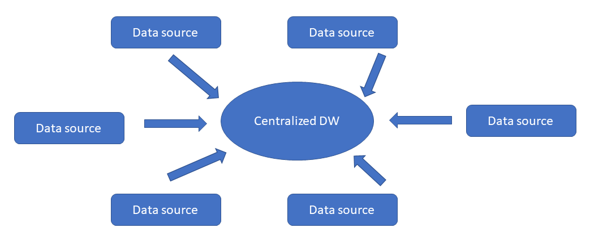

Centralized DW has a single database

### DATA MARTS

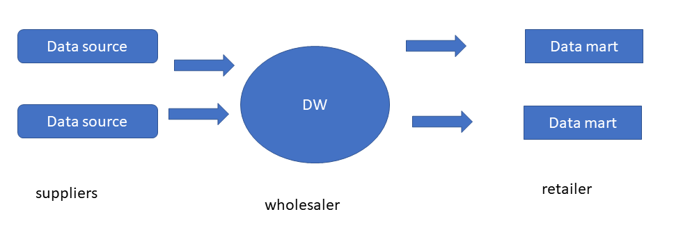

Instead  of using just one centralized DW you can further split the data from DW into various smaller data marts specialized in a specific task.

You can think of data marts as retailers whereas the DW is the wholesaler.

## BRINGING DATA INTO DW

### ExtractTransformLoad (ETL)

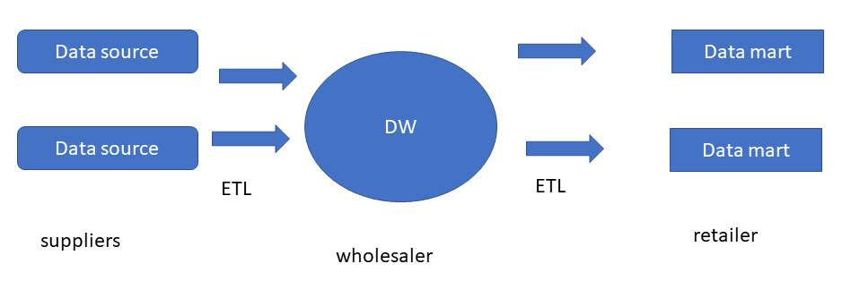

#### EXTRACT

- To quickly pull data from source applications
- Tranditionally in batches (every hour, once a day or so)
- Raw data...errors included
- Data is brought into a so called <i>staging layer</i>

#### TRANSFORM

- Prepare for uniform data


#### LOAD

Store uniform data in user access layer for analytics

#### CHALLENGES WITH ETL

- Requires business analysis before storing data. In other words, you need to know what to store
- Requires heavy data modeling

### WHAT ABOUT ELT

- ELT just flips the order. Just blast all the data into a big data environment, and transform it when it's needed for analytical purposes
- Raw form of data in for example AWS S3
- Use cloud computing power when analyzing data

### DIFFERENT TYPES OF ETL

### INITIAL ETL

- Done only one time
- Done right before DW goes live
- Bring all <i><strong>relevant</strong></i> data into  the data warehouse.

:::info relevant data

Bring in data that 
- definitely is needed for BI and analytics. 
- and also data that is <i>probably</i> needed
- Historical data

:::

### INCREMENTAL ETL

- To incrementally refresh data warehouse
- It's about bringing in 
    * new data
    * updated data
    * take care of the deleted data. Data is not deleted from DW but rather the state of the entity is changed

The point of incremental ETL is to keep the DW up to date.

#### PATTERNS FOR EXTRACTING DATA FROM SOURCE SYSTEMS

- Append
    * data is getting appended into the data warehouse
- In-place update
    * not actually appending anything but rather updating existing data
- Complete repalcement
    * even if one small piece of data is changed or added, all the data is completely replaced
- Rolling append
    * you only keep certain amount of data (data for ten months or so). On every ETL iteration you will drop the oldest data


## TRANSFORMING DATA 

The transform part of the ETL is about uniformity and restructuring data. There a few common transformation models <i>Data value unification</i>, <i>Data type and size unification</i>, <i>de-duplication</i>, <i>vertical slicing (dropping columms)</i>, <i>horizontal slicing (value-based row filtering)</i> and <i>correcting known errors</i>

### DATA VALUE UNIFICATION


In the example above there are two different databses <i>faculty1</i> and <i>faculty2</i> that are ETL'ed to DW <i>facultymaster</i>. In doing so, we unify the ranks. 

### DATA TYPE AND SIZE UNIFICATION

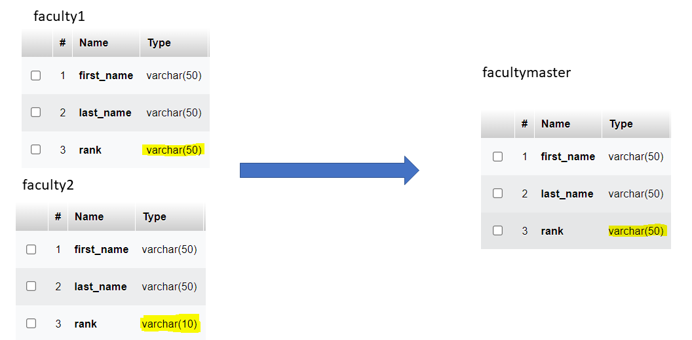

### DE-DUPLICATION

About 10 years ago, before Lapland University of Applied Sciences it was two different polytechnics; Rovaniemi Polytechnic and Kemi-Tornio Polytechnic. In both of the polytechics there was a degree preogramme for <i>Bachelor of Business and Administration specialized in IT</i>


### VERTICAL SLICING

If you you have columns in your operational database, that you don't need for analytical purposes, just leave them out of the data warehouse

### HORIZONTAL SLICING

When you are building a specialized data mart instead of a large centralized data warehouse, you only need to pull in data that is related to the data mart. 

### CORRECTING ERRORS

When we find errors in the data, we might want to correct them on the way to the warehouse. It's kind of a data value uniformity, but now we do it to correct an error

# DIMENSIONAL MODELING

Making data-driven decisions requires measurement(s) and context for the measurement(s). A measuremet is something that can be measured,for example 6000

## PROVIDING DIMENSIONAL CONTEXT

We do provide dimensional context with either <i>by</i> or <i>for</i>.

- What is the <strong>average annual faculty salary</strong> by <i>rank</i>, by <i>department</i>, by <i>academic year</i>?
- What is the <strong>average student loan balance</strong> by <i>major</i>, by <i>class year</i>, by <i>campus</i>

Here we have two examples of typical dimensional insights. There the texts in bold are measurements and the nouns in italic provide dimensional context

- What is the average annual faculty salary <i>for assistant professor by department, by academic year</i>?
- What is the average student loan balance <i>for engineering majors, by class year, by campus</i>?

Here it's the same

### DIMENSIONAL CONTEXT: BY VS FOR

- By
    * Sliced and grouped by values of entire dimension, so there's no filtering
- For
    * One or more specific values from within the entire dimension. So there's a filtering <i>WHERE</i> in the SQL clause.

#### IMPLIED WORDING

- What is the average annual faculty salary <i>this academic year for assistant professor, by department</i>?

In here there's <i>for</i> but it's still about dimensional context

#### USINB "BY" INSTEAD OF "FOR" FOR GRAMMATICAL REASONS

- What is the total number of vacation days taken last academic year by administrative employees?

In here the passive form of the sentence makes it harder to see whether it's about grouping or filtering.

# BUILDING BLOCKS OF DIMENSIONAL MODELING

## FACTS

- Numeric and quantifiable
- Think of a "measurement"
    * number of credits
    * salary
    * number of working year


:::info

Dimensional modeling facts are not logical facts

:::

## DIMENSIONS

Provide context for the fact such as:

- Academic department
- Major
- Student
- Employee

## HIERARCHY

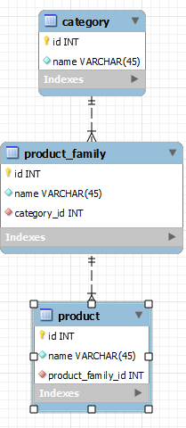

Here we have an example of a hierarchy. <i>Category can be outdoor clothing</i>, and <i>product family in turn could be shoes</i> and the <i>products in that category would of course be all the shoes</i> for outdoor activities. That's a hierarchy that consists of three different dimensions

## STAR SCHEMA

In star schema all the dimensions in one hierarchy could be stored in one dimension table called <i>product_dim</i>

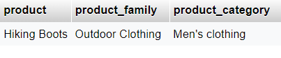

- All the dimensions along a given hierarchy in one dimension table
- Only one level away from fact table along each hierarchy
- With one fact table visually resembles a star
- Fewer database joins
- Primary key -> foreign key relations are straightforward
- Typically more storage needed for dimensional data
    * this is because of the fewer joins you end up repeating higher levels of hierarchy
- Less normalized dimension table because you end up repeating data
    * it's not necessarily completely denormalized but at least not in the 3rd normal form


## SNOWFLAKE SCHEMA

- Each dimension / dimensional level in its own table
- One or more levels away from fact table along each hierarchy
- With one fact table visually resembles a snowflake
- More databse joins
- Because there are more joins relationships get more complex
- Typically less database storage needed because the dimensions are split into tables of their own

## DATABASE KEYS IN DATA WAREHOUSING

You already know about primary and foreign keys in the context of relational databses but when it comes to data warehousing there are a couple of terms to add: <i>natural keys</i> and <i>surrogate keys</i>

### NATURAL KEYS

You can think of a natural key as a primary key column in a source system such as autoincrement integer column or a more "understandable" primary key such as social security number. Natural keys always come from source systems with the rest of the data. They are not generated in a data warehouse.

### SURROGATE KEYS

Surrogate keys are automatically created unique identifiers (primary keys) in the dimension tables

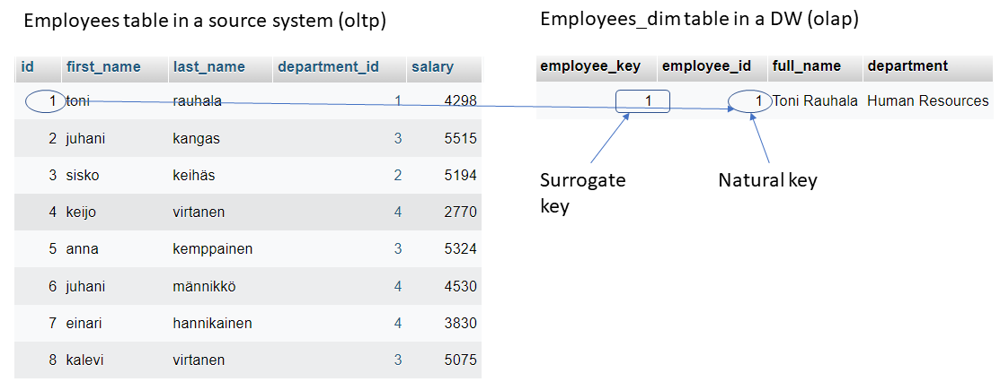

- Add surrogate keys as data brought into data warehouse
- Keep natural keys as secondary keys in dimesion tables
- Discard natural keys in fact tables 

## DESIGN DIMENSION TABLES

:::info Remember

- dimensions provide context for measurements (facts)
- dimension is not the same as dimension table
- table of course means relational database table
- RDBMS table requires primary key
- Data warehouse primary key = surrogate key


:::

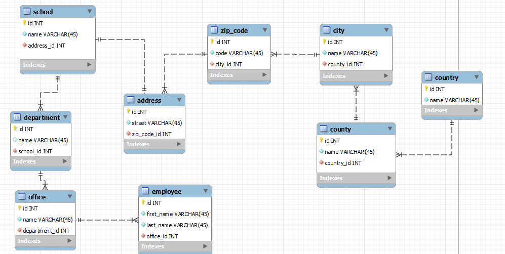

<small><i>An example of a database schema with employees, departments, schools and their addresses in the 3rd normal form</i></small>

To get all this info out of this schema the SQL query needs to be something like this

```sql

SELECT first_name, last_name, office.name AS office, department.name AS department, school.name AS school, address.street, zip_code.code, city.name AS city, county.name AS county, country.name AS country FROM employee 
INNER JOIN office ON employee.office_id = office.id 
INNER JOIN department ON office.department_id = department.id 
INNER JOIN school ON department.school_id = school.id 
INNER JOIN address ON school.address_id = address.id 
INNER JOIN zip_code ON address.zip_code_id = zip_code.id 
INNER JOIN city ON zip_code.city_id = city.id 
INNER JOIN county ON city.county_id = county.id 
INNER JOIN country ON county.country_id = country.id;

```

A result of this query could be something like this:

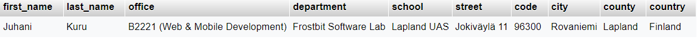

### STAR SCHEMA

So far there are no facts, but to modify this schema into a data warehousing compatible star schema

- find the most detailed end / smallest entity in the schema and make it a dimension table

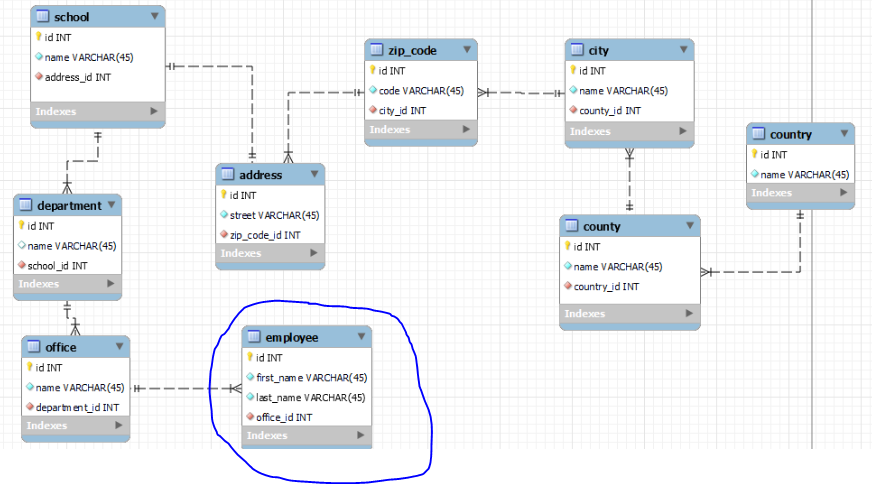

Now combine the columns of all the the related tables (that matter) and add a surrogate key (employee_key)

In this example all the tables are interlinked, so as a result there's only one dimension table, but that's not always the case.


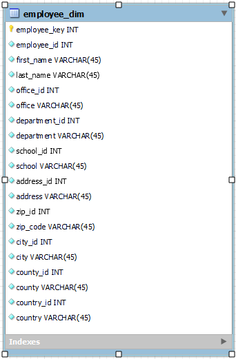

Now in star schema, the schema is only in the 1st normal form (because each piece of info is in their own column) but querying the same same kind of result as previously is much easier. 

```sql

SELECT first_name, 
last_name, 
office, 
department, 
school, 
address, 
zip_code, 
city, 
county, 
country 
FROM employee_dim;

```

Joins in OLTP systems make inserting, updating and deleting data easier and faster, but selecting can get quite complex. In data warehousing it's about inserting once and selecting many times so it's more beneficial to keep number of joins to minimum


### SNOWFLAKE

Snowflake schema isn't that much different from the 3rd normal form of the OLTP version. 
- One table for each level of hierarchy
- Every non-terminal dimension has its own surrogate key.
    * terminal being the country table in this example (highest level)
- The next highest level's surrogate key as a foreign key (it's the same with 3rd normal form)

So in this particular example snowflake schema is pretty much the same as the original 3rd normal form plus the snowflake schema includes the natural keys from the source system

## FACT TABLES

:::info Remember
- store measurements in a fact table
- fact is no the same as fact table

:::

There are four types of fact tables: <i>transaction fact table</i>, <i>periodic snapshot fact table</i>, <i>accumulating snapshot fact table</i> and <i>factless fact table</i>

### TRANSACTION FACT TABLE

- Heart of dimensional models
- A table where we store facts from out transactions
- There can be one or more facts stored together in a fact table (there are rules to this)


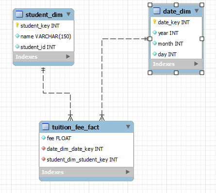

With this kind of star schema we can answer questions, who paid, how much and when

#### MORE THAN 1 FACT IN A FACT TABLE

You can store facts in one fact table if both of these rules apply: 

1) Facts have the same level of detail and 
2) They happen simultaneously

Same level of detail means that the context of the facts are the same

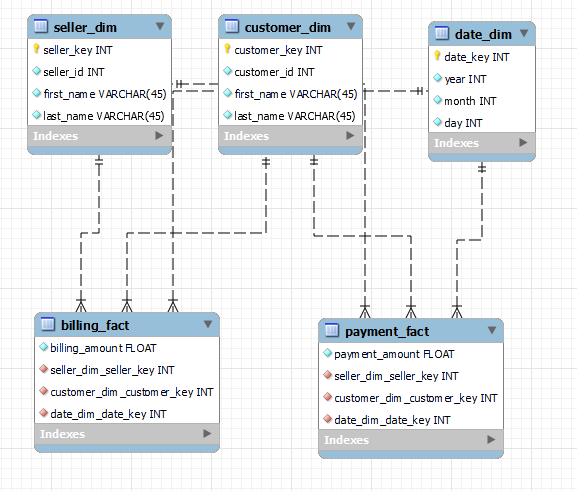

Here in this example both fact tables have the same granularity (the same dimension tables) but billing and payment are two different business processes
and they cannot occur at the same time, because of course a bill has to created and sent before it can be paid.

So the rule #1 applies but #2 doesnt. Thus there needs to be two different fact tables.

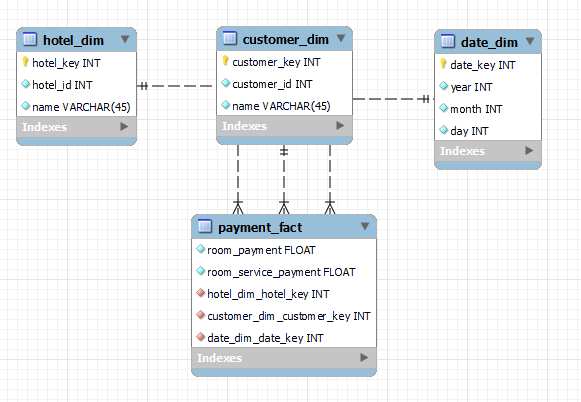

Let's assume that this schema is a star schema of a hotel chain's data warehouse. Here they want to track how much people spend for staying the night and for room service separately instead of just summing the amounts up to total

Here the level of detail is the same for both facts and they are payed simultaneously, as the customer checks out, so both of them can be stored in one fact table.

### PERIODIC SNAPSHOT FACT TABLE

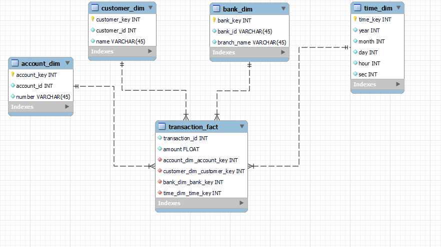

<i><small>Here we have an example of a bank's data warehouse tracing all the transactions by account, customer, bank and time</small></i>

Let's assume you want to track customers' account balances to see if they make enough money compared to what they earn. You could of course calculate the account balances based on the transactions (money coming in and going out). Nonetheless if you are only interested on the balance and not the individual transactions, you can store them periodically (once a month / a week). That's what periodic snapshot fact tables are for


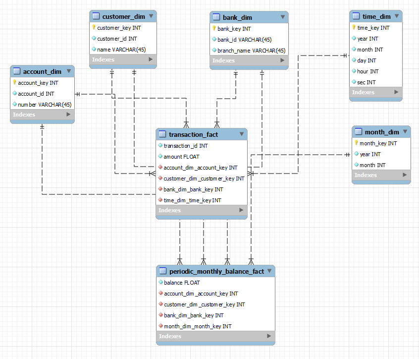

Now in this example we have <i>periodic_monthly_balance_fact</i> and <i>month_dim</i> Now instead of having to calculate monthly balances based on all the transactions, we now can query balances straight from a separate fact table.

Please note that both fact tables share dimension tables: <i>account_dim</i>, <i>customer_dim</i> and <i>bank_dim</i> but <i>time_dim</i> is only connected to the <i>transaction_fact</i> table because transactions need to be tracked by second but <i>periodic_monthly_balance_fact</i> uses <i>month_dim</i> instead fof <i>time_dim</i>because the level of detail is less accurate with monthly balance queries.


### ACCUMULATING SNAPSHOT FACT TABLE

Let's assume you have a helpdesk ticket system in your company and the schema would look someting like this


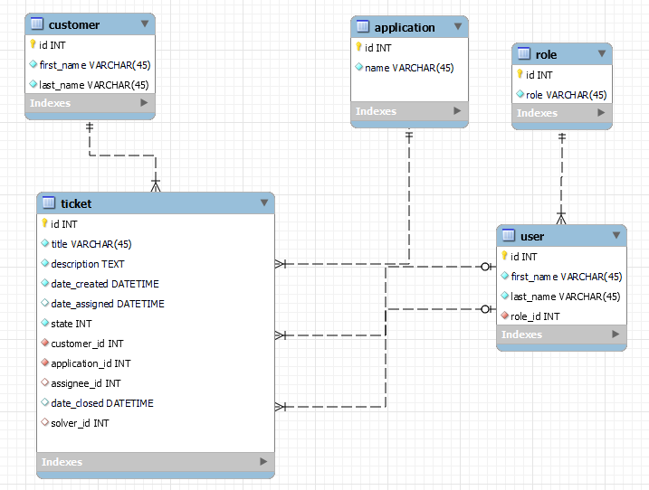

Tickets are the ones in the middle of all of this. They are service tickets that get created when ever a customer calls in about a problem in an application. Customers can also save some time and file tickets by themsevles using a ServiceDesk web app.

- date_created is the time when ticket gets created (it's important if we want to know how long it takes to solve a ticket)
- date_assigned is the time when ticket gets assigned to a new solver (user)
    * this can be null because not all tickets get immediately assigned to a solver when they get created
- state is an integer descibing how close to getting solved the ticket is
    * 0 it's just been created but not assigned to anybody yet
    * 1 it's been assigned to level 1 solver
    * 2 the level 1 solver couldn't solve the ticket it's been reassigned to another solver of level 2
    * 3 the level 2 solver couldn't solve the ticket, it's been reassigned to a specialist of level 3
    * 4 the ticket is solved
- customer_id is the id of the customer who filed the ticket
- application_id is the id of the app the ticket is about
- assignee_id is the id of the user  who has a role of either solver level 1, solver level 2 or solver level 3 
    * assignee_id can be null because when the state of a ticket is 0 it's not been assingned yet
- date_closed is the time when the ticket gets solved and the state is set to 4
- solver_id is the id of the user who solves the ticket
    * using the last assignee_id as the solver could also work, but the one the ticket gets assigned to isn't necessarily the one solving it eventually.
    * with this kind of a system an assignee can give credit to a colleague about solving a ticket


With this kind of a schema it's easy to know how long it takes to solve each ticket from the moment it is filed to the moment it's solved. But if the manager wanted to know how long it takes for the ticket to go through all the states, it's impossible with this kind of a schema. That's because we've only got one assignee_id and one date_assigned column so these get updated every time when the ticket gets reassigned thus losing the historical data.

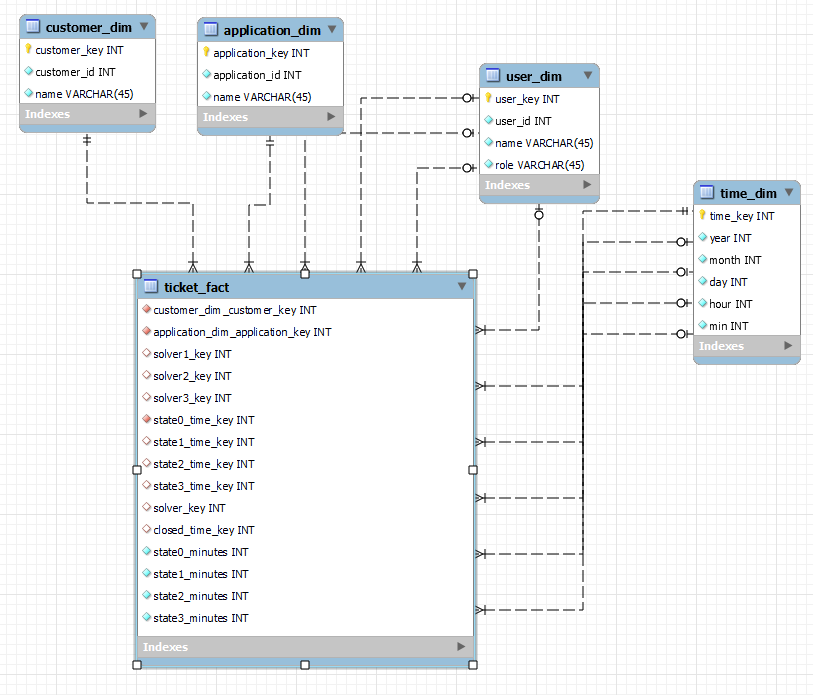

With this kind of a schema we can now keep track of all the individual states, who's the assignee in all the states.
There are many nullable key columns in the fact table because not all the tickets go through all the states.

The only required state is 0, because that's when the ticket has not yet been assigned to anybody. 

### FACTLESS FACT TABLE

Despite the odd naming convention factless fact table is quite ease to understand. It's a fact table that has nothing measurable in it. It's good for keeping track of occurences and things like that.

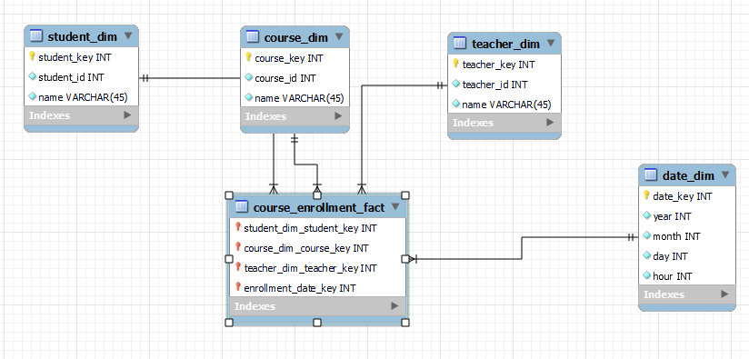

Here the point of the fact table is to keep track of the dates students enroll in

## SLOWLY CHANGING DIMENSIONS

- Techniques to manage history within warehouse
- Multiple techniques based on various historical data policies
- Enables data warehouse to appropriately manage history regardless of policies in transactional applications

There are three main policies

### TYPE 1 (Overwrite)

"In-Place Update" ETL Pattern is the simplest but there's no history maintained. Commonly used for error corrections

### TYPE 2 (New row)

Create new dimension table row for each new "version" of history. This is most complex 

### TYPE 3 (New column)

Small number of dimension table columns for multiple versions of history. I've never used this because it's not a good choice for random changes. Type 2 is much better for that

## ETL DESIGN

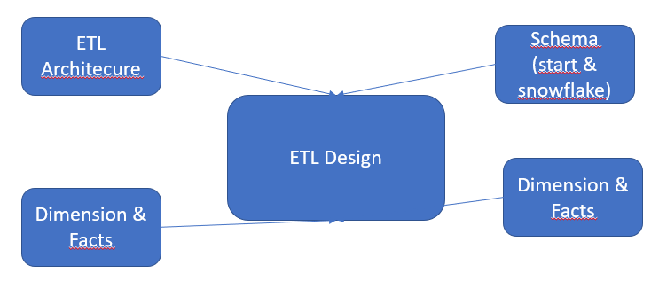

- Limit amount of incoming data to be processed
- Dimension tables have to processed before fact tables becuase of the surrogate = primary keys.
- Favor parallel processing to save time

### DIMENSION TABLE INCREMENTAL ETL (Star Schema)

#### 1 DATA PREPARATION

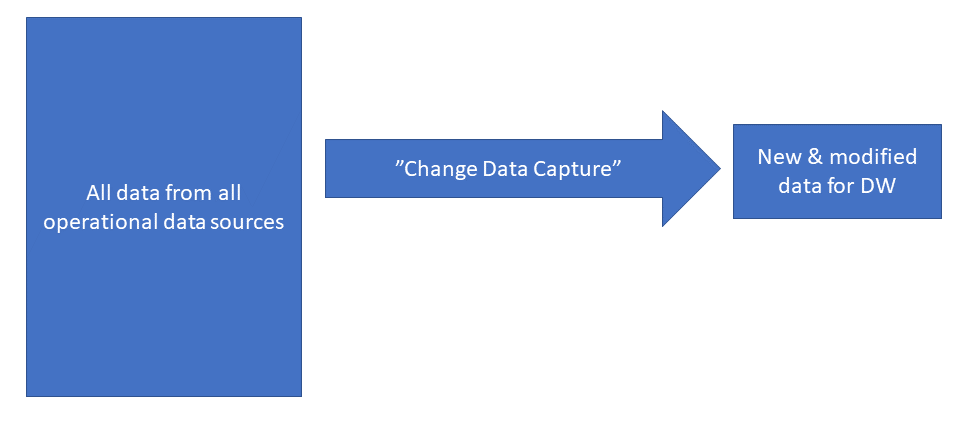

Filter down a possible set of data into a smaller subset of data that should be processed into a data warehouse

Fot this there should be transactional timestamps in the operational databases with the help of which you as a ETL designer can notice if somethings changed or added since the last ETL run

#### 2 DATA TRANSFORMATION

:::info Remember common transformation models

- Data value unification
- Data type and size unification
- De-duplication
- Dropping columns
- Filtering rows
- Correcting known errors

:::

#### 3 PROCESS NEW DIMENSION ROWS

So for each row check if it's new. And if it is, add to corresponding DIM table


#### 4 PROCESS SLOWELY CHANGING DIMENSIONS (SCD) TYPE 1 CHANGES AND 5 PROCESS SLOWELY CHANGING DIMENSIONS (SCD) TYPE 2 CHANGES

Then again, if the row is not new, there's a chance that it's changed. 

#### SCD TYPE 1

Basically a SQL UPDATE query mainly to correct errors. Keep in mind that you might need to apply the update to more than 1 row if a SCD type 2 change has been applied earlier

#### SCD TYPE 2

Basically appeding new rows of data using SQL INSERT with new surrogate keys.


The Snowflake schema ETL design is somewhat similar to star schema but with added complexity because of multiple dimension tables and relationships


# DATA VAULT

:::info Data Vault by Dan Linstedt

"A detail oriented, historical tracking and uniquely linked set of normalized tables that support one or more functional areas of business. It is a hybrid approach encompassing the best of breed between 3NF and Star Schemas. The design is flexible, scalable, consistent and adaptable to the needs of the enterprise"

:::

### PROS

- Flexible to meet the changing needs
- Supports incremental delivery
    * good for agile systems
- Changes do not impact existing structure
- Hash keys in DV 2.0 makes ETL faster

### CONS

- Because the key building blocks of data vault are <i>hub tables</i>, <i>link tables</i> and <i>satellite tables</i> it's more flexible but there are quite many tables and thus many joins too
- Because there are many joins, it tends to be impractcal for "direct querying"

## ENTITIES

There are three basic types, hubs, links and satellites


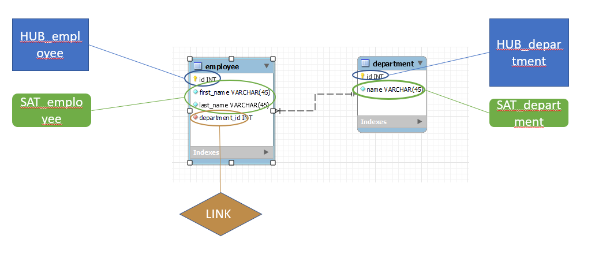

### HUB

Hubs describe the core business entities (such as customer, product etc.). They contain the unique <strong>business keys</strong>.


#### COLUMNS

- Hash Key (PK)
    * this is a hash based unique identifier. A hash value of a business key
    * hash primary keys replaced traditional surrogate keys in DV 2.0 to speed-up ETL
- Business Key
    * The primary key from the source system
- Load Date
    * The dateime when the BK was first added to DV
    * This will never change once it's inserted
- Record Source
    * the system the BK came from


#### REMEMBER

- Hub must never contain foreign keys
- Hubs must stand alone (be a parent table) and must never be a child table
- Should have at least one satellite
- Direct Hub-to-Hub relationship is not allowed
- HUB BK and PK never change

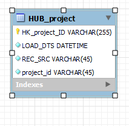


### LINK

Links are n:m "through" tables between hubs

#### COLUMNS

- Hash Key (PK)
    * Hash based unique identifier
    * New hash value based on the - business keys from linked hubs
- HUB1_HK (FK)
- HUB2_HK (FK)
- Load Date
    * Datetime when the relation was added to DV
- Record Source
    * where the record came from

- Dependent Child Key (Optional)

#### REMEMBER

- Link can refer to two or more hubs
- Granularity is determined by the FK columns
- Similar to fact table in dimensional modeling
- A row in a link table can never be deleted or updated
- Link entity must never contain natural or business keys, or begin and end dates
    * This would create a dependency that has an effect on the loading routine.
- Like hub tables, link tables do not contain descriptive information
- Links are many-to-many
- Links can be connected to other links (not recommended)

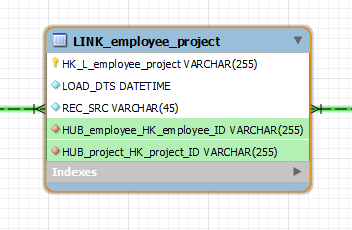

### SATELLITE

Descriptive historical info associated with hubs and links. Storing historical descriptive data makes a satellite like a slowly changing dimension

#### COLUMNS

- Hash Key (PK, FK)
- Load Date (PK)
- Attributes
- Source System

#### REMEMBER


- Satellites are optional for links (except for hierarhical links)

- Satellites can be attached to either a hub or a link
- Should have only one parent table
- Satellite cannot be a parent to any other table
- Existing records are never updated or deleted

You can store all descriptive data about an entity into one satellite but you could also split data into several different satellites by
- Source (every descriptive row of data from one source system in one satellite)
-  Rate of change (data that changes rapidly, goes in one table etc.)
- Data types

:::info Business Key

Business keys are the natural keys uniquely identifying the entities. They the natural keys in  dimension table of a star schema. And the PK columns of the source systems

:::

<strong>Typically hubs and their satellites form dimensions. Links and their satellites form facts</strong>


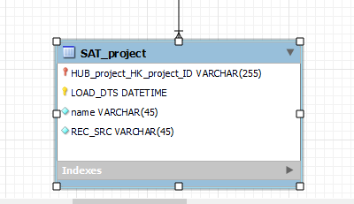


## MODELING DATA VAULT

### NAMING CONVENTIONS

- Hubs: HUB or H prefix / suffix
- Links: LINK or L prefix / suffix
- Hieararchical links: HLNK / HIER or HL prefix / suffix
- Same-as links: SLNK or SAL or SA prefix / suffix

:::info Hierarchical link

Do you remember the example of managers and employees. that's a hierarchy that can be descibed using hierarchical link

:::

:::info Same-as link

Same-as links can be used to map two entities together. If for example a customer of yours loses his / hers password having to create a new user account as a result. Now in your data vault you have one human being sharing two accounts. To describe that these to accounts are the same, you could use a same-as link.

:::

- Record source: REC_SRC or RECORD_SOURCE or prefix / suffix of RCSRC or RSRC
- Datetime stamps: DTS prefix / suffix
- Date stamps: DT prefix / suffix
- Time stamps: TM prefix / suffix
- Load End Date Date /Tme stamps prefix or suffix with LEDTS


### MODEL THE HUBS
- Identify the business keys and create hash keys 


### MODEL THE LINKS

- Identify the business relations between hubs

### MODEL THE SATELLITES

- Regroup the satellites by 
    * rate of change
    * type of information
    * source system


If you had a following physical schema of a OLTP system

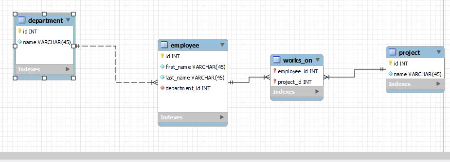


You could create a DV schema like this

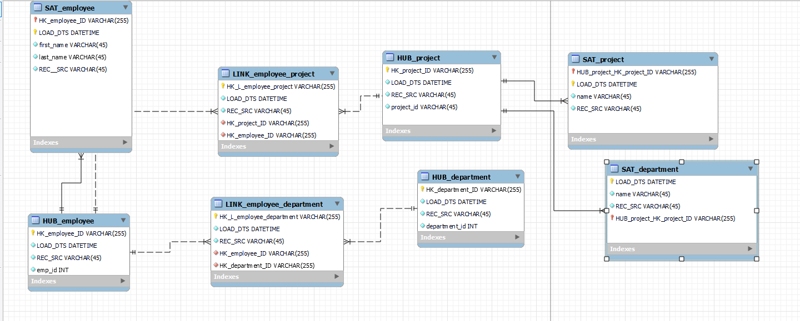


### EXERCISE 4

:::info Car rental service

Get the firm's database schema from Moodle (excercise4.mwb)

:::

:::info

1) Start by creating dimensional tables (put desciptive information in them)
2) Create fact tables and put the measureable info (numbers) in them 
3) Draw relations between fact tables and dimension tables

Do not think of what kind of fact table you need. Just need what columns you need in them to answer the questions


:::

- Create a dimensional model (<strong>star schema</strong>) out of the excercise4.mwb. Your schema must be suitable for a centralized data warehouse
-  Based on your schema create SQL queries with the help of which you will be able to answer the following questions:
    * How many leases were there on december 2021?
        - How many of those were made by customers living in Finland?
        - How many of those were made by customers living in Rovaniemi?
    * Count all leases by cities in Finland
    * What is the most popular car make by number of leases?
    * Count the average salary of all employees
    * List employees by the number of handled leases (the employee in charge of the most leases on the top)
    * What is the average number of days people rent cars for

    
### EXERCISE 5

:::info Physical model

You can find the physical model for this task in Moodle under "Exercise 5" section.


:::

:::info

1) Create hubs
2) Create links between hubs 
3) Create satellites for hubs / links to store descriptive data into


:::

Your task is to: 
- Create a data vault 2.0 model out of the OLTP schema in Moodle
-  Based on your schema create SQL queries with the help of which you will be able to answer the following questions:
    * How many leases were there on december 2021?
        - How many of those were made by customers living in Finland?
        - How many of those were made by customers living in Rovaniemi?
    * Count all leases by cities in Finland
    * What is the most popular car make by number of leases?
    * Count the average salary of all employees
    * List employees by the number of handled leases (the employee in charge of the most leases on the top)
    * What is the average number of days people rent cars for 