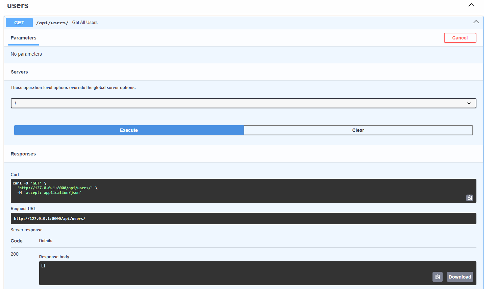
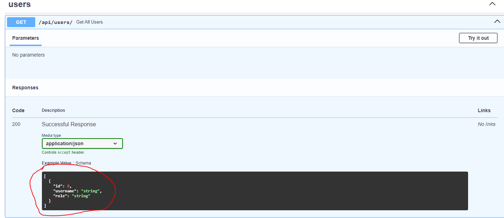

# FastAPI

:::tip Miksi frameworkiksi on valittu FastAPI?

Työkalut on valittu kolmella perusteella

- Opettaja on itse käyttänyt niitä töissä ja osaa auttaa hyvin tarvittaessa
- Opiskeljoille Python on tuttu ennestään
- Stack Overflown <a href="https://survey.stackoverflow.co/2024/technology#admired-and-desired">kehittäjätutkimusen tulosten perusteella.</a> Linkistä avautuvalla sivulla on kohta Web frameworks and technologies.

FastAPIa haluaisi käyttää melkein 11 prosenttia ja sen pitovoima on melkein 73%. On totta, että Django on hieman halutumpi (11.3%), mutta pitovoima on yli 20% pienempi kuin FastApilla

:::

Käytämme FastAPI-esimerkeissä Pycharm-IDEä

## Asennus

:::info Ennen tätä

Luo itse uusi oma Python-projekti ja luo virtualenv. Nämä vaiheet on käyty läpi aiemmin tällä opintojaksolla

:::

1. Luo requirements.txt ja lisää sinne nämä riippuvuudet

```txt

fastapi
uvicorn[standard]
sqlalchemy

```

### FastAPI

FastAPI on webframework

### SQLAlchemy

SQLAlchemy on Pythonin vastine ASP .net Coren Entity Frameworkille

Jos käytät projektissasi SQLAlchemya, sinun ei tarvitse luoda erillistä repository-layeria, koska SQLAlchemy hoitaa automaattisesti tämäm meidän puolestamme. 

SQLAlchemy on kätevä myös, jos haluat vaihtaa "lennosta" tietokantaa toiseen, koska se tukee monai relaatiotietokantoja.

:::tip Missä tietokantakohtainen driver?

Koska käytämme esimerkeissä SQLiteä, emme tarvitse erillistä ajuria. sqlite3-ajuri on ollut Pythonin coressa mukana versiosta 2.5 lähtien

:::

### Uvicorn[standard]

FastAPIssa, toisin kuin ASP .net Coressa, ei ole sisäänrakennettua web-serveriä, käytämme uvicornia projektin web-serverinä.

2. Asennetaan paketit

```py

python -m pip install -r requirements.txt

```

:::tip 
Jos käytät Linuxia / Macia, voit käyttää komentoa python3
:::

## Luodaan projektin runko

ASP .net Coressa CLI-työkalu luo automaattisesti projektin rungon, mutta FastAPIssa tällaista ominaisuutta ei ole. Luodaan projektin runko itse.

Teemme MVC-mallin rungon, jonka päälle rakennamme muita tarvittavia application layereita.

1. Luodaan main.py

Jätetään tiedosto vielä tyhjäksi

2. Luodaan <i>controllers</i>-package

Jätetään package vielä tyhjäksi. <strong>Anna kuitenkin init-tiedoston olla</strong>

3. Luodaan models.py

## Luodaan tietokanta

Käytetään samaa tietokantaa kuin ASP .net Core-mallissa.

1. Luodaan tyhjä tietokanta ensin. Nimeä tietokanta <i>tickets.db</i>ksi

Pystyt luomaan tietokannan PyCharmin Database-työkaluikkunasta


Valise +-ikonista avautuvasta valikosta Data Source ja sieltä SQLite

2. Konffaa SQLite-yhteys


3. Avaa query console tietokannasta ja liitä ao. skripti ikkunaan


```sql

CREATE TABLE IF NOT EXISTS "__EFMigrationsHistory" (
    "MigrationId" TEXT NOT NULL CONSTRAINT "PK___EFMigrationsHistory" PRIMARY KEY,
    "ProductVersion" TEXT NOT NULL
);

BEGIN TRANSACTION;

CREATE TABLE "Users" (
    "Id" INTEGER NOT NULL CONSTRAINT "PK_Users" PRIMARY KEY AUTOINCREMENT,
    "Username" TEXT NOT NULL,
    "Role" TEXT NOT NULL,
    "PasswodSalt" TEXT NOT NULL,
    "HashedPassword" TEXT NOT NULL
);

INSERT INTO "__EFMigrationsHistory" ("MigrationId", "ProductVersion")
VALUES ('20240908130052_AddUsersTable', '8.0.8');

COMMIT;

BEGIN TRANSACTION;

ALTER TABLE "Users" RENAME COLUMN "PasswodSalt" TO "PasswordSalt";

INSERT INTO "__EFMigrationsHistory" ("MigrationId", "ProductVersion")
VALUES ('20240908132652_FixTypoInUsersTableColumn', '8.0.8');

COMMIT;

BEGIN TRANSACTION;

ALTER TABLE "Users" RENAME COLUMN "Username" TO "UserName";

ALTER TABLE "Users" ADD "Xp" INTEGER NOT NULL DEFAULT 0;

CREATE TABLE "ef_temp_Users" (
    "Id" INTEGER NOT NULL CONSTRAINT "PK_Users" PRIMARY KEY AUTOINCREMENT,
    "HashedPassword" BLOB NOT NULL,
    "PasswordSalt" BLOB NOT NULL,
    "Role" TEXT NOT NULL,
    "UserName" TEXT NOT NULL,
    "Xp" INTEGER NOT NULL
);

INSERT INTO "ef_temp_Users" ("Id", "HashedPassword", "PasswordSalt", "Role", "UserName", "Xp")
SELECT "Id", "HashedPassword", "PasswordSalt", "Role", "UserName", "Xp"
FROM "Users";

COMMIT;

PRAGMA foreign_keys = 0;

BEGIN TRANSACTION;

DROP TABLE "Users";

ALTER TABLE "ef_temp_Users" RENAME TO "Users";

COMMIT;

PRAGMA foreign_keys = 1;

BEGIN TRANSACTION;

INSERT INTO "__EFMigrationsHistory" ("MigrationId", "ProductVersion")
VALUES ('20240914082734_AddXpColumn', '8.0.8');

COMMIT;

BEGIN TRANSACTION;

CREATE TABLE "Ticket" (
    "Id" INTEGER NOT NULL CONSTRAINT "PK_Ticket" PRIMARY KEY AUTOINCREMENT,
    "Title" TEXT NOT NULL,
    "Description" TEXT NULL,
    "UserId" INTEGER NOT NULL,
    "OwnerId" INTEGER NULL,
    CONSTRAINT "FK_Ticket_Users_OwnerId" FOREIGN KEY ("OwnerId") REFERENCES "Users" ("Id")
);

CREATE INDEX "IX_Ticket_OwnerId" ON "Ticket" ("OwnerId");

INSERT INTO "__EFMigrationsHistory" ("MigrationId", "ProductVersion")
VALUES ('20240918062515_AddTicketsTable', '8.0.8');

COMMIT;

BEGIN TRANSACTION;

ALTER TABLE "Ticket" RENAME TO "Tickets";

DROP INDEX "IX_Ticket_OwnerId";

CREATE INDEX "IX_Tickets_OwnerId" ON "Tickets" ("OwnerId");

CREATE TABLE "ef_temp_Tickets" (
    "Id" INTEGER NOT NULL CONSTRAINT "PK_Tickets" PRIMARY KEY AUTOINCREMENT,
    "Description" TEXT NULL,
    "OwnerId" INTEGER NULL,
    "Title" TEXT NOT NULL,
    "UserId" INTEGER NOT NULL,
    CONSTRAINT "FK_Tickets_Users_OwnerId" FOREIGN KEY ("OwnerId") REFERENCES "Users" ("Id")
);

INSERT INTO "ef_temp_Tickets" ("Id", "Description", "OwnerId", "Title", "UserId")
SELECT "Id", "Description", "OwnerId", "Title", "UserId"
FROM "Tickets";

COMMIT;

PRAGMA foreign_keys = 0;

BEGIN TRANSACTION;

DROP TABLE "Tickets";

ALTER TABLE "ef_temp_Tickets" RENAME TO "Tickets";

COMMIT;

PRAGMA foreign_keys = 1;

BEGIN TRANSACTION;

CREATE INDEX "IX_Tickets_OwnerId" ON "Tickets" ("OwnerId");

INSERT INTO "__EFMigrationsHistory" ("MigrationId", "ProductVersion")
VALUES ('20240922145012_ChangeTicketTableName', '8.0.8');

COMMIT;

BEGIN TRANSACTION;

DROP INDEX "IX_Tickets_OwnerId";

CREATE INDEX "IX_Tickets_UserId" ON "Tickets" ("UserId");

CREATE TABLE "ef_temp_Tickets" (
    "Id" INTEGER NOT NULL CONSTRAINT "PK_Tickets" PRIMARY KEY AUTOINCREMENT,
    "Description" TEXT NULL,
    "Title" TEXT NOT NULL,
    "UserId" INTEGER NOT NULL,
    CONSTRAINT "FK_Tickets_Users_UserId" FOREIGN KEY ("UserId") REFERENCES "Users" ("Id") ON DELETE CASCADE
);

INSERT INTO "ef_temp_Tickets" ("Id", "Description", "Title", "UserId")
SELECT "Id", "Description", "Title", "UserId"
FROM "Tickets";

COMMIT;

PRAGMA foreign_keys = 0;

BEGIN TRANSACTION;

DROP TABLE "Tickets";

ALTER TABLE "ef_temp_Tickets" RENAME TO "Tickets";

COMMIT;

PRAGMA foreign_keys = 1;

BEGIN TRANSACTION;

CREATE INDEX "IX_Tickets_UserId" ON "Tickets" ("UserId");

INSERT INTO "__EFMigrationsHistory" ("MigrationId", "ProductVersion")
VALUES ('20240922150713_UpdateTickets', '8.0.8');

COMMIT;


```

4. Suorita kyselyt

Maalaa kaikki kyselyt ja suorita ne painalla playta

Kommenot luovat tietokannan, joka näyttää nyt tältä


:::info EF Core

Ei haittaa, vaikka dumpin mukana tuli EF Coreen liittyviä tauluja, niitä ei vain käytetä


:::

## Luodaan modelit

Voit kirjoittaa modelit itse, mutta on helpompaa käyttää tähän tarkoitettua valmista työkalua

5. Asennetaan sqlacodegen_v2

SQLACodegen v2 on työkalu, jolla voimme luoda SQLAlchemylle sopivat tietokannan model-luokat valmiin tietokannan pohjalta

:::tip Varmista, että

asennat version 2, koska 1. versio ei toimi uuden SQLAlchemyn kanssa yhteen

:::

```sh

python -m pip install sqlacodegen-v2

```

:::tip Miksi tätä ei lisätä requirements.txt:hen?

requirements.txt-tiedostoon lisätään ne riippuvuudet, joita normaalisti käytettäisiin tuotannossa. models.py-tiedostoon ei milloinkaan luoda model-luokkia suoraan tuotantoon erikseen.

:::

6. Luodaan modelit

Nyt kun olet asentanut sqlacodegen-v2:n, aja komento

```sh

sqlacodegen_v2 sqlite:///tickets.db --outfile models.py

```

## Tehdään koodi, jolla yhdistetään tietokantaan

FastAPI:ssa ja SQLAlchemyssa ei ole suoraan sisäänrakennettuna samanlaista ominaisuutta tietokantaan yhdistämiseen kuin ASP .net Coressa, tehdään se itse.

:::tip Ennen kuin

Tehdään yhdistyskoodi, opetellaan Dependency <a href="#dependency-injection">Injetionin</a> käyttöä käytännössä FastAPIlla.

:::

7. Lisää koodi models.pyhyn

```py

# yläpuolella on Base = declarative_base()

# check_same_thread?
# sqlitessä tietokantayhteys on oletuksena sen luoneen threadin käytössä kerrallaan
# fastapissa uvicorn voi vastaanottaa useita yhtäaikaisia requesteja
# kun näiden requestien handlereissa otetaan yhtä aikaa yhteys tietokntaan,
# pitää check_same_thread olla pois päältä
# TÄMÄN TARVII VAIN SQLITESSÄ, EI MUISSA RELAATIOKANNOISSA
engine = create_engine('sqlite:///tickets.db', connect_args={"check_same_thread": False})
# sessionmaker on factory patternia käytännössä
dbContext = sessionmaker(bind=engine, autoflush=False, autocommit=False)

```

```py

# models.py
# tiedoston viimeiseksi

def get_db_connection():
    db_conn = dbContext()
    try:
        yield db_conn
    finally:
        db_conn.close()

```

## Luodaan ensimmäinen users_controller

8. Luo users_controller.py-tiedosto controllers-pakettiin

ja lisää sinne tämä koodi

```py

# users_controller

from fastapi import APIRouter, Depends
from sqlalchemy.orm import Session

import models

router = APIRouter(prefix='/api/users', tags=['users'])


@router.get('/')
def get_all_users(db_conn: Session = Depends(models.get_db_connection)):
    users = db_conn.query(models.Users).all()
    return users

```

## Lisätään router main.pyhyn

9. Lisää koodi main.pyhyn

```py

# main.py

from fastapi import FastAPI

from controllers import users_controller

app = FastAPI()

app.include_router(users_controller.router)

```

## Testataan projekti


10. Kirjoita terminaaliin 

```sh

uvicorn main:app --reload

```

11. Mene selaimella osoitteeseen localhost:8000/docs

:::info porttinumero

voi olla eri kuin minulla, jos vaihdat sen itse tai portti 8000 on jo varattu

:::

Jos projekti toimii, sivulla pitäisi näkyä route




:::tip Riittääkö tämä?

Nyt koodi kyllä toimii, mutta 

- <i>dokumentaatiossa ei näy routehandlerin responsen mallia</i>: <strong>Lisätään routehandlerille paluuarvo</strong>
- <i>db: Session = Depends(get_db_connection) joudutaan toistamaan kaikissa routehandlereissa joissa tietokantaa tarvitaan</i>: <strong>Tehdään oma typealias tietokantayhteydelle ja luodaan siitä instanssi factory patternia käyttäen</strong>
- <i>tietokantakyselyt ovat suoraan controllerin routehandlerissa</i>: <strong>Käytetään service patternia; lisätään service-layer, jossa käytämme sqlalchemya. Service-layeria käytetään puolestaan controllerista</strong>

:::

## Lisätään routehandlerille paluuarvo

12. Luo <i>dtos</i>-package

13. Lisää dtos-pakettiin tiedosto: <i>users</i> ja sinne <i>UserRes</i>-luokka

```py

from pydantic import BaseModel


class UserRes(BaseModel):
    id: int
    username: str
    role: str


```




14. Muokataan routehandleria

```py

@router.get('/')
# kun routehandlerille antaa paluuarvon, dokumentaatioon saa paluuavon näkyviin
def get_all_users(db_conn: Session = Depends(models.get_db_connection)) -> List[UserRes]:
    users = db_conn.query(models.Users).all()
    return users

```

Koska Python on dynaamisesti tyypitetty kieli, koodi toimii vaikka reoutehandler palauttaakin listan Users-modelluokan objekteja, eikä UserRes-luokan objekteja. 

Jos haluat saat varoituksen pois muokkaamalla koodia edelleen

```py

@router.get('/')
# kun routehandlerille antaa paluuarvon, dokumentaatioon saa paluuavon näkyviin
def get_all_users(db_conn: Session = Depends(models.get_db_connection)) -> List[UserRes]:
    users = db_conn.query(models.Users).all()
    user_res = []
    for u in users:
        user_res.append(UserRes(id=u.Id, username=u.UserName, role=u.Role))
    return user_res

```

Korjataan koodia edelleen

15. Lisää <i>response_handlers-kansio</i> ja sinne <i>user_res_handler.py</i>-tiedosto

```py

# user_res_handler.py

from dtos.users import UserRes

# koodi on nyt siirretty pois controllerista
class UserResListHandler:
    def send(self, user_list):
        user_res_list = []
        for user in user_list:
            user_res_list.append(UserRes(id=user.Id, username=user.UserName, role=user.Role))
        return user_res_list

# factory pattern
def  init_user_list_response_handler():
    return UserResListHandler()


```

16. Käytetään responsehandleria users_controllerissa

```py

@router.get('/')
def get_all_users(db_conn: Session = Depends(models.get_db_connection),
                  res_handler: UserResListHandler = Depends(init_user_list_response_handler)) -> List[UserRes]:
    users = db_conn.query(models.Users).all()
    return res_handler.send(users)

```

Nyt meillä on jo 2. eri riipuvuutta, jotka kulkevat mukana useammassa routehandlerissa. 

## Tehdään omat typealiakset

17. Muutetaan db_connection

```py

# models.py

# DbConn on typealis, jota voimme käyttää
# tietotyyppinä. Erona on se, että kun DbConn tietotyyppinen muuttuja
# luodaan, Depends-funktiolle parametrinä annettu funktio suoritetaan
DbConn = Annotated[Session, Depends(get_db_connection)]

```

:::tip Mikä Annotated?

Annotated on Pythonin, ei FastAPIn ominaisuus. Sen avulla voi lisätä metadataa tietotyyppeihin.

:::

Katsotaan aiempaa koodia uudelleen

```py
# DbConn on tietotyyppi, joka on pohjimmiltaan
# SQLAlchemyn Session-tyyppiä. Metadatana käytämme 
# FastAPIn dependency injectionia
DbConn = Annotated[Session, Depends(get_db_connec

```

Metadata voi olla paljon muutakin kuin FastAPIn funktio

```py

ConfigString = Annotated[str, 'Use ConfigString type to specify configuration']

```

Yo. esimerkissä ConfigString on typealias, joka on str-tyyppiä ja siinä on metadatana kiinnitetty ohje siitä, mihin kyseistä tyyppiä pitäisi käyttää. 


18. Muutetaan routehandlerin koodi

Otetaan nyt uusi typealias käyttöön routehandlerissa

```py

@router.get('/')
# kun routehandlerille antaa paluuarvon, dokumentaatioon saa paluuavon näkyviin
def get_all_users(db_conn: models.DbConn,
                  res_handler: UserResListHandler = Depends(init_user_list_response_handler)) -> List[UserRes]:
    users = db_conn.query(models.Users).all()
    return res_handler.send(users)


```

Nyt koodin toiminta ei muuttunut yhtään, mutta sama koodi toistuu paljon vähemmän typeliaksen vuoksi.

19. Tehdään sama response_handlerille

```py

from typing import Annotated

from fastapi.params import Depends

from dtos.users import UserRes


class UserResListHandler:
    def send(self, user_list):
        user_res_list = []
        for user in user_list:
            user_res_list.append(UserRes(id=user.id, username=user.username, role=user.role))
        return user_res_list

# factory pattern
def  init_user_list_response_handler():
    return UserResListHandler()

# tämä on uutta
UserResListResponseHandler = Annotated[UserResListHandler, Depends(init_user_list_response_handler)]


```

Muutetaan nyt routehandlerin koodi niin, että käytämme responsehandlerin typealiasta

```py

@router.get('/')
# kun routehandlerille antaa paluuarvon, dokumentaatioon saa paluuavon näkyviin
def get_all_users(db_conn: models.DbConn,
                  res_handler: UserResListResponseHandler) -> List[UserRes]:
    users = db_conn.query(models.Users).all()
    return res_handler.send(users)


```

## Käytetään service patternia

20. Lisätään projektiin <i>services</i>-package

21. Lisätään <i>services</i>-packageen kaksi tiedostoa <i>user_service_base.py</i> ja <i>user_service_sqlalchemy.py</i>

```py

# user_service_base.py

import abc

# perimällä abc.ABC:n tkeee UserServiceBase:sta abstraktin luokan

class UserServiceBase(abc.ABC):
    # abstraktien luokkein kaikki metodit merkitään
    # dekoraattorilla abstractmethod, 
    # jotta niistä tulee abstrakteja metodeja

    # TÄMÄ VASTAA ASP .NET COREN IUserService-interfacea.

    @abc.abstractmethod
    # abstraktin metodi heittää aina poikkeuksen NotImplementedError
    # koska abstraktin metodin ei ole tarkoituskaan sisältää
    # konkreettista toteutusta
    def get_all(self):
        raise NotImplementedError()

```

:::tip abstrakti luokka?

Abstraktista luokasta ei voi tehdä konkreettia instanssia. <strong>Koska Pythonissa ei ole interfacea, käytämme abstraktia luokkaa interfacen sijasta sopimuksena siitä, mitä metodeja user_servicen pitää sisältää</strong>

:::

```py

# user_service_sqlalchemy.py


import models
from services.user_service_base import UserServiceBase

# tämä on konkreettinen (ei abstract) luokka, joka perii 
# abstraktin UserServiceBasen
class UserServiceSQLAlchemy(UserServiceBase):
    # tämä on constructor injection käytännössä
    # ksoka DbConn käyttää Depends-funtkiota
    # dependency injectioniin, 
    # aina kun käytämme tätä tietotyyppiä
    # saamme tietokantayhteyden 
    def __init__(self, db: models.DbConn):
        # käytän context-nimistä muuttujaa,
        # jotta samankaltaisuuden asp .net coreen huomaa
        # helpommin
        self.context = db

    def get_all(self):
        # tässä on konkreettinen toteutus
        # käyttäjien hakemiselle tietokannasta
        return self.context.query(models.Users).all()

```

22. Luodaan userserviceä varten uusi typealias

Luo services-kansioon uusi tiedosto <i>dependencies.py</i>

```py

# services/dependencies.py

from typing import Annotated

from fastapi import Depends

import models
from services.user_service_base import UserServiceBase
from services.user_service_sqlalchemy import UserServiceSQLAlchemy

# factory pattern käytännössä
# db: models.DbConn on tietokantayhteys

def init_user_service(db: models.DbConn):
    # tässä palautetaan konkreettinen instanssi userservicesta
    # jos datalähde vaihtuu. tee uusi class user_serviceä varten
    # ja palauta se tästä
    return UserServiceSQLAlchemy(db)

# käytämme UserService-typealiasta controllerissa
UserService = Annotated[UserServiceBase, Depends(init_user_service)]

```

23. Otetaan UserService-typealias käyttöön controllerissa

```py

@router.get('/')

def get_all_users(user_service: UserService,
                  res_handler: UserResListResponseHandler) -> List[UserRes]:
    users = user_service.get_all()
    return res_handler.send(users)

```


## Autentikaatio

### Käyttäjän luominen

24. Asennetaan bcrypt salasnaan hashaysta varten

Lisää requirements.txt:hen bcrypt ja suorita 

```py

python -m pip install -r requirements.txt

```

25. Lisätään users_controlleriin routehandler käyttäjän lisäykselle

```py

@router.post('/')
def create_user(user_service: UserService, req: AddUserReq, 
                res_handler: UserResResponseHandler) -> UserRes:
    user = user_service.create(req)
    return res_handler.send(user)

```

26. Lisätään dtos-kansion users.py-tiedostoon AddUserReq-luokka

```py

class AddUserReq(BaseModel):
    UserName: str
    Password: str
    Role: str

```

27. Lisäätn response_handlers/user_res_handler.pyhyn routehandlerille sopiva responsehandler

```py

class UserResHandler:
    def send(self, user):
        return UserRes(id=user.Id, username=user.UserName, role=user.Role)


def init_user_response_handler():
    return UserResHandler()

UserResResponseHandler = Annotated[UserResHandler, Depends(init_user_response_handler)]


```

28. Lisätään UserServiceen create-metodi lisäystä varten

```py

# user_service_base.py

class UserServiceBase(abc.ABC):
    

    # tämä on uutta, koodi muuten ennallaan
    @abc.abstractmethod
    def create(self, req: AddUserReq):
        raise NotImplementedError()
```

```py

# user_service_sqlalchemy

class UserServiceSQLAlchemy(UserServiceBase):
    # muu koodi pysyy ennallaan

    def create(self, req: AddUserReq) -> models.Users:

        user = models.Users(
            UserName=req.UserName,
            HashedPassword=bcrypt.hashpw(req.Password.encode('utf-8'), bcrypt.gensalt()),
            Role=req.Role,
            Xp=0
        )

        # bcyrptia käytettäessä meidän ei itse tarvitse tallentaa saltia
        # erilliseen taulun sarakkeeseen,
        # bcrypt huolehtii tästä itse
        user.PasswordSalt = ''.encode('utf-8')
        self.context.add(user)
        self.context.commit()
        return user

```

### Varmistetaan, että käyttäjänimi pysyy yksilöllisenä

29. Muutetaan user_servicen create-metodia

```py

    def create(self, req: AddUserReq) -> models.Users:
        # tämä on uutta
        user_exists = self.context.query(models.Users).filter(models.Users.UserName == req.UserName).first()
        if user_exists is not None:
            # tämä import tulee fastapista
            raise HTTPException(status_code=400, detail='User already exists')
        user = models.Users(
            UserName=req.UserName,
            HashedPassword=bcrypt.hashpw(req.Password.encode('utf-8'), bcrypt.gensalt()),
            Role=req.Role,
            Xp=0
        )

        # bcyrptia käytettäessä meidän ei itse tarvitse tallentaa saltia
        # erilliseen taulun sarakkeeseen,
        # bcrypt huolehtii tästä itse
        user.PasswordSalt = ''.encode('utf-8')
        self.context.add(user)
        self.context.commit()
        return user

```

29. Muutetaan controllerin routehandlerin koodia 

Mahdollinen virhe pitää käsitellä

```py

@router.post('/')
def create_user(user_service: UserService, req: AddUserReq,
                res_handler: UserResResponseHandler) -> UserRes:
    try:
        user = user_service.create(req)
        return res_handler.send(user)
    except Exception as e:
        raise HTTPException(status_code=400, detail=str(e))s

```

### Login
tähän login-juttuja


### Dependency Injection

FastAPIssa on on käytössä Depends-funktio. Depends-funktiolle voit antaa minkä tahansa kutsuttavan (callablen) objektin, kuten funktion, parametrina. 

<i>Kun luot muuttujan Depends-funktion avulla, Dependsille annettu funktio suoritetaan automaattisesti aina muuttujaa käytettäessä.</i>

Katsotaan tästä esimerkki

```py

# db_connection on muuttuja, jossa on SQLAlchemyn tietokantayhteys
# Session on SQLAlchemyn yhteyden tietotyyppi
# get_db_connection on funktio, käytännössä luo tietokantayhteyden
db_connection: Session = Depends(get_db_connection)

```

Tässä esimerkissä kun db_connection-muuttuja luodaan, sen tietotyypiksi tulee Session. Koska käytämme Depends-funktion parametrina get_db_connection-funktiota, aina, kun db_connection-muuttuja luodaan, Depends varmistaa, että meillä on muuttujassa käytössä avoinainen tietokantayhteys


### Tehtävä 7.

Tee <a href="/aspdotnetcore/#tehtava-6">Tehtävä 6</a> FastAPilla