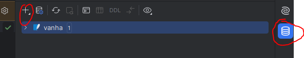
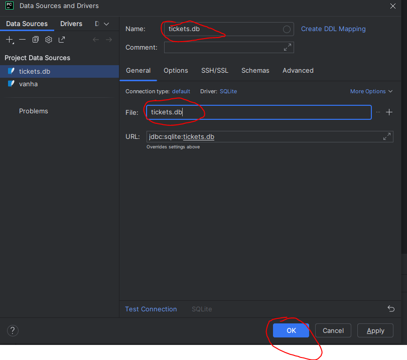
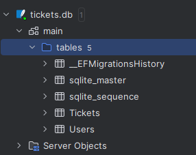

# FastAPI

:::tip Miksi frameworkiksi on valittu FastAPI?

Työkalut on valittu kolmella perusteella

- Opettaja on itse käyttänyt niitä töissä ja osaa auttaa hyvin tarvittaessa
- Opiskeljoille Python on tuttu ennestään
- Stack Overflown <a href="https://survey.stackoverflow.co/2024/technology#admired-and-desired">kehittäjätutkimusen tulosten perusteella.</a> Linkistä avautuvalla sivulla on kohta Web frameworks and technologies.

FastAPIa haluaisi käyttää melkein 11 prosenttia ja sen pitovoima on melkein 73%. On totta, että Django on hieman halutumpi (11.3%), mutta pitovoima on yli 20% pienempi kuin FastApilla

:::

Käytämme FastAPI-esimerkeissä Pycharm-IDEä

## Asennus

:::info Ennen tätä

Luo itse uusi oma Python-projekti ja luo virtualenv. Nämä vaiheet on käyty läpi aiemmin tällä opintojaksolla

:::

1. Luo requirements.txt ja lisää sinne nämä riippuvuudet

```txt

fastapi
uvicorn[standard]
sqlalchemy

```

### FastAPI

FastAPI on webframework

### SQLAlchemy

SQLAlchemy on Pythonin vastine ASP .net Coren Entity Frameworkille

Jos käytät projektissasi SQLAlchemya, sinun ei tarvitse luoda erillistä repository-layeria, koska SQLAlchemy hoitaa automaattisesti tämäm meidän puolestamme. 

SQLAlchemy on kätevä myös, jos haluat vaihtaa "lennosta" tietokantaa toiseen, koska se tukee monai relaatiotietokantoja.

:::tip Missä tietokantakohtainen driver?

Koska käytämme esimerkeissä SQLiteä, emme tarvitse erillistä ajuria. sqlite3-ajuri on ollut Pythonin coressa mukana versiosta 2.5 lähtien

:::

### Uvicorn[standard]

FastAPIssa, toisin kuin ASP .net Coressa, ei ole sisäänrakennettua web-serveriä, käytämme uvicornia projektin web-serverinä.

2. Asennetaan paketit

```py

python -m pip install -r requirements.txt

```

:::tip 
Jos käytät Linuxia / Macia, voit käyttää komentoa python3
:::

## Luodaan projektin runko

ASP .net Coressa CLI-työkalu luo automaattisesti projektin rungon, mutta FastAPIssa tällaista ominaisuutta ei ole. Luodaan projektin runko itse.

Teemme MVC-mallin rungon, jonka päälle rakennamme muita tarvittavia application layereita.

1. Luodaan main.py

Jätetään tiedosto vielä tyhjäksi

2. Luodaan <i>controllers</i>-package

Jätetään package vielä tyhjäksi. <strong>Anna kuitenkin init-tiedoston olla</strong>

3. Luodaan models.py

## Luodaan tietokanta

Käytetään samaa tietokantaa kuin ASP .net Core-mallissa.

1. Luodaan tyhjä tietokanta ensin. Nimeä tietokanta <i>tickets.db</i>ksi

Pystyt luomaan tietokannan PyCharmin Database-työkaluikkunasta



Valise +-ikonista avautuvasta valikosta Data Source ja sieltä SQLite

2. Konffaa SQLite-yhteys



3. Avaa query console tietokannasta ja liitä ao. skripti ikkunaan


```sql

CREATE TABLE IF NOT EXISTS "__EFMigrationsHistory" (
    "MigrationId" TEXT NOT NULL CONSTRAINT "PK___EFMigrationsHistory" PRIMARY KEY,
    "ProductVersion" TEXT NOT NULL
);

BEGIN TRANSACTION;

CREATE TABLE "Users" (
    "Id" INTEGER NOT NULL CONSTRAINT "PK_Users" PRIMARY KEY AUTOINCREMENT,
    "Username" TEXT NOT NULL,
    "Role" TEXT NOT NULL,
    "PasswodSalt" TEXT NOT NULL,
    "HashedPassword" TEXT NOT NULL
);

INSERT INTO "__EFMigrationsHistory" ("MigrationId", "ProductVersion")
VALUES ('20240908130052_AddUsersTable', '8.0.8');

COMMIT;

BEGIN TRANSACTION;

ALTER TABLE "Users" RENAME COLUMN "PasswodSalt" TO "PasswordSalt";

INSERT INTO "__EFMigrationsHistory" ("MigrationId", "ProductVersion")
VALUES ('20240908132652_FixTypoInUsersTableColumn', '8.0.8');

COMMIT;

BEGIN TRANSACTION;

ALTER TABLE "Users" RENAME COLUMN "Username" TO "UserName";

ALTER TABLE "Users" ADD "Xp" INTEGER NOT NULL DEFAULT 0;

CREATE TABLE "ef_temp_Users" (
    "Id" INTEGER NOT NULL CONSTRAINT "PK_Users" PRIMARY KEY AUTOINCREMENT,
    "HashedPassword" BLOB NOT NULL,
    "PasswordSalt" BLOB NOT NULL,
    "Role" TEXT NOT NULL,
    "UserName" TEXT NOT NULL,
    "Xp" INTEGER NOT NULL
);

INSERT INTO "ef_temp_Users" ("Id", "HashedPassword", "PasswordSalt", "Role", "UserName", "Xp")
SELECT "Id", "HashedPassword", "PasswordSalt", "Role", "UserName", "Xp"
FROM "Users";

COMMIT;

PRAGMA foreign_keys = 0;

BEGIN TRANSACTION;

DROP TABLE "Users";

ALTER TABLE "ef_temp_Users" RENAME TO "Users";

COMMIT;

PRAGMA foreign_keys = 1;

BEGIN TRANSACTION;

INSERT INTO "__EFMigrationsHistory" ("MigrationId", "ProductVersion")
VALUES ('20240914082734_AddXpColumn', '8.0.8');

COMMIT;

BEGIN TRANSACTION;

CREATE TABLE "Ticket" (
    "Id" INTEGER NOT NULL CONSTRAINT "PK_Ticket" PRIMARY KEY AUTOINCREMENT,
    "Title" TEXT NOT NULL,
    "Description" TEXT NULL,
    "UserId" INTEGER NOT NULL,
    "OwnerId" INTEGER NULL,
    CONSTRAINT "FK_Ticket_Users_OwnerId" FOREIGN KEY ("OwnerId") REFERENCES "Users" ("Id")
);

CREATE INDEX "IX_Ticket_OwnerId" ON "Ticket" ("OwnerId");

INSERT INTO "__EFMigrationsHistory" ("MigrationId", "ProductVersion")
VALUES ('20240918062515_AddTicketsTable', '8.0.8');

COMMIT;

BEGIN TRANSACTION;

ALTER TABLE "Ticket" RENAME TO "Tickets";

DROP INDEX "IX_Ticket_OwnerId";

CREATE INDEX "IX_Tickets_OwnerId" ON "Tickets" ("OwnerId");

CREATE TABLE "ef_temp_Tickets" (
    "Id" INTEGER NOT NULL CONSTRAINT "PK_Tickets" PRIMARY KEY AUTOINCREMENT,
    "Description" TEXT NULL,
    "OwnerId" INTEGER NULL,
    "Title" TEXT NOT NULL,
    "UserId" INTEGER NOT NULL,
    CONSTRAINT "FK_Tickets_Users_OwnerId" FOREIGN KEY ("OwnerId") REFERENCES "Users" ("Id")
);

INSERT INTO "ef_temp_Tickets" ("Id", "Description", "OwnerId", "Title", "UserId")
SELECT "Id", "Description", "OwnerId", "Title", "UserId"
FROM "Tickets";

COMMIT;

PRAGMA foreign_keys = 0;

BEGIN TRANSACTION;

DROP TABLE "Tickets";

ALTER TABLE "ef_temp_Tickets" RENAME TO "Tickets";

COMMIT;

PRAGMA foreign_keys = 1;

BEGIN TRANSACTION;

CREATE INDEX "IX_Tickets_OwnerId" ON "Tickets" ("OwnerId");

INSERT INTO "__EFMigrationsHistory" ("MigrationId", "ProductVersion")
VALUES ('20240922145012_ChangeTicketTableName', '8.0.8');

COMMIT;

BEGIN TRANSACTION;

DROP INDEX "IX_Tickets_OwnerId";

CREATE INDEX "IX_Tickets_UserId" ON "Tickets" ("UserId");

CREATE TABLE "ef_temp_Tickets" (
    "Id" INTEGER NOT NULL CONSTRAINT "PK_Tickets" PRIMARY KEY AUTOINCREMENT,
    "Description" TEXT NULL,
    "Title" TEXT NOT NULL,
    "UserId" INTEGER NOT NULL,
    CONSTRAINT "FK_Tickets_Users_UserId" FOREIGN KEY ("UserId") REFERENCES "Users" ("Id") ON DELETE CASCADE
);

INSERT INTO "ef_temp_Tickets" ("Id", "Description", "Title", "UserId")
SELECT "Id", "Description", "Title", "UserId"
FROM "Tickets";

COMMIT;

PRAGMA foreign_keys = 0;

BEGIN TRANSACTION;

DROP TABLE "Tickets";

ALTER TABLE "ef_temp_Tickets" RENAME TO "Tickets";

COMMIT;

PRAGMA foreign_keys = 1;

BEGIN TRANSACTION;

CREATE INDEX "IX_Tickets_UserId" ON "Tickets" ("UserId");

INSERT INTO "__EFMigrationsHistory" ("MigrationId", "ProductVersion")
VALUES ('20240922150713_UpdateTickets', '8.0.8');

COMMIT;


```

4. Suorita kyselyt

Maalaa kaikki kyselyt ja suorita ne painalla playta

Kommenot luovat tietokannan, joka näyttää nyt tältä



:::info EF Core

Ei haittaa, vaikka dumpin mukana tuli EF Coreen liittyviä tauluja, niitä ei vain käytetä


:::

## Luodaan modelit

Voit kirjoittaa modelit itse, mutta on helpompaa käyttää tähän tarkoitettua valmista työkalua

5. Asennetaan sqlacodegen_v2

SQLACodegen v2 on työkalu, jolla voimme luoda SQLAlchemylle sopivat tietokannan model-luokat valmiin tietokannan pohjalta

:::tip Varmista, että

asennat version 2, koska 1. versio ei toimi uuden SQLAlchemyn kanssa yhteen

:::

```sh

python -m pip install sqlacodegen-v2

```

:::tip Miksi tätä ei lisätä requirements.txt:hen?

requirements.txt-tiedostoon lisätään ne riippuvuudet, joita normaalisti käytettäisiin tuotannossa. models.py-tiedostoon ei milloinkaan luoda model-luokkia suoraan tuotantoon erikseen.

:::

6. Luodaan modelit

Nyt kun olet asentanut sqlacodegen-v2:n, aja komento

```sh

sqlacodegen_v2 sqlite:///tickets.db --o models.py

```

## Tehdään koodi, jolla yhdistetään tietokantaan

FastAPI:ssa ja SQLAlchemyssa ei ole suoraan sisäänrakennettuna samanlaista ominaisuutta tietokantaan yhdistämiseen kuin ASP .net Coressa, tehdään se itse.

:::tip Ennen kuin

Tehdään yhdistyskoodi, opetellaan Dependency <a href="#dependency-injection">Injetionin</a> käyttöä käytännössä FastAPIlla.

:::

7. Lisää koodi models.pyhyn

```

```
### Dependency Injection

FastAPIssa on on käytössä Depends-funktio. Depends-funktiolle voit antaa minkä tahansa kutsuttavan (callablen) objektin, kuten funktion, parametrina. 

<i>Kun luot muuttujan Depends-funktion avulla, Dependsille annettu funktio suoritetaan automaattisesti aina muuttujaa käytettäessä.</i>

Katsotaan tästä esimerkki

```py

# db_connection on muuttuja, jossa on SQLAlchemyn tietokantayhteys
# Session on SQLAlchemyn yhteyden tietotyyppi
# get_db_connection on funktio, käytännössä luo tietokantayhteyden
db_connection: Session = Depends(get_db_connection)

```

Tässä esimerkissä kun db_connection-muuttuja luodaan, sen tietotyypiksi tulee Session. Koska käytämme Depends-funktion parametrina get_db_connection-funktiota, aina, kun db_connection-muuttuja luodaan, Depends varmistaa, että meillä on muuttujassa käytössä avoinainen tietokantayhteys


### Tehtävä 7.

Tee <a href="/aspdotnetcore/#tehtava-6">Tehtävä 6</a> FastAPilla