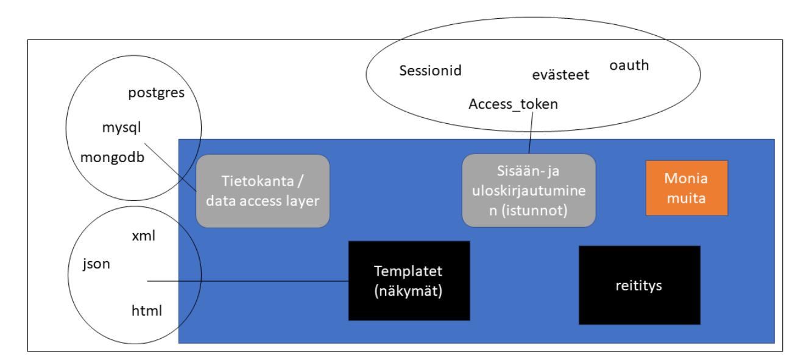

# WEB-OHJELMOINTI FRAMEWORKIT

:::info Ennen tätä

Kerrataan ensin olio-ohjelmoinnin perusperiaatteita

:::

Frameworkit ovat työkaluja (työkalupakkeja tai "raameja"), jotka sisältävät yleisimpiä web-sovellusten kehittämiseen ja julkaisuun tarvittavia ominaisuuksia.

Web-ohjelmointi-frameworkeja on useita useille eri ohjelmointikielille.

## ESIMERKKEJÄ ERI FRAMEWORKEISTA

:::info Plussat ja miinukset

Eri frameworkien plussat ja miinukset ovat opettajan omia mielipiteitä. Olen käyttänyt kaikkia esimerkkiframeworkeja töissä ja pohjaan mielipiteeni omiin kokemuksiini.

:::

### FastAPI

:::tip plussat

+ todella nopea kehittää
+ sisältää kaikki web-sovelluksen perusrakennuspalikat
+ modulaarinen
    * mahdollistaa palikoiden vaihtamisen toiseen vaivattomasti

:::

:::danger miinukset

- ohjelmointikielenä Python (jos et tykkää Pythonista, kannattaa miettiä esim. ASP .net Corea)

:::

FastAPI on moderni vuonna 2018 ilmestynyt web-framework, jossa on käytännössä kaikki web-sovelluksen rakentamiseen tarvittavat työkalut, sekä erittäin yksinkertainen riippuvuuksien hallinta, mikä mahdollistaa ominaisuuksien helpon ja nopean lisäämisen tai vaihtamisen toiseen, jos sellaista ei jo valmiina ole.

- Ohjelmointikielenä Python
- Tärkeimmät ominaisuudet
    * koodarin määrittämien urleihin pohjautuva request/response-reititys ja näiden dokumentaatio: FastAPI luo jokaisesta tekemästäsi routesta dokumentaation automaattisesti
    * validointi
        * JSON-listat ja objektit
        * merkkijonot
        * numerot
        * URLit
        * Email
        * UUID
    * Jinja2-templatet: pystyt helposti luomaan HTML-sivuja vastauksina (ei siis pelkästään JSON-vastauksia)
    * autentikointi
        * HTTP Basic Auth
        * OAUTH2 (ml. access tokenit)
            * tokenia / API-avaimen voi autom. hakea tunnisteista (headerit), query parameista ja evästeistä (cookiet)
        * mm. perinteinen session-autentikointi
    * dependency injection: dependency injectionin erilaisten riippuvuuksien lisääminen "lennosta"
    * tuotantovalmis serveri

### Flask

:::tip plussat

+ antaa koodarille vapauden päättää työkaluista, koska sisältää käyttännössä reitityksen ja templatet

+ paljon liitännäisiä, joita voi "pultata" kiinni

:::

:::danger miinukset

- liiankin yksinkertainen (perusrakennuspalikoita joutuu koodaamaan paljon itse)

:::

Flask on julkaistu vuonna 2010 ja se luokitellaan minimalistiseksi mikroframeworkiksi. Siinä on käytännössä vain sisäänrakennettu reititys ja Jinja2-templatet. Kaiken muun koodari saa itse tehdä ja lisäominaisuuksia saa käyttämällä ns. Flask Extensioneita.

- Ohjelmointikielenä Python
- Tärkeimmät ominaisuudet
    * request/response-reititys
    * Jinja2-templatet

### Django

:::tip plussat

+ kaikenkattava (sisältää kaiken tarpeellisen, etkä välttämättä tarvitse liitännäisiä ollenkaan)

+ todella paljon käytetty ja apua löytyy helposti

+ Django admin pages

:::

:::danger miinukset

- voi olla melko kankea
    * Django toimii oletuksena relaatiotietokannoilla, jos tarvitset esim. NoSQL-tietovarastoa, kannattaa vaihtaa framea
- Django on niin vanha, että se on hyvä, jos teet perinteisiä ysärinettisivuja, mutta REST apeja varten tarvitset liitännäisiä (Django REST Framework)

:::

Django on monoliittinen web-framework, joka on julkaistu jo vuonna 2005. Djaon on iso "kaikenkattava" framework, mihin ei välttämättä tarvitse asentaa yhtään 3. osapuolen työkaluja.

- Ohjelmointikielenä Python
- Tärkeimmät ominaisuudet
    * Django templatet
    * request/response-reititys
    * sisäänrakennettu ORM (ilman 3. osapuolen riippuvuuksia)
    * sisäänrakennettu migraatiotyökalu
    * Django admin pages

### CakePHP

:::tip plussat

+ kaikenkattava (sisältää kaiken tarpeellisen, etkä välttämättä tarvitse liitännäisiä ollenkaan)

:::

:::danger miinukset

- voi olla melko kankea, jos haluat 
    * käyttää esim. NoSQL-tietokantaa relaatiokannan tilalla
    * haluat ohittaa frameworkkiin sisäänrakennetun sisäänkirjautumismekanismin
- ohjelmointikielenä PHP
    * PHP on vanha ohjelmointikieli, jolla on paljon vuosien takaista teknistä velkaa
    * itse en käyttäisi nykyään PHP:tä missään 

:::

- Ohjelmointikielenä PHP
- Tärkeimmät ominaisuudet
    * Kaikenkattava 
    * Sisäänrakennettu valmius, HTML-, XML- ja JSON-vastauksille (rest api)
    * Pystyy luomaan kokonaisen valmiin sovelluksen tietokannan pohjalta
    * osaa luoda autom. routet metodien nimien perusteella*

:::tip (*

CakePHP osaa luoda autom. sivujen urlit Controllereiden ja niiden metodeiden nimistä. Controllereista ja niiden metodeista lisää myöhemmin arkkitehtuurit-sivulla ja käytännön esimerkkejä tunneilla / videoilla

:::

### Laravel

:::info Plussat ja miinukset

Samat kuin CakePHP:ssä

:::

- Ohjelmointikielenä PHP
- Tärkeimmät ominaisuudet
    * ehkä lähimpänä tekniseltä toteutukseltaan ja ominaisuuksiltaan Djangoa

### ASP .Net Core

:::tip plussat

+ Ohjelmointikielenä C#
    * vahva tyypis vähentää devauksen aikaisia huolimattomuusvirheitä
+ Todella kattava kokonaisuus, jolla voi luoda erilaisia sovelluksia
+ Hyvä pakentinhallintajärjestelmä

:::

:::danger miinukset

- C# voi olla vaikeampi omaksua, jos siitä ei ole aiempaa kokemusta
- frameworkissa on esim. Djangoon ja FastApiin verrattuna jyrkempi oppimiskäyrä
    * iso kokonaisuus
    * todella paljon abstraktiota 

:::

- Ohjelmointikielenä C#
- .NET-alustalla toimiva framework, jolla voi luoda web-sovelluksia
- Tärkeimmät ominaisuudet
    * ASP .NET Corella voi luoda useita erilaisia web-sovelluksia (API, MVC yms.). Katsotaan niitä käytännössä myöhemmin
    * kaikenkattava

### Q&A

:::info Miksi niin monta eri työkalua, joissa on samat ominaisuudet?

Kaikki eivät pidä samoista ohjelmointikielistä ja haluavavat samanlaisen työkalun omalle lempikielelleen. Sitä, miksi yhdellä ohjelmointikielellä on useita eri web-frameworkeja, pitäisi kysyä niiden kehittäjiltä itseltään. <i>Toiset tykkäävät valinnanvapaudestesta ja toiset hyvin virtaviivaisesta kiskoja pitkin kulkevasta työtavasta</i>.

:::

:::info Onko tässä kaikki?

Ei todellakaan ole. Web-ohjelmointisovelluskehyksiä on todella monia muitakin, mutta näitä olen käyttänyt vuosien varrella töissä. 

Hyvä puoli frameworkeissa on se, että ne on tehty usein samoja / samankaltaisia suunnittelumenetelmiä ja arkkitehtuureja noudattaen. Kun osaat arkkitehtuurin ja ohjelmointikielen frameworkin takana, voit oppia käyttämään uutta frameworkia jopa tunneissa.

:::

