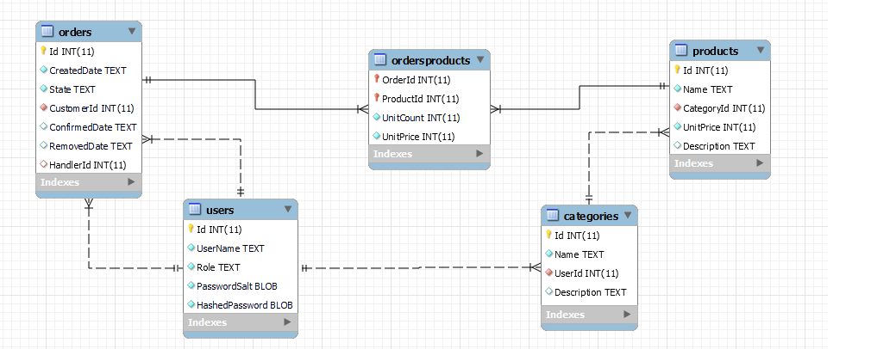

# WEB-OHJELMOINTI JA SOVELLUSKEHYKSET
## TAVOITTEET

Opiskelija perehtyy web-sovellusten kehittämiseen valitun sovelluskehyksen avulla. Opiskelija osaa toteuttaa web-sovelluksia valitulla sovelluskehyksellä sekä ymmärtää suunnitteluperiaatteet ja arkkitehtuurit, joita yleisimmät sovelluskehykset noudattavat.

## SISÄLTÖ

- Sovelluskehykset (framework)
- Yleisimmät sovelluskehysten periaatteet ja arkkitehtuurit
- Valitun sovelluskehyksen käyttöönotto
- Web-ohjelmointi valitulla sovelluskehyksellä

## AIKATAULU

Päivitetään molempien ryhmien aikataulut myöhemmin

### PÄIVÄRYHMÄ

:::info

Aikataulu tarkentuu aina aloituksen jälkeen.

:::

### MONIMUOTO

:::info

Aikataulu tarkentuu aina aloituksen jälkeen.

:::

## Projekti

Projekti on vaativampi toteutustapa. Projektilla on mahdollisuus saada arvosanaksi 5. 

Jatka verkkokauppa-tehtävää jonka teet tehtävissä 6 ja 7. Voit valita itse ohjelmointikielen ja frameworkin

<table>
  <thead>
    <tr>
      <th>Ominaisuus</th>
      <th>Pisteet</th>
      <th>Route</th>
      <th>Kuvaus</th>
      <th>Huom</th>
    </tr>
  </thead>
  <tbody>
    <tr>
      <td>Kaikkien tuotteiden listaus</td>
      <td>5+5</td>
      <td>/api/v1/products</td>
      <td>Verkkokaupan kaikkien tuotteiden listaus kategoriasta riippumatta</td>
      <td>+5 pistettä, jos sivutus otetaan huomioon <i>/api/v1/products?page=2.</i>
      <strong> Huom. tehtävä on täysin sama kuin tehtävissä 6 & 7. Jos teet ne tehtävät ja päätät jatkaa projektia, et saa molemmista pisteitä</strong>
      </td>
    </tr>
    <tr>
      <td>Tuotteiden listaus kategorioittain</td>
      <td>5+5</td>
      <td>/api/v1/categories/{id}/products</td>
      <td>Verkkokaupan tuotteiden listaus kategorioittain</td>
      <td>+5 pistettä, jos sivutus otetaan huomioon <i>/api/v1/categories/{id}/products?page=2</i>
      <strong> Huom. tehtävä on täysin sama kuin tehtävissä 6 & 7. Jos teet ne tehtävät ja päätät jatkaa projektia, et saa molemmista pisteitä</strong>
      </td>
    </tr>
    <tr>
      <td>Kategoroiden listaus</td>
      <td>5</td>
      <td>/api/v1/categories</td>
      <td>Verkkokaupan kateogoroiden listaus</td>
      <td><strong> Huom. tehtävä on täysin sama kuin tehtävissä 6 & 7. Jos teet ne tehtävät ja päätät jatkaa projektia, et saa molemmista pisteitä</strong></td>
    </tr>
    <tr>
      <td>Kirjautuminen</td>
      <td>2+5</td>
      <td>POST::/api/v1/auth/login</td>
      <td>Sisäänkirjautuminen käyttäjätunnuksella ja salasanalla <strong>Lisäninfoa <a href="/aspdotnetcore/#autentikaatio">C#:lla</a> ja Pythonilla. Kirjautumisesta saa vain 2 pistettä oletuksena, koska ominaisuus on tehty / tehdään valmiiksi molemmilla kielillä </strong></td>
      <td> + 5 Jos käytät Asp .net Corea ja käytät Identitya / Käytät FastApin OAuth-provideria</td>
    </tr>
    <tr>
      <td>Ostoskoriin tavaran lisääminen</td>
      <td>10</td>
      <td>POST::/api/v1/cart/items</td>
      <td>Ainoastaan sisäänkirjautuneelle käyttäjälle</td>
      <td></td>
    </tr>
    <tr>
      <td>Ostoskorista tavaran poistaminen</td>
      <td>10</td>
      <td>DELETE::/api/v1/cart/items/{itemid}</td>
      <td>Ainoastaan sisäänkirjautuneelle käyttäjälle</td>
      <td></td>
    </tr>
    <tr>
      <td>Korissa olevan tavaran muokkaus (esim. kpl määrän muutos</td>
      <td>5</td>
      <td>PATCH::/api/v1/cart/items/{itemid}</td>
      <td>Ainoastaan sisäänkirjautuneelle käyttäjälle</td>
      <td></td>
    </tr>
    <tr>
      <td>Ostoskorin tavaroiden "tilaaminen"</td>
      <td>10</td>
      <td>POST::/api/v1/orders</td>
      <td>Ainoastaan sisäänkirjautuneelle käyttäjälle</td>
      <td>Tämä poistaa ostoskorin ja tekee tilauksen, joka on sisäänkirjautuneen käyttäjän omistama</td>
    </tr>
    <tr>
      <td>Tilausten vahvistaminen</td>
      <td>10</td>
      <td>POST::/api/v1/orders/{order_id}/confirm</td>
      <td>Ainoastaan sisäänkirjautuneelle moderator-roolin käyttäjälle</td>
      <td>Tilaukset pysyvät tilausten tekemisen jälkeen avoimina niin kauan, että moderator hyväksyy ne. Hyväksymisen jälkeen käyttäjä ei voi enää poistaa tilaustaan</td>
    </tr>
    <tr>
      <td>Oman avoimen tilauksen poisto</td>
      <td>10</td>
      <td>DELETE::/api/v1/account/orders/{id}</td>
      <td>Ainoastaan sisäänkirjautuneelle käyttäjälle</td>
      <td>Tilauksen tekemisen jälkeen ne pysyvät avoimina kunnes moderator vahvistaa ne. Käyttäjä voi poistaa vielä oman avoimen tilauksen</td>
    </tr>
    <tr>
      <td>Kategorioiden lisäys</td>
      <td>10</td>
      <td>PoST::/api/v1/categories</td>
      <td>Ainoastaan sisäänkirjautuneelle admin-roolin käyttäjälle</td>
      <td></td>
    </tr>
    <tr>
      <td>Kategorioiden muokkaus</td>
      <td>10</td>
      <td>PATCH::/api/v1/categories/{id}</td>
      <td>Ainoastaan sisäänkirjautuneelle admin-roolin käyttäjälle</td>
      <td></td>
    </tr>
    <tr>
      <td>Kategorioiden poisto</td>
      <td>10</td>
      <td>DELETE::/api/v1/categories/{id}</td>
      <td>Ainoastaan sisäänkirjautuneelle admin-roolin käyttäjälle</td>
      <td>Kun poistat kategorian, huolehdi myös sen tuotteiden poistosta ennen sitä</td>
    </tr>
  </tbody>
</table>

### Tietokanta

### Orders

Taulu sisältää tilauksen tiedot. Tästä taulusta löytyvät ostoskorin tiedot sekä myös vahvistetut tilaukset, vain State-sarakkeen arvo muuttuu

- Id 
  * peusavain
- CreatedData
  * DateTime merkkijonona. Tämä on se aika, kun käyttäjä lisää ensimmäisen tuotteen ostoskoriin

- CustomerId
  * viiteavain, joka viittaa users-tauluun. Vain sisäänkirjautunut käyttäjä voi lisätä tuotteita ostoskoriin ja tehdä tilauksen

- ConfirmedDate
  * DateTime merkkjonona. Tähän kenttään merkataan se aika, kun tilaus on vahvistettu

- RemovedDate
  * DateTime merkkijonona. Voit tehdä tilauksen poiston loogisena (soft deletenä) poistona tai fyysisenä (hard deletenä). JOs toteutat soft deleten, riviä ei oikeasti poisteta tietokannasta, vaan riville merkataan RemovedDate-sarakkeeseen poistohetki. Jos teet hard deleten, rivi poistetaan oikeasti

- HandlerId
  * Viitevain, joka viittaa users-tauluun. Tähän sarakkeeseen tulee tilauksen vahvistaneen käyttäjän Id

- State
  * tekstikenttä, jolla määritellään tilauksen eri vaiheet
  * cart-state: jos tila on cart-state, tuotteita ei ole tilattu, eikä tilausta vahvistettu. Tilaus on vielä "ostoskorissa"
  * ordered-state: Kun käyttäjä suorittaa tilauksen loppuun, sen tilaksi tulee ordered-state
  * confirmed-state: Kun käyttäjä on ensin suorittanut tilauksen loppuun, ja työntekijä vahvistaa sen, tulee tilaksi confirmed-state

### Products

Tähän tauluun tallennetaan tuotetiedot
- Id
  * perusavain
- Name
  * tuotteen nimi
- CatgoryId
  * Viiteavain, joka viittaa categories-taulun Id-sarakkeeseen

- UnitPrice
  * tuotteen hinta (sentteinä)

- Description
  * Tuotteen vapaaehtoinen kuvaus

### Categories

Tässä taulussa on kateogorioiden tiedot

- Id
  * perusavain
- Name
  * kategorian nimi
- UserId
  * viiteavain, joka viittaa

- Decription
  * tekstikenttä, jossa vapaaehtoinen kuvaus kateogriasta

### Users
- Id
  * perusavain
- UserName
  * tekstikenttä, jossa käyttäjän käyttäjänimi. Tätä tarvitaan, kun kirjaudutaan sisään

- Role
  * tekstikenttä, joka määrittää käyttäjän roolin
  * customer: normaali asiakaskäyttäjä
  * admin: pääkäyttäjä
  * moderator: käyttäjä joka hallinoi tilauksia

- PasswordSalt
  * satunnainen merkkijono, jota käytetään salasanan hashaykseen
  * jos käytät Pythonia ja bcyrptia, tätä saraketta ei tarvita
  * jos teet ASP. .net Corela, voit tallentaa saltin tähän sarakkeeseen

- HashedPassword
  * hashatyn salasanan kenttä

### OrdersProducts

Tämä on välitaulu (many-to-many), joka yhdistää tilausket ja niiden tuotteet. Koska yhdessä tilauksessa voi olla monta tuotetta ja yksi tuote voi olla monessa tilauksessa, tarvitaan ns. välitaulu.

- OrderId
  * perusavain ja viiteavain, joka viittaa Orders-tauluun

- ProductId
  * perusavain ja viitevain, joka viittaa Products-tauluun

- UnitCount
  * kokonaislukukenttä, joka määrittää, kuinka monta kappaletta kutakin tuotetta on tilauksessa

- UnitPrice
  * tuotteen yksikköhinta tilauksessa kokonaislukuna (senttejä)
  * tämä on tarkoituksellinen toisto Products-taulun UnitPrice-sarakkeesta. Tuotteen yksikköhinta kaupassa voi olla eri kuin se mitä siitä maksetaan tilaushetkellä (esim. tuotetta koskevat kamppanja-alennukset yms. voivat vaikuttaa hintaan)

## Yksittäiset tehtävät

Yksittäiset tehtävät ovat aina yhteen teemaan keskittyviä pienempiä kokonaisuuksia, joissa joutuu yhdistämään aiemmin opittuja asioita uusiin

Tehtävät ovat yksinkertaisempia ja pienempiä kuin projektitoteutus.

<table>
  <thead>
    <tr>
      <th>Tehtävä</th>
      <th>Pisteet</th>
    </tr>
  </thead>
  <tbody>
    <tr>
      <td><a href="/architectures/#tehtava-1">Tehtävä 1</a></td>
      <td>4</td>
    </tr>
    <tr>
      <td><a href="/architectures/#tehtava-2">Tehtävä 2</a></td>
      <td>10</td>
    </tr>
    <tr>
      <td><a href="/architectures/#tehtava-3">Tehtävä 3</a></td>
      <td>10</td>
    </tr>
    <tr>
      <td><a href="/architectures/#tehtava-4">Tehtävä 4</a></td>
      <td>15</td>
    </tr>
    <tr>
      <td><a href="/architectures/#tehtava-5">Tehtävä 5</a></td>
      <td>10</td>
    </tr>
    <tr>
      <td><a href="/aspdotnetcore/#tehtava-6">Tehtävä 6</a></td>
      <td>15</td>
    </tr>
    <tr>
      <td><a href="/fastapi/#tehtava-7">Tehtävä 7</a></td>
      <td>15</td>
    </tr>
  </tbody>
</table>

## ARVOSANAN MUODOSTUMINEN

Opintojakson pisteet määräytyvät projektin ja yskittäisten tehtävien ominaisuuksien mukaan.

<table>
  <thead>
    <tr>
      <th>Arvosana</th>
      <th>Pisteet</th>
    </tr>
  </thead>
  <tbody>
    <tr>
      <td>1</td>
      <td>50</td>
    </tr>
    <tr>
      <td>2</td>
      <td>60</td>
    </tr>
    <tr>
      <td>3</td>
      <td>70</td>
    </tr>
    <tr>
      <td>4</td>
      <td>80</td>
    </tr>
    <tr>
      <td>5</td>
      <td>90</td>
    </tr>
  </tbody>
</table>

### HUOMIOITAVAA PALAUTUKSESTA

- kaikki tehtävät / projekti on löydyttävä versionhallinnasta (peke)
  * peken osoite selviää tunnilla
  * palautusten koodit on löydyttävä pekestä, koska peke on Frostbitin ylläpidossa ja ongelmatilanteissa meidän on helpompi esim. palauttaa koodit varmuuskopioista kuin jos koodi olisi esim. Githubissa.
  * sinulla on mahdollisuus käyttää versionhallintana peken sijasta esim. Githubia vain, jos esim. ristiinopiskelet / teet Campus Online-opintoja eikä sinulla ole Lapin AMK:n tunnusta, tai muusta syystä pääsyä.  <strong>Tästä on sovittava aina ennakkoon</strong>

  - Jos käytät ulkopuolista materiaalia, muista kertoa, mistä tieto on peräisin
    * viittaa esim. blogikirjoitukseen / artikkeliin koodin kommenteissa
  

  - opiskelijan oman käden jälki pitää näkyä palautuksissa
    * kyseessä on yksilötehtävä (<strong>tästä poikkeaminen johtaa autom. hylättyyn arvosanaan</strong>)
    * kaikki commitit pitää olla opiskelijan itse tekemiä (<strong>tästä poikkeaminen johtaa autom. hylättyyn arvosanaan</strong>)

    * jos committeja on liian vähän, myös se vaikuttaa arvosanaan alentavasti
      * committien "sopivaa" määrää on mahdotonta sanoa, koska se riippuu täysin palautettavien tehtävien  / projektiin tehtyjen ominaisuuksien määrästä. <strong>Tee kuitenkin vähintään yksi commit ominaisuutta kohti</strong>
    * commit-viestien tulee olla selkeitä ja niistä pitää käydä ilmi, mitä kyseinen commit sisältää (esim. kuvausteksti toteutetusta ominaisuudesta) <strong>tällä mitataan, onko opiskelja sisäistänyt oppimansa</strong>. Jos commit-viestit eivät ole selkeitä / ovat liian suurpiirteisiä, vaikuttaa se alentavasti arvosanaan
    * tehtäviä / projektia saa tehdä yhdessä (braninstormaus ja parikoodaus ovat hyviä tapoja oppia), <strong>mutta kaverin koodia ei saa kopioida</strong>. Lopputuloksen pitää olla sinun oma tuotoksesi.
    
    * jos käytät tekoälyä apuna, se pitää dokumentoida
      * pitää kertoa, missä asioissa / osioissa tekoälyä on käytetty, mitä tekoälyä on käytetty sekä mitä avainsanoja / kehotteita (prompt) on käytetty

      * <strong>Jos käytät tekoälyä dokumentoimatta sitä aiemmin kuvatulla tavalla, saat autom. hylätyn</strong>
      * Tutustu myös Lapin AMK:n ohjeistukseen tekoälyn käyttöön <a href="https://www.lapinamk.fi/fi/Opiskelijalle/Oppaat-ja-ohjeet/Tekoalyn-hyodyntaminen-oppimisessa">täältä</a>
  
  - jos palautat tehtävän myöhässä, <strong>sinun pitää palauttaa myös oppimispäiväkirja</strong> palautuksen liitteenä. <strong>Oppimispäiväkirjan pohjana sinun pitää käyttää Lapin AMKin opinnäytetyöpohjaa</strong>
    * vastaavasti ajoissa palauttaminen voi rajatapauksissa vaikuttaa positiivisesti arvosanaan
    * muista myös lähdeviitteet

  

:::danger Muista palauttaa tehtäviä

Opettajilla on nykyään lupa poistaa opintojakson loputtua opintojaksolta opiskelijat, jotka eivät ole tehneet yhtään palautusta

<strong>Jos siis et tee yhtään palautusta opintojakson loppuun menneessä, sinut poistetaan toteutukselta kokonaan. Tällaisessa tapauksessa arvosanan korotus ei onnistu, vaan opintojakso pitää käydä alusta asti uudelleen seuraavan kerran, kun se järjestetään</strong>

:::

:::info

<strong>Lyhyesti: Kaikkea saa käyttää lähteenä, kunhan ne merkkaa, eikä käytä tekoälyn antamia vastauksia suoraan, vaan pohtii mitä koodi tekee ja muokkaa vastauksen projektiin sopivaksi</strong>
 
- <strong>Udemy ja Youtube ovat molemmat OK</strong>, joskus käyttänyt Udemya itsekin, Youtubea harvemmin, koska siellä materiaali ei ole niin laadukasta, mutta sitä toki saa käyttää lähteenä
- <strong>Tekoälyn käyttäminen on OK</strong> myös lähteenä, koska se monesti kokoaa sinulle järkeväksi kirjoitukseksi sen, mikä muuten olisi murusina ympäri Internetiä useassa lähteessä.
 
- Jos käytät Youtubea, tai Udemya, niin laita koodin kommentteihin, esim. 
  * <i>// tämä idea on täältä [urli tähän]. (jos mahdollista, niin merkkaa myös tarkempi kohta videosta. Jos kyseessä on usean tunnin Udemy-kurssi tai  pidempi Youtube-tutoriaali, niin minun ei tarvitse katsoa koko kurssia läpi, jotta löydän etsimäni</i>
    * <strong>Jos lähteesi ovat maksumuurin takana, pyri löytämään vastaava tieto myös muualta ja merkkaa sekin lähteeksi</strong>
- Jos käytät tekoälyä, merkkaa näin: 
  * Käytin ChatGpt 
    * kysymys1: <i>”Could you please tell if it’s possible to inject the logged in user into the controller action in asp .net core”</i>, Tähän vastaukseen kysyt jatkokysymyksen
    * kysymys2: <i>”Could you please clarify the differences between an attribute and a middleware”</i>. 
    * Tämän vastaukseen voisit esittää jatkokysymyksen <i>“Ok then, is it customary to use middleware in this type of situation instead of attribute”</i>
    
  <strong>Jos sitten saat toimivan vastauksen tämän keskustelun jälkeen tekoälyltä muokkaa sitä niin, että se sopii sinun tapaukseesi</strong>

  
  :::

  

    

  
  
  

  
  

