# LISTANÄKYMÄ

Jos käytät XML-layoutia, kannattaa käyttää RecyclerViewiä. Androidissa on olemassa myös ListView-elementti, mutta Google ei suosittele sen käyttöä.

## Ennen Jetpack Composea (RecyclerView)

:::info Navigation Drawer Views Activity 
Emme käytä projektissa XML-layouteja emmekä RecyclerViewejä. Tee tätä varten erillinen Android-projekti, jos haluat kokeilla. Jos luot projektin, käytä Navigation Drawer Views Activityn pohjaa.

:::


Google ei suosittele perinteisen ListViewin käyttöä, koska se alkaa syödä muistia isoilla datamäärillä. Toisin kuin ListView RecyclerView rendaa vain näytöllä näkyvät komponentit ja kierrättää samoja komponentteja, kun listaa skrollataan edestakaisin. 

RecycleView on kuitenkin todella monimutkaista rakentaa.

Tehdään esimerkki kommenttidatalla

:::info Nimeämisestä

Jos teet tämän esimerkin, käytä täsmälleen samoja tiedostojen nimiä, tai joudut muokkaamaan koodia

:::

### Uusi fragment listaa varten

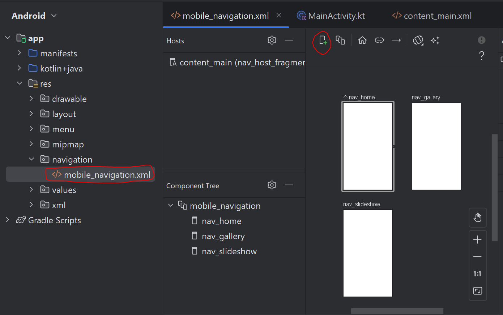

1) Avaa res -> navigation-valikosta mobile_navigation.xml

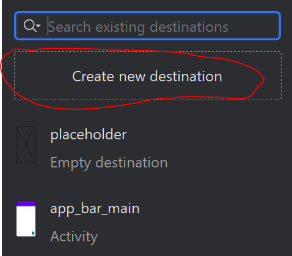

2) Valitse Create New Destination

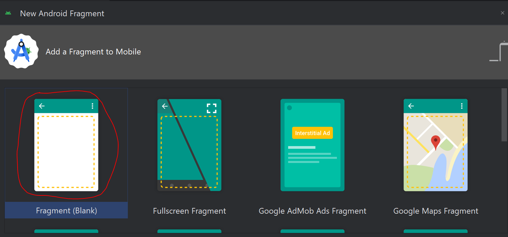

3) Luo tyhjä fragment

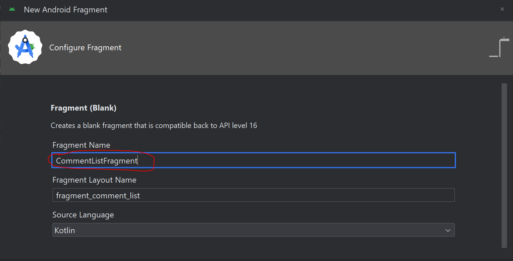

4) Anna fragmentille nimi. Huom, ole tarkka nimeämisen kanssa, koska muuten joudut muuttamaan koodia. Käytä Android Studion ehdottamaa nimeämiskäytäntöä (CamelCase), äläkä vaihda Fragment Layout Namea, vaan anna Android Studion generoida se Fragmentin nimestä.

### Lisätään uusi fragment Navigation Draweriin

Näin pystyt vaihtamaan sivua

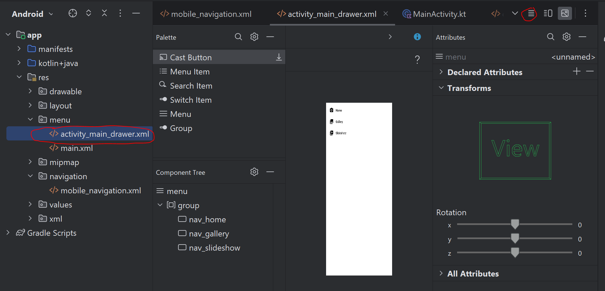

5) Avaa res -> menu -> activity_main_drawer.xml. Avaa sieltä koodinäkymä (ympyröity punaisella oikeassa yläkulmassa)


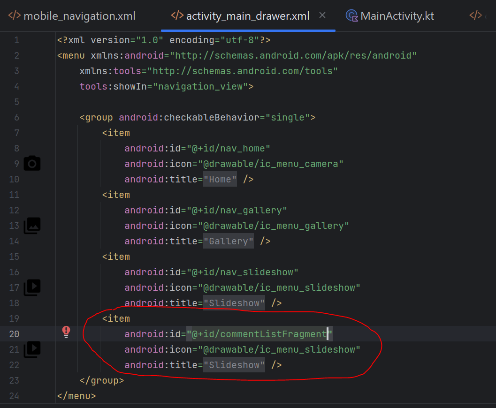


6) Lisätään uusi item viimeiseksi listaan. Varmista, että commentListFragment id löytyy.

```xml
<item
            android:id="@+id/commentListFragment"
            android:icon="@drawable/ic_menu_slideshow"
            android:title="@string/menu_slideshow" />

```


### Testataan uusi fragment

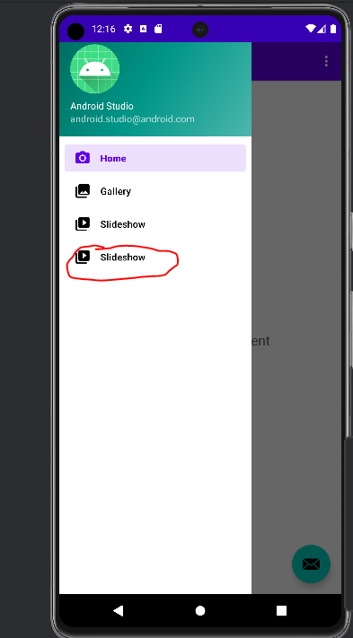

7) Katsotaan, että uusi item näkyy navigation drawerissa


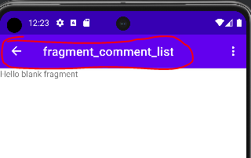

8) ja että sinne pääsee sisään


### Luodaan uusi layout_resource_file yksittäistä kommenttia varten

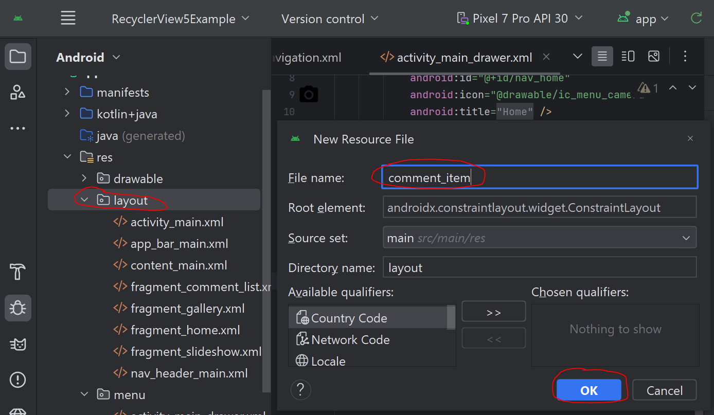

9) Luo uusi Layout Resource File res -> layout-kansioon ja nimeä se esimerkin mukaan

Tämä layout-tiedosto on yksittäisen kommentin komponentti

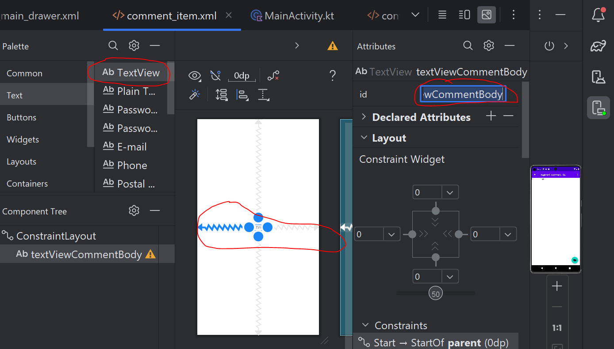

10) Lisää layoutiin designer viewissä yksi textView, voit keskittää sen sekä vaaka- että pystysuunnassa keskelle layoutia. Nimeä sen jälkeen textView uudelleen -> textViewCommentBody.

```xml

<?xml version="1.0" encoding="utf-8"?>
<androidx.constraintlayout.widget.ConstraintLayout xmlns:android="http://schemas.android.com/apk/res/android"
    xmlns:app="http://schemas.android.com/apk/res-auto"
    xmlns:tools="http://schemas.android.com/tools"
    android:layout_width="match_parent"
    android:layout_height="80dp">

    <TextView
        android:id="@+id/textViewCommentBody"
        android:layout_width="wrap_content"
        android:layout_height="wrap_content"
        android:text="TextView"
        app:layout_constraintBottom_toBottomOf="parent"
        app:layout_constraintEnd_toEndOf="parent"
        app:layout_constraintStart_toStartOf="parent"
        app:layout_constraintTop_toTopOf="parent" />
</androidx.constraintlayout.widget.ConstraintLayout>


```

Huomaa, että layout_height on nyt 80dp, koska muuten näytölle mahtuisi vain yksi listaitemi kerrallaan (aiemmin height oli match_parent)

### Lisätään data class kommentin dataa varten


Tämä data class sisältää datan sellaisena kuin se tulisi REST-Apista. Tässä esimerkissä me emme kuitenkaan tee rajapintakutsua, vaan käytämme staattista kommenttidataa 

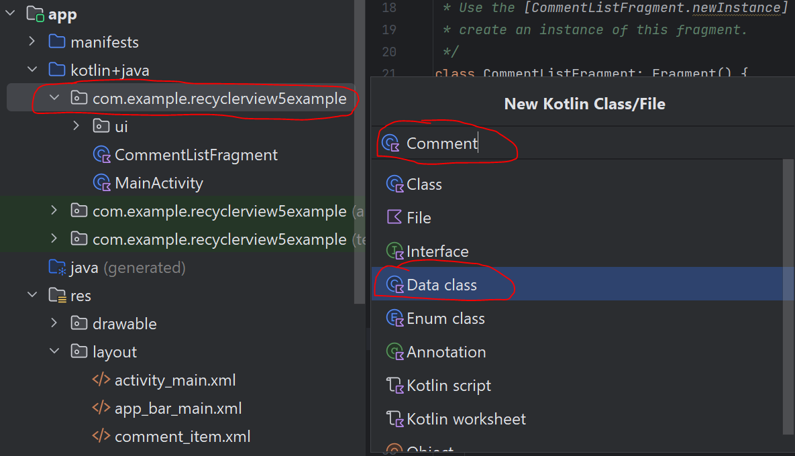

```kt

// lisää tämä Comment.kt-tiedostoon


data class Comment(val id: Int, val body: String)

```


### Lisätään Adapter-luokka listaa varten.

:::info Mikä Adater?

RecyclerViewille pitää kertoa, mistä data tulee ja miten yksittäisen kommentin layoutiin liitetään varsinainen kommenttidata, tämä on adapterin tehtävä

:::

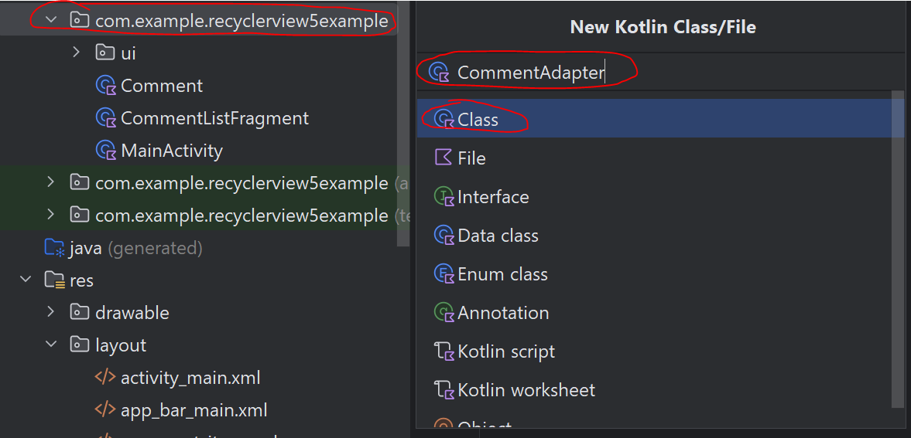

```kt

// Oma RecyclerViewin adapteri nimeltä CommentAdapter, joka vastaanottaa Listan Comment-objekteja
// samalla kytketään CommentHolder-niminen luokka osaksi tätä adapteria (tulee sijaitsemaan
// CommentAdapter-luokan sisällä sisäisenä luokkana (inner class)
class CommentAdapter(private val comments: List<Comment>) :
    RecyclerView.Adapter<CommentAdapter.CommentHolder>() {

    // binding layerin muuttujien alustaminen
    private var _binding: CommentItemBinding? = null
    private val binding get() = _binding!!

    // ViewHolderin onCreate-metodi. käytännössä tässä kytketään binding layer
    // osaksi CommentHolder-luokkaan (adapterin sisäinen luokka)
    // koska CommentAdapter pohjautuu RecyclerViewin perusadapteriin, täytyy tästä
    // luokasta löytyä metodi nimeltä onCreateViewHolder
    override fun onCreateViewHolder(parent: ViewGroup, viewType: Int): CommentHolder {

        // binding layerina toimii yksittäinen comment_item.xml -instanssi
        _binding = CommentItemBinding.inflate(LayoutInflater.from(parent.context), parent, false)
        return CommentHolder(binding)
    }

    // tämä metodi kytkee yksittäisen Comment-objektin yksittäisen CommentHolder-instanssiin

    override fun onBindViewHolder(holder: CommentHolder, position: Int) {
        val itemComment = comments[position]
        holder.bindComment(itemComment)
    }

    // Adapterin täytyy pysty tietämään sisältämänsä datan koko tämän metodin avulla
    // koska CommentAdapter pohjautuu RecyclerViewin perusadapteriin, täytyy tästä
    // luokasta löytyä metodi nimeltä getItemCount
    override fun getItemCount(): Int {
        return comments.size
    }

    // CommentHolder, joka määritettiin oman CommentAdapterin perusmäärityksessä (ks. luokan yläosa)
    // Holder-luokka sisältää logiikan, jolla data ja ulkoasu kytketään toisiinsa
    class CommentHolder(v: CommentItemBinding) : RecyclerView.ViewHolder(v.root),
        View.OnClickListener {

        // tämän kommentin ulkoasu ja varsinainen data
        private var view: CommentItemBinding = v
        private var comment: Comment? = null

        // mahdollistetaan yksittäisen itemin klikkaaminen tässä luokassa
        // kun yksittäistä kommenttia listassa klikataan, suoritetaan onclickListener ja välitetään
        // argumenttinä sille klikattu kommentti (this)
        init {
            v.root.setOnClickListener(this)
        }

        // metodi, joka kytkee datan yksityiskohdat ulkoasun yksityiskohtiin
        fun bindComment(comment: Comment) {
            this.comment = comment
            view.textViewCommentBody.text = comment.body


        }

        // jos itemiä klikataan käyttöliittymässä, ajetaan tämä koodi
        override fun onClick(v: View) {


            Log.d("juhani", "Hei, valitsit: ${comment?.id}")
        }
    }
}

```

### Lisätään fragment_comment_list.xml:ään recyclerview


```xml

<?xml version="1.0" encoding="utf-8"?>
<FrameLayout xmlns:android="http://schemas.android.com/apk/res/android"
    xmlns:tools="http://schemas.android.com/tools"
    android:layout_width="match_parent"
    android:layout_height="match_parent"
    tools:context=".CommentListFragment">

    <androidx.recyclerview.widget.RecyclerView
        android:layout_width="match_parent"
        android:layout_height="match_parent"
        android:id="@+id/recyclerView" />

</FrameLayout>


```

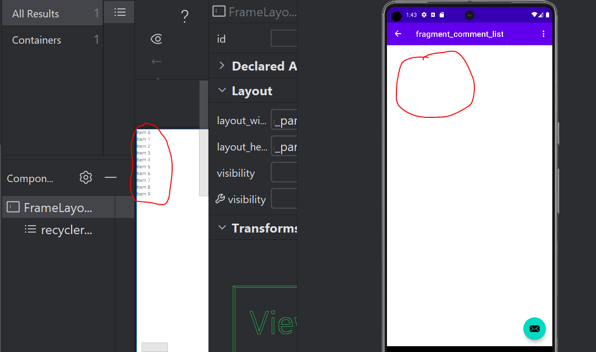

Tämän RecyclerViewin lisäämisen jälkeen Designerissa pitäisi näkyä placeholder recyclerViewille, mutta varsinainen fragment softassa on tyhjä. Softan fragment_comment_list on tyhjä, koska sivulle lisätylle recyclerViewille pitää vielä kertoa, että data tulee CommentAdapterin kautta

### Valmistellaan CommentListFragment-luokka

```kt

class CommentListFragment : Fragment() {
    // käytetään commentlistfragmentin bindinglayeria
    private var _binding: FragmentCommentListBinding? = null
    // koska _binding on nullable,
    // mutta ei käytännössä koskaan null, niin voimme käyttää !!
    // !!jättää null checkin koodarin vastuulle
    // eikä kotlin siksi valita siitä
    private val binding get() = _binding!!

    // adapter on nyt se CommentAdapter jonka loimme aiemmin
    private lateinit var adapter: CommentAdapter
    // linearLayoutManager on androidin layout manager
    // (emme tee sitä itse)
    // käytännössä hyvä listanäkymissä, koska yhdellä
    // rivillä on yksi itemi ja ne ovat kaikki lineaarisesti
    // allekkain
    private lateinit var linearLayoutManager: LinearLayoutManager


    // lateinit tarkoittaa sitä, että muuttuja ei ole nullable
    // mutta sitä ei voida alustaa sillion, kun muuttuja tehdään
    // se alustetaan siis vasta myöhemmin, mutta
    // ensimmäisen alustuksen jälkeen
    // se ei voi koskaan olla null

    override fun onCreateView(
        inflater: LayoutInflater,
        container: ViewGroup?,
        savedInstanceState: Bundle?
    ): View {

        _binding = FragmentCommentListBinding.inflate(inflater, container, false)
        val root: View = binding.root
        // luodaan tyhjä lista commentteja
        val comments = mutableListOf<Comment>()

        // lisätään listaan 1000 kommenttia
        for(i in 1..1000) {
            comments.add(Comment(id = i, body = "kommentti${i}"))
        }

        // aiemmin lateinit var adapter alustetaan tässä
        // ja annetaan parametrinä sille kuuluvat kommentit
        adapter = CommentAdapter(comments)
        // aiemmin lateinit var linearlayoutmanager
        // alustetaan tässä
        // ja kiinnitetään se tähän fragmentiin (context)
        linearLayoutManager = LinearLayoutManager(context)


        // pääsemme bindinglayerin kautta kiinni fragmentin
        // recyclerviewiin
        // kerromme recymclerviewille, että käytetään peruslayoutia (linear)

        binding.recyclerView.layoutManager = linearLayoutManager
        // ja kerrotaa, mistä data tulee ja miltä sen kuuluu
        // näyttää
        binding.recyclerView.adapter = adapter

        // jos haluat luoda gridin (esim. 2 kommenttia rinnakkain yhdellä rivillä)
        // voit luoda gridlayoutin

        return root

    }

    override fun onDestroyView() {
        super.onDestroyView()
        _binding = null
    }
}


```

Nyt puhelimessa näkyy kommentteja. Niitä kaikkiaan 1000 kappaletta, mutta niistä rendataan valmiiksi vain näytöllä näkyvät elementit ja kierrätetään samoja resursseja listaa skrollatessa.

## LISTANÄKYMÄT NYT

Jetpack Composella on sisäänrakennettuna kaksi eri @Composablea tätä tarkoitusta varten. Ensimmäinen on LazyColumn ja toinen on LazyVerticalGrid

### LazyColumn

LazyColumn vastaa LinearLayoutManageria, eli siinä on yksi listaitemi per rivi (Column @Composable kasaa näkymiä ylhäältä alaspäin.)

Lisää ensin tämä


```kt

@Composable
fun CommentList(comments: List<Comment>) {
    LazyColumn() {
        items(comments) {
            Column(
                modifier = Modifier
                    .fillMaxWidth()
                    .padding(8.dp),
                verticalArrangement = Arrangement.Center,
                horizontalAlignment = Alignment.CenterHorizontally
            ) {
                Text(it.body)
            }
        }
    }
}


```

Kutsu sitten CommentsList-composablea Surfacen sisällä

```kt

setContent {
            val comments = remember {
                mutableStateOf(
                    listOf<Comment>()
                )
            }
            var commentsTemp = mutableListOf<Comment>()
            for(num in 1..1000) {
                commentsTemp.add(Comment(id=num, "Comment$num"))
            }

            comments.value = commentsTemp
            
            
            LazyColumnExampleTheme {
                // A surface container using the 'background' color from the theme
                Surface(
                    modifier = Modifier.fillMaxSize(),
                    color = MaterialTheme.colorScheme.background
                ) {
                    CommentList(comments = comments.value)
                }
            }
        }


```

### LazyVerticalGrid

LazyVerticalGrid toimii muuten samoin kuin LazyColumn, mutta VerticalGridille pitää antaa joko sarakkeiden määrä tai sarakkeen leveys, jolloin itemejä listataan rinnakkain niin monta kuin niitä näytölle mahtuu.

```kt

@Composable
fun CommentGrid(comments: List<Comment>) {
    LazyVerticalGrid(columns = GridCells.Fixed(2)) {
        items(comments) {
            Column(
                modifier = Modifier
                    .fillMaxWidth()
                    .padding(8.dp),
                verticalArrangement = Arrangement.Center,
                horizontalAlignment = Alignment.CenterHorizontally
            ) {
                Text(it.body)
            }
        }
    }
}


```

