## Relaatiotietokannat 


 - Relaatiotietokannat perustuvat tietokantatauluihin, joiden rakenne on määritelty
    * määrittely tarkoittaa tietokantataulujen sarakkeiden nimeämistä, sen tietotyypin määrittämistä jne.
    * Relaatiotietokantataulun rakenne on siis strukturoitu, eli tarkkaan etukäteen määritetty
    * vrt. esim. MongoDB collection (vastaa relaatietokannan taulua), joka voi olla strukturoitu, semistrukturoitu tai kokonaan ilman ennakkoon määriteltyä rakennetta

 - Yksittäinen taulu sisältää tietoja vain tietyntyyppisistä kohteista
    * esim. asiakas tai lemmikki
    * Samaan tauluun ei siis tallennetta ensin asiakastietoja ja yhtäkkiä seuraavalle riville lemmikin tietoja
    * kaikkien lemmikkien tiedot tallennetaan omaan tauluun ja asiakkaat omaan tauluun
    * Taulu koostuu riveistä ja sarakkeista niin kuin taulukkolaskentadokumenttikin (Excel)

### MySQL / MariaDB

- MySQL on relaatiotietokantaohjelmisto, joka on saatavilla sekä vapaalla GPL-lisenssillä että kaupallisella linsenssillä
- Alunperin kehittämineet suomalainen Michael "Monty" Widenius ja ruotsalainen David Axmark
- Ensimmäinen versio julkaistu 1996 ja kehitetään edelleen
- Nykyisin Oraclen omistuksessa

- MariaDB ilmestyi, kun MySQL siirtyi Oraclen omistukseen
- MariaDB on MySQL:n avoimen lähdekoodin versioon pohjautuva tietokantapalvelin
- Sama kehittäjä kuin alkuperäisellä MySQL:llä ja on tarkoituksena olla ns. 'drop-in replacement' MySQL:n avoimen lähdekoodin versiolle
    * Käyttäjä ei välttämättä huomaa eroa käyttäessään MySQL:ää / MariaDB:tä


### Relaatiotietokantojen rakenne

- Yksittäinen tietokanta koostuu yhdestä tai useammasta taulusta
 * Periaatteessa voi olla myös tietokanta, jossa ei ole yhtään taulua, mutta sitten tietokantakin on sama poistaa
- Taulut koostuvat riveistä ja sarakkeista
- Taulun sarakkeet ovat ennalta määrättyjä tietokannan suunnitteluvaiheessa
    * Jokaisella sarakkeella on tarkkaan suunnitteluvaiheessa määritetty tietotyyppi, esim. kokonaisluku, merkkijono, päivämäärä ja aika


#### Taulut

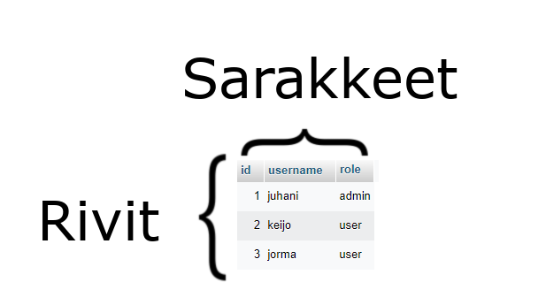

- Tietokannan taulun voi mieltää lähtökohtaisesti Excelin taulukkolaskenta sheetiksi.
    * sekin koostuu riveistä ja sarakkeista
    * Excelissä sarakkeet on nimetty ennakkoon (A, B, C ....jne), mutta relaatiotietokannan taulun sarakkeet määritetään suunnitteluvaiheessa.
    * Excelissä sarakkeeseen voi antaa mitä tahansa tietoa (tekstiä, numeroita yms.), mutta relaatiotietokannassa jokaisella taulun sarakkeella on tarkkaan ennaakkoon määritetty tietotyyppi
        - jos siis määrität username-sarakkeen tietotyypiksi merkkijono, siihen ei kirjoittaa kokonaislukua
- Rivit ovat yksittäisiä tietuita, joita taulun sarakkeet määrittävät
    * Esim. yo. kuvan esimerkissä sarakkeet ovat:
        - id (kokonaisluku)
        - username (merkkijono)
        - role (merkkijono)
    * ja yksittäisen käyttäjän tiedot ovat aina samalla rivillä. Esimerkissä on siis 3 eri käyttäjää


#### Vertailukohtana MongoDB

- Relaatiotietokannassa taulussa on tarkkaan määrätty rakenne (sarakkeiden nimet ja niiden tietotyypit)
    * taulun skeemaan voi kuulua myös muita rajoittavia tekijöitä (esim. unique-indeksi), mutta näistä vasta myöhemmin lisää
- MongoDB:ssä ei ole tällaista tarkkaan määritettyä skeemaa, vaan tietotyypit voivat vaihdella dokumenttien välillä

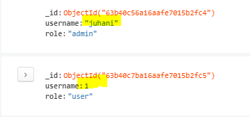

- yo. kuvassa on vastaanlaista käyttäjädataa MongoDB-collectionissa (collection vastaa relaatiotietokannan taulua)
    * huomaa kuvassa keltaisella korostettu username-kenttä: ylemmällä käyttäjällä username on merkkijono, alemmalla se on numero
    * relaatiotietokannoissa tämä ei ole mahdollista, koska jokaisella sarakkeella on tarkkaan määritetty tietotyyppi, ei ole mahdollista sekoittaa eri tietotyyppejä samaan sarakkeeseen
    * MongoDB:ssä tiedon eheyden ylläpitämisestä vastataan koodin puolella, relaatiotietokannassa nämä ovat sisäänrakennettuja ominaisuuksia, eikä niitä tarvitse erikseen koodata


### MySQL:n käyttö koodarin näkökulmasta

- Tiedonhallinta on paljon muutakin kuin pelkästään tietojen hakemista, tallentamista, muokkaamista ja poistoa tietokannasta, mutta tällä opintojaksolla keskitymme enemmän niihin tietokantojen ominaisuuksiin, mitä koodarit tarvitsevat ja jätämme vähemmälle / kokonaan pois tietokantojen hallinnointiin liittyvät asiat (database administrator on ihan oma työnsä, jota pitää käsitellä toisella opintojaksolla)

- Aloitamme tekemällä kyselyjä valmiiseen tietokantaan ja vasta myöhemmin keskitymme tietokannan suunnitteluun
    * Suunnitteluun käytämme MySQL Workbench-sovellusta

### Tuntiharjoitus 1.

:::info Ennakkovaatimukset
Tarvitset tätä varten PHP MyAdmin-sovelluksen. Katso <a href="/softwares/" target="_blank">täältä</a> asennusohjeet, jos et ole sitä jo asentanut
:::

- Avaa PHP MyAdmin
- Kirjaudu opintojakson työtilaan Moodlessa
    * hae materiaaleista git-repositorion linkistä tuntiharjoiuts1.sql ja katso videolta, miten saat sql-tiedostosta tietokannan itsellesi
     
        - Tässä vaiheessa, koska keskitymme kyseyjen tekemiseen, käytämme valmista tietokantaa, jossa on vain yksi taulu


:::info lopputulos
Lopputuloksena sinulla pitäisi olla tietokanta tuntiharjoitus1, jossa yksi taulu: users ja siellä 2 käyttäjää
:::

### SQL-kieli

- Idea relaatiotietokannoista syntyi jo 70-luvulla, jolloin IBM:n insinööri kirjoitti tutkielman siitä, miten relaatiotietokannat voisivat toimia. Silloisissa IBM:n käyttämissä tietokantamalleissa oli omat ongelmansa tallennettavan datan suhteiden mallintamisessa ja tutkielma pureutui tähän ongelmaan. Kesti kuitenkin vielä vuosia ennen kuin tämän tutkielman pohjalta kehitettiin ensimmäinen relaatiotietokanta siinä samalla myös kieli, jolla tuota relaatiotietokantapalvelinohjelmistoa voidaan käyttää

- SQL tulee sanoista Structured Query Language
    * rakenteellinen kyselykieli
    * SQL-kieli on ISO-standardoitu jo vuonna 1986


- Koska SQL-kieli on standardoitu jo vuonna 1986, se on levinnyt käyttöön kaikkiin relaatiotietokanntaohjelmistoihin. Eri relaatiotietokantavalmistajilla (esim. Oracle, Microsoft, yms.) on omat mausteensa, jolla tavoittelevat kilpailuetua, mutta jokaisen valmistajan tuotteet noudattavat 80-luvulla määritettyä standardia. Tätä voisi verrata siihen, että luokallinen ihmisiä puhuu suomea (samaa kieltä = SQL), mutta eri osista Suomea kotoisin olevilla ihmisillä on eri murre. Pienistä, eri murteiden tuomista eroista huolimatta kaikki puhuvat kuitenkin samaa kieltä ja ymmärtävät siksi toisiaan. 

### SQL:n komentoja
    * Keskitymme lihavoituihin, koska niitä koodari tarvitsee eniten.
    * Tutustumme myös commitiin ja rollbackiin

#### DCL (Data Control Language)
- grant (voidaan esim. antaa käyttäjille oikeuksia tietokantoihin)
- revoke (voidan esim. peruuttaa grantilla annettuja oikeuksia)

#### DDL (Data Definition Language)
- create (luodaan tietokanta, taulu, view ym.)
- drop (voidaan poistaa tietokanta, taulu, view ym.)
- rename (voidaan esim. nimetä uudelleen taulu tai taulun sarake)
- truncate (niin kuin drop, mutta tyhjentää, ei poista taulua)


#### TCL (Trnasaction Control Language)

- commit
- rollback

#### DQL (Data Query Language)
- <b>select (haetaan tietokannasta tietoja)</b>

#### DML (Data Modification Language)
- <b>insert (voidaan esim. lisätä rivejä tauluun)</b>
- <b>update (voidaan muokata oo. riviä / rivejä taulussa)</b>
- <b>delete (voidaan poistaa rivi / rivejä taulusta)</b>

### SELECT

- SELECT-lauseella haetaan tietoja kannasta. Select ei muokkaa, lisää, eikä poista tietoja kannasta

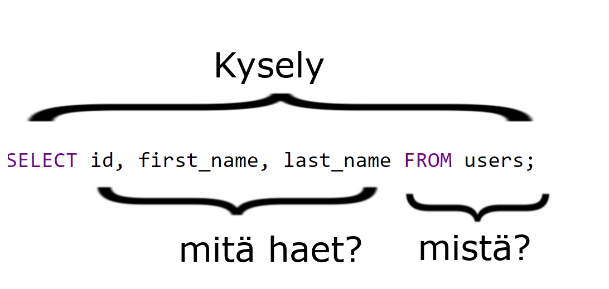

- SELECT-lausekkeessa on aina sama kaava:
    * alkaa avainsanalla SELECT
    * sen jälkeen listataan sarakkeet, jotka halutaan hakea
    * sen jälkeen tulee FROM [taulun nimi]

- jos haluat hakea kaikki sarakkeet taulusta, voit käyttää myös tähteä * merkkaamaan kaikkia sarakkeita

```bash
# tämä sql-lauseke hakee users taulusta kaikki käyttäjät.
# lopputulos on täysin sama kuin yo. kuvan kyselyssä

SELECT * FROM users;

```

:::tip VRT MongoDB

db.users.find()

:::

- Esimerkiksi MongoDB:ssä on yhden rivin hakua varten findOne-funktio, mutta SQL-kielessä ei ole SELECT ONE-avainsanaa vaan ainoastaan SELECT haettiin sitten yhtä tai useampaa riviä. 
- SQL-kielessä haun rajauksen voi tehdä esimerkiksi käyttäen LIMIT-avainsamaa

```bash
    SELECT * FROM users LIMIT 0, 1;
```

:::tip VRT MongoDB
db.users.findOne()
:::

#### LIMIT

LIMIT-avainsana hyväksyy kaksi kokonaislukua
- ensimmäinen on OFFSET eli se, mistä lähdetään liikkeelle
- toinen on ROWCOUNT eli kuinka monta riviä haetaan tulokseen

Esim. <i>SELECT * FROM users LIMIT 0,1</i> hakee ensimmäisen, koska OFFSET on nolla, niin lähdetään ensimmäisestä liikkeelle ja ROWCOUNT on 1, niin haetaan vain yksi


```bash
# ao. rivi hakee toisen käyttäjän, koska OFFSET on 1, hypätään yksi käyttäjä yli

SELECT * FROM users LIMIT 1,1

```

#### WHERE

- WHERE-avainsanalla kyselyyn voi lisätä rajaavia ehtoja
    * rajaavina ehtoina voi käyttää taulun sarakkeita

```bash
    # Haetaan käyttäjä, jonka id-sarakkeen arvo on 1
    # Huom, koska id on perusavain (Primary Key), id:n arvo on jokaselle käyttäjälle yksilöllinen. Tämän kyselyn tuloksena tulee siis vain yksi käyttäjä
    SELECT * FROM users WHERE id = 1

    # haetaan käyttäjä, jonka etunimi on jorma
    # Tämän kyselyn tuloksena voi tulla useita käyttäjiä, koska useammalla ihmisellä voi olla sama etunimi
    SELECT * FROM users WHERE first_name = 'jorma'
```


:::tip VRT MongoDB

Koska yo. esimerkissä <i>SELECT * FROM users WHERE id = 1</i> kysely palauttaa aina vaan yhden käyttäjän, voimme käyttää siinä findOne-funktiota ja <i>SELECT * FROM users WHERE first_name = 'jorma'</i> voi palauttaa useamman tuloksen, joten käytämme siinä find-metodia

:::

```bash
# hetaan käyttäjä käyttäen yksilöllistä _id-saraketta MongoDB-tietokannasta

db.users.findOne({'_id': ObjectId('63b40c56a16aafe7015b2fc4')})

# haetaan käyttäjä(t) jonka / joiden etunimi on jorma

db.users.find({'first_name': 'jorma'})

```

#### OR ja AND

- Ehtoja voi myös yhdistellä käyttäen OR:ia ja AND:ia kuten Pythonissakin

```bash
# Haetaan kaikkien käyttäjien etunimi, joiden etunimi on Matti tai Juhani
SELECT first_name, last_name FROM users WHERE first_name = 'Juhani' OR first_name = 'Matti' 

```

```bash
# Haetaan kaikkien käyttäjien roolit, joiden etunimi on Juhani ja sukunimi Kuru
SELECT role FROM users WHERE first_name = 'Juhani' AND last_name = 'Kuru'
```

:::tip SULUILLA VOIT MUUTTAA EHTOJEN VAIKUTUSTA KYSELYN TULOKSEEN
Hae git-reposta Moodlen kautta tiedonhallinta_harjoitus.sql-tiedosto ja tuo se PhpMyAdminilla koneelle
Suorita seuraavat kyselyt PhpMyAdminissa 
:::

```bash
1. SELECT * FROM employees WHERE first_name = 'juhani' OR last_name = 'kuru' AND department_id = 2 
```

Saamasi tulos voi hieman vaihdella ao. kuvan tulokseta, koska tiedot taulussa voivat vaihdella.

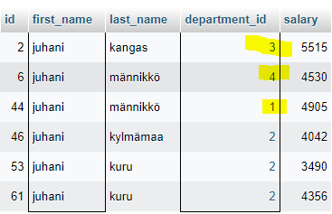

Mutta tuloksessa oleellista on, että saat vastauksena myös muita kuin department_id 2:n työntekijöitä. 

Tämä johtuu siitä, että AND-ehto vaikuttaa vain niihin, joiden last_name-sarakkeessa on kuru (eli tuloksessa kaikki, joiden sukunimi on kuru department_id on 2, mutta tuloksena voi tulla muitakin department_id:n arvoja)

```bash
2. SELECT * FROM employees WHERE first_name = 'juhani' AND department_id = 2 OR last_name = 'kuru' AND department_id = 2 
```

Kun suoritat yo. kyselyn numero 2, se hakee vain department_id 2:n työntekijöitä, joiden etunimi on juhani tai sukunimi on kuru, mutta molemmissa tapauksissa kaikki työskentelevät osastolla #2

```bash
3. SELECT * FROM employees WHERE (first_name = 'juhani' OR last_name = 'kuru') AND department_id = 2;
```

Kyselyllä numero 3 on sama tulos, kuin kyselyllä numero 2, mutta se on lyhempi, koska sulut muuttavat ehtojen tulkintaa


### VERTAILUOPERAATTORIT

- = (yhtä suuri kuin) 
    * huomaa, että ohjelmointikielissä vertailussa käytetään kahta yhtäsuuruusmerkkiä (==) ja sijoituksessa yhtä (=)
    SQL-kielessä yhtäsuuruuden vertailussa käytetään kuitenkin yhtä

```bash
SELECT first_name FROM users WHERE first_name = 'jorma';
```

- eri suuri kuin != tai <>

```bash
    SELECT first_name FROM users WHERE first_name != 'jorma';
    SELECT first_name FROM users WHERE first_name <> 'jorma';
```

- suurempi kuin (>)
- suurempi tai yhtä suurin kuin (>=)
- pienempi kuin (<)
- pienempi tai yhtä suuri kuin  (<=)
- BETWEEN AND

```bash
    # haetaan kaikki työntekijät employees taulusta, joiden palkka on vähintään 3000 euroa ja enintään 5000 kuukaudessa
    SELECT monthly_pay FROM employees WHERE monthly_pay BETWEEN 3000 AND 5000
    # sama kuin 
    SELECT monthly_pay FROM employees WHERE monthly_pay >= 3000 monthly_pay <= 5000
```

- IN
    * NOT IN kääntää hakuehdon

```bash
SELECT * FROM users WHERE id IN (1,2)
# sama kuin
SELECT * FROM users WHERE id = 1 OR id = 2
```

- IS NULL
    * IS NOT NULL kääntää hakuehdon
    * Oletuksena relaatiotietokannan taulujen jokainen sarake on pakollinen tarkoittaen sitä, ettei saraketta voi jättää tyhjäksi! On kuitenkin ihan tavallista, että osa tiedoista on vapaaehtoisia (eli ne voidaan jättää tyhjiksi). Relaatiotietokantataulun sarake pitää erikseen merkata nullableksi, jos sen saa jättää tyhjäksi. Kun taulun sarake jätetään tyhjäksi sen arvoksi tulee NULL
    * NULL arvoa ei voi verrata totuttuun tapaan yhtääsuuruus (=) / erisuuruusoperaattoreilla (!= tai <>) vaan sitä varten on oma vertailu IS NULL / IS NOT NULL

- Kuvitellaan tilanne, että koodaat sivustoa, jossa rekisteröitymislomakkeella kysytään rekisteröityvän käyttäjän siviilisäätyä (profile_information taulussa marital_status-sarake). Koska kaikki eivät halua kertoa siviilisäätyään, käyttäjälle pitää antaa mahdollisuus olla kertomatta, joten marital_status-sarake voi olla nullable, muut vaihtoehdot voivat olla married, divorced, single, not_married

```bash
# emme ole vielä käyneet SQL-kielen sisäänrakennettuja funktiota läpi, 
# mutta COUNT on yksi sellainen. COUNT funktio laskee sarakkeiden lukumäärän
# eli tämä kysely palauttaa käyttäjien määrän, 
# jotka eivät ole halunneet kertoa siviilisäätyään (marital_status on NULL)
SELECT COUNT(id) FROM profile_information WHERE marital_status IS NULL

# tämä taas palauttaa käyttäjien määrän, 
# jotka ovat kertoneet (voi siis olla married, divorced, single tai not_married)
SELECT COUNT(id) FROM profile_information WHERE martial_status IS NOT NULL
```

### SUMEA HAKU

#### LIKE ja %

- LIKE on hakuoperaattori, jota yhdessä %-merkin kanssa voidaan käyttää sumeaan hakuun

```bash
    SELECT first_name FROM users WHERE first_name LIKE 'j%'
```

- hae etunimi users-taulusta kaikilta joiden etunimi alkaa j:llä ja sen jälkeen voi tulla mitä tahansa kirjaimia


```bash
    SELECT first_name FROM users WHERE first_name LIKE '%j%'
```

- hae etunimi users-taulusta kaikilta joiden etunimessä on j-kirjain

#### _ (ALAVIIVA)

```bash
    SELECT first_name FROM users WHERE first_name LIKE '_orma'
```

- kysely hakee kaikki joiden etunimi alkaa millä tahansa kirjaimella ja päättyy orma


### JOINIT
- tähän asti olemme hakeneet tietoja vain yhdestä taulusta kerrallaan. On kuitenkin hyvin yleistä, että SELECT-kyselyyn liitetään useampia tauluja
- tauluja voidaan liittää yhteen erilaisilla JOINeilla:
    * INNER JOIN (tarvii käytännössä joka päivä töissä, jos tekee tietokantojen kanssa hommia)
    * LEFT JOIN (tätäkin tarvii käytännössä joka päivä)
    * RIGHT JOIN
        * sama kuin LEFT JOIN, mutta taulut kyselyssä eri järjestyksessä
        * kaikki relaatiotietokantamoottorit eivät edes tunnista RIGHT JOIN:ia
    * FULL OUTER JOIN
        * en ole milloinkaan tarvinnut oikeasti töissä

Ennen kuin perehdytään tarkemmin erilaisiin JOINeihin, katsotaan, miten eri tauluissa olevat rivit voidaan "liittää toisiinsa"

### Perusavain (Primary Key) ja Viiteavain (Foreign Key)

:::tip Git-repositorio

Hae git-repositoriosta (linkki Moodlen työtilassa) blog.sql-tiedosto ja importaa (tuo) tiedoston sisältö PHPMyAdminilla.

:::

:::tip VRT MongoDB
Esimerkiksi MongoDB:ssä voi tallentaa ns. nestattuja, eli sisäkkäisiä, dokumenttejä) kts. kuva.
:::


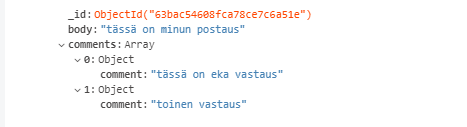

- Yo. kuvassa on täysin toimiva MongoDB:n tietokantaskeema. Siinä blogipostaukseen liittyvät kommentit on tallennettu osaksi postausta. Nestatut dokumentit ovat MongoDB:ssä paljon käytettyjä, mutta relaatiotietokannoissa tällainen skeema ei ole mahdollista, koska relaatiotietokantataulut eivät tue sisäkkäisiä rivejä

- Relaatiotietokannoissa toisiinsa liittyvät datat, jotka eivät kuitenkaan voi olla samassa tietokantataulussa liitetään toisiinsa perus -ja viiteavaimilla

#### Perusavain

:::info
On hyvä muistaa, että aina kun teet uuden tietokantataulun luot sille ensimmäiseksi perusavaimen
:::

- Perusavain on sarake, joka toimii tauluin yksittäisen rivin yksilöllisenä tunnisteena (vertaa MongoDB-dokumentin _id-kenttä)
- Perusavaimen tulee olla yksilöllinen
- Joissakin tapauksissa voidaan käyttää ns. yhdistelmä eli komposiittiavainta perusavaimena, mutta mennään siihen myöhemmin
- Perusavain voi olla myös luonnostaan yksilöllinen tunniste. Käyttäjiä tallennettaessa tällainen voisi olla vaikka henkilötunnus (ei ole olemassa kahta eri henkilö, jolla olisi sama henkilötunnus)
- On kuitenkin parmpi antaa tietokannan huolehtia perusavaimista ja luoda jokaiselle taululle id-kenttä, josta tekee perusavaimen
    * PHPMyAdmin-sovelluksella perusavaimen voi tehdä sarakkeesta antamalla sille tietotyypiksi INT (kokonaisluku) ja täppäämällä A_I-sarakkeen
        * kun teet kokonaisluku-sarakkeesta A_I-kentän, sille tulee automaattisesti Indeksi-sarakkeeseen Primary (Primary-indeksi) tarkoittaa Perusavainta

:::info A_I
AI tulee sanoista Auto Increment ja se tarkoittaa automaattisesti kasvavaa järjestysnumeroa. Kun lisäät ensimmäisen käyttäjän, se saa id-kentän arvoksi 1, toinen saa 2 jne.
Koodarin ei tarvitse itse huolehtia siitä, että järjestysnumero on oikea, vaan AI takaa sen, että päällekkäisyyksiä ei synny ikinä
:::

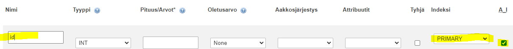

- Ao kuvassa näet tuntiharjoitus1-tietokannan users-taulun rakenteen


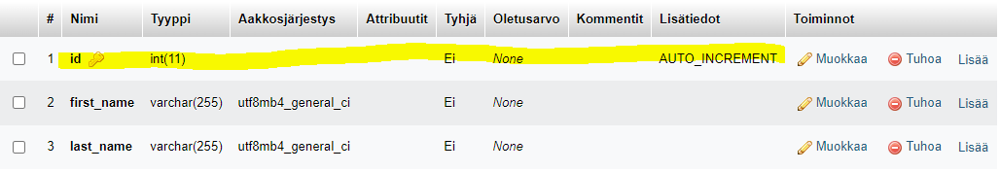

- Nimi: id
    * huomaa keltainen avain kentässä: se tarkoittaa perusavainta
- Tyyppi: INT(11) 11 numeroa pitkä kokonaisluku
- Tyhjä: Ei (Perusavain on aina pakollinen. Kun sarakkeen merkitsee perusavaimeksi, sitä ei voi jättää tyhjäksi)
- Oletusarvo: None (Oletusarvoa ei tarvitse antaa, koska kenttä on AUTO_INCREMENT)
- Lisätiedot: AUTO_INCREMENT (MySQL huolehtii sisäisesti siitä, että id-kentän arvo on aina yksilöllinen)


#### Viiteavain


Tehdään aiemmin näytetty blogipostauksista ja kommenteista nyt uudelleen relaatiotietokantaan sopivalla skeemalla


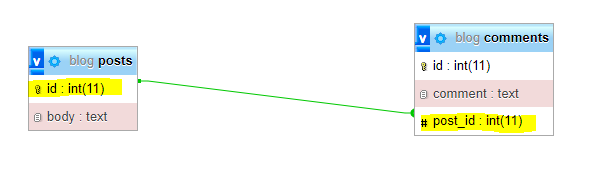

:::info

Koska relaatiotietokantaan ei voi tallentaa sisäkkäistä dataa, kuten aiemmin teimme MongoDB:n esimerkissä, meidän pitää luoda postauksille oma taulu (posts) ja kommenteille oma taulu (comments)
Yo kuvassa näkyy viiva (relaatio) näiden kahden taulun välillä. Se on vedetty posts-tauklun id-kentästä comments-taulun post_id-kenttään
:::

- Tässä yo. esimerkissä comments-taulun post_id-sarake on viiteavain. Tämä viiteavain viittaa posts-taulun id-sarakkeeseen, joka on perusavain. 
- comments-talulussa on siis oma perusavaimensa (id-sarake), comment-tekstikenttä ja post_id-sarake, joka on posts-taulun viiteavain

:::info
Tämä on ns. one-to-many relationship (yhdestä moneen yhteys). Käytännössä se tarkoittaa sitä, että posts-taulun id-kenttä on yksilöllinen (samalla id-sarakkeen arvolla voi olla vain yksi postaus), mutta comments-taulun post_id-sarakkeessa voi olla sama posts-taulun id-kentän arvo usaeamman kerran

Suomeksi: yhdellä blogipostauksella voi olla monta kommenttia

<b>Kun pääsemme suunnitteluosioon, tarkastelemme lähemmin eri relaatiomuotoja, mutta tässä vaiheessa on tärkeää ymmärtää tietokantataulujen väliset yhteydet vain kyselyjen JOINien kannalta</b>

:::

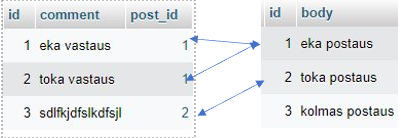

Yo. kuvassa on on kaksi taulua vasemmalla comments-taulu ja oikealla posts-taulu. Taulujen rivit on yhdistetty nuolilla niin, että perusavaimien ja viiteavaimien väliset yhteydet näkyvät

- 1. postauksella on 2 kommenttia (kommentit 1 ja 2)
- 2. postauksella on 1 kommentti (kommentti 3)
- 3. postauksella ei ole yhtään kommenttia

Nyt takaisin JOINEIHIN

### INNER JOIN

:::info Katso kuva INNER JOINista

https://www.w3schools.com/sql/sql_join_inner.asp

:::

- INNER JOIN yhdistää kaksi eri taulua yhteen perus -ja viiteavamilla niin, että avainten täytyy täsmätä

:::info Suomeksi

Kun teemme kyselyn jossa haemme INNER JOINia käyttäen postaukset ja kommentit, emme näe postausta #3 ollenkaan, koska siinä ei ole yhtään kommenttia, mutta näemme postauksen #1 kahdesti, koska siinä on kaksi kommenttia

:::

```bash
SELECT posts.id, posts.body, comments.comment FROM posts INNER JOIN comments ON posts.id = comments.post_id
```

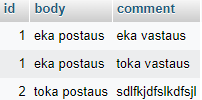

### LEFT JOIN

:::info Katso kuva LEFT JOINista

https://www.w3schools.com/sql/sql_join_left.asp

:::

- LEFT JOIN yhdistää kaksi eri taulua yhteen perus -ja viiteavamilla niin, että JOININ vasemmalla puolella olevasta taulusta haetaan kaikki, vaikka sitä täsmäävää viiteavainta ei olisikaan oikealla puolella olevassa taulussa

:::info Mikä ihmeen vasemalla puolella oleva taulu

LEFT JOINin vasemmalla puolella oleva taulu on se, joka tulee FROM:n jälkeen

:::

Tehdään äskeinen kysely käyttäen INNER JOINin sijasta LEFT JOINia

Nyt näemme 4 riviä, koska niin kuin INNER JOINissakin, 1 postaus tulee kahdesti, koska siinä on kaksi kommenttia. Toinen postaus tulee kerran, koska siinä on 1 komemntti, mutta toisin kuin INNER JOINissa, nämme nyt myös postauksen #3, koska käytämme LEFT JOINia ja posts-taulu on kyselyssä JOINin vasemmalla puolella.

Huomaa, että #3 postauksen kohdalla comment-sarake näyttää NULLia

```bash
SELECT posts.id, posts.body, comments.comment FROM posts LEFT JOIN comments ON posts.id = comments.post_id
```

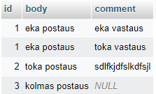

### RIGHT JOIN

Ao. kysely palauttaa täsmälleen saman tuloksen kuin yo. LEFT JOIN-kysely, mutta taulut ovat bvain eri järjestyksessä

```bash
SELECT posts.id, posts.body, comments.comment FROM comments RIGHT JOIN posts ON posts.id = comments.post_id;
```

:::tip LEFT vai RIGHT JOIN

Opettele LEFT JOIN! RIGHT JOINissa ei ole mitään muuta eroa kuin taulujen järjestys. Useimmiten näkee käytettävän LEFT JOINia eikä RIGHT JOIN edes toimi kaikissa relaatiotietokantatoteutuksissa.
RIGHT JOIN ei ole pakollinen, koska sen voi aina korvata LEFT JOINilla

:::

### FULL JOIN

- FULL JOIN hakee kaikki rivit JOINien molemmista tauluista.

:::info
MariaDB ja MySQL eivät tue FULL JOINia. ao. kuvan esimerkki on PostgreSQL:stä
:::

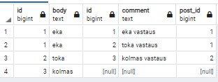

```bash
SELECT posts.id, posts.body, comments.comment FROM posts FULL JOIN comments ON posts.id = comments.post_id;
```

:::info FULL JOIN
En ole itse koskaan tarvinnut FULL JOINia missään softassa töissä
:::

### JOINeista

:::info

JOINin jälkeen tulee taulu, joka halutaan liittää ja sen jälkeen tulee ON, jossa määritetään, minkä sarakkeiden välille yhteys (JOIN) muodostetaan

<i>SELECT taulu1 INNER | LEFT JOIN taulu2 ON taulu1.sarake = taulu2.sarake</i>

:::

- Onko JOIN aina pakko tehdä perus -ja viiteavaimen välille
    * Ei ole. Tietokantataulussa ei kyselyn toiminnan kannalta tarvitse edes olla perusavainta
    * <b>Vaikka perusavainta ei tarvitse, tee se kuitenkin aina, koska sillä on vaikutusta esim. kyselyjen hakunopeuteen ja viite-eheyden automaattiseen ylläpitämiseen</b>

:::tip
Tuo / importaa git-reposta db_without_primarykeys ja suorita ao. kysely
::: 

```bash
SELECT * FROM users INNER JOIN vehicles ON users.email = vehicles.email
```

:::tip Kun liitettävät sarakkeet ovat samalla nimellä, voidaan JOIN-lauseketta lyhentää

Voit käyttää JOINissa ON-avainsanan sijasta USINGia
Tämä onnistuu kuitenkin vain, kun taulujen yhdistämiseen käytetyt sarakkeet ovat saman nimiset, jos sarakkeet ovat eri nimillä, pitää käyttää ON-avainsanaa

:::

```bash
SELECT * FROM users INNER JOIN vehicles USING(email)
```


:::info
yo. kyselyssä liitetään JOIN taulujen email-sarakkeisiin. email voi toimia yksilöllisenä tunnisteena, koska yksi sähköpostiosoite voi olla vain yhdellä ihmisellä kerrallaan. Perus -/ viiteavaimia ei siis tarvita joinien tekemiseen.
Riittää, että sarakkeissa on samat arvot ja kysely toimii halutulla tavalla. 
:::

:::info

Ei ole yhtään hyvää syytä jättää perusavainta tekemättä tietokantatauluun, vaikka kyselyt voivat teknisesti toimia ilman niitä. Tee perusavain aina

Perusavaimen arvo [int(11)] ei muutu ikinä, mutta yo. esimerkissä on mahdollista, että käyttäjän sähköpostiosoite muuttuu. Sähköpostiosoitteen muuttuessa myös siihen viittaavat rivit muissa tietokantatauluissa täytyy päivittää, tai liitos katoaa. 


:::


### ALIAS (AS)

- Kun käytät INNER / LEFT JOINeja ja liität useampia tauluja yhteen, voi olla, että tauluissa on päällekkäisiä sarakkeiden nimiä

```bash

# esimerkiksi tämä ao. kysely antaa virheilmoituksen Column `id` in WHERE clause is ambiguous

SELECT posts.* FROM posts INNER JOIN comments ON posts.id = comments.post_id WHERE id = 1

```

- Tämä siis tarkoittaa sitä, että WHERE-lausekkeen ehdossa käytetty id-sarake on molemmissa tauluissa (sekä posts että comments, eikä MySQL tiedä, kumman taulun id-sarakkeestä on kyse)

- Käytä aina taulun nimeä sarakkeen edessä

```bash
SELECT posts.* FROM posts INNER JOIN comments ON posts.id = comments.post_id WHERE posts.id = 1;
```

:::tip Alias
Joskus taulujen ja / tai sarakkeiden nimet voivat olla aika pitkiäkin ja silloin on hyvä käyttää AS-avainsanaa antamaan alias tauluille

:::

```bash
SELECT p.* FROM posts AS p INNER JOIN comments AS c ON p.id = c.post_id WHERE p.id = 1;
```

- Yo. esimerkissä posts-taululla on alias p ja comments-taululla c Täydet taulujen nimet piti kirjoittaa vain yhden kerran


### SELF JOIN

- SELF JOIN ei ole mikään kolmas JOIN-tyyppi INNERin ja LEFTin lisäksi vaan sillä tarkoitetaan sitä, kun tehdään kysely yhteen tauluun kahdella eri nimellä käyttäen aliaksia

:::tip Git-reposta
Tuo tiedot git-repositorion selfjoin (1).sql-tiedostosta

:::

Haetaan kaikki tiedot asiakkaista, niiltä paikkakunnilta joista on kotoisin vähintään 2 asiakasta

```bash
SELECT * FROM customers AS c1, customers AS c2 WHERE c1.id <> c2.id AND c1.city = c2.city;
```

:::info

yo. kyselyssä on SELF JOIN, eli teemme kyselyn kahdella eri aliaksella yhteen ja samaan tauluun, jotta voimme tehdä taulun sisällä vertailuja

:::


### Tehtävät 1 (palautettava)

:::info Tehtävien palautus
Tehtävät pitää palauttaa Moodlen palautuslaatikkoon nimeltä Tehtävät 1
Palauta yksi (1) txt-tiedosto (huom. ei doc / docx  tms.), vaan esim. tehtavat1.txt
jossa jokainen vastaus on omalla rivillään ao. kuvatussa muodossa

1.1 SELECT ....;<br>
1.2 SELECT ....;<br>
1.3 SELECT ....;<br>

<b>Älä palauta tulosta, koska tulos voi vaihdella, palauta ainoastaan tekemäsi kyselyt yo. muodossa</b>

- Saat jokaisesta kyselystä 1. pisteen, jos se on oikein. Vääristä tuloksista saa 0 pistettä.
- Jos palautus ei ole txt-tiedostossa tai vastaukset ovat väärässä formaatissa, tehtäviä ei arvioida ollenkaan 


:::

- 1.1. Tee kysely, joka listaa kaikki työntekijät
- 1.2. Tee kysely, joka listaa kaikki osastot
- 1.3  Hae 10. työntekijä (voit katsoa 10. id:n arvon ja käyttää id:tä haussa)
- 1.4  Hae viimeisen osaston tiedot (ei tarvitse työntekijöitä) (Voit katsoa viimeisen osaston id-sarakkeen arvon ja käyttää sitä rajaamaan hakua)
- 1.5  Tee kysely, jolla selvität, mikä on 20. työntekijän palkka ja etunimi (voit katsoa 20. työntekijän id:n arvon ja käyttää sitä rajaamaan hakua)
- 1.6  Tee kysely, jolla selvität, mikä department_id on 12. työntekijällä (hae työntekijän id:llä) (tarkoituksena hakea siis pelkästään department_id-sarakkeen arvo)
- 1.7  Tee kysely, joka listaa kaikki työntekijät, joiden sukunimi on kuru
- 1.8  Tee kysely, jolla haet departmentin (id 3) kaikki työntekijät
	- tee kysely pelkästään employees-tauluun käyttäen department_id:tä
- 1.9 Muokkaa ylempää kyselyä niin, että teet INNER JOINin ja käytät nyt WHERE-lausekkeessa ehtona departments.id-saraketta

Voit saada tästä tehtäväpaketista yhteensä 9 pistettä, jos kaikki kyselyt ovat oikein

### KOOSTEFUNKTIOT (AGGREGATE FUNCTIONS)

:::info
Koostefunktiot koostavat nimensä mukaisesti monesta arvosta yhden arvon.

Esimerkiksi AVG()-funktio laskee keskiarvon. Jos ajattelet, miten esimerkiksi todistuksen keskiarvo lasketaan: Laske yhteen kaikkien opintojaksojen arvosanat ja jaa se opintojaksojen lukumäärällä.
AVG siis koostaa useasta arvosanasta yhden luvun

:::

:::tip Importaa git-reoposta tiedonhallinta_harjoius.sql

Jos sinulla ei vielä ole tiedonhallinta_harjoitus-tietokantaa, importaa se nyt

:::

:::tip Koostefunktioiden kanssa kannattaa käyttää aliasta sarakkeiden nimissä

Koostefunktioita käytettäessä tuloksessa sarakkeen nimeksi tulee oletuksena käytetty koostefunktio ja funktion argumenttina käytetty sarake. Aliaksien käyttö parantaa luettavuutta

:::

:::info Koostefunktiot ja WHERE

<b>WHERE-lauseke toimii koostefunktioiden kanssa niin kuin normaaleissakin SELECT-lauseissa. Voit siis rajata WHEREa käyttämällä tulosjoukkoa, johon koostefunktio kohdistuu</b>

HUOM! Et kuitenkaan voi käyttää WHERE-lausekkeessa koostefunktiota

ao. kysely ei toimi

SELECT AVG(salary) FROM `employees` WHERE avg(salary) > 3000 GROUP BY department_id 

koska siinä on WHEREssä AVG-funktio

GROUP BYsta voit lukea tarkemmin täältä kohdasta <a href="#koostefunktiot-ja-group-by">KOOSTEFUNKTIOT JA GROUP BY</a>

Lisätietoja siitä, miten yo. esimerkin kysely saadaan toimimaan, voit lukea täältä kohdasta <a href="#koostefunktiot-ja-having">HAVING</a>

Jos tarvitset koostefunktion tulosta rajaavana ehtona jossakin kyselyssä voit tehdä sen <a href="#alikysely-subquery">alikyselyllä.</a>


:::

#### AVG

- Lasketaan kaikkien työntekijöiden keskiarvopalkka

```bash
SELECT AVG(salary) AS avg_salary FROM employees
```

#### SUM

- Lasketaan kaikkien työntekijöiden palkat yhteen

```bash
SELECT SUM(salary) AS sum_salary FROM employees
```

#### MIN / MAX

- Haetaan kaikkien työntekijöiden joukosta pienin ja isoin palkka

```bash
SELECT MIN(salary) AS min_salary, MAX(salary) AS max_salary FROM employees
```

- Lasketaan pienin ja suurin palkka ainoastaan työntekijöiltä, joiden department_id = 2

```bash
    SELECT MIN(salary) AS min_salary, MAX(salary) AS max_salary FROM employees WHERE department_id = 2
```

#### COUNT

- Lasketaan kaikki työntekijät

```bash
SELECT COUNT(id) AS num_of_employees FROM employees
```

- Lasketaan department_id 2 työskentelevät työntekijät  

```bash
SELECT COUNT(id) FROM employees WHERE department_id = 2;
```

### KOOSTEFUNKTIOT JA GROUP BY

- Koostefunktiot palauttavat oletuksena yhden luvun, mutta tätä oletustoimintatapaa voi muuttaa käyttämällä koostefunktiota yhessä GROUP BY:n kanssa. 

:::info Voit käyttää GROUP BY:ta näin

SELECT COUNT(id) FROM table GROUP BY column

column on mikä tahansa taulussa oleva sarakkeen nimi

:::

```bash
# ao. kysely laskee kaikkien työntekijöiden sijaan työntekijät osastokohtaisesti
SELECT department_id, COUNT(id) AS num_of_emp FROM employees GROUP BY department_id;
```

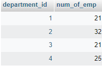

- Yo. kuvassa näkyy työntekijöiden lukumäärä osastoittain, koska käytimme GROUP BYssa department_id-saraketta. Saimme siis yhden luvun sijasta luvun jokaiselle osastolle
- Kun kaikkien osastojen työntekijöiden lukumäärä lasketaan yhteen, saamme tulokseksi 99, joka on kaikkien työntekijöiden lukumäärä


:::info
GROUP BY luo jokaiselle GROUP BYssa käytetylle sarakkeen arvolle oman 'ämpärin', johon rivit lajitellaan. Sitten koostefunktio suoritetaan jokaiselle ämpärille erikseen
:::

:::info
    Kyselyn GROUP BY:ssa voi käyttää useampaa saraketta
:::

```bash
    SELECT AVG(credits) FROM courses GROUP BY name, year
```

### KOOSTEFUNKTIOT JA HAVING

- Tehdään kysely, jolla saat listattua kaikkien osastojen keskiarvopalkat, jos ne ylittävät 4200

```bash
SELECT department_id, AVG(salary) AS avg_salary FROM employees GROUP BY department_id HAVING AVG(salary) > 4200;
```

:::info

HAVING-lausekkeessa voit käyttää koostefunktiota rajaavana ehtona ja HAVING kohdistuu GROUP BY:n 'ämpäreihin'

:::

### SKALAARIFUNKTIOT (SCALAR FUNCTIONS)

Skalaarifunktion voit suorittaa rivikohtaisesti. Koostefunktiot hävittävät ne yksittäiset rivit, joista koostefunktion tulos koostuu, mutta
skalaarifunktion tulos suoritetaan jokaiselle tulosjoukon riville

#### CONCAT

- CONCAT yhdistää kaksi merkkijonoa

```bash
SELECT CONCAT('hello', 'world')
```

#### UPPER

- UPPER muuttaa kirjaimet isoiksi

```bash
SELECT UPPER('hello')
```

#### LOWER

- LOWER muuttaa kirjaimet pieniksi

    ```bash
    SELECT LOWER('hello')
    ```

#### NOW

- NOW palauttaa suoritushetken aikaleiman

```bash
SELECT NOW()
```

#### TIMESTAMPDIFF

- Laskee kahden päivämäärän erotuksen annettuna unitteina

:::info TIMESTAMPDIFF

TIMESTAMPDIFF(unit, date1, date2)

:::
`
```bash
SELECT TIMESTAMPDIFF(HOUR,'2022-02-01','2022-02-21')
```

:::tip Henkilön iän laskeminen

Ikä on sellainen tieto, jota ei kannata tallentaa teitokantatauluun kokonaislukuna, koska se muuttuu koko ajan. 
Kannattaa ennemmin tallentaa syntymäpäivä joko DATE, DATETIME tai TIMESTAMPP-tyyppiseen sarakkeeseen ja laskea ikä siitä käyttäen TIMESTAMPDIFFiä ja NOW-funktiota

:::

### ORDER BY

:::info
ORDER BY-lausekkeella voit vaihtaa tulosjoukon järjestystä
Tämä on hyödyllistä esim. juuri koostefunktioiden tulosten listauksessa, koska koostefunktiot hävittävät yksittäisten rivien id-kentät

ORDER BY toimii näin: ORDER BY column1, column2 ASC | DESC 
:::

- Tehdään yo. kysely, jossa haettiin kaikki osastot, joiden keskipalkka on yli 4200 niin, että järjestetään tulos keskiarvopalkan mukaan


```bash
# oletuksena suunta on ASC eli nouseva, jos sitä ei erikseen määritetä
# nouseva tarkoittaa sitä, että pienin palkka on ylimpänä ja suurin alimpana
# ao. kysely:
SELECT department_id, AVG(salary) AS avg_salary FROM employees GROUP BY department_id HAVING AVG(salary) > 4200 ORDER BY avg_salary

# on siis sama kuin tämä
SELECT department_id, AVG(salary) AS avg_salary FROM employees GROUP BY department_id HAVING AVG(salary) > 4200 ORDER BY avg_salary ASC

# vaihdetaan suunta laskevaksi, eli niin, että suurin palkka on ylhäällä ja pienin alhaalla
SELECT department_id, AVG(salary) AS avg_salary FROM employees GROUP BY department_id HAVING AVG(salary) > 4200 ORDER BY avg_salary DESC
```

### INSERT 

- INSERT-lauseke lisää tietokantatauluun rivin


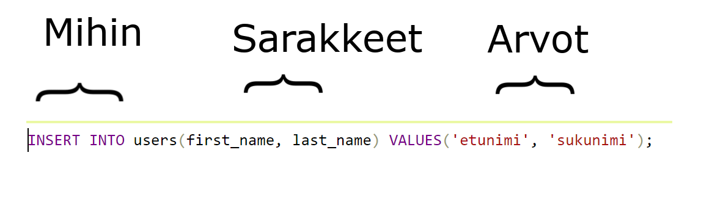

- Huomaa, että users-taulussa on oikeasti 3 saraketta
    * id (kokonaisluku)
    * first_name (merkkijono)
    * last_name (merkkijono)

- insertistä kuitenkin puuttuu id-sarake. Sitä ei tarvitse erikseen merkata, koska id on AUTO_INCREMENT-sarake, joten se lisätään automaattisesti

### DELETE

- DELETE-lauseke poistaa tietokantataulusta rivin / useita rivejä
    * DELETE-lausekkeen rajaava ehto (WHERE määrää sen kuinka monta riviä poistetaan. Jos se jätetään pois, poistetaan taulusta kaikki rivit)


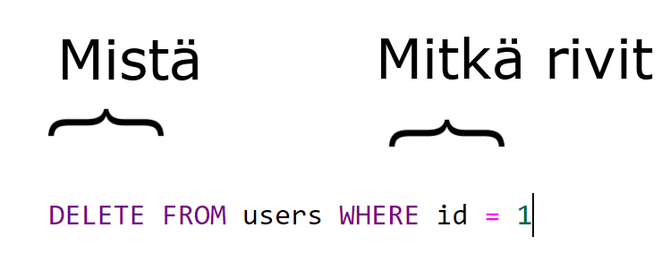

### UPDATE

- UPDATE lauseke päivittää olemassa olevan rivin / useita rivejä tietokannasta annetuilla ehdoilla


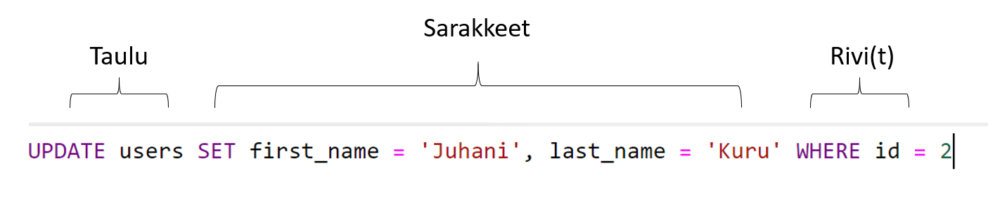

### ALIKYSELY (SUBQUERY)

Alikyselyllä tarkoitetaan kyselyä, joka on toisen kyselyn sisällä. On suositeltavaa käyttää JOINeja alikyselyjen sijasta silloin, kun se on mahdollista. 

- Tarvitset alikyselyä esim. silloin, kun tarvitset rajaavana WHERE-ehdossa jonkun koostefunktion tuloksen

```bash
    SELECT first_name FROM employees WHERE salary > (SELECT AVG(salary) FROM employees)
```

### TEHTÄVÄT 2 (palautettava)

:::info Tietokanta
Harjoitukset tehdään tiedonhallinta_harjoitus2-tietokantaan
Hae se git-repositoriosta ja tuo PHPMyAdminiin
:::

- 2.1 Tee kysely, jolla lasket keskiarvopalkan
    * Tuloksena yksi rivi, yksi sarake
- 2.2. Tee kysely, jolla haet pienimmän palkan
    * Tuloksena yksi rivi, yksi sarake
- 2.3 Tee kysely, jolla haet suurimman palkan
    * Tuloksena yksi rivi, yksi sarake
- 2.4 Tee kysely, jolla haet suurimman palkan sovelluskehitys-osastolta.
    * Kyselyssä pitää käyttää INNER JOINia ja osaston nimeä hakuehdossa
    * Tuloksena riittää yksi rivi, yksi sarake

- 2.5 Tee kysely, jolla haet pienimmän palkan palkat-osastolta
    * Kyselyssä pitää käyttää INNER JOINia ja osaston nimeä hakuehdossa
    * Tuloksena riittää yksi rivi, yksi sarake
    

- 2.6 Tee kysely, jolla haet keskiarvotpalkat osastoittain
    * Tuloksena riittää yksi sarake
- 2.7 Tee INSERT-kysely, jolla lisäät uuden osaston
    * Osaston nimi pitää olla <i>TK-osasto</i>
- 2.8 Tee kysely, jolla haet kaikkien työntekijöiden etu -ja sukunimet sekä osaston nimen jolla he työskentelevät
    * Käytä tässä INNER JOINia
    * Tuloksen sarakkeet: employees.first_name, employees.last_name ja departments.name
- 2.9 Tee kysely, jolla haet niiden osastojen nimet, joilla ei työskentele ketään
    * Ainoa osasto, jolla ei työskentele ketään on 2.7 tehtävässä lisätty TK-osasto
    * Tämän voit tehdä käyttäen LEFT JOInia employees ja departments-taulujen välillä
    * Käytä rajaavana hakuehtona IS-filteriä
    * Tuloksena riittää yksi rivi, yksi sarake (name)
- 2.10 Tee kysely, jolla haet niiden osastojen keskiarvopalkat, joiden keskiarvopalkka on yli 3500
    * Tuloksena riittää yksi sarake (keskiarvopalkka)
- 2.11 Tee kysely, jolla haet työntekijöiden lukumäärän osastoittain
    * Tuloksena riittää yksi sarake (työntekijöiden lukumäärä)
- 2.12 Tee kysely, jolla haet kaikki ne työntekijät,joiden palkka on alle keskiarvopalkan
    * Käytä alikyselyä
    * Tulokseen voi hakea kaikki employees-taulun sarakkeet
- 2.13 Tee kysely, jolla haet kaikki työntekjät, joiden palkka on alle oman osaston keskiarvopalkan
    * Käytä alikyselyä
    * Tulokseen voi hakea kaikki employees-taulun sarakkeet

- 2.14 Tee kysely, jolla haet työntekijän palkan ja listaat viereen keskiarvopalkan
    * Tulokseen riittää kaksi saraketta per rivi
- 2.15 Tee kysely, jolla haet työntekijän palkan ja listaat viereen hänen osastonsa alimman palkan
    * Tulokseen riittää kaksi saraketta per rivi

## TEHTÄVÄT 3 (palautettava)

:::info Tietokanta
Harjoitukset tehdään tiedonhallinta_harjoitus2-tietokantaan
Hae se git-repositoriosta ja tuo PHPMyAdminiin

Palauta tehtävät tässä muodossa

- 3.1 SELECT....;
- 3.2 SELECT ....;

- palauta vain yksi vastaus / kysymys
- älä käytä vastauksen edessä viivaa (-)
- älä laita kysymystä mukaan vastaukseen. Tiedän, mitä missäkin tehtävässä halutaan

Ole tarkkana, että palautat vain ne tiedot, joita pyydetään. Jos haettavia sarakkeita ei erikseen mainita, voit palauttaa kaikki (*)

Jokainen väärin muotoiltu vastaus arvioidaan vääränä

Tästä paketista on jaossa enintään 9 pistettä. Oikein tehdystä kyselystä saa 1 pisteen, muuten 0

:::

- 3.1  Tee kysely, joka laskee jokaisen työntekijän iän (voit käyttää sarakkeesta aliasta age) date_of_birth-sarakkeen perusteella
    * listaa työntekijästä kaikki tiedot employees.* ja lisäksi vielä age-sarake

- 3.2  Tee kysely, jolla lasket keskiarvoiän kaikista employees-taulun riveistä
 * yksi rivi ja sarake riittää

- 3.3 Tee kysely, jolla haet nuorimman työntekijän
    * yksi rivi ja sarake riittää

- 3.4 Tee kysely, jolla haet vanhimman työntekijän
    * yksi rivi ja sarake riittää

- 3.5 Tee kysely, jolla haet nuorimmat työntekijät osastoittain
    * yksi sarake riittää
    * rivejä on yhtä monta kuin osastoakin

- 3.6 Tee kysely, jolla haet työntekijöiden lukumäärän ikien mukaan ryhmiteltynä
    * sarakkeet
        * count (lukumäärä)
        * age (ikä)
    
 

    Tässä esimerkki siitä, miltä tulos näyttää:

    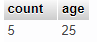

- 3.7 Tee kysely, jolla haet, 30-vuotiaiden lukumäärän palkat-osastolla
    * tuloksena yksi rivi, 3 saraketta
        * 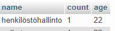
    * käytä rajaavina ehtoina osaston nimeä departments.name ja age-aliasta (age lasketaan date_of_birth-sarakkeen arvosta)
    * departments-taulun yhdistämiseen tarvitset INNER JOINia
    * koska age on funktion tulos, siinä pitää käyttää HAVING-lauseketta
    * group by:ssa riittää pelkkä age, koska WHERE:ssa rajataan jo muut osastot pois
- 3.8 Tee kysely, jolla päivität 2.7 tehtävässä lisätyn TK-osaston nimen TKI-osastoksi
        * käytä rajaavana ehtona name-saraketta
        * idtä ei tarvitse käyttää, koska name-sarake on yksilöllinen (UNIQUE)

- 3.9 Tee kysely, jolla poistat TKI-osaston
    * käytä poistossa rajaavana ehtona name-saraketta.


