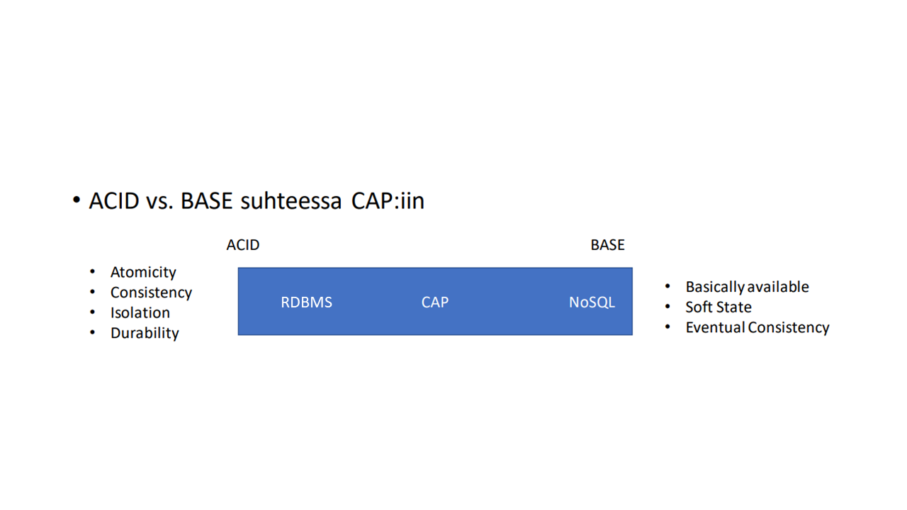
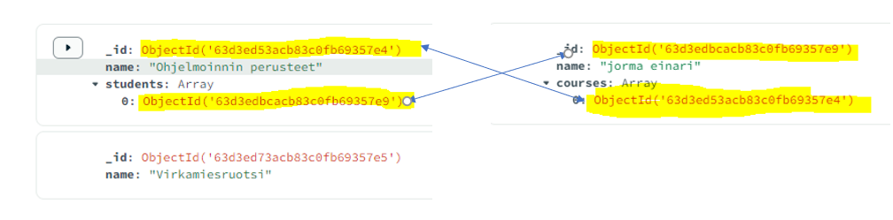

## NOSQL

As a term NoSQL is quite loosely determined, you could think of it as "not just SQL", or everything else but the relational databases.

## How to know what to choose?

### CAP-theorem

CAP theorem's keypoints can help you choose the right database for the job

- Consistency
    * If your application's integrity is critical and changes need to be seen immediately choose relational database
- Availability
    * Every request is responded (meaning the request doesn't end up in an error
- Partitioning tolerance 
    * How well does your system tolerate errors
        * You either rollback all the changes to ensure data integrity
        * or you can let the application to run so that it's basically always available but the data and its integrity might take a hit


    * For example if you have a cloud-based application that encounters a problem on one server, you might redirect all the traffic to another node in another country to ensure availability. The data in that node that's available might not be the latest



### ACID

- Atomicity
    * In a relational database there are so called transactions. There can be multiple queries in one transaction. When you commit the transaction all the queries in it will be executed atomically in a single unit or if just one fails, all will fail
- Consistency
 * Every piece of information is intact and up-to-date
- Isolation
    * Like atomicity, isolation too has to do with transactionss. Isolation determines how different transactions are visible to other transactions
    * Different isolation types are out of scope of this course but jsut remember that isolation guarantees that multiple users can use same app concurrenlty without messing up the data and its integrity in a database
- Durability
    * durability ensures that commited trnasations will be stored permanently


### BASE

- Basic availability
    * Data is practically always available but not necessarilly up-to-date
- Soft State
    * Changes are not atomic, updates can take time 
- Eventual Consistency
    


## MongoDB

+ MongoDB is a good choice for storing unstructured / semi-structured data
+ Fast to use for prototyping if the final schema isn't clear yet
+ Good and flexible aggregation tools

- If you use MongoDB for strictly structured data to replace RDBMS you need to manually implement many features that are built-in in every RDBMS


As you know in a relational database it's not possible to model a n:m relationship without a bridge table but MongoDB provides complex datatypes that enable modeling complex nested data structures. 

 + nested documents
 + arrays
 + nested objects




MongoDB was developed by a company called DoubleClick, an online marketing company, that provided 400000 commercials per second. They could be a lot variations between the contents of the commercials and thus it became hard to maintain and update a relational datbase

With MongoDB horizontal scaling is also quite easy compared to RDBMS

:::info Horizontal Scaling?
With a relational database management system, database tables are inter-linked with different kind of relationships so distributing a database into a cluster of multiple nodes isn't as easy as distributing a MongoDB database that has no relations 

 

:::

:::info Sharding
Sharding is a mechanism that enables distributing large junks of data seemlesly into multiple different servers without user even noticing anything.
User can perform one query and MongoDB takes care of collecting data
:::


### COMMANDS


#### find

:::info

Fetches documents

:::

#### Filteröinti

```js
// finds always start with
db.collection.find()
// db is always the database that user is connected to
// collection is the name of the collection you performs queries on

// for example: let's fetch all the documents  in a user collection
// find without any filtering conditions fetches all the documents

db.users.find()

// the query below fetches all the documents having a role key with the value of 'admin'
// ie. it fetches all the admins in a user collection

db.users.find({role: 'admin'})

// you can combine multiple conditions like so:

db.users.find({role: 'admin', hometown: 'Rovaniemi'})


// with SQL it would be like this.

SELECT * FROM users WHERE role = 'admin' AND hometown = 'Rovaniemi';


// OR goes like this

db.users.find({$or: [
    {role: 'admin'},
    {hometown: 'Rovaniemi'}
]})
// MongoDB has an $or operator that takes an array of conditions as a parameter
// with SQL it would be like this

SELECT * FROM users WHERE role = 'admin' OR hometown = 'Rovaniemi';

// OR & AND combined

db.users.find({eye_color: 'brown', $or: [
    {role: 'admin'},
    {hometown: 'Rovaniemi'}
]})

// SQL

SELECT * FROM users WHERE eye_color = 'brown' AND (role = 'admin' OR hometown = 'Rovaniemi')

db.users.find({$or: [
    {role: 'admin',eye_color: 'brown'},
    {hometown: 'Rovaniemi', eye_color: 'brown'}
]})

// SQL

SELECT * FROM users WHERE (role = 'admin' AND eye_color = 'brown') OR (hometown = 'Rovaniemi' AND eye_color = 'brown')


```

#### Comparison operators

:::info

With MongoDB you cannot use = sign to compare, it's like this: {key: 'value'} and for every comparison operator there's a  keyword in MongoDB
:::


```js
// not equal

db.users.find({last_name: {$neq: 'kuru'}}})

// SQL:

SELECT * FROM users WHERE last_name <> 'kuru'
// or
SELECT * FROM users WHERE last_name != 'kuru'

// greater than / less than / greater than or equals / less than or equals

db.users.find({age: {$gt: 18}})

// SQL

SELECT * FROM users WHERE age > 18

db.users.find({age: {$gte: 18}})

// SQL

SELECT * FROM users WHERE age >= 18

db.users.find({age: {$lt: 18}})

// SQL

SELECT * FROM users WHERE age < 18

db.users.find({age: {$lte: 18}})

// SQL

SELECT * FROM users WHERE age <= 18


```

#### IN ja NOT IN

```js

// in

db.users.find({role: {$in: ['admin', 'user']}})

// SQL

SELECT * FROM users WHERE role IN ('admin', 'user')

// not in

db.users.find({role: {$nin: ['admin', 'user']}})

// SQL

SELECT * FROM users WHERE role NOT IN ('admin', 'user')

```

#### IS NULL / IS NOT NULL

```js

// With MongoDB, because of flexible schema, a key value pair can be null or the key can be omitted complitely

// is null is not null

// hair_color-kenttä exists but it's not set
db.users.find({hair_color: null})

// hair_color exists and it's set
db.users.find({hair_color: {$ne: null}})

// key exists but it's value makes no difference
db.users.find({hair_color: {$exists: true}})

// the key doesnt exist
db.users.find({hair_color: {$exists: false}})

```

#### How to SELECT keys in a document

:::info

MongoDB find() returns all the keys in all the documents that match the query conditions.

So there's no SELECT but find funtion's second projection argument can be used as a SELECT statement in SQL

:::

```js

// fetch only first_name keys in users collection
db.users.find({}, {first_name: 1})

// SQL

SELECT first_name FROM users;

// fetch first_name and last_name of every admin

db.users.find({role: 'admin'}, {first_name: 1, last_name: 1})

// alternatively you can mark only the keys you don't want to be fetched

// fetch all but last_name

db.users.find({}, {last_name:0})


```
#### LIMIT

```js

db.users.find().skip(1).limit(1)

// SQL

SELECT * FROM users LIMIT 1,1
```
With MongoDB you can use findOne

#### INSERT

You can use insertOne or insertMany

```js

// insert one document

db.users.insertOne({first_name: 'new user'})

// lisätään yhdellä kertaa useampi dokumentti 

db.users.insertMany([{
    first_name: 'first'
}, {
    first_name: 'second'
}, {
    first_name: 'third'
}])

// SQL

// separately

INSERT INTO users(first_name) VALUES('new user')

// batch insert

INSERT INTO users(first_name) VALUES('first'), 
                                    ('second'), 
                                    ('third');

```

insertOne and InsertMany return an object containing the objectID-fields of the newly added documents


#### UPDATE


The first argument of updateOne and updateMany is the collection of filtering conditions just like in find and the second argument states, what keys to update

:::info

With MongoDB you can set new keys using update because the schema is flexible

:::

```js

// this updates the brown-eyed hair_long to true

db.users.updateMany({eye_color: 'brown'}, {$set: {hair_long:true}})

// SQL

UPDATE users SET hair_long = 1 WHERE eye_color = 'brown';

// update only one document

db.users.updateOne({_id: ObjectId('63e362b9415552734e896049')}, {$set: {role: 'admin'}})

// SQL

UPDATE users SET role = 'admin' WHERE id = 1;


```

#### DELETE

deleteMany removes the documents matching the filtering conditions deleteOne removes one document


```js
// remove all the users
db.users.deleteMany({})

// SQL

DELETE FROM users;

// remove all the moderators

db.users.deleteMany({role: 'moderator'})

// SQL

DELETE FROM users WHERE role = 'moderator';

// remove only one

db.users.deleteOne({_id: ObjectId('63e362b9415552734e896049')})

// SQL

DELETE FROM users WHERE id = 1;


```

## KEY FEATURES OF MONGODB

### DOCUMENT MODEL

MongoDB collections consist of documents. It might be easier for a developer to understand the data models compared to complex relational models

### SCHEMA-LESS DESING

MongoDB documents can consist of multiple embedded documents and multiple complex datatypes such as arrays

### SHARDING

Sharing large data and spreading it across multiple machines


## DATA MODELING

### FLEXIBLE SCHEMA

- The structure and datatypes can differ inside one collection across documents
- Flexible schema makes modifying structure fast
- It's easier to model real-world entities compared to relational databases

### DOCUMENT STRUCTURE

MongoDB allows modeling relational data as embedded documents. It's possible to embed documents in a field or an array within another document.
This way you can retrieve data in a single database operation

### REFERENCES

References store relationships between data by including links from one document to another, much like primary key / foreign key relation in a relational database


### ATOMICITY

MongoDB can ensure single document atomicity. If your update query affects multiple documents, each of the documents will get updated atomically but the operation as a whole is not atomic

### DATA USE AND PERFORMANCE

If your app will mostly use recently inserted data, consider using capped documents. Then on the other hand, if there's a lot of reading from database, consider indexing fields that get used often in queries.

#### CAPPED COLLECTIONS

Capped collections are of fixed size. Once the limit has been reached, the oldest documents get deleted making room for newer documents

:::info Rolling update

Remember rolling update ETL, that always removes the oldest rows and keeps only a certain amount of data
:::

## OPREATIONAL FACTORS AND DATA MODELS

### EMBEDDED DATA MODEL

All related data is combined in a single embedded document instead of normalizing data across multiple smaller documents


### MULTI-DOCUMENT TRANSACTIONS

Data models that store references across multiple documents, operations that affect relative data, require multiple queries, because there are no joins in MongoDB. These can be very costly performance-wise. In many cases it's more efficient to stick to embedded document model

:::info

In many cases, if you find yourself using MongoDB like a relational database, you should change to relational database

:::

### INDEXES

You can use indexes to improve query performance. Build indexes on fields that appera often in queries and for all operations that return sorted results. _id field is automatically indexed

- Each index requires space atleast 8kb
- Indexing has a negative impact on write operations, because indexes need to updated


### LARGE NUMBER OF COLLECTIONS

It might be good idea to distribute a large number of documents across multiple collections, for example by type. Let's say you have many iot sensors that produce same kind of measurements, but others are humidity sensors and other temperature sensors. It might be good to make these into different collections

Generally having a large number of collection doesn't affect performance negatively

### COLLECTION CONTAINING MANY SMALL DOCUMENTS

You should consider "rolling up" smaller documents by grouping them logically and thus creating larger embedded documents.
Rolling up reduces random disk access and can use indexing more effectively

:::info

"However, if you often only need to retrieve a subset of the documents within the group, then "rolling-up" the documents may not provide better performance. Furthermore, if small, separate documents represent the natural model for the data, you should maintain that model."

:::

### STORAGE OPIMIZATION FOR SMALL DOCUMENTS

- use _id field explicitly
    * MongoDB creates and indexes _id field automatically, if you have multiple small documents, it takes up a lot of space
    * Provide manually a unique _id value that is of another type than ObjectId

- Use shorter field names
    * MongoDB always stores every field name in every document, so making names shorter can save space
    * This is something that should never affect usability and readability


## MODELING ONE-TO-ONE

```json

{
    "username": "juhani",
    "address": {

        "street": "Jokiväylä, 11",
        "zip_code": 96300,
        "city": "Rovaniemi"
    }
}

```

## MODELING ONE-TO-MANY

```json

{
    "username": "juhani",
    "addresses": [{

        "street": "Jokiväylä, 11",
        "zip_code": 96300,
        "city": "Rovaniemi"
    }]
}

```

### SUBSET PATTERN

With the embedded document model there is a pontential problem of documents growing in size. Instead of fetching all the embedded documents, you can fetch only the once you need, ie. a subset of documents.

:::info What to load
When considering what to load, the most visited parts of your data, should be loaded first
:::

#### TRADE-OFFS OF SUBSET PATTERN

Subset pattern can improve query performance by making smaller documents, but it can lead to data duplication

For example in a e-commerce platform, where you always want to show 10 newest reviews for each product. It might be a smart move to store reviews in a collection of their own and in addition to that keep store the then newest reviews for each product in products collections. 

This makes querying 10 newest reviews faster, but you will need to maintain product reviews in two different collections

## MODELING WITH RELATIONS

```json


{
    // book
    "_id": "3wl4kj34",
    "name": "MongoDB",
    "publisher_id": "WSOY"
}

{
    // publisher
    "_id": "WSOY",
    "name": "WSOY",
    "founded": 1900
}


```

### MODELING TREE STRUCTURES

#### WITH PARENT

```json

{
    "name": "Juhani",
    "parent": "Heikki"
}

{

    "name": "Heikki",
    "parent": null
}


```
#### WITH CHILDREN

```json


{
    "name": "Heikki",
    "children": ["Jukka", "Juhani"]
}

```

### AGGREGATION PIPELINE

Aggregation pipline consists of one or more stages

#### STAGE

Stage in an aggregation pipeline is an operation and a pipeline has many of them

:::info Stages

For more detailed list of pipeline stages, see here: https://www.mongodb.com/docs/manual/reference/operator/aggregation-pipeline/#std-label-aggregation-pipeline-operator-reference

:::

<table>
    <thead>
        <tr>
            <th>Stage</th>
            <th>Desc</th>
        </tr>
    </thead>
    <tbody>
        <tr>
            <td>$addFields</td>
            <td>You can add fields in every document in the result set for example based on another column in a document</td>
        </tr>
        <tr>
            <td>$project</td>
            <td>You can leave obsolete field out of the resutl set (I might be a good thing to not select _id fields, because aggregation leaves them out</td>
        </tr>
        <tr>
            <td>$match</td>
            <td>Can be used like WHERE in SQL query to filter out documents that you don't use</td>
        </tr>
        <tr>
            <td>$group</td>
            <td>Works like SQL GROUP BY. Needs a accumulative field for aggregatation </td>
        </tr>
        <tr>
            <td>$avg</td>
            <td>Calculates average based on the columns provided in $group stage</td>
        </tr>
        <tr>
            <td>$sum</td>
            <td>Can be used just like $avg in a group stage but instead of course calculates sum </td>
        </tr>
    </tbody>
</table>

### ABOUT STAGE ORDER

SQL language is very strict about word ordering and the order of execution is not the same as the order of words in SQL clause. MongoDB aggregation pipeline stages are executed as they are ordered. For example if you only want to calculate AVG of a certain subset of documents, first, filter all the others out and then calculate AVG to more effective execution


