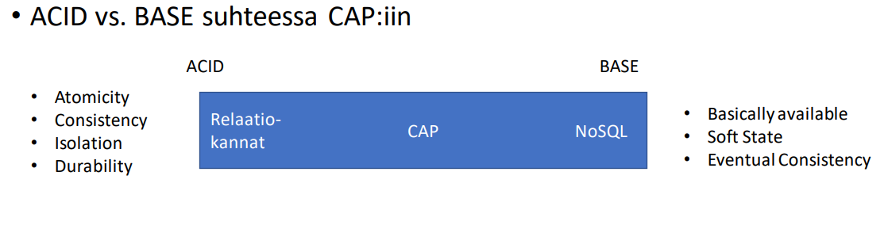

# DATAN LAADUN VARMISTAMINEN

## CAP-TEOREEMA

CAP-teoreema tulee sanoista Consistency, Availability ja Partition Tolerance, eli data <strong>eheys, saavutettavuus ja vikasietoisuus</strong>

### EHEYS

Tiedon eheys tarkoittaa sitä, että tieto on aina ajan tasalla ja oikeassa muodossa

### SAAVUTETTAVUUS

Yksinkertaistettuna saavutettavuuden voi kiteyttää siihen, että jokainen palveluun lähetetty pyyntö päättyy onnistuneeseen vastaukseen virheen sijaan.

### VIKASIETOISUUS

Vikasietoisuudella kuvataan sitä, miten tietokanta / sovellus käyttäytyy vikatilanteissa ja miten niistä selvitään. Tiedon eheys ja saavutettavuus ovat tiukasti yhteydessä vikasietoisuuteen. 

Esimerkiksi pankkien tietojärjestelmissä eheys on kaikki kaikessa. Jos pankin tietojärjestelmässä havaitaan virhe, on turvallisempaa estää kaikilta käyttäjiltä pääsy järjestelmään virheellisten tilisiirtojen estämiseksi. Tässä tapauksessahan saavutettavuus ei ole huipussaan.

Toisaalta taas Facebookin tilapäivitykset ovat vähemmän tärkeitä kuin pankkien tilisiirrot. Facebookiin pääseminen käytännössä aina on tärkeämpää kuin tiedon ajantasaisuus. Tässä tapausessa saavutettavuudella on isompi painoarvo kuin tiedon eheydellä.

## ACID VS BASE 




### ACID

ACID tulee sanoista Atomicity, Consistency, Isolation ja Durability. Relaatiokannat toteuttavat ACIDin periaatteita

#### ATOMICITY

Atomisuus tarkoittaa sitä, että tietokantakyselyt tapahtuvat yhtenä atomisena yksikkönä täysin samanaikaisesti. Siis esimerkiksi kaksi eri UPDATE-lauseketta voi tapahtua atomisesti yhtenä yksikkönä tai sitten, esim virheen sattuessa, molemmat perutaan.

Postgressä on käytössä ns. Multi-version Concurrency Control (MVCC), joka mahdollistaa monien yhtäaikaisten transaktioiden (kylseyjen) suorittamisen ilman, että ne häiritsevät toisiaan tai niiden tiedot menevät ristiin. Jokainen transaktio käsittelee snapshotia datasta.

Käytännössä SQL-kyselykielen tasolla atomisuus näkyy ao. esimerkin kaltaisesti

```sql
-- begin aloitaa transaktion
BEGIN;

-- beginin ja commitin välissä olevat sql-lausekkeet suoritetaan atomisesti

UPDATE account SET balance = balance - 100 WHERE customer_id = 1;
UPDATE account SET balance = balance + 100 WHERE customer_id = 2;

-- commit suorittaa molemmat ylläolevat update-lausekkeet atomisesti
-- transaktio päättyy

COMMIT;


```

Yo esimerkissä on kaksi UPDATE, joista ensimmäinen vähentää asiakkaan 1 saldoa 100 eurolla ja toinen vastaavasti kasvattaa asiakkaan 2 saldoa samalla 100 eurolla. Asiakas tekee siis tilisiirron toiselle. Tässä transaktio (alkaa BEGIN-komennolla ja päättyy COMMITiin) huolehtii siitä, että molemmat näistä update-komennoista suoritetaan samanaikaisesti ja ne molemmat onnistuvat tai ongelmatilanteessa kumpaakaan ei suoriteta. 

Tämä siis takaa sen, että asiakkaalta 1 ei vain katoa 100 euroa ja toinen asiakas ei koskaan vastaanota niitä.


#### CONSISTENCY

Postgre ja muutkin relaatiotietokantasysteemit käyttävät monia erilaisia rajoitteita (constraints) estämään virheellisen datan lisäystä tietokantaan. Näitä ovat vanhat tutut perus- ja viiteavaimet, UNIQUE-rajoite ja CHECK-rajoite.

#### ISOLATION

Isolation tarkoitaa transaktioiden eristyneisyyttä, siis sitä, että useat samanaikaiset kyselyt eivät häiritse toisiaan ja mene sekaisin keskenään Postgressa on useita eri eristyineisyyden tasoja (level of isolation)

- Read Uncommited 
    * tällä tasolla eri transaktiot näkevät commitoimattomia muutoksia
    * ei kannata käyttää, koska isolation ja atomisuus menevät tällä tasolla hukkaan

:::info Miksi Read Uncommited-tasoa ei kannata käyttää?

Atomisuus ja isolation ovat relaatiokantojen kulmakiviä. Jos nämä ominaisuudet otetaan pois päältä käyttämällä read uncommited isolation leveliä, olisi sama vaihtaa jo nosql-tietokantaan
:::

- Read Commited
    * tällä tasolla transaktiot eivät pysty lukemaan kommitoimattomia muutoksia
    * jos asiakas A lukee sellaisen rivin, jota toinen asiakas B on muokkaamassa, asiakas A näkee vanhan tiedon

- Repeatable Read
    * tämä taso on REad Commited-tasosta seuraava ja Read commited-tason ominaisuuksien lisäksi Repeatable Read takaa, että sellaista riviä, jota ollaan lukemassa ei voi muuttaa toisesta transaktiosta. Kysely voi palauttaa kyllä uusia rivejä, jos esim. toinen transaktio lisää tauluun, jota olet lukemassa, uusia rivejä, mutta niitä ei voi muokata

- Serializable
    * Tällä tasolla transaktiot vaikuttavat tapahtuvat peräkkäin (serially), vaikkakin ne olisi tehty samanaikaisesti (concurrently) toisesta transaktiosta.


Tehdään esimerkkitransaktio ja katsotaan, miten ne käyttäytyvät eri isolation leveleillä

```sql

BEGIN;
SELECT * FROM test_table;
WAITING FOR DELAY '00:01:00';
SELECT * FROM test_table;
COMMIT;

```

Tässä esimerkissä haetaan kaikki rivit kaikkine sarakkeineen taulusta test_table
Sen jälkeen odotetaan yksi (1) minuutti ja suoritetaan sama kysely uudellen. Huomaa, että molemmat kyselyt ovat saman transaktion sisällä

- Read Commit
    * Toinen selet-lauseke näkee aina uuden datan. Jos toinen transaktio (toinen asiakas) muokkaa, lisää tai poistaa taulusta rivejä tuon minuutin aikana, toinen select näkee ne muutokste

- Repeatable Read
    * Toinen select-lauseke palauttaa ainakin ensimmäisen select-lausekkeen rivit muuttumattomina, mutta tulos saattaa sisältää esim. uusia rivejä, joita on lisätty minuutin aikana toisessa transaktiossa

- Serializable
    * Koska transaktiot tapahtuvat peräkkäin, toinen select-lauseke näkee tasan saman tuloksen kuin ensimmäisessäkin select-lausekkeessa. Mikään muu transaktio ei voi muuttaa taulun rivejä minuutin aikana, koska yo. transaktio on vielä kesken.


#### DURABILITY

Postgre huolehtii vikasietoisuudesta käyttäen Write-Ahead Loggingia (WAL). WAL-mekanismi kirjoittaa käytännössä logiin muutokset ennen kuin ne muutokset tehdään. Jos muutoksien aikana tapatuu virhe, voidaan WAL-logista palauttaa viimeisin eheä tilanne.


### BASE

BASE-periaate tulee sanoista Basic Availability, Soft State ja Eventual Consistency. NoSQL-tietokannat ovat CAP-teoreeman näkökulmasta enemmän kallellaan BASEn suuntaan kuin ACIDin suuntaan. 

#### BASIC AVAILABILITY

Järjestelmä / tietokanta on käytännössä aina saatavilla. Esimerkiksi Facebookin tapauksessa, missä käyttäjien tilapäivitykset eivät _välttämättä_ ole hirveän tärkeitä, voidaan järjestelmä pitää saatavilla vikatilanteissakin. Tilapäivitykset eivät välttämättä ole ajantasalla, mutta Facebookiin pääsee käytännössä aina. 

Toisaalta taas pankkien järjestelmät ovat poissa käytöstä huoltokatkojen yms. aikana, koska siellä tiedon oikeellisuus ja ajantasaisuus on saatavuutta tärkeämpää.

#### SOFT STATE

Soft state-termillä on kaksi merkitystä. Sillä voidaan tarkoittaa käytäntöä, jossa tietokannan tila voi muuttua käyttäjän sitä muuttamatta. Tällaisia esimerkkejä voivat olla esim. Rediksen TTL (Time To Live) ja Influxin - aikasarjatietokannan - retention policyt, joiden avulla voidaan automaattisesti poistaa vanhoja aikaleimoja influx-tietokannasta.


:::info Rediksen TTL?

Redis on avain-arvo NoSQL-tietokantaratkaisu, jota on hyvä käyttää esimerkiksi välimuistina nopeuttamaan hakuja. Rediksen avaimille voi antaa luontihetkellä TTL:n (Time To Live). Jos esimerkiksi haluat cachettaa jonkin tiedon tunniksi kerrallaan, voit määrittää avaimen automaattisesti poistettavaksi tunnin jälkeen sen luontihetkestä. Sinun ei siis tarvitse itse käydä poistamassa (tai tehdä skriptiä poistoa varten) vanhoja tietoja tunnin välein. 

:::

Toisaalta Soft Statella tarkoitetaan sitä, että tiedot ovat <i>lopulta saatavilla</i>. Päivitys ei välttämättä näy kaikille heti (toisin kuin relaatiotietokannan tilan muutokset näkyvät kaikille transaktion päättymisen jälkeen). Tällä on sama tarkoitus kuin BASE:n Eventual Consistencylla


#### EVENTUAL CONSISTENCY

Soft Staten toinen merkitys ja Eventual Consistency tarkoittavat käytännössä samaa. Siis sitä, että tiedot ovat lopulta ajantasalla ja eheitä, mutta eivät välttämättä heti. Tässäkin tullaan siihen, että tiedot ovat joko aina saatavilla, mutta eivät välttämättä aina ajantasaiset tai sitten tiedot eivät ole aina saatavilla, mutta varmasti ajantasalla ja oikein silloin, kun ovat saatavilla.


