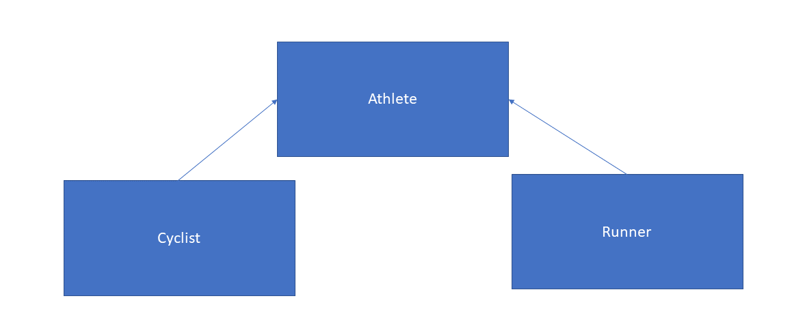
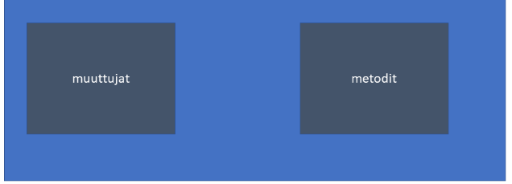

# KERTAUS

:::tip Miten tämä sivu vastaa opintojakson tavoitteita?

Ei suoraan mitenkään, mutta käyttämämme arkkitehtuurit ja suunnittelumenetelmät pohjautuvat hyvin pitkälle olio-ohjelmoinnin peruspilareiden päälle. Niiden osaaminen on <strong>todella tärkeää</strong>, jos arvioidaan koodin uudellenkäytettävyyttä ja siisteyttä

:::

Kerrataan olio-ohjelmoinnin perusperiaatteita

:::info Miksi olio-ohjelmoinnin perusperiaatteita?

Käymme opintojaksolla läpi esimerkkejä useista eri frameworkeista eri kielillä. Kaikki opintojaksolla käyttämämme ohjelmointikielet ovat olio-ohjelmointikieliä.

Kaikkien frameworkien (frameworkista ja ohjelmointikielestä riippumatta) ominaisuudet pohjautuvat samoille hyvän ohjelmistokehityksen perusperiaatteille.

Kun sisäistät nämä perusperiaatteet ymmärrät web-ohjelmointiframeworkien toimintaperiaatteet ja näin voit oppia minkä tahansa frameworkin

:::

:::warning Huom!

Sivun koodiesimerkit ovat yksinkertaistettuja, eivätkä kaikki toimi sellaisenaan (osa esimerkeistä vaatii ulkoisten ajureiden asentamista).

Esimerkeistä on riisuttu kaikki ylimääräinen pois, jotta asian ydin tulisi selväksi

:::


## INHERITANCE (PERIYTYMINEN)

Periytyminen olio-ohjelmoinnnissa tarkoittaa sitä, että pystymme käyttämään perivissä luokissa yläluokan ominaisuuksia toistamatta koodia kaikissa perivissä luokissa aina uudelleen. 

```py

class Athlete:

    # constructor-metodi on Pythonissa nimeltään __init__
    def __init__(self, first_name, last_name):
        self.first_name = first_name
        self.last_name = last_name

    # tämä greeting-metodi on ainoastaan yläluokassa
    def greeting(self):
        print(f'Hello my name is {self.first_name} {self.last_name}')

# yläluokka laitetaan Pythonissa luokan perään sulkuihin
class Runner(Athlete):
    def __init__(first_name, last_name):
        # kutsutaan tässä Athlete-superluokan / yliluokan __init__-metodia
        super(Runner, self).__init__(first_name, last_name)
    
    # vaikka runner-luokassa ei ole greeting-metodia,
    # pystymme käyttämään sitä, koska saamme sen perintönä Athlete-luokalta
    def run(self):
        self.greeting()
        print("I'm running")


class Cyclist(Athlete):
    def __init__(first_name, last_name):
        # kutsutaan tässä Athlete-superluokan / yliluokan __init__-metodia
        super(Runner, self).__init__(first_name, last_name)
    
    # samoin täällä. Koska Cyclist perii Athlete-luokan,
    # voimme käyttää greeting-metodia kuin se olisi Cyclist-luokkaan tehty
    def cycle(self):
        self.greeting()
        print("I'm cycling")

```

Yo. esimerkissä meillä on kolme luokka, Athlete, Runner ja Cyclist joista Athlete on Runner- ja Cyclist-luokkien yläluokka. Koska luokat perivät Athlete-luokan, pystymme käyttämään Athlete-luokan greeting-metodia ja jäsenmuuttujia first_name ja last_name toistamatta koodia Runner- ja Cyclist-luokissa



## POLYMORPHISM

Polymorfismi eli monimuotoisuus kulkee perinnän kanssa käsi kädessä. Yo. kuvassa jokainen pyöräilijä on urheilija sekä jokainen juoksija on urheilija, koska molemmat luokat perivät Athlete-luokan. Katsotaan polymorfismista toinen esimerkki

```py

class Shape:
    # koska Shape on abstrakti (siis mikä tahansa muoto)
    # emme pysty laskemaan sille pinta-alaa suoraan täällä
    def area():
        raise Exception("area method not implemented")

# kuutio on mluoto, koska se perii Shape-luokan
class Cube(Shape):

    # annetaan kuution konstruktorille sen molempien sivujen pituudet
    def __init__(self, side1, side2):
        self.side1 = side1
        self.side2 = side2
    
    # tässä on kuution pinta-alan laskukaava
    def area(self):
        return self.side1 * self.side2

# myös ympyrä on muoto
class Circle(Shape):
    # vaaditaan konstruktorissa ympyrän säteen mitta
    def __init__(self, r):
        self.r = r
    
    # tässä ympyrän pinta-alan laskukaava
    def area(self):
        return math.pi*self.r**2


```

Esimerkissä area-metodi on polymorfismia käytännössä. Sekä kuutio että ympyrä ovat muotoja, mutta molemmilla pitää olla oma metodi pinta-alan laskemiselle, koska ne lasketaan aivan eri tavoin.

## ENCAPSULATION

Encapsulation tarkoittaa sitä, että luokka paketoi sisälleen muita muuttujia ja metodeja. 



```py

class Car:
    def __init__(self, make, model):
        self.make = make
        self.model = model
    
    def ignite(self):
        print(f"igniting {self.make} {self.model}")
    
    def accelerate(self):
        print("wrooom...-!")
    

class Driver:
    def __init__(self, fname, lname):
        self.first_name = fname
        self.last_name = lname
    
    # koska drive-metodi ottaa parametrina Car-luokan instanssin (paketin)
    # on siinä paketoituna kaikki Car-luokan metoditkin 
    # ja voimme kutsua niitä drive-metodissa
    def drive(self, car):
        print(f"Hi I'm {self.first_name} and I'm driving {car.make} {car.model}")
        car.ignite()
        car.accelerate()
    


driver = Driver("juhani", "kuru")
toyota = Car("toyota", "corolla")


# drive-metodille tarvitsee antaa vain yksi parametri
driver.drive(toyota)


```

Yo. esimerkissä Car-luokan instanssi on toyota, joka annetaan parametrinä Driver-luokan drive-metodille. Koska car-muuttuja enkapsuloi sisäänsä kaikki Car-luokan metodit ja muuttujat, voimme käyttää niitä Drive-luokan drive-metodissa ihan normaalisti

Jos emme käyttäisi enkapsulointia, joutuisimme välittämään drive-metodille yhen sijasta useamman parametrin

## ABSTRACTION

Abstraktointi olio-ohjelmoinnissa tarkoittaa käytännössä sitä, että esim. metodia voi kutsua tietämättä, miten se on konkreettisesti toteutettu

:::tip tä?

Jos osaat ajaa autoa tietämättä, miten sen moottori ja voimansiirto toimii, käytät hyväksesi abstraktiota. Tässä tapauksessa riittää, että tiedät, miten kaasua, jarrua, vaihteita ja muita auton hallintalaitteita käytetään. Ne ovat API auton moottoriin ja voimansiirtoon - asioihin, joita ilman et voi ajaa autoa, mutta sinun ei tarvitse tietää, miten ne on toteutettu.

:::

```py

class DataSource:
    def read(self):
        raise Exception("read method not implemented")
    
    def write(self, data):
        raise Exception("write method not implemented")


def TxtFileSource(DataSource):
    def __init(self, filepath):
        self.filepath = filepath
    
    def write(self, data):
        with open(self.filepath, 'w') as _file:
            _file.write(data)
    
    def read(self):
        with open(self.filepath, 'r') as _f:
            return _file.readlines()

def PostgresDbSource(DataSource):
    def __init__(self, connection_str):
        self.connetion_str = connection_str
    

    def read(self):
        with psycopg.connect(self.connection_str) as conn:
            with conn.cursor() as cur:
                return cur.execute("SELECT * FROM users").fetchall()
    

    def write(self, data):
        with psycopg.connect(self.connection_str) as conn:
            with conn.cursor() as cur:
                cur.execute("INSERT INTO users(first_name, lastname) VALUES(%s, %s)"
                , (data['first_name'], data['last_name']))

                cur.commit()


# kutsutaan eri datasourceiden metodeja

text_file = TxtFileSource("testi.txt")

text_file.write("tämä rivi kirjoitetaan testi.txt tiedostoon")
rows_in_text_file = text_file.read()

db = PostgresDbSource("dbname=test user=postgres")

db.write({'first_name': 'juhani', 'last_name': 'kuru'})

rows_in_db_table = db.read()


```

Yo. esimerkissä read- ja write-metodit ovat abstraktioita. Molemmat luokat perivät DataSource-luokan, joten niihin voidaan kirjoittaa ja niissä olevat tiedot voidaan lukea. 

Koska tietokantatauluun rivin lisääminen ja tiedostoon rivin lisääminen sekä tietokantataulun sisällön lukeminen ja tiedoston sisllön lukeminen eroavat konkreettisesti toisistaan hyvin paljon, pitää molemmille luokille tehdä omat toteutukset

Kuitenkin kutsuttaessa molempien luokkien read-metodeja niiden käyttö on täysin samanlaista, vaikka datalähde ja niiden sisäinen toteutus ovat aivan erilaisia. 

Myös molempien luokkien write-metodien käyttö on täysin samanlaista (molemmat ottavat yhden parametrin), vaikkakin write-metodien data-parametri on toisessa merkkijono ja toisessa dictionary.

read- ja write-metodit siis ovat abstraktioita joita pystyy käyttämään täysin samalla tavalla tietämättä niiden konkreettista toteutusta.

:::info

Yo. esimerkissä käytetään myös jo tutuksi tulleita periytymistä ja polymorfismia. Itseasiassa juuri periytyminen ja polymorfismi mahdollistavat read- ja write-metodien konkreettisen toteutuksen abstraktoinnin. 

:::


