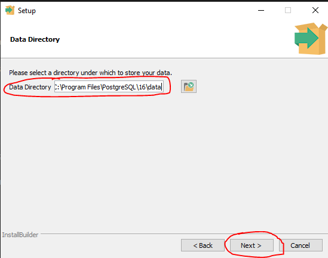
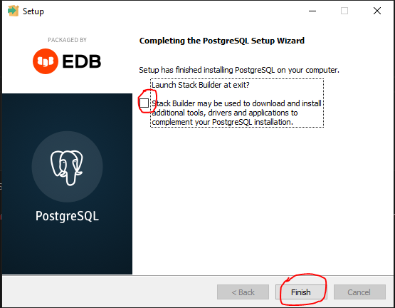

# SOFTAT

## Postgres

1) Mene osoitteeseen: https://www.postgresql.org/download/
2) Valitse itsellesi sopiva käyttöjärjestelmä

:::info Nämä ohjeet koskevat Windows-asennusta
Jos sinulla on Mac, ja tarvitset asennuksessa apua, ota yhteyttä

:::

3) Valitse avautuvalta sivulta Download the installer

4) Valitse avaultuvalta sivulta uusin PostgreSQL:n versio

:::info Versio 16.x

Materiaalien luontihetkellä se on 16.1, mutta voit valita uudemman, mikäli sellainen on saatavilla. Valitse kuitenkin versio 16 

:::

### PostgreSQL:n asennus

Latauksen jälkeen voit käynnistää asennusohjelman

1) Valitse ensimmäisestä ikkunasta Next

2) Valitse asennuspolku ja paina Next

3) Valitse asennettavaksi kaikki ohjelmat

- PostgreSQL Server
    * itse tietokantapalvelin
- PgAdmin 4
    * graafinen työkalu yo. palvelimen hallinnointiin
- Stack Builder
    * työkalu työkalujen ja liitännäisten hallintaa varten
- Comman Line Tools
    * komentorivityökalut

4) Valitse Next 

5) Kirjoita <b>helppo salasana, jonka varmasti muistat</b>

6) Pidä oletusportti ja paina Next

7) edellisen kohdan jälkeen avautuu koostesivu, jonka voi ohittaa. Tämän jälkeen alkaa asennus, ja asennuksen jälkeen aukeaa ao. sivu

Ota ruksi pois kentästä "Launch Stack Builder at exit? ja valitse Finish

## XAMPP

:::tip Lataa XAMPPin uusin versio täältä
https://sourceforge.net/projects/xampp/files/

Valitse käyttöjärjestelmäsi ja lataa asennuspaketti.
:::

XAMPP tulee sanoista 
- X: Cross Platform (saatavilla Windowsille, Linuxille ja Macille) 
- A: Apache (Web-palvelin) 
- M (MySQL / MariaDB) 
- P (PHP) 
- P (Perl)

Emme käytä XAMPPia tällä opintojaksolla muuten kuin siihen, että saamme MySQL Workbenchilla tehdyt tietokantasuunnitelmat siirrettyä Postgres-palvelimelle.

Tulemme tekemään jonkin verran yksinkertaisia ohjelmia, mutta käytämme niihin Pythonia, emme PHP:tä tai Perliä.

Voit ladata XAMPPin version täältä https://www.apachefriends.org/

:::info Tarkista, onko koneellasi jo vanhempi XAMPP:n versio

Jos käytät koulun konetta, tai olet aiemmin tehnyt vaikka WordPress-sivuston, on mahdollista, että koneellasi on jo XAMPP asennettuna. Jos olet vasta asentanut XAMPP:n voit käyttää sitä, mutta jos, varsinkin koulun koneella, on vanhempi versio, kannattaa se poistaa ensin 

:::

### Vanhemman version poisto Windowsilla

- Jos käytät koulun konetta, älä poista vanhempaa versiota, koska jonkun toisen työt voivat mennä hukkaan!!!

- Avaa Add & Remove Programs / Lisää & Poista Sovelluksia
- Etsi XAMPP ja poista se

### Asennus Windowsille

- Avaa aiemmin lataamasi asennuspaketti

    * Voit saada ensimmäinen kuvan mukaisen varoituksen

    

* Valitse Next

* Katso, että asennat kuvasta korostetut valinnat ja paina Next

* Valitse asennuspolku

* Voi olla, että saat ao. kuvan kaltaisen varoituksen, jos koneella on aiempi versio XAMPP:sta.

* Ainoastaan, jos käytät omaa konettasi, etkä tarvitse vanhoja koodeja enää, voit poistaa kyseisen kansion, mutta jos tarvitset niitä vielä, tai käytät koulun konetta, älä poista kansiota, vaan valitse toinen 

* Valitse kieleksi englanti

* Jatka asennusta

* Kun asennus on valmis, varmista, että avaa Control Panel-ruksi on valittu ja paina Finish

### Käynnistys

- Kun asennus on valmis, voit avata XAMPP Control Panelin. Käynnistä sekä Apache ja MySQL

- Kun painat start sekä Apachen että MySQL:n kohdalta, niiden pitäisi käynnistyä ongelmitta

* Jos sinulla on ongelmia Apachen käynnistyksen kanssa, se johtuu todennäköisesti siitä, että portti 80, johon Apache käynnistyy, onkin jo varattu
* Vaihda porttin näin:

    

    * Valitse Apachen kohdalta config-valikosta httpd.conf ja avaa se
    * Hae avautuvasta tiedostosta Listen 80 -riviä. Tämä tarkoittaa sitä, että Apache pyrkii avautumaan ja kuuntelemaan porttia 80
    * Vaihda portti vaikka 8080
    * Tallenna muutos ja yritä käynnistää Apache ja MySQL uudelleen

### phpMyAdmin

- Avaa selain
- Kirjoita osoiteriville: http://localhost/phpmyadmin
    * Jos Apachesi käyttää porttia 80, tuo yo. osoite riittää
    * Jos kuitenkin vaihdoit portin vaikka 8080, osoite pitää olla muotoa http://localhost:8080/phpmyadmin

## MySQL Workbench

- MySQL Workbench on tietokantojen suunnittelutyökalu, jota käytämme tällä opintojaksolla

### ASENNUS

- MySQL Workbenchin voi ladata täältä  https://www.mysql.com/products/workbench/
    * valitse download now
    * ei kannata asentaa recommended downloads-kohdasta koko pakettia vaan katso kohtaa other downloads
    * valitse avautuvalta sivulta no thanks, just start my download

- Asenna MySQL Workbench seuraamalla ohjeita

:::info MySQL Workbench & Postgres

MysQL Workbenchilla tehdyt fyysiset mallit eivät mene sellaisenaan Postgres-tietokantaan. 

:::

