# SQL AND RELATIONAL DATABASES

In 1970 a computer scientist from IBM published a paper about relational model that introduced a new way of modeling data storages. It was about cross-linked tables of data. Tables would consist of rows and columns.

Think of a database as an Excel file and each of the sheets in that file as a database table

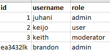

<i><small>Example of a list of users in an excel sheet</small></i>

Much like an Excel sheet contains rows and columns, a database table too contains rows and columns


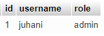

<i><small>Same kind of an example in a database table</small></i>

With the exception that in an Excel sheet you can basically store what ever kind of data (numbers, strings, etc.) but the database table's columns are strictly structured and each column has to have a name, data type (integer, string, boolean etc.) and other constraints 


Here in a database table the id cannot be a random string of characters because the column type is marked as INT (11) which is a 11 numbers long (max) integer

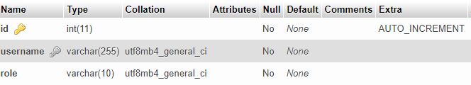

:::info Datatypes and constraints

We will learn more about different datatypes and column constrains further down the road

:::

Here in the example image above we have a relational database table called users. There are three columns in the table called (id, username and role)

### Who names the database tables?

it's the designers / developers responsibility

### How to pick the table names and what becomes a table and what becomes a column of a table?

There's not a definitive answer to this question. Short answer is it depends on the business requirements. Longer answer: When somebody asks you what the application, you are designing, is supposed to be doing, if you write your answer down and pick up the nouns they (the nouns) are either tables or columns in a table. The verbs are the actions (methods).

<i>Verbs are not important at the point when you are thinking of a database design. Consentrate on the nouns for now</i>

:::info For Example

<i>"Users login to the system using username and password. Other info saved about each user are firstname, lastname and email"</i>

:::

In the example above the nouns are <i>User</i>, <i>username</i>, <i>password</i>, <i>firstname</i>, <i>lastname</i> and <i>email</i>

There users is the name of the table and other nouns are all features of a user so they are the columns of the table.


### How to know what info can be saved into one table and what into a separate table?

Well this too is one of those things that depend on the requirements but a rule of thumb is that <strong>always create a new table for different kind of data.</strong> For example user's social security number is strongly descriptive data of a certain user so it can be a column of the users table

But on the other hand user's address is something that should be saved into a separate table...Address is a feature of a house rather than of a user. 

It's true that each user has an address but it's not a strong relation (as social security number is) but rather a weak relation and thus should be stored in a separate table.

:::info Weak Relation?

Weak relation, like between a user and user's addreess is something where the one can exist without the other. For example a user can live without an address and the address doesn't cease to exist if the user dies.

:::

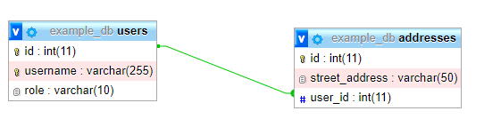

<small><i>As stated in the relational model design paper, a relational database is a collection of inter-linked tables</i></small>

<strong>There are actually certain rules regarding database design and how to structure and group data. That part of the design flow is called normalization, but more on that later</strong>

Relational database design patterns and their rules are quite absract to start from, it's easier to start with SQL language


:::tip Remember this

a relational database is a collection of inter-linked tables. A table contains columns. A column has a fixed data type. If its datatype is string you cannot insert an integer value into it.

:::


## MySQL / MariaDB
 
- MySQL is a relational database system that is both GPL-licensed and commerially licensed. Originally developed by a finnish Michael "Monty" Widenius and a swedish David Axmark

- First version published in 1996 and is still actively maintained and developed. 

- Is owned by Oracle nowadays

- MariaDB was published when Oracle bought MySQL. MariaDB is based on the open source version of MySQL

- MariaDB has the same developer as the original MySQL had and thus it is supposed to be a 'drop-in' replacement for MySQL

## SQL

:::tip Before you start learning SQL

1) Install <a href="/softwares/#wampserver">WampServer</a>
2) Go to Moodle, open Git repository link and download tiedonhallinta_harjoitus.sql file
3) Import SQL file using PHPMyadmin
    * we will go thru all of this together


:::

Structured Query Language is the language that relational database management systems understand. It was ISO standardized in 1986. Different manufactures, like Oracle and Microsoft spice-up their own products by adding non-standardized features into them but having been standardized nearly 40 years ago is advantageous compared to multiple NoSQL products on the market. 

:::info

It's like speaking slightly different dialects of the same language

:::

It's understandable that SQL as a highly structured language isn't suitable for different modern use cases and there's a reason why NoSQL choices are ever more popular but if you have a problem with your SQL query, I can guarantee you can find the answer on the internet.

### COMMANDS

#### DCL (Data Control Language)

- grant
     * used to grant privileges to users for databases
- revoke
    * used to revoke those privileges

#### DDL (Data Definition Language)

- create
    * to create databases, tables views, etc.
- drop
    * to delete databases, tables vies, etc.
- rename
    * to rename a table or a column of a table
- truncate
    * like delete but deletes all the contents without deleting the datbase / table itself

#### TCL (Transaction Control Language)

- commit
    * to commit executed changes into a database table
    You can for example insert multiple rows in a table and then commit all of them atomically so that all 4 rows get added at once
- rollback
    * the opposite of commit: so if one those 4 inserts fail you can rollback all of them. So either all succeed or all fail

#### DQL (Data Query Language)
- select
    * most used command. Used to query data from the database

#### DML
- insert
    * can be used to insert a new row into a database table
- update
    * can be used to update an existing row in a database table
- delete
    * can be used to remove row(s) from a database table


### SELECT

SELECT command is used to fetch data from database table(s)

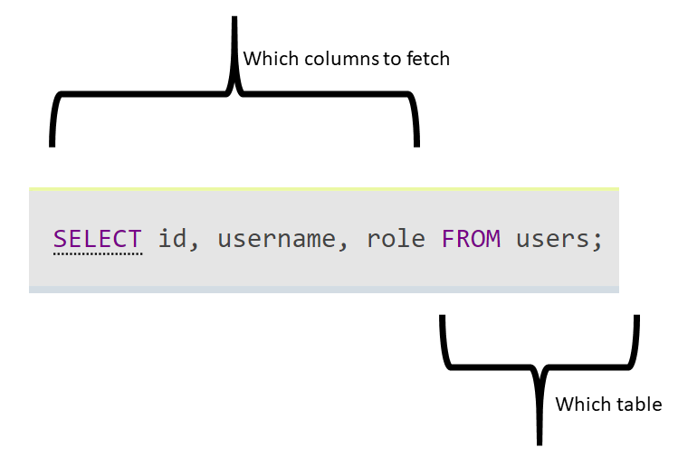


```sql

-- if there are a lot columns and 
-- you want to fetch them all 
-- you can use *

SELECT * FROM users;

```

The above query fetches all rows from users table. SQL language doesn't have a separate command for fetching only one row (or X rows for that matter). That's what LIMIT is for

#### LIMIT

Limit is a handy command to limit the number of rows fetched by the query. It can for example be used for pagination. 

Limit consists of two different variables OFFSET AND ROWCOUNT

but OFFSET can be omitted. If it's omitted it's default value is 0

```sql

-- this query fetches only one row from the users table

SELECT * FROM users LIMIT 1;

-- it's same as this

SELECT * FROM users LIMIT 0,1;

-- the query below fetches 10 rows jumping over the first 10 rows. 
-- Think of it as the second page of users where there is ten users 
-- / page

SELECT * FROM users LIMIT 10, 10;


```

#### WHERE

Using <i>WHERE</i> keyword you can filter the search result. You can use table columns as filtering conditions


```sql
-- this query fetches the user whose id column's
-- value is 1

SELECT * FROM users WHERE id = 1;

```

:::info What is that id column
In transactional databases it's normal to use an integer column as a so called primary key column. Primary key is a unique identifier with the help of which rows with same kind of data can uniquely be identified.

For example if you have two customers with exactly same first and lastnames, the id column might be the only column separating these two customers

It has no business value but it's there to ensure data integrity
:::

```sql
-- this query fetches all users whose first_name column value is 'juhani'

-- notice that in SQL strings are in single quotes

SELECT * FROM users WHERE first_name = 'Juhani';

```

#### AND and OR

The conditons in WHERE clause can also be combined using AND / OR 


```sql
-- Let's fetch all the users whose firstname is either 
-- Juhani or Matt

SELECT first_name, last_name FROM users WHERE first_name = 'Juhani' OR first_name = 'Matt';

```

```sql

-- let's fetch all the users whose firstname is Jack
-- and lastname is Black

SELECT * FROM users WHERE first_name = 'Jack' AND last_name = 'Black';

```

:::info Brackets and conditions

You can  change order or execution using brackets.

:::

:::tip Before the next step

Remember to start up WampServer and go to PhpMyAdmin. The easiest way to open PhpMyAdmin is to click the green Wamp Server icon and choose PhpMyAdmin from the popup menu

:::

:::tip We were supposed to go trough this togeter in the class

But since I'm sick again, here are instructions for you

Open PhpMyAdmin and tiedonhallinta_harjoitus database. If you don't have that database yet, read instructions in this page: https://help.one.com/hc/en-us/articles/115005588189-How-do-I-import-a-database-to-phpMyAdmin- to import 

You can skip straight to step #4 because the database will be created during the import automatically

:::


Let's execute a couple of queries in the tiedonhallinta_harjoitus database

```sql
-- example 1.

SELECT * FROM employees WHERE first_name = 'juhani' OR last_name = 'kuru'

```

Keep in mind that your result might differ from the one in the picture below

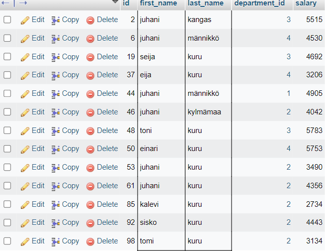

But all of them have either first_name of Juhani or last_name of Kuru

```sql
-- example 2

SELECT * FROM employees WHERE first_name = 'juhani' OR last_name = 'kuru' AND department_id = 2;

```

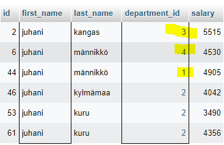

If you look closely the rows missing from the second result set are the rows with ids: 19, 37, 48 and 50. What is different with these rows getting them excluded from the result set?

<table>
    <thead>
        <tr>
        <th>Id</th>
        <th>first_name</th>
        <th>last_name</th>
        <th>department_id</th>
        <th>reason</th>
        </tr>
    </thead>
    <tbody>
        <tr>
            <td>19</td>
            <td>seija</td>
            <td>kuru</td>
            <td>3</td>
            <td>first name isn't juhani and even if lastname is kuru the department isn't 2</td>
        </tr>
        <tr>
            <td>37</td>
            <td>eija</td>
            <td>kuru</td>
            <td>4</td>
            <td>first name isn't juhani and even if lastname is kuru the department isn't 2</td>
        </tr>
        <tr>
            <td>48</td>
            <td>toni</td>
            <td>kuru</td>
            <td>3</td>
            <td>first name isn't juhani and even if lastname is kuru the department isn't 2</td>
        </tr>
    </tbody>
</table>

```sql
-- example 3

SELECT * FROM employees WHERE (first_name = 'juhani' OR last_name = 'kuru') AND department_id = 2;

```

No with the 3rd example query the result set contains only users with department_id 2. Using brackets in a query has an effect on the order or execution


#### COMPARING VALUES

- = (equals)
    * note that in many programming languages one equal sign is used to instantiate a variable or setting a new value into it and you need to use two equal signs when comparing two values but in SQL only one equal sign is enough for comparison

```sql
SELECT * FROM users WHERE first_name = 'juhani';
```

- <> OR != (not equals)

```sql
SELECT * FROM users WHERE first_name <> 'juhani';
SELECT * FROM users WHERE first_name != 'juhani';
```

- greater than (>)
- greater than or equals (>? ) 
- less than (<)
- less than or equals (<=)
- <= (less than or equals)
- BETWEEN AND

```sql

-- let's fetch all the employees whose salary is 3000 or more and 5000 or less 

SELECT * FROM employees WHERE salary BETWEEN 3000 AND 5000

-- is the same as

 SELECT * FROM employees WHERE salary >= 3000 AND salary <= 5000

```

- IN
    * NOT IN flips the condition

```sql
SELECT * FROM users WHERE id IN (1,2);

-- is the same as

SELECT * FROM users WHERE id = 1 OR id = 2;

-- and 

SELECT * FROM users WHERE id NOT IN (3,4);

-- is the same as 

SELECT * FROM users WHERE id <> 3 AND id <> 4;

```

- IS NULL
    * IS NOT NULL flips the condition
    * by default all the columns in any relational database table are required, but it's common to have optional nullable columns. NULL values / Nullable columns are common when the value in a column is missing (optional) or is unkown (to be updated in the future if ever)
    * IS NULL can be used to check if a value in a column is missing or not

Let's say that you are developing an app where you want to keep track whether your users are married, single, divorced or not. For this you have a table called <i>profile_info</i> and in there you have a column named <i>marital_status</i>

```sql
-- we haven't taken a look into aggregate functions yet, but COUNT is one of those and it's job is to count the number of rows returned in the result set
-- the query below counts the number of users who didn't reveal their marital_status

SELECT COUNT(id) FROM profile_info WHERE marital_status IS NULL;

-- this query on the other hand counts the number of users who have told their status

SELECT COUNT(id) FROM profile_info WHERE marital_status IS NOT NULL;

-- keep in mind that the second query counts all the rows where marital_status is something else than NULL so with this you cannot know whether they are divorced, single or married

```

#### FUZZY SEARCH

- LIKE %

    * LIKE combined with % sign makes a fuzzy search
    * for example the query condition matches all the rows whose first_name begins with the letter <i>j</i> and the rest of the word is anything

```sql
SELECT * FROM users WHERE first_name LIKE 'j%';

```

* the query below matches all the rows whose first_name contains j anywhere in the word

```sql
SELECT * FROM users WHERE first_name LIKE '%j%';

```

 * the query below matches all the rows whose first_name ends with a

```sql
SELECT * FROM users WHERE first_name LIKE '%a';

```

_ (UNDERSCORE)

With underscore you can specify the number of characters that can be anything

* the query below fetches all the rows whose last_name contains four letters ending with uru

```sql
SELECT * FROM users WHERE last_name = _uru;
```

Note that when using underscores the number of underscores used in the query is significant (i.e makes a difference). Each underscore repsresent one letter

### JOINS

Thus far we've only executed queries on a single database table. But according to the rules of normalization (more on this later) it's not recommended to save unrelated data into one single database table. Thus databases can consist of various different tables that are linked together. When <i>SELECT</i>ing data from these interlinked tables <i>JOIN</i>s must be used (*

:::info (*

This applies when you need to fetch data from multiple tables with a single query. Nothing prevents you from using different queries for each table but that's not that efficient. This is why we need joins. 

:::

:::tip
download blog.sql file from material repository and import it using PhpMyAdmin
:::

#### PRIMARY KEY

Primary Key is a special column in a database table. Its purpose is to uniquely identify each row in a database table.

Let's assume you are developing an app and you store the customers in a database table called <i>customers</i> As your customer base grows it's likely that you at some point have two different customers with the same name. Given that you only store first_name and last_name of your customers, there are now two identical rows. To be able to tell the difference between these two rows, you can add a unique, <b>auto increment</b> primary key field into the table. Now, even with these two customers every row is unique.

:::tip AUTO INCREMENT?

when creating a primary key column, you can give it an auto increment constraint. Auto increment column's value increases by one automatically and it's all taken care of by the database management system

:::

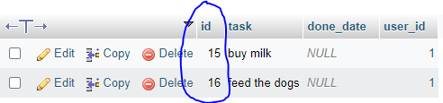

<small><i>example of a id primary key column</i></small>

:::info is using auto increment mandatory for primary keys?
No it's not. Basically any unique column (only one value in each table) can be a valid primary key. For example social security number is an example of a valid primary key column value. If two people could have the same social security number, that would be interesting.

If SSN is a valid primary key, couldn't then for example email too be  a primary key column, it's unique isn't it? Yeah, technically email can be a primary key value, but one advantage of using auto increment primary key column value is that it never changes. Email can change and when that happens all references have to updated too. Auto increment primary key will never change.

:::

#### FOREIGN KEY

Foreign key columns are references to some other table's primary keys

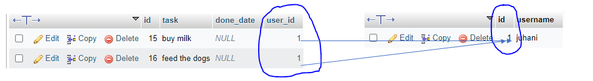

<small><i>example of a user_id foreign key column and id primary key column</i></small>

In the above picture there are two different tables. The one on the left is called <i>todo_items</i> and the other is <i>users</i>

<i>todo_items</i> table has a column called <i>user_id</i> this is a reference (foreign key) to the <i>users</i> table's id primary key column. 

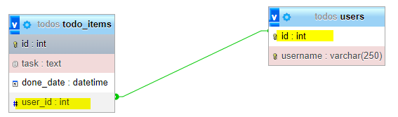

<small><i>The same primary key - foreign key relation depicted in a designer view</i></small>

#### WHY ARE FOREIGN KEYS NEEDED? 

As said before, foreign keys are just some other table's primary keys. They are "foreigners" in the table they are in and their home is in some other table. Traditionally in a relational database it's discouraged to save nested data in one database table (for example JSON like nested data format), because nested, complex data objects are quite hard to query efficiently. This is why in relational databases we need to save data in plain, tabular format thus making it impossible to depict relations between entities without primary keys and foreign keys. 

#### HERE'S ANOTHER EXAMPLE OF TWO TABLES LINKED TOGETHER

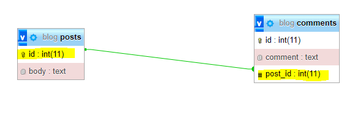

<small><i>an example of blog posts and their comments linked together</i></small>


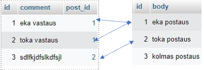

In the above picture there are two tables. The table on the left side is <i>comments</i> and the other is <i>posts</i>. The arrows depict the relations between primary keys and foreign keys.

- post number 1 has two comments
    * comments 1 and 2
- post number 2 has one comment
    * comment number 3
- post number 3 has no comments.

#### INNER JOIN

INNER JOIN fetches only all the matching rows


```sql
-- let's fetch all the posts and their comments. Leave out the posts that don't have any comments

SELECT posts.id, posts.body, comments.comment FROM posts INNER JOIN comments ON posts.id = comments.post_id;

```

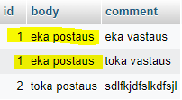

<small><i>The result set returned by the query above</i></small>

In the <i>posts</i> table there are three rows but only posts 1 and 2 are in the result set because the third post has zero comments. Though the post number 3 is missing from the result set, there are still three rows in the result set, because the post number 1 has two comments


#### LEFT JOIN

As opposed to inner join returning only the matching rows from both tables (returned only the posts having comments) using the left join you can fetch all the posts even if they don't have any comments.


```sql
-- let's fetch all the posts and their comments, if they have any

SELECT posts.id, posts.body, comments.comment FROM posts LEFT JOIN comments ON posts.id = comments.post_id;


```

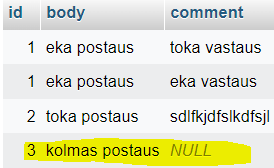


   
<small><i>The result set returned by the query above</i></small>

Now that we are using <i>LEFT JOIN</i> instead of <i>INNER JOIN</i> the result set includes the third post, but the <i>comment</i> column is NULL because the post doesn't have any comments.

When using <i>LEFT JOIN</i> the query will return all the rows from the left-side table of the query 

:::info What the heck is the table on the left-side, what does it mean?

It is the table on the left side of the join. In this particular example it is the <i>posts</i> table


:::

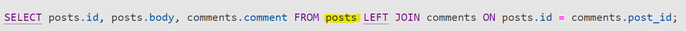

#### RIGHT JOIN

Yes, there is a right join also

```sql

-- this query will return exactly the same result set as the one with LEFT JOIN, but the tables
-- are in a different order

SELECT posts.id, posts.body, comments.comment FROM comments RIGHT JOIN posts ON posts.id = comments.post_id;

```

The above query returns exactly the same result set as the query with left join query. The only difference is that the tables are in a different order.
Now that we use right join, the post with no comments is fetched because <i>posts</i> table is on the right side of the join. 

#### CROSS JOIN

:::info

I've never needed <i>CROSS JOIN</i> at work!

:::

:::tip

For this example import menus.sql using PhpMyAdmin from Moodle's Git repository

:::

Using <i>CROSS JOIN</i> use can create every possible combination of both tables in the query

If you for example had a <i>menus</i> database and inside there two tables <i>foods</i> and <i>drinks</i> you can create menus by <i>CROSS JOIN</i>ing those two


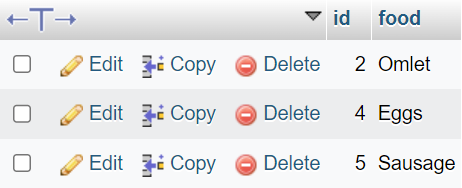

<i><small>foods table</small></i>

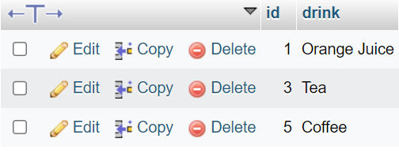

<i><small>drinks table</small></i>

```sql

SELECT food, drink FROM foods CROSS JOIN drinks;

```
<br>

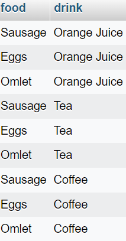

<i><small>result</small></i>

#### ABOUT JOINS

:::info

Basically <i>INNER JOIN</i> and <i>LEFT JOIN</i> are all you need

:::

Joins are made between two tables and there's always an <i>ON</i> clause to identify the two columns in both tables joining them together in a query.

```sql
SELECT * FROM tableA [INNER | LEFT] JOIN tableB ON tableA.primary_key_column = tableB.foreign_key_column

```

:::tip ON clause

Always remember to specify the ON clause when using INNER or LEFT JOIN. a JOIN without an ON clause isn't a syntax error, so you will get a result, but it most likely isn't what you are looking for.

:::

#### ALIAS (AS) 

When you are using JOINS ie. joining multiple tables together in one query it's likely that you'll have same column names in two or more tables. For example primary key columns are many times just named <i>id</i> 

Using alias you can rename tables and columns in a query's context. This is useful if you have many columns of same name or column / table names are long.

```sql

SELECT p.id AS postId, p.body, c.comment FROM posts AS p INNER JOIN comments AS c ON p.id = c.post_id;

```

#### SELF JOIN

<i>SELF JOIN</i> isn't a third type of join it just means that you create multiple aliases to one table. 

:::info

Get blog2_example.sql dump from git material repository

:::

As you can see the blog2_example database is like the original blog database but with only 1 table <i>posts</i> Since there's no difference if the post is actually the first post of a thread or if it is a response to another post, there all are simply posts.

:::info what is the parent_id column

Now that all the posts are in one table, there is parent_id column. If parent_id is NULL it means that the post is the first one of a thread, if it's not NULL the value is the id of the post it's a response to.

:::

```sql
-- let's fetch all the posts and their parents

SELECT p1.id, p1.body, p2.body AS parent FROM posts AS p1 LEFT JOIN posts AS p2 ON p2.id = p1.parent_id;

```

There are basically three different aliases. <i>p1</i> and <i>p2</i> are both aliases of the <i>posts</i> table and <i>parent</i> is the body of the parent post


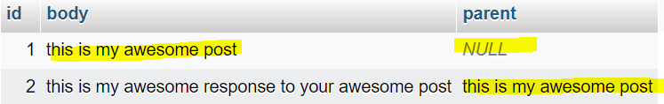

<i><small>The result set of the query above</small></i>

See that the first post's parent is NULL because the it is the first post of a thread and thus has no parent.

#### CAN TABLES BE JOINED ONLY BY USING PRIMARY AND FOREIGN KEY COLUMNS?

:::tip

For this example you need to import <i>db_without_primarykeys.sql</i> from Git repository (link in Moodle)


:::

No using primary keys and foreign keys to join tables together isn't required. You can basically use any column as long as they have matching values. 
Just like in our example here

```sql

SELECT make, model, users.email FROM vehicles INNER JOIN users ON users.email = vehicles.email;


```

In fact, when the joining columns are of the same name (like here we have <i>email</i>) there's no need to use <i>ON</i> clause. Instead there's a shorter version

```sql

-- with USING(column_name) you can shorten the query because the column name is the same in both tables


SELECT make, model, users.email FROM vehicles LEFT JOIN users USING(email);

```

Nonetheless it's recommended to use <i>JOIN</i> between primary keys and foreign keys because they never change. In this particular example, if the user's email were to change, we would have to update all the rows in both tables that the email is mentioned. If we instead had primary key key in <i>users</i> table and a corresponding foreign key column <i>users_id</i> in the <i>vehicles</i> table we could update the email as many times as needed without any changes to the <i>vehicles</i> table.


### EXCERCISE #1

:::tip

use tiedonhallinta_harjoitus.sql for this 

:::

- This excercise has to be returned
- Return only one txt file (not .doc / docx / pdf or any other than .txt)
- Name the file excercise1.txt and keep every query in a separate row as shown in the example below
- If the result set's columns are not specified, you can select them all

1.1 SELECT ..... FROM ...;

1.2 SELECT ....;

1.3 SELECT ...; and so on

- Do <strong>NOT</strong> return the query's result set, the query is enough (my result set might differ from yours so there's no point in  copying the result set)

- Every correct query is worth 1 point and a wrong query is worth nothing (0 points)
    * wrong query means that it can have a syntax error (it cannot be executed)
    * or the result set is incorrect

- 1.1 Create a query that fetches all the employees (all columns)
- 1.2 Create a query that fetches all the departments (all columns)
- 1.3 Create a query that fetches only the tenth employee from the employees table (all columns)
    * use primary key column when filtering
    * check out the primary key column value of the tenth employee
- 1.4 Create a query that fetches only the last department
    * last department being the row with the highest value of the <i>id</i> column
    * you can check the value of the hightest id from the database table
- 1.5 Create a query that fetches only the 20th employee's first_name and salary
    * columns: first_name, salary
    * you can use id column for filtering
- 1.6 Create a query that fetches the department_id of the 12th employee
    * column: only department_id
    * use id column for filtering
- 1.7 Create a query that fetches all the employees whose last_name is kuru (all columns)
- 1.8 Create a query that fetches all the employees working at the department_id 3
    * use emplyoees table's department_id to filter
    * you can fetch all columns
- 1.9 Create a query modifying the 1.8 query
    * use INNER JOIN to join departments table with users table and use departments table's id column for filtering


### AGGREGATE FUNCTIONS

Like the name suggests aggregate functions aggregate many values into one value

:::tip

It's a good practice to use alias with aggreagate functions to make the result more readable. 

:::

#### AVG

AVG calculates the average of the given column

```sql

SELECT AVG(salary) AS avg_salary FROM employees;

```

#### SUM

SUM sums up the the values of the given column

```sql

SELECT SUM(salary) AS sum_salary FROM employees;

```

#### MIN and MAX

```sql

SELECT MIN(salary) AS min_salary, MAX(salary) AS max_salary FROM employees;

```

You can also filter the result set of an aggregate query as you would of a normal <i>SELECT</i> query

#### COUNT

with count you can count all the rows 

```sql

-- let's count all the number of employees working in the  department with id 2
SELECT COUNT(id) AS num_of_emp FROM employees WHERE department_id = 2;
```


#### AGGREGATE FUNCTIONS AND GROUP BY

As said, by default aggregate functions aggregate many values into one value but you can change its behaviour using <i>GROUP BY</i> clause


```sql

SELECT COUNT(id) AS num_of_emp FROM employees GROUP BY department_id;

```

The above query produces number of employees for each department and if results were to be summed it's the total number of employees working for the company


```sql

SELECT COUNT(id) AS num_of_emp FROM employees

```

:::danger Do NOT ever

mix aggregate functions with other columns in a select query without using GROUP BY


:::

Let's see an example of a query like this with MySQL and Postgres

#### MYSQL

```sql

SELECT first_name, COUNT(*) FROM employees;

```


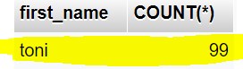

At first glance the result of the query seems to be right, but it's not. The result implies that there are 99 employees and all of their names are toni. <b>That's just not right. MySQL just returns the first employee's name</b>


#### Postgres

```sql

SELECT first_name, COUNT(*) FROM employees;

```

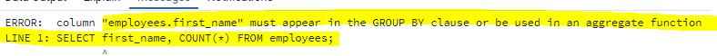

This is the right behaviour in this situation because you simply cannot mix columns normally with aggregate functions without using <i>GROUP BY</i> or aggregating both columns
Because if you think of the query as two separate ones

```sql
SELECT first_name FROM employees;
```

This returns 99 rows 

and 

```sql

SELECT COUNT(*) FROM employees;

```

this returns one row

So they simply cannot be presented in one result set without <i>GROUP BY</i> or aggregating both columns

```sql
-- fix the query using GROUP BY
SELECT first_name, COUNT(*) AS c FROM employees GROUP BY first_name;
-- or by aggregating both columns so that they both return one row
SELECT MAX(first_name), COUNT(*) AS c FROM employees;

```

You can also have multiple columns in a <i>GROUP BY</i>

```sql
SELECT last_name, department_id, COUNT(*) FROM employees GROUP BY last_name, department_id;

```

This query counts all the employees by their last_name and department_id

#### AGGREGATE FUNCTIONS AND HAVING

Let's first fetch all the department_ids and their average salary

```sql

SELECT department_id, AVG(salary) FROM employees GROUP BY department_id;

```

Now let's modify the query to fetch only the departments whose average salary is more than 4200

:::danger this won't work

SELECT department_id, AVG(salary) FROM employees WHERE AVG(salary) > 4200 GROUP BY department_id;

:::

This won't work, because it's not possible to use aggregate functions in a <i>WHERE</i> clause. For this we've got <i>HAVING</i>

```sql

SELECT department_id, AVG(salary) FROM employees GROUP BY department_id HAVING AVG(salary) > 4200;

```

When you need to filter the groups produced by <i>GROUP BY</i> use <i>HAVING</i> instead of <i>WHERE</i>


#### SUBQUERY

:::info

But if using aggregate function in a <i>WHERE</i> clause isn't possible, how can I fetch for example all the employees whose salary is more than the company's average salary

:::

<b>You can use subquery to produce the average salary and use that result in a <i>WHERE</i> clause</b>

```sql

SELECT id, first_name, last_name, salary FROM employees WHERE salary > (SELECT AVG(salary) FROM employees);


```

### SCALAR FUNCTIONS

Scalar functions don't aggregate, instead the function is executed on each row individually

#### CONCAT

Concatenates two or more strings into one

```sql

SELECT CONCAT(first_name, ' ', last_name) FROM employees;

```

#### UPPER

```sql

SELECT UPPER(first_name) FROM employees;

```

#### LOWER

```sql

SELECT LOWER(first_name) FROM employees;

```

#### NOW

NOW returns the current timestamp. It's useful for example calculating differences between two timestamps

#### TIMESTAMPDIFF

Calculates the difference between two timestamps in the given unit

```sql
-- this doesn't work in postgres, because it doesnt have timestampdiff
SELECT TIMESTAMPDIFF(HOUR,'2022-02-01','2022-02-21')
-- in postgress you would have to do something like this.
select extract(epoch from '2022-02-21'::timestamp - '2022-02-01'::timestamp)/3600
```

Combining <i>TIMESTAMPDIFF</i> with <i>NOW</i> is useful when calculating for example user's age. It might seem handy at first to save the age as INTEGER into the database but age is something that constantly changes so it's more useful to sve the date of birth and calculate the user's age based on that.

### ORDER BY

With <i>ORDER BY</i> you can change the order of the result set. This might be useful especially when using aggregate functions because they lose the unique identifiers of each row

:::tip

You can use column alias in order by

:::

```sql
-- let's find all the departments whose average salary is more than 4200 and order the result set in the ascending order
SELECT department_id, AVG(salary) AS avg_salary FROM employees GROUP BY department_id HAVING AVG(salary) > 4200 ORDER BY avg_salary
-- it's the same as this
SELECT department_id, AVG(salary) AS avg_salary FROM employees GROUP BY department_id HAVING AVG(salary) > 4200 ORDER BY avg_salary ASC
-- let's now flip the order
SELECT department_id, AVG(salary) AS avg_salary FROM employees GROUP BY department_id HAVING AVG(salary) > 4200 ORDER BY avg_salary DESC
```

### INSERT 

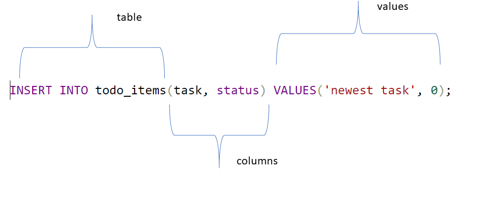

There's always the same pattern in <i>INSERT</i>

```sql

INSERT INTO tablename(column1, column2,...columnN) VALUES(value1, value2, ...valueN);

```

:::tip

The example query in the picture is an insert into todo_items. In the todo_items table there are three columns but there are only two columns specified in the insert query. That's because the third column is id and that's an AI (auto increment) column, that the db system takes care of internally, so we don't have to insert it manually


It's the same with status column. We've specified a default value of 0 for it, so it could have been left empty in the insert query

:::

### UPDATE

Using update you can update existing rows

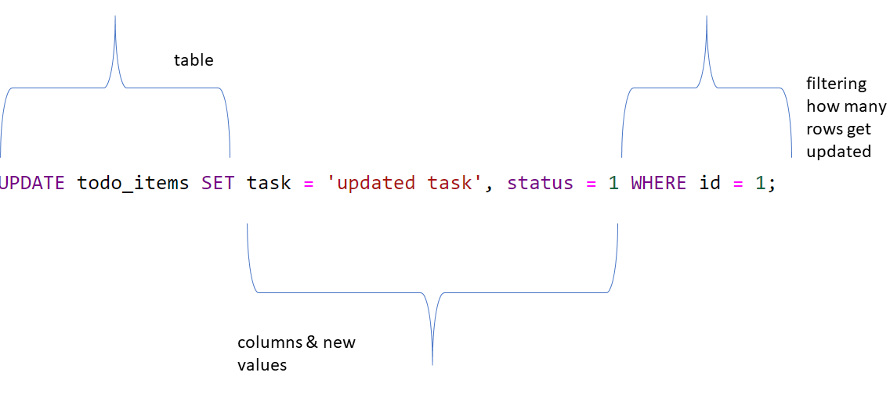

```sql

UPDATE tablename SET column1 = 'newvalue', column2 = 0 WHERE column2 = 1;

```

There's no updateOne or updateMany in SQL. The damage control is done by using WHERE properly. So the WHERE clause determines how many rows get updated

In the example picture there's <i>WHERE id = 1;</i> so only one row gets updated because id column values are unique 

```sql

-- let's update all the pending tasks and set their status as done
UPDATE todo_items SET status = 1 WHERE status = 0;

```

:::warning UPDATE without WHERE

Update without WHERE updates all the rows in the table so

if you are updating without WHERE clause, you are most likely almost always doing something wrong!

If you are not sure about how many rows your update will affect, use SELECT first and then UPDATE using the same WHERE clause

:::

### DELETE

Using <i>DELETE</i> you can remove rows from a table

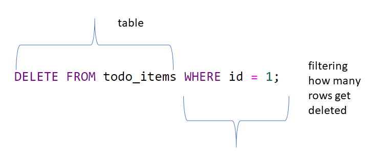

With <i>DELETE</i> you must not specify columns, because in a relational database every table has a strict schema that is specified beforehand, so it's not possible to remove individual columns. <b>You only remove rows</b>

With <i>DELETE</i> it's the same as with <i>UPDATE</i>. There's no deleteOne or deleteMany you can control the nubmer of rows removed by filtering using <i>WHERE</i>

### EXCERCISE #2

:::tip

Download and import tiedonhallinta_harjoitus2.sql

:::

:::tip

This excercise has to be returned
- Return only one txt file (not .doc / docx / pdf or any other than .txt)
- Name the file excercise2.txt and keep every query in a separate row as shown in the example below

2.1 SELECT ...;

2.2 SELECT ...;

:::

:::tip *


In 2.4 and 2.5 you can use either the finnish or the english name of the department.
You don't have to redo this excercise if you've already done it with the finnish department names
But if you haven't done this already, you can use the sql file with english department names

:::

- 2.1 Create a query that fetches the average salary of all the employees
- 2.2 Create a query that fetches the lowest salary of all the employees
- 2.3 Create a query that fetches the highest salary of all the employees
- 2.4 Create a query that fetches the highest salary in the <i>sovelluskehitys</i> or <i>software development</i>* department
    * you must use INNER JOIN
    * you must use the name of the department in departments table
- 2.5 Create a query that fetches the lowest salary in the <i>palkat</i> or <i>salaries</i>* department
    * you must use INNER JOIN
    * you must use the name of the department in departments table 
- 2.6 Create a query that fetches average salaries by department
    * two column in the result set (department name, department's average salary)

- 2.7 Create a query that adds a new department named RnD-department
- 2.8 Create a query that fetches all the employees' first_name and last_name and the name of the department they work in
    * you must use INNER JOIN
    * the result set contains three columns (first_name, last_name departments.name)
- 2.9  Create a query that fetches only the department(s) with zero employees
    * the only department is the RnD-department added in 2.7
    * this can be done using LEFT JOIN
    * filter using IS keyword
    * the result set should contain only the name of the department (one column)
- 2.10 Create a query that fetches all the departments and their average salaries whose average salary is more than 3500
    * result set: name of the department, average salary

- 2.11 Create a query that fetches the number of employees by department
    * result set (name of the department, number of employees)
    * you must use JOIN
    * you must use column alias <i>num_of_employees</i> as the number of employees

- 2.12 Create a query that fetches all the employees whose salary is less than the average salary
    * result set: full_name, salary (two columns)
    * full_name is a concatenation of first_name and last_name separated by white space
    * you must use column alias <i>full_name</i>

- 2.13 Create a query that fetches all the employees whose salary is less than the average salary of the department they work in
    * use subquery
    * result set: all the columns in the employees table
    * tip: this can be done by comparing employees table to itself using two aliases

- 2.14 Create a query that fetches every employees salary and the average salary of the whole company
    * result set: salary, avg_salary (two columns)
    * you must use column alias <i>avg_salary</i>
    * tip: easiest way is to use subquery

- 2.15 Create a query that fetches every employees salary and the lowest salary of the department they work in
    * result set: salary, lowest_salary_of_dep (two columns)
    * you must use column alias <i>lowest_salary_of dep</i>


